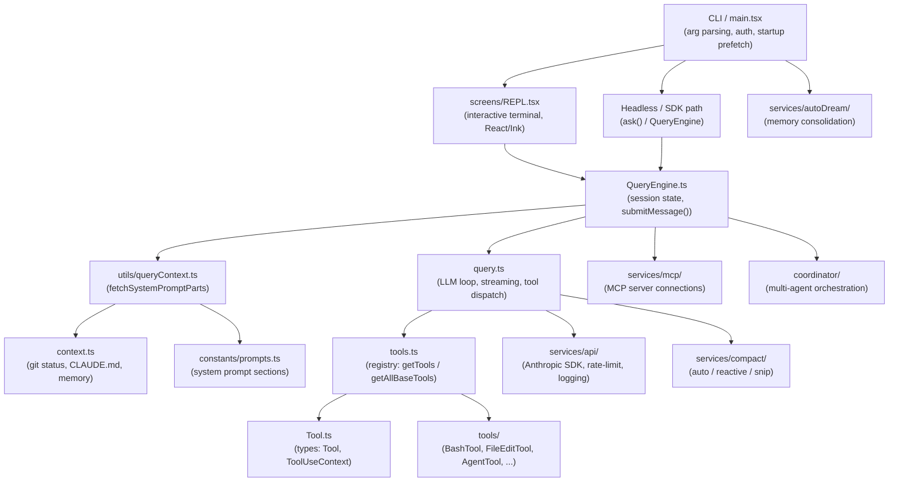
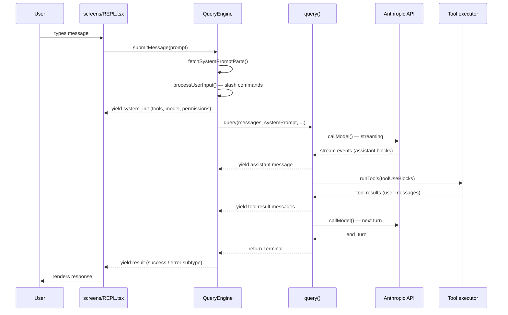

# Claude Code — Design Overview

Claude Code is Anthropic's CLI for Claude: a terminal application that runs as both an interactive REPL and a headless/SDK agent. The UI is built with [Ink](https://github.com/vadimdemedes/ink) (React for terminals). All LLM calls go through the Anthropic SDK.

---

## Module Map

| Path | Role |
|---|---|
| `main.tsx` | Entry point: CLI argument parsing, auth, startup prefetch, REPL/headless dispatch |
| `QueryEngine.ts` | Session lifecycle: owns messages, usage, and permission state across turns |
| `query.ts` | LLM loop: streaming, tool dispatch, compaction, stop-hooks |
| `context.ts` | User/system context: git status, CLAUDE.md files, memory files |
| `utils/queryContext.ts` | System-prompt assembly: `fetchSystemPromptParts()` for cache-key prefix |
| `constants/prompts.ts` | Core system prompt sections |
| `constants/systemPromptSections.ts` | Cacheable prompt fragments; split at `SYSTEM_PROMPT_DYNAMIC_BOUNDARY` |
| `Tool.ts` | Base types: `Tool`, `Tools`, `ToolUseContext`, `PermissionResult` |
| `tools.ts` | Tool registry: `getTools()` / `getAllBaseTools()`, feature-gated assembly |
| `tools/` | One subdirectory per tool (e.g. `BashTool/`, `FileEditTool/`, `AgentTool/`) |
| `screens/REPL.tsx` | Main interactive terminal screen |
| `hooks/` | ~80 React hooks: input, keybindings, IDE integration, voice, task management |
| `state/AppState.tsx` | Global app state via store pattern |
| `commands.ts` | Slash-command registry; `getSlashCommandToolSkills()` |
| `commands/` | One subdirectory per slash command |
| `services/api/` | Claude API client, rate limiting, logging, usage tracking |
| `services/mcp/` | MCP server management and connections |
| `services/autoDream/` | Background memory-consolidation engine |
| `services/compact/` | Auto-compact, reactive-compact, snip-compact strategies |
| `coordinator/` | Multi-agent coordinator mode (Research → Synthesis → Implementation → Verification) |
| `bridge/` | JWT-authenticated integration with claude.ai |
| `entrypoints/agentSdkTypes.ts` | Public SDK type surface (`SDKMessage`, `SDKResultMessage`, etc.) |

---

## Architecture

---

## Data Flow

---

## Design Documents

| File | Covers |
|---|---|
| [README.md](./README.md) | Top-level architecture, module map, data-flow sequence |
| [query-engine.md](./query-engine.md) | `QueryEngine` — session lifecycle, `submitMessage()` pipeline, budget control, SDK message types |
| [query-loop.md](./query-loop.md) | `query()` — LLM streaming loop, tool execution, compaction, token budgets, error recovery |
| [context.md](./context.md) | System-prompt assembly, CLAUDE.md loading, git status, cache boundary |
| [tool-system.md](./tool-system.md) | `Tool` interface, `ToolUseContext`, `buildTool()`, registry assembly (`getTools`, `assembleToolPool`) |
| [permissions.md](./permissions.md) | Permission modes, `ToolPermissionContext`, rule sources, `canUseTool` dispatch, protected files |
| [coordinator.md](./coordinator.md) | Multi-agent coordinator mode: coordinator vs worker roles, system prompt injection, agent lifecycle |
| [autodream.md](./autodream.md) | Background memory consolidation: three-gate system, dream agent, consolidation lock |
| [commands.md](./commands.md) | Slash command registry, custom skill commands, dispatch flow |
| [mcp.md](./mcp.md) | MCP server integration: connections, transports, tool wrapping, auth, resource support |
