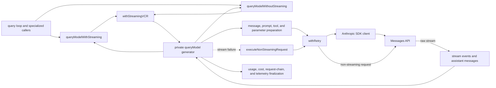
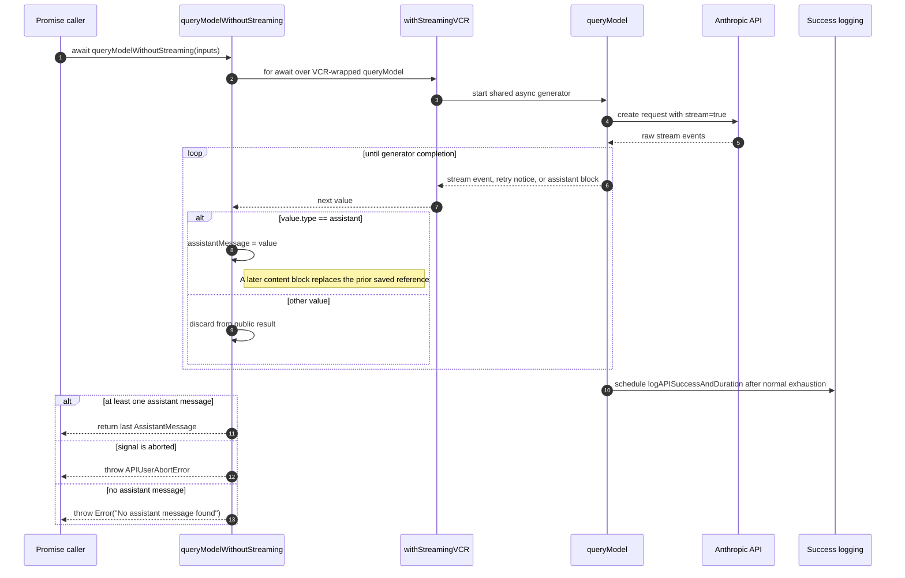
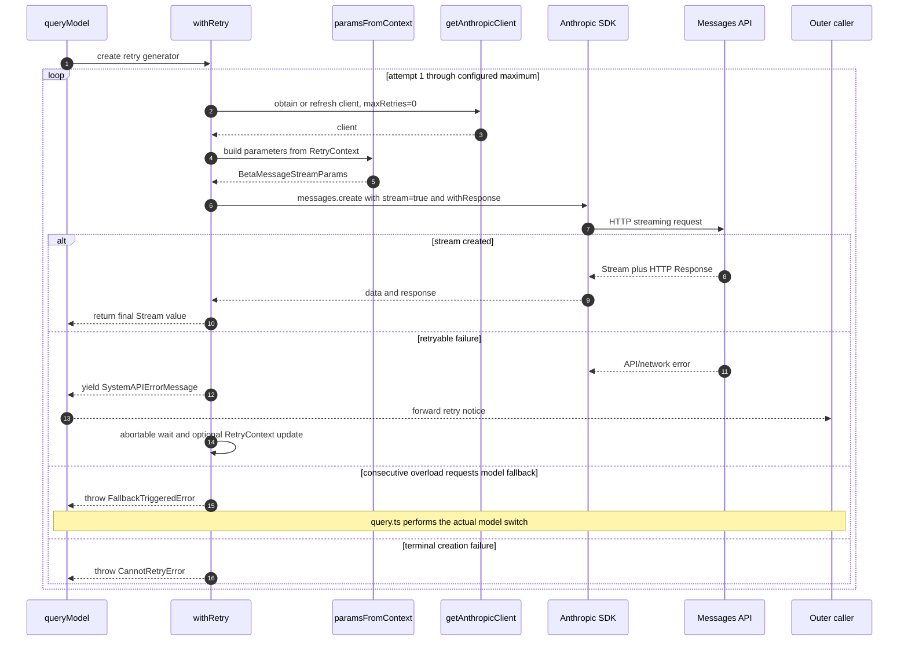
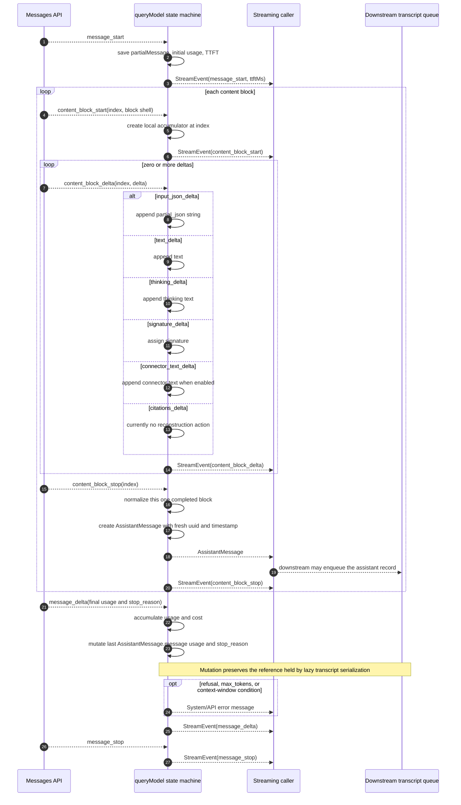
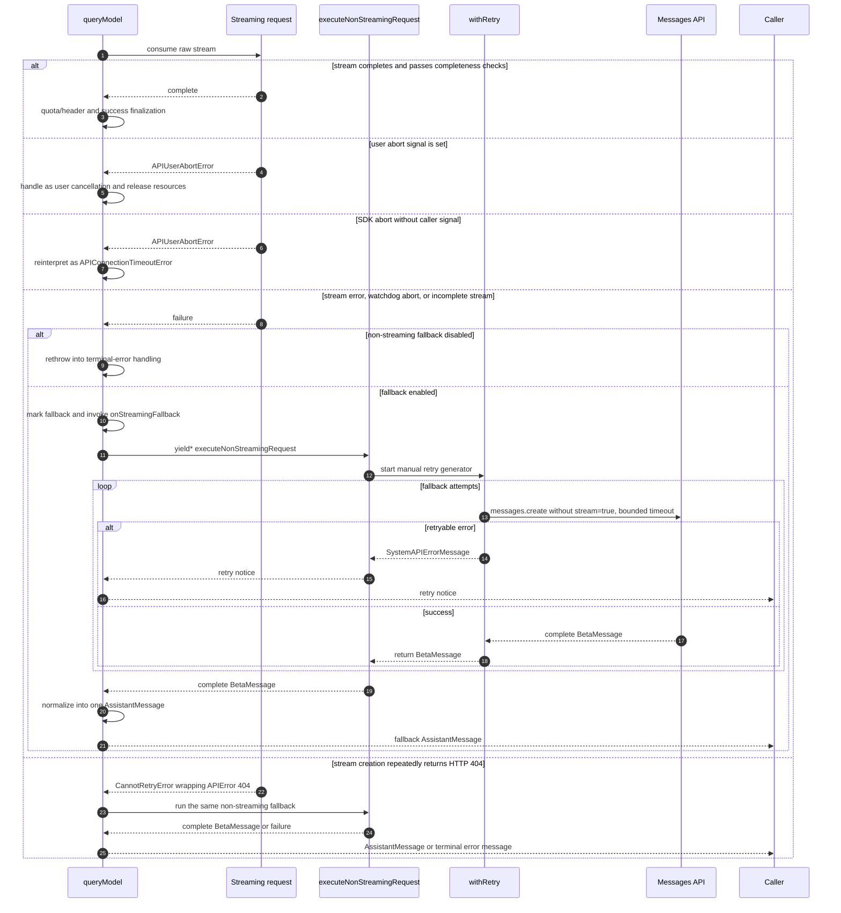
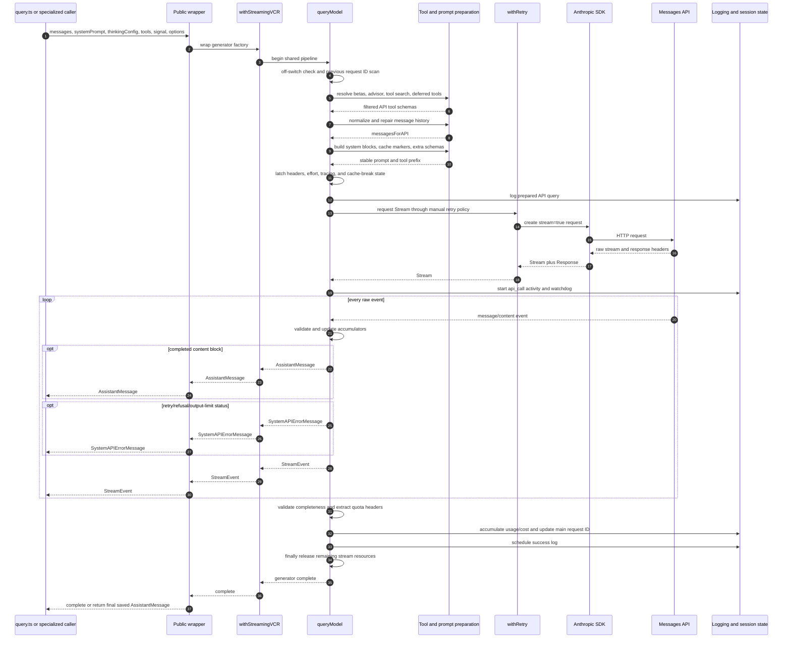

# Claude API Request Pipeline

## Purpose and Scope

This document describes `services/api/claude.ts`, the boundary between Claude
Code's internal message model and the Anthropic Messages API. It concentrates
on the two public query interfaces:

- `queryModelWithStreaming()`
- `queryModelWithoutStreaming()`

Both interfaces delegate to the same private async generator, `queryModel()`.
The important naming caveat is that `queryModelWithoutStreaming()` is normally
only **non-streaming to its caller**. It still performs a streaming HTTP request
and drains the stream internally. A genuinely non-streaming HTTP request is
made by `executeNonStreamingRequest()` only when the streaming path fails or a
gateway rejects stream creation with HTTP 404.

The document follows the recovered source behavior. Feature flags, dynamic
configuration, provider-specific fields, and internal-only fields can make a
particular request omit some of the branches shown here.

## Architectural Position



The main agent path is:

```text
query.ts
  -> productionDeps().callModel
  -> queryModelWithStreaming
  -> withStreamingVCR
  -> queryModel
  -> Anthropic SDK / Messages API
```

`query/deps.ts` binds `callModel` to `queryModelWithStreaming()` in production,
while allowing tests to inject a replacement. Other callers use one of the
public wrappers directly for compaction, web-search synthesis, summaries,
hooks, skill improvement, and agent generation.

### Direct callers

| Caller | Interface | Purpose |
| --- | --- | --- |
| `query.ts` through `query/deps.ts` | Streaming | Primary agentic loop; consumes assistant blocks and raw events and starts tool execution. |
| `services/compact/compact.ts` | Streaming | Compaction model request. |
| `tools/WebSearchTool/WebSearchTool.ts` | Streaming | Web-search synthesis request. |
| `services/awaySummary.ts` | Non-streaming consumer | Produces an away summary from a completed assistant result. |
| `components/agents/generateAgent.ts` | Non-streaming consumer | Generates an agent definition. |
| `utils/hooks/execPromptHook.ts` | Non-streaming consumer | Executes a prompt hook through the model pipeline. |
| `utils/hooks/apiQueryHookHelper.ts` | Non-streaming consumer | Shared API-query hook helper. |
| `utils/hooks/skillImprovement.ts` | Non-streaming consumer | Generates skill-improvement output. |
| `queryHaiku()` and `queryWithModel()` in this module | Non-streaming consumer | Convenience request interfaces with empty tools and disabled thinking. |

## Public Query Contracts

Both wrappers accept the same inputs:

| Input | Role |
| --- | --- |
| `messages: Message[]` | Internal conversation history. It is normalized and repaired before being sent to the API. |
| `systemPrompt: SystemPrompt` | Caller-supplied prompt components. API attribution, CLI prefix, advisor, and browser instructions may be added. |
| `thinkingConfig: ThinkingConfig` | Requested thinking mode and budget. Retry context may alter its effective form. |
| `tools: Tools` | Registered internal tools. They are filtered and converted to API schemas. |
| `signal: AbortSignal` | Shared cancellation signal for retry waits and API requests. |
| `options: Options` | Model, query source, permissions, caching, fallback, tool search, fast mode, tracing, and other request controls. |

The output contracts differ:

| Interface | Return contract | What the caller observes |
| --- | --- | --- |
| `queryModelWithStreaming()` | `AsyncGenerator<StreamEvent \| AssistantMessage \| SystemAPIErrorMessage, void>` | Raw stream events, completed assistant content blocks, and retry/API status messages as they are yielded. |
| `queryModelWithoutStreaming()` | `Promise<AssistantMessage>` | No intermediate values. It consumes all generator output and returns the last assistant message. |
| `executeNonStreamingRequest()` | `AsyncGenerator<SystemAPIErrorMessage, BetaMessage>` | Internal fallback primitive. It yields retry notices and returns one complete SDK `BetaMessage`. |

Selected `Options` groups are:

| Concern | Fields |
| --- | --- |
| Identity and routing | `model`, `querySource`, `agentId`, `queryTracking` |
| Tool exposure | `getToolPermissionContext`, `toolChoice`, `extraToolSchemas`, `agents`, `allowedAgentTypes`, `mcpTools`, `hasPendingMcpServers` |
| Generation | `maxOutputTokensOverride`, `temperatureOverride`, `effortValue`, `outputFormat`, `taskBudget` |
| Cache shape | `enablePromptCaching`, `skipCacheWrite`, `hasAppendSystemPrompt` |
| Recovery | `fallbackModel`, `onStreamingFallback`, `fetchOverride` |
| Runtime modes | `isNonInteractiveSession`, `fastMode`, `advisorModel`, `addNotification` |

## Wrapper Semantics

### `queryModelWithStreaming()`

This wrapper delegates through `withStreamingVCR()` and forwards every value
from `queryModel()` with `yield*`. Outside VCR mode it adds no buffering.

```mermaid
sequenceDiagram
    autonumber
    participant C as Streaming caller
    participant W as queryModelWithStreaming
    participant V as withStreamingVCR
    participant M as queryModel
    participant A as Anthropic API

    C->>W: iterate generator with shared inputs
    W->>V: yield* withStreamingVCR(messages, factory)
    alt VCR disabled
        V->>M: invoke generator factory
        M->>A: create stream=true request
        loop each generator output
            M-->>V: StreamEvent / AssistantMessage / SystemAPIErrorMessage
            V-->>W: yield immediately
            W-->>C: yield immediately
        end
    else VCR enabled
        V->>M: run generator under withVCR
        loop live production or fixture recording
            M-->>V: output buffered in memory
        end
        Note over V,C: VCR replays the completed buffer&#59; live timing is not preserved
        loop buffered output
            V-->>W: yield cached or newly recorded value
            W-->>C: yield value
        end
    end
```



The generator is pull-driven. If a caller stops iteration early, JavaScript
invokes generator return/cleanup. The `queryModel()` `finally` block releases
stream resources and stops API-call activity, but code after that `finally`
(including normal success logging) does not run after an early return.

### `queryModelWithoutStreaming()`

This wrapper uses the exact same VCR and `queryModel()` generator. It records
every yielded assistant message, deliberately continues until the generator is
exhausted, then returns the last one.



Draining is intentional: `logAPISuccessAndDuration()` is reached only after all
yields and cleanup. Returning immediately after the first assistant block would
skip the remainder of the stream, final usage mutation, and normal success
finalization.

For a multi-block model response this wrapper returns only the final outer
`AssistantMessage`. It does not merge text, thinking, and tool-use blocks into
one outer record. Callers choosing this interface therefore assume the last
completed block is the result they need.

## Shared `queryModel()` Workflow

The private generator owns request preparation, streaming reconstruction,
fallback, resource cleanup, and request telemetry. The workflow is easiest to
understand as eleven phases.

### Phase 1: Early policy and request-chain lookup

1. A dynamic off-switch can reject a non-subscriber request to a non-custom
   Opus model. The generator yields an assistant error message and returns
   before any API request.
2. `getPreviousRequestIdFromMessages()` scans backward for the most recent
   assistant `requestId`. This makes request-chain telemetry local to the
   supplied history, so main threads, subagents, teammates, rollback, and undo
   do not depend on a single mutable global previous-ID value.
3. A Bedrock application inference profile may be resolved to its backing
   model for cost accounting while the requested model remains the routing
   model.

### Phase 2: Betas, advisor, and tool exposure

1. The function derives whether the request is agentic from `querySource` and
   assembles model/query beta headers.
2. Advisor support is validated against the base model and optional experiment
   configuration. If enabled, an advisor server-tool schema and prompt
   instructions are added later.
3. Tool-search eligibility is calculated asynchronously. It depends on the
   mode, model, tool set, permission context, and agents.
4. Deferred tools are precomputed. If no deferred tools exist and no MCP server
   is pending, tool search is disabled.
5. With tool search enabled, ordinary tools remain visible, ToolSearch remains
   visible, and a deferred tool becomes visible only after a matching
   `tool_reference` in history. Without tool search, ToolSearch itself is
   removed.
6. Provider-specific tool-search betas are placed in either the normal beta
   list or the Bedrock extra body.
7. Each surviving internal `Tool` is asynchronously converted by
   `toolToAPISchema()`. The conversion can consult permissions, agent
   definitions, the complete tool list, the model, and `defer_loading` state.

### Phase 3: Conversation normalization

The internal history is transformed before it becomes an API request:

1. `normalizeMessagesForAPI()` converts internal message structures.
2. If the selected model cannot use tool search, user `tool_reference` blocks
   and assistant tool-use `caller` fields are stripped. This also supports a
   mid-conversation switch to a model without tool-search support.
3. `ensureToolResultPairing()` repairs mismatched `tool_use`/`tool_result`
   history, including histories resumed from other sources.
4. Advisor blocks are removed when the required beta is absent.
5. Older media items are stripped once the request exceeds the maximum media
   count; the newest media items are retained.
6. A prompt fingerprint is computed before synthetic deferred-tool metadata is
   inserted.
7. Depending on the active tool-search delta protocol, a synthetic user block
   can describe deferred tools.

### Phase 4: System prompt and tool-schema assembly

The request system prompt is composed from:

1. attribution header;
2. CLI system-prompt prefix;
3. caller-provided system prompt;
4. optional advisor instructions;
5. optional Claude-in-Chrome tool-search instructions.

`buildSystemPromptBlocks()` converts these strings to API text blocks and
places cache markers according to prompt-caching and global-cache rules.
Ordinary tool schemas are followed by caller-provided extra schemas and, when
enabled, the advisor server-tool schema. Ordering is significant because it
affects prompt-cache prefixes.

### Phase 5: Session-stable latches and tracing

The function resolves or latches request-shape controls that should not flap
mid-session:

- AFK, fast-mode, cache-editing, and thinking-clear headers;
- one-hour cache eligibility and query-source allowlist;
- effective effort;
- beta tracing context and span;
- optional prompt-cache-break detection state.

The thinking-clear latch is specifically retained after activation so later
requests do not oscillate the server-side cache key.

### Phase 6: `paramsFromContext()` request factory

`withRetry()` owns a mutable `RetryContext`, so request parameters must be
rebuilt for every attempt. `paramsFromContext()` constructs a fresh
`BetaMessageStreamParams` using that context. In the current implementation,
retry policy can change `maxTokensOverride` and `fastMode`; the context's model
and thinking fields also inform retry/fallback decisions but are not switched
in place to perform the configured fallback-model request.

It determines:

- normalized requested model, with retry-context model used by selected
  capability and cache decisions;
- normal, provider-specific, 1M-context, structured-output, effort,
  task-budget, and context-management betas;
- extra request body fields, including Bedrock-specific beta transport;
- structured `output_config`, effort, and optional API-side task budget;
- `max_tokens`, with retry override taking precedence over caller override and
  the model default;
- adaptive thinking when supported, otherwise configured-budget thinking,
  always constrained below `max_tokens`;
- prompt caching and cache breakpoints;
- cache edits consumed once outside the factory and reused consistently;
- fast/standard speed and latched headers;
- temperature only when thinking is disabled;
- model, messages, system blocks, tools, tool choice, metadata, context
  management, and extra body.

Because the factory is invoked per attempt, a retry can change maximum tokens
or fast-mode state without rebuilding the earlier normalized conversation from
scratch. A fallback **model** is handled separately: `withRetry()` throws
`FallbackTriggeredError`, and `query.ts` starts a new query using that model.

#### Final request payload and message cache boundary

The factory's returned object has this conceptual wire shape:

```text
{
  model,
  messages: addCacheBreakpoints(messagesForAPI, ...),
  system,
  tools,
  tool_choice,
  betas,
  metadata,
  max_tokens,
  thinking,
  temperature?,
  context_management?,
  output_config?,
  speed?,
  ...extraBodyParams
}
```

`addCacheBreakpoints()` is the final internal-to-API message conversion. It
maps user and assistant records to API `MessageParam` values and installs
exactly one message-level cache marker: normally on the last message, or on the
second-to-last message for `skipCacheWrite` fork requests so the marker remains
at the last shared prefix.

When cached microcompact is active, the same function:

1. restores pinned `cache_edits` blocks at their original user-message
   positions;
2. deduplicates cache-reference deletions across old and new edit blocks;
3. inserts a new edit block after tool results in the last eligible user
   message and pins its position for future calls;
4. adds `cache_reference: tool_use_id` to tool-result blocks strictly before
   the last cache-control message, cloning arrays/blocks to avoid mutating
   history reused by another request.

API metadata contains a serialized `user_id` object with device, OAuth account,
session, and configured extra metadata. Provider/body configuration is merged
late, so supported custom extra-body fields accompany the same prepared
messages and prompt.

### Phase 7: Query logging and mutable response state

Before dispatch, `queryModel()` logs the prepared request shape after obtaining
the permission context. It then initializes per-request mutable state:

- `partialMessage` from `message_start`;
- one reconstructed `contentBlocks[index]` per API block;
- `newMessages`, containing outer assistant records already yielded;
- accumulated `usage`, `costUSD`, `stopReason`, and `ttftMs`;
- stream/controller/HTTP-response/request-ID references;
- attempt start times, fallback flags, research state, and advisor state.

`releaseStreamResources()` is idempotent in intent: it aborts the SDK stream
controller and cancels the underlying response body when present.

### Phase 8: Streaming request creation with retry



The SDK client's own retry count is zero. `withRetry()` is the policy owner so
that retries can yield visible system messages, refresh credentials/clients,
handle stale connections, apply abortable delays, alter fast mode, reduce old
overflowing `max_tokens` requests, and trigger the outer model fallback.

On successful stream creation, the function captures the response request ID,
raw `Response`, optional first-party client request ID, request parameters, and
attempt timing.

### Phase 9: Raw stream reconstruction and yield ordering



The event ordering has several important consequences:

1. A completed API content block creates one outer `AssistantMessage`; a single
   Anthropic response with thinking, text, and tool-use blocks can therefore
   create several outer assistant messages sharing the same nested API message
   ID.
2. At `content_block_stop`, the assistant message is yielded **before** the raw
   `content_block_stop` `StreamEvent`.
3. Tool JSON is accumulated as a string and normalized only when the block is
   completed.
4. `message_delta` arrives after completed blocks. It writes final usage and
   `stop_reason` back to the most recently yielded assistant object by direct
   property mutation. The transcript queue may hold the nested message object
   by reference and serialize it on a later flush.
5. Cost accounting occurs before the `message_delta` stream event is yielded.
6. A refusal or output/context limit can add an error message before that raw
   `message_delta` event is forwarded.

The state machine validates block existence and block/delta compatibility. A
missing block, missing message, or mismatched delta type throws and enters the
streaming-fallback/error path instead of silently producing malformed content.

### Phase 10: Stream health and non-streaming recovery

The loop records gaps longer than the stall threshold. An optional watchdog,
controlled by environment configuration, warns halfway to its deadline and
aborts/cancels the stream at the deadline. After iteration, the result is also
rejected as incomplete when there was no `message_start`, or when neither an
assistant block nor a stop reason was observed.



The fallback request:

- uses a fresh client with SDK retries disabled;
- shares `withRetry()` policy and the caller abort signal;
- rebuilds parameters from the current retry context;
- removes streaming and caps output at `MAX_NON_STREAMING_TOKENS` (64,000),
  reducing an enabled thinking budget to remain below the cap;
- applies a per-attempt timeout from `API_TIMEOUT_MS`, otherwise 120 seconds in
  remote mode or 300 seconds locally;
- returns one complete `BetaMessage`, which is normalized into one outer
  assistant message rather than one outer record per content block.

The main query loop supplies `onStreamingFallback`. Once invoked, `query.ts`
tombstones assistant messages yielded by the failed partial stream, clears
partial tool state, and replaces its streaming tool executor. This prevents a
partial tool use and its fallback replacement from both being executed.

A `FallbackTriggeredError` is different from streaming-to-non-streaming
fallback. It requests a **model** switch after repeated overload failures and
must escape `queryModel()` so `query.ts` can rerun with the fallback model.

### Phase 11: Cleanup, final state, and telemetry

The outer `finally` always:

1. stops `api_call` session activity;
2. aborts the SDK stream controller if still open;
3. cancels the underlying response body if available;
4. finalizes non-streaming fallback usage, stop reason, and cost before an
   early consumer return can strand them.

After normal generator continuation beyond `finally`, the function:

1. marks cached-microcompact tool state as sent;
2. records the last main request ID for foreground main/SDK chains, excluding
   background agent contexts;
3. reduces large message state to scalar logging values;
4. obtains the permission context asynchronously and schedules
   `logAPISuccessAndDuration()` with usage, duration, retries, TTFT, request ID,
   stop reason, fallback status, headers, cost, query-chain data, cache
   strategy, fast mode, betas, and prior request ID.

The success logger is fire-and-forget. Resource cleanup is synchronous with
generator completion; the permission-context lookup and success log can finish
later.

## Full Primary-Path Sequence



## Provider-Neutral Model API Sequence

The following is a comprehensive provider-neutral solution rather than a
renaming of the Claude pipeline. The application works only with canonical
request, operation, event, response, usage, cache-hint, and error types. All
provider-specific request fields, authentication, endpoints, wire protocols,
identifiers, and error formats are confined to a selected `ProviderAdapter`.

```mermaid
sequenceDiagram
    autonumber
    participant C as Application caller
    participant F as Model API facade
    participant O as Provider-neutral orchestrator
    participant H as History normalizer
    participant K as Schema compiler
    participant R as Routing and retry policy
    participant P as Instruction and cache planner
    participant A as Selected provider adapter
    participant T as Transport
    participant E as Provider service
    participant S as Stream health and response assembler
    participant B as Observability

    alt streaming API
        C->>F: stream(ModelRequest, cancellation signal)
        F->>O: execute(request, delivery=events)
    else unary API
        C->>F: generate(ModelRequest, cancellation signal)
        F->>O: execute(request, delivery=complete-response)
    end

    O->>O: validate canonical ModelRequest
    O->>H: scan backward for latest response correlation ID
    H-->>O: previousRequestId or none
    Note over O,B: Previous ID is tracking metadata local to the supplied history

    O->>R: resolve requested model and routing constraints
    R->>A: inspect adapter capabilities for resolved model
    A-->>R: ModelCapabilities
    R-->>O: adapter, route, and capabilities

    O->>K: compile surviving operations using capabilities, permissions, and registry context
    loop each operation definition
        K->>K: validate schema, visibility, and lazy-exposure policy
        K->>A: map canonical operation schema
        A-->>K: opaque provider operation schema
    end
    K-->>O: ordered provider operation schemas

    O->>H: normalize canonical conversation history
    H->>H: normalize roles and content
    H->>H: consolidate response fragments and compatible adjacent turns
    H->>H: validate and repair operation-call/result pairing
    H-->>O: consolidated canonical history

    O->>P: build ordered instruction blocks and cache plan
    P->>P: separate stable prefix from dynamic suffix
    P->>P: place provider-neutral cache checkpoints
    P-->>O: InstructionPlan and CachePlan

    O->>R: derive timeout, retry, fallback, and delivery policy
    R-->>O: ExecutionPolicy

    O->>A: validate canonical features against capabilities
    alt unsupported required feature
        A-->>O: CanonicalError(unsupported_feature)
        O-->>F: canonical failure
        F-->>C: error
    else request is supported
        A-->>O: validation successful
        O->>A: encode history, instructions, cache hints, operations, and options
        A-->>O: opaque ProviderRequest
        O->>B: start operation with trace ID and previousRequestId

        loop attempts before output becomes externally visible
            O->>R: begin attempt using current RetryContext
            R-->>O: route, service tier, output limits, and backoff state
            O->>A: rebuild attempt request from ProviderRequest and RetryContext
            A->>A: refresh credentials when required
            A->>T: reset stale connection state when required
            Note over O,T: Disable autonomous client retries when possible so the central policy owns attempts
            O->>A: openEventChannel(attempt request, cancellation signal)
            A->>A: add provider authentication and request metadata
            A->>T: send provider-specific transport request
            T->>E: request

            alt native streaming response
                E-->>T: response metadata and byte or frame stream
                T-->>A: transport stream
                A->>A: initialize provider wire decoder
                A-->>O: AsyncIterable of canonical ModelEvent
            else provider supports only unary response
                E-->>T: complete provider response
                T-->>A: response payload
                A->>A: decode payload and synthesize canonical ModelEvent sequence
                A-->>O: AsyncIterable of canonical ModelEvent
            else dispatch fails
                E-->>T: error response or connection failure
                T-->>A: transport failure
                A->>A: map status, body, and headers to CanonicalError
                A-->>O: CanonicalError
                O->>R: classify retry safety using error and idempotency
                alt retry permitted
                    R-->>O: adjust route, tier, output limit, or backoff
                    O->>B: record failed attempt
                    opt streaming API exposes retry status
                        O-->>F: canonical RetryStatus event
                        F-->>C: canonical RetryStatus event
                    end
                    O->>O: wait with cancellation support
                else retry forbidden or exhausted
                    R-->>O: terminal decision
                    O->>B: finalize failure
                    O-->>F: CanonicalError
                    F-->>C: error
                end
            end
        end

        O->>S: initialize health monitor and empty ModelResponse accumulator
        S->>S: start first-response and idle watchdog timers
        S->>S: schedule warning threshold and abort deadline
        O->>B: record accepted response metadata and providerRequestId

        loop canonical event channel
            alt native streaming transport
                E-->>T: next bytes or frame
                T-->>A: provider wire data
                A->>A: parse and map provider data
            else unary response adapter
                A->>A: emit next synthesized event
            end
            A-->>O: canonical ModelEvent
            O->>S: observe arrival, record inter-event gap, and reset idle watchdog
            S->>S: validate event order and referenced output unit
            S->>S: reduce starts, deltas, completed units, usage, and terminal metadata
            S-->>O: updated response state plus ordered canonical outputs
            O->>B: update usage, latency, stall, and accounting metrics

            loop ordered canonical outputs
                alt completed output unit
                    opt streaming API
                        O-->>F: completed OutputUnit event
                        F-->>C: completed OutputUnit event
                        O->>O: mark output as externally visible
                    end
                else progress or delta event
                    opt streaming API
                        O-->>F: canonical progress or delta event
                        F-->>C: canonical progress or delta event
                        O->>O: mark output as externally visible
                    end
                else terminal metadata event
                    S->>S: apply final usage and finish reason before delivery
                    opt streaming API
                        O-->>F: canonical terminal event
                        F-->>C: canonical terminal event
                    end
                end
            end
        end

        S->>S: stop health timers
        O->>S: validate response completeness and protocol invariants
        Note over O,S: Require response start and either terminal metadata or a valid complete response

        alt event channel completes with a valid response
            S->>S: consolidate every output unit in original order
            S-->>O: canonical ModelResponse
            O->>B: finalize success with trace and provider correlation metadata
            alt unary API
                O-->>F: complete ModelResponse
                F-->>C: complete ModelResponse
            else streaming API
                O-->>F: completion event
                F-->>C: completion event
            end
        else caller cancellation
            O->>B: finalize cancellation without converting it to a provider error
            O-->>F: cancellation outcome
            F-->>C: cancellation outcome
        else timeout, watchdog abort, protocol error, or incomplete response
            O->>B: record stalls, failure cause, and partial-output state
            O->>R: evaluate recovery using visibility, idempotency, and capabilities

            alt no output exposed and clean stream retry is safe
                R-->>O: retry with fresh assembler and remaining attempt budget
                Note over O,S: Return to dispatch and discard private partial state
            else no output exposed and unary recovery is supported
                R-->>O: select adapter unary mode
                O->>A: executeUnary(attempt request, cancellation signal)
                A->>T: send provider-specific unary request
                T->>E: unary request
                E-->>T: complete response
                T-->>A: provider response
                A->>A: map response to canonical event sequence
                A-->>O: canonical recovery events
                O->>S: reset and reduce every recovery event
                S-->>O: complete canonical ModelResponse
                O->>B: finalize recovered success
                alt unary API
                    O-->>F: complete ModelResponse
                    F-->>C: complete ModelResponse
                else streaming API
                    O-->>F: completed response event
                    F-->>C: completed response event
                end
            else output exposed and verified resumption is supported
                R-->>O: resume using provider-issued cursor
                O->>A: resumeEventChannel(cursor)
                Note over O,A: Continue the same response without replaying delivered output
            else recovery is unsafe or exhausted
                R-->>O: terminal partial-response decision
                O->>S: retain assembled partial response for diagnostics
                O->>B: finalize partial-response failure
                O-->>F: CanonicalError with partial-response metadata
                F-->>C: partial-response failure
            end
        end

        O->>S: finally stop every watchdog and release assembler resources
        O->>A: close event channel
        A->>T: cancel readers and response bodies
        O->>B: finalize current/previous request correlation and terminal state
    end
```



The provider-neutral contracts are:

```text
ModelRequest
  -> normalize and consolidate history
  -> compile operation schemas
  -> build instruction and cache plans
  -> ProviderAdapter.encode()
  -> opaque ProviderRequest

Provider response bytes or payload
  -> ProviderAdapter.decode()
  -> ModelEvent stream
  -> CanonicalResponseAccumulator
  -> ModelResponse
```

The design has seven important boundaries:

1. `ModelRequest`, `ModelEvent`, `ModelResponse`, `ModelUsage`, and
   `CanonicalError` contain no provider wire fields.
2. `ProviderAdapter` is the only layer that understands a provider's headers,
   authentication, request schema, event names, response IDs, or error body.
3. Every adapter exposes one canonical event channel. An adapter may back it
   with native streaming or synthesize events from a unary response without
   changing the orchestrator.
4. Streaming and unary facades use the same response accumulator. The unary
   facade returns the complete accumulated response rather than the last event
   or content unit.
5. Historical request IDs are opaque correlation metadata. They are derived
   from supplied history and sent to observability, not used as message
   parentage or silently forwarded to a provider.
6. Operation-call/result pairing is repaired or rejected before provider
   encoding, so every adapter receives structurally valid canonical history.
7. Transparent retry is allowed only before output is visible. After delivery
   begins, continuation requires verified provider resumption semantics;
   otherwise the caller receives an explicit partial-response failure. This
   avoids duplicated output and provider-specific tombstone behavior.

Cache checkpoints are provider-neutral hints in `CachePlan`; an adapter maps
them to provider cache controls when supported. Model-specific flags and wire
fields remain adapter capabilities. Fixture recording remains outside the
runtime sequence because it is a test concern, not provider execution.

### Coverage of the Claude pipeline stages

| Claude pipeline responsibility | Provider-neutral responsibility |
| --- | --- |
| Scan history for `previousRequestId` | `HistoryNormalizer` returns the latest opaque provider correlation ID for observability. |
| `toolToAPISchema()` | `SchemaCompiler` validates canonical operations, then asks the adapter to encode provider schemas. |
| Normalize and consolidate messages | `HistoryNormalizer` canonicalizes roles/content and merges compatible turns and response fragments. |
| Ensure tool-result pairing | The normalizer validates operation-call/result relationships and applies an explicit repair/rejection policy. |
| Build system blocks and cache breakpoints | `InstructionAndCachePlanner` produces ordered instructions and provider-neutral cache hints. |
| Create streaming request with retry | `RoutingAndRetryPolicy` owns attempts; autonomous transport retries are disabled where possible. |
| Reconstruct raw stream and define yield order | The adapter maps wire data to `ModelEvent`; one assembler validates and reduces events before ordered delivery. |
| Monitor stream and recover without streaming | Watchdogs detect first-response/idle timeouts and incomplete streams; safe pre-delivery retry or adapter unary recovery is policy-controlled. |
| Cleanup, state, and telemetry | Finalization stops timers, closes readers/bodies, preserves usage, and records current/previous correlation. |

## Message and ID Semantics

| Identifier | Owner | Lifetime and purpose |
| --- | --- | --- |
| Nested API `message.id` | Anthropic API | Identifies the model response. Multiple outer assistant records from one response share it. |
| Outer assistant `uuid` | `queryModel()` | Fresh UUID at each completed streamed block, or once for a complete fallback response. This is the transcript/UI identity. |
| `requestId` | HTTP/API response | Request correlation, quota/error telemetry, and consecutive-request linking. |

The API layer does **not** assign transcript `parentUuid` and does not persist
records itself. It creates and yields outer assistant objects. Downstream query,
coordinator, REPL, and session-storage paths decide when and how those objects
are recorded and parented. The direct usage mutation in `message_delta` is the
only explicit transcript-queue coupling here: it preserves the object reference
until lazy serialization.

## Yield Matrix

| Condition | `queryModel()` yield | Streaming wrapper | Non-streaming wrapper |
| --- | --- | --- | --- |
| Every raw API event | `StreamEvent` | Forwarded | Consumed and discarded |
| Completed streamed content block | `AssistantMessage` | Forwarded immediately | Saved; only last returned after exhaustion |
| Retry delay/status | `SystemAPIErrorMessage` | Forwarded | Consumed and discarded |
| Refusal or output/context limit | Error/system message | Forwarded before related raw `message_delta` | Consumed; a completed assistant can still be returned |
| Terminal API error | Assistant error message, except user abort | Forwarded | Can become the returned assistant value |
| User abort | Usually return without assistant error | Upstream handles iteration end/abort | Throws `APIUserAbortError` if no assistant was observed |
| Successful non-streaming recovery | One complete `AssistantMessage` | Forwarded | Returned after exhaustion |

## Prompt Caching and Prefix Stability

Several choices in this module protect stable request prefixes:

- prompt blocks and tools are emitted in controlled order;
- cache controls are added at selected system/message/tool boundaries;
- global caching is avoided when a rendered per-user MCP tool makes the tool
  prefix user-specific;
- one-hour cache eligibility and allowlists are latched for the session;
- thinking-clear, fast-mode, AFK, and cache-editing headers are latched where
  changing them would destabilize request shape;
- deferred tools keep large or late-arriving schemas out of the initial tool
  prefix until discovered;
- prompt-cache edits are consumed once and pinned across retries;
- retry parameters are rebuilt while normalized conversation and schema order
  remain stable.

`recordPromptState()` and `checkResponseForCacheBreak()` provide optional
diagnostics for unexpected cache-prefix changes. They are observational and do
not perform transcript persistence.

## Error and Cancellation Invariants

1. SDK automatic retries are disabled for model query calls; `withRetry()` owns
   retry visibility and policy.
2. All retry sleeps and requests share the caller's abort signal.
3. An `APIUserAbortError` is a user cancellation only when the supplied signal
   is also aborted; otherwise the streaming path treats it as an SDK timeout.
4. User aborts do not yield a normal assistant API-error record from the outer
   terminal handler.
5. `FallbackTriggeredError` must propagate to the query loop.
6. Stream controller abort and response-body cancellation live in `finally`,
   so early consumer termination does not leak buffers or sockets.
7. Non-streaming fallback cost finalization also lives in `finally`, because an
   outer consumer may call `.return()` while the fallback assistant is paused
   at its yield.
8. A raw stream without minimally coherent response state is failed rather
   than accepted as successful.

## Supporting Exports in `claude.ts`

| Area | Exports |
| --- | --- |
| Metadata and body | `getExtraBodyParams`, `getAPIMetadata` |
| Prompt caching | `getPromptCachingEnabled`, `getCacheControl`, `addCacheBreakpoints`, `buildSystemPromptBlocks` |
| Message conversion | `userMessageToMessageParam`, `assistantMessageToMessageParam`, `stripExcessMediaItems` |
| Usage | `updateUsage`, `accumulateUsage` |
| Stream lifecycle | `cleanupStream` |
| Non-streaming recovery | `executeNonStreamingRequest`, `adjustParamsForNonStreaming`, `MAX_NON_STREAMING_TOKENS` |
| Task budget | `configureTaskBudgetParams` |
| Convenience queries | `queryHaiku`, `queryWithModel` |
| Authentication | `verifyApiKey` |
| Model limits | `getMaxOutputTokensForModel` |

`queryHaiku()` and `queryWithModel()` are convenience layers over
`queryModelWithoutStreaming()` with an additional outer `withVCR()` wrapper.
They inherit retry behavior from the shared pipeline, as well as the wrapper
caveat that their normal transport is still streaming.

## Source Map

| Source | Responsibility |
| --- | --- |
| `services/api/claude.ts:676-707` | Public query options. |
| `services/api/claude.ts:709-780` | Public query wrappers. |
| `services/api/claude.ts:795-917` | True non-streaming fallback. |
| `services/api/claude.ts:919-937` | Previous request-ID lookup. |
| `services/api/claude.ts:1017-1537` | Policy, tools, normalization, prompt, latches, tracing. |
| `services/api/claude.ts:1538-1729` | Per-retry request parameter factory. |
| `services/api/claude.ts:1731-1867` | Query logging, response state, stream creation. |
| `services/api/claude.ts:1868-2304` | Watchdog, reconstruction, message creation, usage mutation, yields. |
| `services/api/claude.ts:2305-2807` | Validation, fallback, and terminal errors. |
| `services/api/claude.ts:2808-2892` | Cleanup and success finalization. |
| `services/api/withRetry.ts:170-517` | Retry and model-fallback policy. |
| `services/vcr.ts:349-380` | Streaming fixture buffering and replay. |
| `query/deps.ts` | Production `callModel` binding. |
| `query.ts` | Primary consumer and fallback recovery. |

Line numbers describe the recovered source at the time of this investigation;
function names are the more durable navigation handles.
