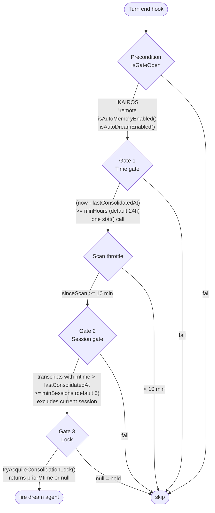
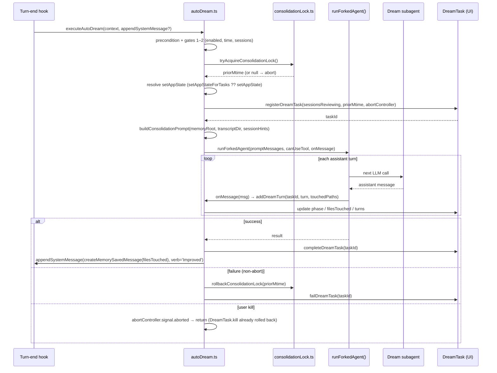

# AutoDream: Background Memory Consolidation

AutoDream is a background service that periodically spawns a forked subagent (the "dream agent") to read recent session transcripts and consolidate memories into the user's memory directory. It is fired from the stop-hook path for main-thread turns — lightweight unless all gates pass.

---

## Activation: Enabled Precondition + Three Gates

The source labels three named gates (Time, Sessions, Lock). Before reaching them, an enabled precondition (`isGateOpen()`) is evaluated. Gates are evaluated cheapest-first. Any failing check aborts without advancing.

**Precondition — `isGateOpen()`.** Checked in order: KAIROS active → return false (KAIROS uses its own disk-skill dream path); remote mode → return false; `isAutoMemoryEnabled()` → checks `CLAUDE_CODE_DISABLE_AUTO_MEMORY`, `CLAUDE_CODE_SIMPLE`, and CCR-without-persistent-storage; `isAutoDreamEnabled()` → reads `autoDreamEnabled` from `settings.json` first; if unset, falls through to `tengu_onyx_plover.enabled` in GrowthBook.

**Gate 1 — Time gate.** Reads lock file mtime via `readLastConsolidatedAt()` — a single `stat()` call. Returns `0` if no lock file exists (first ever run). Per-turn cost when enabled but time hasn't passed: one stat.

**Scan throttle.** After the time gate passes, the session scan itself is throttled to once per 10 minutes (`SESSION_SCAN_INTERVAL_MS`). This is a separate early-exit between Gate 1 and Gate 2: when the time gate passes but the session gate fails, the lock mtime doesn't advance, so the time gate would fire every turn without this throttle.

**Gate 2 — Session gate.** Scans per-cwd transcript directory with `listSessionsTouchedSince(lastAt)`. Uses mtime (sessions touched since consolidation, not birthtime). The current session is excluded — its mtime is always recent.

**Gate 3 — Lock.** `tryAcquireConsolidationLock()` writes the current PID to `.consolidate-lock` in the memory directory, then reads back to verify it won the race. Returns `priorMtime` (for rollback) on success, `null` if blocked. Stale lock detection: if the lock is held by a PID that `isProcessRunning()` returns false for, it is reclaimed. Locks older than 1 hour are considered stale even if the PID is live (PID reuse guard). If the body is unparseable, the lock is also reclaimed within the 1-hour window.

**Force override.** An internal `isForced()` function (always `false` in external builds, overridable in ant builds) bypasses the precondition, time gate, scan throttle, session-count check, and lock acquisition. Under force, the existing `lastAt` is used as `priorMtime` so a kill's rollback is a no-op. The session scan still runs to populate prompt hints.

---

## Configuration

From GrowthBook flag `tengu_onyx_plover` with per-field defensive validation (stale cache can return wrong types):

| Field | Default | Purpose |
|-------|---------|---------|
| `enabled` | `false` | Master enable (unless overridden by `settings.json`) |
| `minHours` | `24` | Minimum hours between consolidations |
| `minSessions` | `5` | Minimum new sessions since last consolidation |

User setting `autoDreamEnabled` in `settings.json` takes priority over `tengu_onyx_plover.enabled`.

---

## Consolidation Flow

**`initAutoDream()`** must be called once at startup (alongside `initExtractMemories` in `backgroundHousekeeping`). It creates a closure over `lastSessionScanAt` — tests call it in `beforeEach` for a fresh closure.

**`executeAutoDream(context, appendSystemMessage?)`** is the per-turn entry point from `stopHooks`. It is a no-op until `initAutoDream()` has been called. Per-turn cost when enabled: one GB cache read + one `stat()`. `appendSystemMessage` is optional; when provided, a completion note is appended to the main transcript only if files were touched.

---

## Dream Agent Allowed Tools

The dream agent runs via `runForkedAgent()` with a restricted `canUseTool` predicate (`createAutoMemCanUseTool(memoryRoot)`):

| Tool | Access |
|------|--------|
| `REPLTool` | Allowed; inner primitive tool calls are checked again by the same `canUseTool` path |
| `FileReadTool` | Allowed |
| `GrepTool` | Allowed |
| `GlobTool` | Allowed |
| `FileEditTool` | Allowed only for paths inside the auto-memory directory |
| `FileWriteTool` | Allowed only for paths inside the auto-memory directory |
| `BashTool` | Read-only commands only (`ls`, `find`, `grep`, `cat`, `stat`, `wc`, `head`, `tail`, and similar) |
| Everything else | Denied |

The `canUseTool` restriction is enforced at the `runForkedAgent` layer, not via the tool registry. The dream agent cannot write outside the memory directory or run stateful shell commands.

---

## Consolidation Prompt Phases

`buildConsolidationPrompt(memoryRoot, transcriptDir, extra)` generates a four-phase prompt:

| Phase | Task |
|-------|------|
| **Orient** | `ls` memory dir, read `MEMORY.md` index, skim existing topic files |
| **Gather** | Prioritize daily logs → drifted memories → narrow transcript grep |
| **Consolidate** | Merge new signal into existing files; convert relative dates to absolute; delete contradicted facts |
| **Prune & index** | Update `MEMORY.md` to stay under `MAX_ENTRYPOINT_LINES` lines and ~25KB; each entry one line under ~150 chars |

Session IDs accumulated since last consolidation are appended as `extra` context so the agent knows which transcripts to target.

---

## Consolidation Lock

The lock file is `{memoryDir}/.consolidate-lock`. Its mtime is `lastConsolidatedAt` — this dual-purpose design means a single `stat()` provides both the lock state and the timestamp.

| Operation | Behavior |
|-----------|---------|
| `readLastConsolidatedAt()` | `stat(lockPath).mtimeMs`; returns `0` if absent |
| `tryAcquireConsolidationLock()` | Write PID, read back to verify race winner; returns `priorMtime` or `null` |
| `rollbackConsolidationLock(priorMtime)` | If `priorMtime === 0`: `unlink`. Otherwise: write empty body and rewind mtime via `utimes()` |
| `recordConsolidation()` | Stamped by manual `/dream` skill at prompt-build time (best-effort, no completion hook) |

On fork failure, `rollbackConsolidationLock(priorMtime)` rewinds mtime so the time-gate fires again. The scan throttle (10 min) acts as backoff. On user kill, `DreamTask.kill` calls `rollbackConsolidationLock` and aborts the controller before `executeAutoDream` returns — the catch block in `autoDream.ts` checks `abortController.signal.aborted` and skips double-rollback.

---

## Memory Path Resolution

`getAutoMemPath()` is memoized on `projectRoot`. Resolution order:

1. `CLAUDE_COWORK_MEMORY_PATH_OVERRIDE` env var (full path, used by Cowork for space-scoped mounts)
2. `autoMemoryDirectory` in `settings.json` (trusted sources only: policy/local/user; project settings excluded for security)
3. `{memoryBase}/projects/{sanitized-git-root}/memory/` where `memoryBase` is `~/.claude` or `CLAUDE_CODE_REMOTE_MEMORY_DIR`

Canonical git root is used (via `findCanonicalGitRoot`) so all worktrees of the same repo share one memory directory.

---

## DreamTask Registry

`DreamTask.ts` surfaces the otherwise-invisible forked agent in the UI (footer pill and Shift+Down background-tasks dialog).

| State | Meaning |
|-------|---------|
| `phase: 'starting'` | Agent running, no Edit/Write tool use observed yet |
| `phase: 'updating'` | First Edit/Write tool call seen in `filesTouched` |
| `filesTouched` | Paths from Edit/Write `tool_use` blocks (incomplete — misses bash-mediated writes) |
| `turns` | Last 30 assistant turns, tool uses collapsed to a count |

On completion, `completeDreamTask` sets `notified: true` immediately (no model-facing notification path; the `appendSystemMessage` completion note is the user surface). The `abortController` is cleared from state when the task reaches any terminal status.
