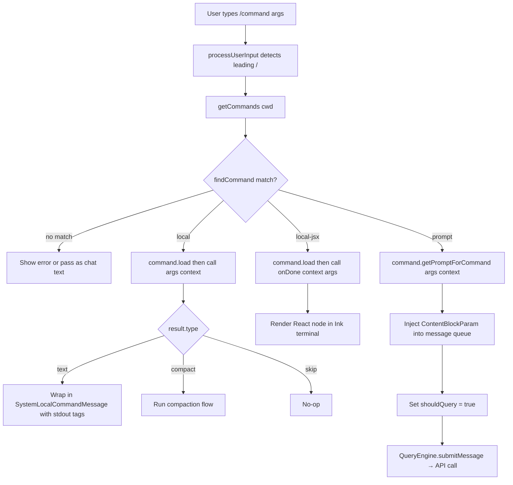

# Slash Command System

## Purpose

The slash command system provides structured actions inside the Claude Code REPL. Commands are invoked by typing `/name [args]` in the chat input. Depending on type, a command either executes entirely within the CLI process, injects prompt context that triggers an LLM call, or changes REPL state directly. They are distinct from tool calls: commands are user-initiated at the input prompt, not model-initiated.

## Command Types

| Type | Key Field | Behavior |
|------|-----------|----------|
| `local` | `load(): Promise<{ call }>` | Runs a JS function in-process. Returns `LocalCommandResult` (text, compact, or skip). No LLM call. |
| `local-jsx` | `load(): Promise<{ call }>` | Renders an Ink/React component. Interactive UI. No LLM call. |
| `prompt` | `getPromptForCommand()` | Returns `ContentBlockParam[]` that are injected as a user message, then the model is queried. |

`LocalCommandResult` variants:
- `{ type: 'text'; value: string }` — echoed back as a system message
- `{ type: 'compact'; compactionResult }` — triggers context compaction flow
- `{ type: 'skip' }` — produces no output

## Command Classification

```mermaid
graph TD
    Input["/command args typed in REPL"]
    Input --> Match{Match registered command}
    Match -->|local| LocalFn[Execute call() in process]
    Match -->|local-jsx| JSX[Render Ink component]
    Match -->|prompt| Inject[Inject ContentBlockParam into messages]
    LocalFn --> Result[LocalCommandResult]
    Result -->|type=text| SysMsg[Display as system message]
    Result -->|type=compact| Compact[Run compaction flow]
    Result -->|type=skip| Skip[No output]
    JSX --> UI[Interactive terminal UI]
    Inject --> Query[QueryEngine.submitMessage → LLM call]
```

## Command Registry

All commands are assembled in `commands.ts`. The exported `COMMANDS` array is a memoized factory function (not a static array) so config reads are deferred until `getCommands()` is first called.

### Loading order in `loadAllCommands(cwd)`

```
bundledSkills → builtinPluginSkills → skillDirCommands → workflowCommands → pluginCommands → pluginSkills → COMMANDS()
```

The final list is filtered by `meetsAvailabilityRequirement()` and `isCommandEnabled()` before returning to callers.

### `getCommands(cwd): Promise<Command[]>`

The primary public API. Returns commands available to the current user. Availability checks are re-evaluated on every call (not memoized) so auth changes after `/login` take effect immediately. Dynamic skills discovered during file operations are merged in at the insertion point just before built-in commands.

### `getSlashCommandToolSkills(cwd): Promise<Command[]>`

Filters to `prompt`-type commands that the model can invoke as skills. Criteria:
- `type === 'prompt'`
- `source !== 'builtin'`
- Has `hasUserSpecifiedDescription` or `whenToUse`
- `loadedFrom` is `'skills'`, `'plugin'`, `'bundled'`, or `disableModelInvocation` is set

### `getSkillToolCommands(cwd): Promise<Command[]>`

Broader filter used by `SkillTool` to show all model-invocable prompt commands, including those from deprecated `/commands/` directories.

## Feature-Gated Commands

Commands behind compile-time `feature()` flags are dead-code-eliminated from external builds. The conditional require pattern is used throughout:

```
const proactive = feature('PROACTIVE') || feature('KAIROS')
  ? require('./commands/proactive.js').default
  : null
```

| Flag | Commands |
|------|----------|
| `KAIROS` / `PROACTIVE` | proactive, brief, assistant |
| `BRIDGE_MODE` | bridge, remoteControlServer (also needs `DAEMON`) |
| `VOICE_MODE` | voice |
| `HISTORY_SNIP` | force-snip |
| `BUDDY` | buddy |
| `ULTRAPLAN` | ultraplan |
| `FORK_SUBAGENT` | fork |
| `WORKFLOW_SCRIPTS` | workflows |
| `UDS_INBOX` | peers |

The `USER_TYPE === 'ant'` runtime check gates `INTERNAL_ONLY_COMMANDS` (backfillSessions, breakCache, bughunter, commit, and others) which are never shipped to external users.

## Availability Filtering

`CommandAvailability` declares which auth environments can see a command:
- `'claude-ai'` — claude.ai OAuth subscriber
- `'console'` — direct api.anthropic.com API key (not 3P, not claude.ai OAuth)

`meetsAvailabilityRequirement()` checks these against runtime auth state. Commands without an `availability` field are visible everywhere. Auth state can change mid-session; this check is not memoized.

## Built-in Commands Reference

| Command | Type | Description |
|---------|------|-------------|
| `/clear` | local | Clear conversation history |
| `/compact` | local | Summarize and compact current conversation |
| `/config` | local-jsx | Manage settings |
| `/cost` | local | Show token usage and cost |
| `/doctor` | local-jsx | Diagnose environment issues |
| `/help` | local | Show help text |
| `/init` | local | Initialize CLAUDE.md in current project |
| `/login` | local-jsx | OAuth authentication (hidden when using 3P services) |
| `/logout` | local | Deauthenticate (hidden when using 3P services) |
| `/mcp` | local-jsx | Manage MCP server connections |
| `/memory` | local-jsx | View and edit memory files |
| `/model` | local-jsx | Switch models |
| `/resume` | local-jsx | Resume a previous conversation |
| `/review` | prompt | Code review (LLM-augmented) |
| `/skills` | local-jsx | Manage skills |
| `/status` | local | Show connection and auth status |
| `/theme` | local-jsx | Change color theme |
| `/vim` | local | Enable vim keybindings |
| `/plan` | local-jsx | Toggle plan mode |
| `/hooks` | local-jsx | Manage hooks |
| `/permissions` | local-jsx | Manage tool permissions |

## Custom Skill Commands

Users place Markdown files in `.claude/commands/` (project-level) or `~/.claude/commands/` (global). Each file becomes a `prompt`-type command. `getSkillDirCommands(cwd)` discovers these by:

1. Walking project directories from `cwd` up toward home
2. Reading `.claude/commands/` and `.claude/skills/` at each level
3. Parsing YAML frontmatter for metadata (`description`, `whenToUse`, `argNames`, `allowedTools`, `model`, `hooks`, `paths`, `effort`, `context`)
4. Wrapping each file as a `PromptCommand` whose `getPromptForCommand()` returns the Markdown body as `ContentBlockParam[]`

Files are discovered in precedence order (project > global > enterprise) and merged into the command list ahead of built-in commands.

## Dispatch Flow



## Remote and Bridge Safety

Not all commands are safe across all transport modes.

`REMOTE_SAFE_COMMANDS` — commands allowed before the remote control init message arrives (e.g., in `--remote` mode). Restricted to local TUI-only commands: `clear`, `theme`, `help`, `cost`, `vim`, `copy`, `plan`, `session`, `exit`.

`BRIDGE_SAFE_COMMANDS` — `local`-type commands safe for execution when the input arrives over the Remote Control bridge (mobile/web). Includes: `compact`, `clear`, `cost`, `summary`, `releaseNotes`, `files`. All `prompt`-type commands are safe by construction (they expand to text). All `local-jsx` commands are blocked (they render Ink UI).

`isBridgeSafeCommand(cmd)` is the predicate used at the bridge dispatch layer.

## Cache Invalidation

`clearCommandsCache()` invalidates all memoization layers:
- `loadAllCommands` — the full command load cache (keyed by `cwd`)
- `getSkillToolCommands` and `getSlashCommandToolSkills` — per-cwd skill filters
- `clearSkillIndexCache` — the skill search index (feature-gated)
- `clearPluginCommandCache` / `clearPluginSkillsCache` — plugin-provided commands
- `clearSkillCaches` — skill directory load cache

`clearCommandMemoizationCaches()` invalidates only the command-list caches without touching skill caches. Used when dynamic skills are discovered mid-session to avoid re-loading all skills from disk.
