# Compaction Design

## Purpose

Compaction is the family of mechanisms that keep a conversation under the model's context window across a long session. They form a layered strategy — cheap and surgical at the top, lossy and heavyweight at the bottom — so the system applies the smallest disruption that resolves the pressure.

The full set, ordered by where they fire in the query loop and how invasive they are:

| # | Strategy | Disruption | Decided by | Code home |
|---|----------|-----------|-----------|-----------|
| 1 | **History Snip** | Removes individual messages | The **model** (via `SnipTool`) | `services/compact/snipCompact.{js,ts}` *(feature-gated, DCE)* |
| 2 | **Microcompact** | Zeros old tool result content | System (count/time triggers) | `services/compact/microCompact.ts` |
| 3 | **API-Side Context Management** | Server-side tool-use/thinking clearing | Anthropic API | `services/compact/apiMicrocompact.ts` |
| 4 | **Context Collapse** | Replaces spans with per-span summaries | System (token thresholds) | `services/contextCollapse/` *(feature-gated, DCE)* |
| 5 | **Session Memory Compaction** | Substitutes pre-extracted memory file for a summary | System (autocompact threshold) | `services/compact/sessionMemoryCompact.ts` *(experiment)* |
| 6 | **Auto-Compact** | Full LLM-generated summary, replaces history | System (~93% threshold) | `services/compact/autoCompact.ts` → `compact.ts` |
| 7 | **Partial Compaction** | Summarizes one half (`from` / `up_to`) | User (via UI message selector) | `services/compact/compact.ts` |
| 8 | **Reactive Compaction** | Same as auto-compact, after a 413 | System (post-API error) | `services/compact/reactiveCompact.js` *(feature-gated, DCE)* |

Auto-compact (6) is the canonical "compaction" event. The others exist because (6) is expensive — a full LLM call, full cache invalidation, lossy summary — so the system tries lighter touches first whenever it can.

---

## Strategy Cheat-Sheet

A one-paragraph view of each strategy. Use this to decide which deep-dive section to read.

### 1. History Snip
**Trigger**: Model invokes `SnipTool` mid-turn with stale message UUIDs. System nudges via the `context_efficiency` attachment when growth without recent snips is detected.
**Mechanism**: Pre-API scan removes those UUIDs from the outgoing `messagesForQuery`. Reports `tokensFreed` to autocompact so its threshold check uses a corrected count.

### 2. Microcompact
**Trigger (time-based)**: Gap since last main-loop assistant message > 60 min (server cache is cold anyway).
**Trigger (cached, ant)**: Every iteration; fires when registered compactable tool_results exceed `keepRecent`. Main-thread only.
**Mechanism (time-based)**: Replaces old tool_result content with `[Old tool result content cleared]` in-place; keeps the last 5 compactable results.
**Mechanism (cached)**: Queues a `cache_edits` block for the next API call. Server deletes those tool_results from the KV cache; local `Message[]` is unchanged.

### 3. API-Side Context Management
**Trigger**: Server-side, when `input_tokens` crosses `API_MAX_INPUT_TOKENS` (180k default). `clear_thinking_20251015` is always active when thinking blocks are present.
**Mechanism**: Client passes a `context_management` config in the request. The model server trims tool_uses/results or old thinking turns before the model attends.

### 4. Context Collapse
**Trigger**: 90% effective window → commit staged spans + background spawn; 95% → synchronous blocking spawn; 413 → drain entire staged queue and retry.
**Mechanism**: A background `marble_origami` sub-agent summarizes one assistant turn + its tools at a time. A projection layer swaps committed spans for summary placeholders before the API call; the REPL keeps the originals.

### 5. Auto-Compact
**Trigger**: `tokenCount ≥ autoCompactThreshold` (~93% of effective window). Suppressed by collapse-enabled, reactive-only mode, recursion guards (`session_memory` / `compact` / `marble_origami`), or circuit breaker (3 consecutive failures).
**Mechanism**: Tries session-memory compaction first; otherwise runs the full LLM summary via the cache-sharing forked agent (or streaming fallback). Replaces the entire history with summary + post-compact attachments.

### 6. Session Memory Compaction (experiment)
**Trigger**: Same threshold as auto-compact, but only when `tengu_sm_compact` is on, the extracted memory file is non-empty, AND the resulting size fits under the threshold.
**Mechanism**: Skips the LLM call. Uses the pre-extracted memory file as the summary; expands the kept tail to meet the 10K-token / 5-text-message minimums (40K hard cap), with API-invariant adjustments for tool pairs and thinking blocks.

### 7. Partial Compaction
**Trigger**: User selects a message in the UI and chooses to summarize messages before or after it.
**Mechanism**: Same summary path as auto-compact but with direction `'from'` (summarize tail, keep prefix — cache preserved) or `'up_to'` (summarize prefix, keep tail — cache invalidated). `preservedSegment` metadata wires the kept range into the boundary marker.

### 8. Reactive Compaction
**Trigger**: API returns `prompt_too_long` (413); the error is withheld from the caller. Runs after collapse's `recoverFromOverflow` has nothing left to drain.
**Mechanism**: Same LLM-summary path as auto-compact. Loop retries the same iteration with `transition = reactive_compact_retry`.

---

## Public Surface

The query loop interacts with compaction through a small set of entry points. Everything else is internal orchestration.

```ts
// services/compact/microCompact.ts
export async function microcompactMessages(
  messages: Message[],
  toolUseContext?: ToolUseContext,
  querySource?: QuerySource,
): Promise<MicrocompactResult>

// services/compact/autoCompact.ts
export async function autoCompactIfNeeded(
  messages: Message[],
  toolUseContext: ToolUseContext,
  cacheSafeParams: CacheSafeParams,
  querySource?: QuerySource,
  tracking?: AutoCompactTrackingState,
  snipTokensFreed?: number,
): Promise<{
  wasCompacted: boolean
  compactionResult?: CompactionResult
  consecutiveFailures?: number
}>

// services/compact/compact.ts
export async function compactConversation(...): Promise<CompactionResult>
export async function partialCompactConversation(...): Promise<CompactionResult>
export function buildPostCompactMessages(result: CompactionResult): Message[]

// services/compact/reactiveCompact.js (feature-gated)
export function isWithheldPromptTooLong(message): boolean
export async function tryReactiveCompact({...}): Promise<CompactionResult | null>
```

`CompactionResult` is the universal output. Every path that produces a new conversation history returns one:

```ts
export interface CompactionResult {
  boundaryMarker: SystemMessage              // compact-boundary marker, with optional preservedSegment metadata
  summaryMessages: UserMessage[]             // the summary (or session-memory) text
  attachments: AttachmentMessage[]           // restored files, skills, plan, async agents, delta announcements
  hookResults: HookResultMessage[]           // SessionStart hook-provided continuation context
  messagesToKeep?: Message[]                 // suffix preserved verbatim (partial/SM-compact)
  userDisplayMessage?: string
  preCompactTokenCount?: number
  postCompactTokenCount?: number             // compact API call's total usage (kept for event continuity)
  truePostCompactTokenCount?: number         // estimated size of the resulting context
  compactionUsage?: ReturnType<typeof getTokenUsage>
}
```

`buildPostCompactMessages()` is the single ordering authority — `boundary, ...summary, ...messagesToKeep, ...attachments, ...hookResults` — used by every consumer so the post-compact transcript layout is identical regardless of which path produced it.

---

## Trigger Architecture

The query loop's compaction stack runs in fixed order on every iteration. Each layer either short-circuits, mutates, or yields control to the next — they are **complementary**, not alternative.

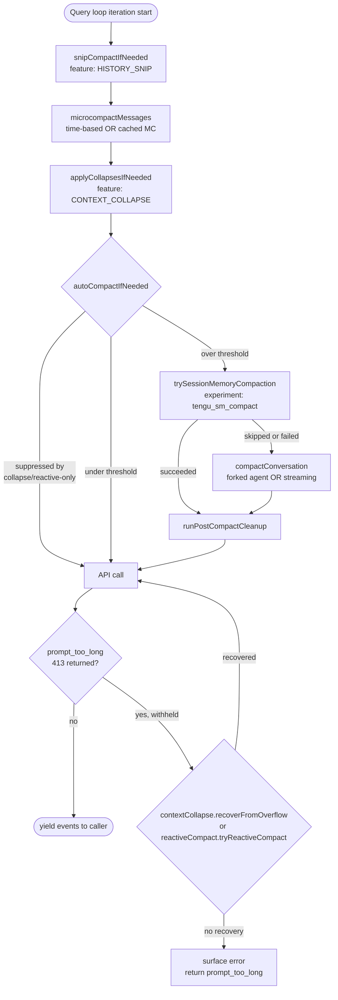

Three properties hold across this stack:

1. **Suppression cascades upward**. Context Collapse owns headroom when active, so it suppresses auto-compact (`shouldAutoCompact` returns `false` when `isContextCollapseEnabled()`, `autoCompact.ts:215-223`). Reactive-only mode (`tengu_cobalt_raccoon`) does the same. Reactive compact then runs as the 413 fallback in both cases.
2. **Recursion guards are hard**. `shouldAutoCompact` short-circuits when `querySource === 'session_memory' | 'compact' | 'marble_origami'` (the forked summarizer agents). Without these guards, a forked agent whose own context overflows would call `runPostCompactCleanup` and destroy the main thread's module-level state (the context-collapse committed log).
3. **Failure increments a circuit breaker**. `AutoCompactTrackingState.consecutiveFailures` caps at `MAX_CONSECUTIVE_AUTOCOMPACT_FAILURES = 3` (`autoCompact.ts:70`). The trigger for this cap: BQ on 2026-03-10 found 1,279 sessions hammering doomed compact attempts on every turn (some up to 3,272 attempts in one session, ~250K wasted API calls/day fleet-wide).

---

## History Snip

History Snip is an **ant-only, compile-time gated** (`feature('HISTORY_SNIP')`) strategy where the **model itself** decides which old conversation turns to remove. Every other compaction mechanism is system-driven (thresholds, timers). Snip is model-driven.

### The three moving parts

**`SnipTool`** — registered into the active tool list (`tools.ts:123`) when the feature is on. The model calls it mid-turn with a list of message UUIDs it considers stale. The tool call is recorded in the transcript like any other tool use.

**`[id:UUID]` tags** — before every API call, `sanitizeMessagesForAPI` (`messages.ts:2351`) injects an `[id:UUID]` tag into every non-meta user message (after all merging, so the tag always matches the surviving message's `uuid`). This gives the model stable handles to reference specific turns when calling `SnipTool`.

**`snipCompactIfNeeded()`** (`services/compact/snipCompact.{js,ts}`) — the pre-call cleanup. Runs **first** in the query loop (`query.ts:401`), before microcompact. Scans `messagesForQuery` for recorded `SnipTool` calls, extracts the `removedUuids` they carried, and physically removes those messages from the array.

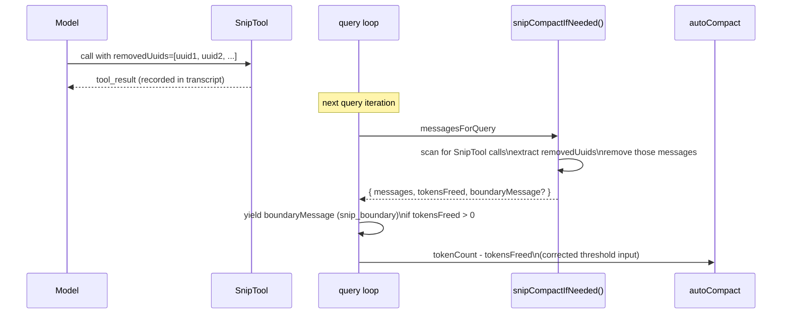

Returns `tokensFreed` — the rough delta of removed tokens. This is subtracted from `tokenCountWithEstimation` before the autocompact threshold check (`query.ts:638`, `autoCompact.ts:225`) so the system doesn't falsely trigger autocompact in the window between snip clearing space and the stale usage counter catching up.

### Nudge mechanism — `context_efficiency` attachment

When `shouldNudgeForSnips(messages)` returns true (the conversation has grown without recent snips or boundaries), `getContextEfficiencyAttachment()` (`attachments.ts:3963`) emits a `context_efficiency` attachment. This becomes a `<system-reminder>` meta user message carrying `SNIP_NUDGE_TEXT` — a prompt hint telling the model to call `SnipTool` on turns it no longer needs. The nudge interval resets on prior nudges, snip markers, snip boundaries, and compact boundaries.

### REPL vs SDK — two views of history

The REPL keeps the full original `messages` array for UI scrollback, exactly like context collapse's projection model:

- **Model-facing path**: `getMessagesAfterCompactBoundary()` (`messages.ts:4648`) calls `projectSnippedView()` (`snipProjection.js`) to filter snipped messages out before the array reaches the API.
- **SDK / QueryEngine**: a `snipReplay` callback (`QueryEngine.ts:1278`) is injected into `QueryEngineConfig`. On each yielded `snip_boundary` system message it calls `snipCompactIfNeeded(store, { force: true })` and truncates `mutableMessages` in-place — bounding memory in long headless sessions where there is no UI to preserve.

### Session restore

`applySnipRemovals()` (`sessionStorage.ts:1982`) runs during resume. It walks the transcript, finds all entries carrying `snipMetadata.removedUuids`, and deletes those UUIDs from the message map. It then relinks survivors whose `parentUuid` now points to a deleted entry using path-compressed backward resolution, so resumed sessions see the same trimmed history the model last saw.

---

## Microcompact

Microcompact is a lightweight, pre-API-call trim of old tool result content. It runs **second** in the query loop (after snip, before context collapse / auto-compact) on every iteration. Rather than summarising conversation history, it zeroes out the content of old `tool_result` blocks that are unlikely to be re-read by the model.

Only results from `COMPACTABLE_TOOLS` are eligible:

```ts
// microCompact.ts:41
const COMPACTABLE_TOOLS = new Set<string>([
  FILE_READ_TOOL_NAME,
  ...SHELL_TOOL_NAMES,
  GREP_TOOL_NAME,
  GLOB_TOOL_NAME,
  WEB_SEARCH_TOOL_NAME,
  WEB_FETCH_TOOL_NAME,
  FILE_EDIT_TOOL_NAME,
  FILE_WRITE_TOOL_NAME,
])
```

The last `keepRecent` results (default: 5) are always preserved. There are two active paths and one no-op:

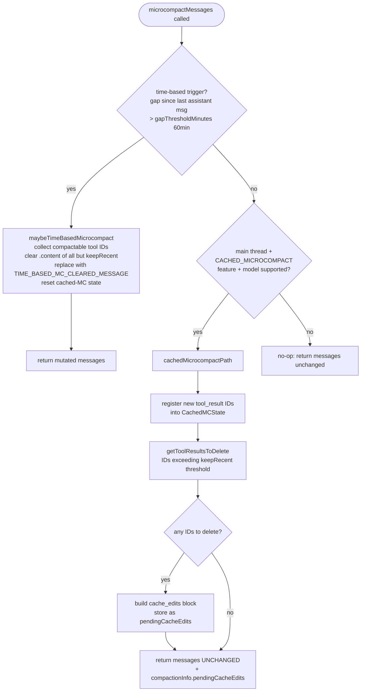

### Cached microcompact (ant-only, `CACHED_MICROCOMPACT` feature)

Uses the Anthropic **cache editing beta API** (`cache-editing-2025-04-14`) to delete old tool results from the server's KV cache. The local `Message[]` array is returned **unchanged** — only the server-side cache is edited. This preserves the prompt cache prefix while reducing billed cache-read tokens.

Module-level state in `microCompact.ts:56-118`:

| Symbol | Role |
|---|---|
| `cachedMCState` | Lazily created `CachedMCState`; tracks registered tool_use IDs, tool message groups, and deleted refs |
| `pendingCacheEdits` | Queued `cache_edits` block for the *next* API request; consumed by `consumePendingCacheEdits()` |
| `pinCacheEdits(userMessageIndex, block)` | Stores the edit block by user-message position so it is re-sent on every subsequent request, maintaining the deletion in future cache hits |
| `markToolsSentToAPIState()` | Called after a successful API response to advance the registered-tool watermark |
| `resetMicrocompactState()` | Full reset; called by `runPostCompactCleanup` and on time-based fires |

The microcompact boundary message (reporting `cache_deleted_input_tokens`) is deferred until **after** the API response so it uses the real server-reported savings rather than a client estimate. The baseline cumulative `cache_deleted_input_tokens` is captured from the last assistant message and used to compute the per-operation delta.

Main-thread gate: only `repl_main_thread*` querySources (prefix match per `isMainThreadSource()`) run cached MC. Subagent forks would otherwise register their tool_results in the global `cachedMCState`, causing the main thread to try deleting tools that don't exist in its own conversation.

### Time-based microcompact

Fires when the server-side 1-hour prompt cache has almost certainly expired (gap > 60 min, configured via GrowthBook flag `tengu_slate_heron`). Since the full prefix will be rewritten on the next call regardless, clearing old tool results before sending shrinks what gets re-transmitted and re-cached. Content is replaced in-place in the local `Message[]` with the marker `[Old tool result content cleared]`; no cache-editing API is needed.

Two predicate calls are deliberately separated:

- `evaluateTimeBasedTrigger(messages, querySource)` — pure predicate, returns `{ gapMinutes, config }` or null. Exposed for other pre-request paths (e.g. snip force-apply) to consult the same trigger without invoking the clearing action.
- `maybeTimeBasedMicrocompact()` — calls the predicate, then performs the in-place clearing if it fires.

Time-based fires **before** cached MC and short-circuits it. The cache is cold; editing assumes a warm cache.

### Cache-break detection coordination

Both microcompact paths notify `services/api/promptCacheBreakDetection` so the legitimate cache_read drop after a clear isn't flagged as an anomaly:

| Path | Call | Why |
|---|---|---|
| Cached MC | `notifyCacheDeletion(querySource)` | KV cache entries were removed |
| Time-based MC | `notifyCacheDeletion(querySource)` | Prompt content mutated, next read will be low |
| Full compact | `notifyCompaction(querySource, agentId)` | New summary breaks the cache prefix entirely |

BQ on 2026-03-01 found ~20% of `tengu_prompt_cache_break` events were false positives because session-memory compaction wasn't calling `notifyCompaction`; `autoCompactIfNeeded` now invokes it explicitly on the SM-compact path (`autoCompact.ts:302`).

---

## API-Side Context Management

`services/compact/apiMicrocompact.ts` is **server-side** context editing — the API's own context-management beta (`context-management-2025-09-19` family) trims context inside the model server instead of locally.

```ts
// getAPIContextManagement() returns this when active:
type ContextManagementConfig = {
  edits: ContextEditStrategy[]
}

type ContextEditStrategy =
  | { type: 'clear_tool_uses_20250919'; trigger?: {...}; keep?: {...}; clear_tool_inputs?: ...; exclude_tools?: ...; clear_at_least?: {...} }
  | { type: 'clear_thinking_20251015'; keep: { type: 'thinking_turns'; value: number } | 'all' }
```

| Strategy | Trigger | Gating | Default thresholds |
|---|---|---|---|
| `clear_thinking_20251015` | Always when `hasThinking && !isRedactThinkingActive` | All users | `keep: 'all'` (or `value: 1` when `clearAllThinking` — >1h idle = cache miss) |
| `clear_tool_uses_20250919` (results variant) | `USE_API_CLEAR_TOOL_RESULTS` env | Ant-only | `API_MAX_INPUT_TOKENS=180_000` trigger; `clear_at_least = trigger - API_TARGET_INPUT_TOKENS(40_000)` |
| `clear_tool_uses_20250919` (uses variant) | `USE_API_CLEAR_TOOL_USES` env | Ant-only | Same defaults; excludes `FileEdit`/`FileWrite`/`NotebookEdit` (edits represent actions, not retrievable state) |

**Why both client AND server side?** Client-side microcompact controls what gets *sent*; server-side context management controls what the *model attends to* after the request lands. Client-side reduces transport + cache cost; server-side enforces a model-attention budget. Either side can fire in isolation. Together they form a defense-in-depth: client trims old tool results on a count cadence, server trims when input_tokens crosses a high-water mark.

The thinking-clear strategy is the only one always-on for external builds. Its purpose is the cache-miss recovery case: when the prompt cache has expired (`clearAllThinking = true`), the schema requires `value >= 1`, and omitting the edit falls back to a model-policy default that may not clear at all. Explicitly passing `{ value: 1 }` guarantees only the last thinking turn survives.

---

## Context Collapse

Context collapse (`CONTEXT_COLLAPSE` feature, internal codename **marble_origami**, `services/contextCollapse/index.js`) is an incremental, span-by-span compaction strategy. It runs **third** in the query loop — after microcompact and **before** auto-compact, which it suppresses when enabled.

Instead of replacing the entire conversation with one summary (as auto-compact does), collapse replaces individual contiguous spans (one assistant turn + its tool calls + results) with a short LLM-generated summary. The REPL always holds the original, complete `messages` array; collapse operates through a **projection layer** (`projectView`) that the API call sees, not the source of truth.

### Collapse anatomy

```
Original messages:     [sys] [u1] [a1 + tools] [u2 tool_results] [u3] [a2] ...
                              ↑──── span 1 archived ────↑
After projectView:     [sys] [<collapsed id="1">summary</collapsed>] [u3] [a2] ...
```

A committed collapse stores:
- `firstArchivedUuid` / `lastArchivedUuid` — span boundary UUIDs in the original array
- `summaryContent` — the model-generated text substituted for the span
- Persisted as `marble-origami-commit` entries in the transcript (append-only log)

Staged collapses are summaries generated by the background ctx-agent but not yet committed. They are stored in the `ContextCollapseSnapshotEntry` (`type: 'marble-origami-snapshot'`) and committed when the token count crosses the commit threshold.

### Query loop integration

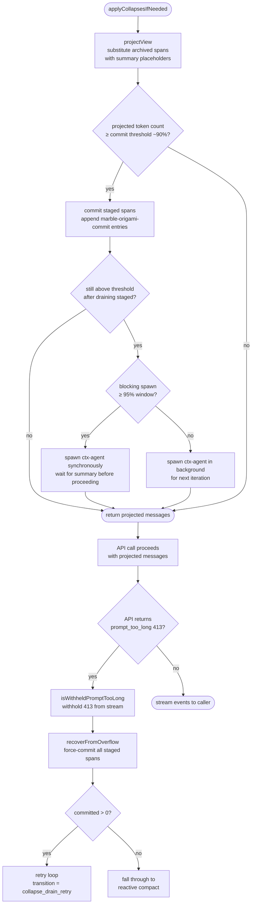

### Token threshold ladder

Three thresholds govern the collapse lifecycle:

| Threshold | Action |
|-----------|--------|
| ~90% effective window | Commit staged spans; spawn ctx-agent in background for next spans |
| ~95% effective window | **Blocking spawn** — ctx-agent runs synchronously, query loop waits |
| Real API 413 | `recoverFromOverflow` — drain entire staged queue in one shot, then retry |

Auto-compact sits at ~93% — between the 90% commit start and 95% blocking spawn — but is **suppressed** when context collapse is enabled to prevent the two systems from racing.

### The ctx-agent (`marble_origami` query source)

Summarization is performed by a forked sub-agent with `querySource === 'marble_origami'`. It has read-only access to the span being archived. It is explicitly excluded from auto-compact: if the ctx-agent's own context overflowed and auto-compact fired, `runPostCompactCleanup` would call `resetContextCollapse()`, destroying the main thread's committed log (shared module-level state). A guard in `autoCompact.ts:179-183` prevents this.

### State persistence

| Entry type | Purpose |
|-----------|---------|
| `marble-origami-commit` | Append-only log of committed collapses; replayed in order on session resume to reconstruct the projection |
| `marble-origami-snapshot` | Latest staged-queue snapshot; last-wins on restore |

On resume, `restoreFromEntries()` rebuilds the collapse store. `projectView` lazily fills the archived message arrays the first time it encounters each span boundary in the resumed messages.

---

## Auto-Compact

Auto-compact is the canonical pressure-relief mechanism. It is the only compaction layer that **always exists in external builds** (snip, collapse, reactive, and cached MC are all DCE'd by `feature()` gates for non-ant users). It is also the most disruptive — a full LLM call that replaces the entire conversation history with a single summary, invalidating the prompt cache.

### Threshold ladder

`calculateTokenWarningState(tokenUsage, model)` (`autoCompact.ts:93`) returns five booleans that drive UI warnings, autocompact firing, and the blocking limit:

```
effectiveContextWindow = contextWindowForModel - MAX_OUTPUT_TOKENS_FOR_SUMMARY(20_000)
autoCompactThreshold   = effectiveContextWindow - AUTOCOMPACT_BUFFER_TOKENS(13_000)
warningThreshold       = autoCompactThreshold  - WARNING_THRESHOLD_BUFFER_TOKENS(20_000)
errorThreshold         = autoCompactThreshold  - ERROR_THRESHOLD_BUFFER_TOKENS(20_000)
blockingLimit          = effectiveContextWindow - MANUAL_COMPACT_BUFFER_TOKENS(3_000)
```

Reserving 20K for the summary output is sized to p99.99 of compact-summary output (17,387 tokens, `autoCompact.ts:29-30`). The 13K autocompact buffer sits ~33K below the blocking limit so the compact request itself has room to land.

`blockingLimit` is the hard cap the loop refuses to cross — when `isAtBlockingLimit`, the loop yields `PROMPT_TOO_LONG` and returns `blocking_limit` without even attempting the API call (`query.ts`).

### Environment overrides

| Variable | Effect | Use case |
|---|---|---|
| `DISABLE_COMPACT` | Disables both auto and manual compaction; auto returns immediately | Hard disable for eval / debugging |
| `DISABLE_AUTO_COMPACT` | Disables auto-compact only; `/compact` still works | Test reactive-only behavior |
| `CLAUDE_CODE_AUTO_COMPACT_WINDOW` | Clamp `contextWindowForModel` to this value | Force compaction in test sessions |
| `CLAUDE_AUTOCOMPACT_PCT_OVERRIDE` | Set threshold as percentage of effective window | Easier-than-token testing |
| `CLAUDE_CODE_BLOCKING_LIMIT_OVERRIDE` | Force a specific blocking limit | Testing |

### shouldAutoCompact — guards and suppression

Four classes of early-return prevent runaway compaction:

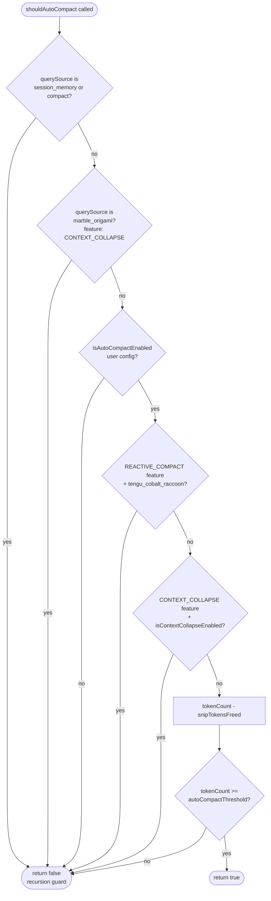

The marble_origami guard's string is wrapped in `feature('CONTEXT_COLLAPSE')` so that even the literal `'marble_origami'` is DCE'd from external builds — `excluded-strings.txt` enforces this.

### `autoCompactIfNeeded()` detailed sequence

`autoCompactIfNeeded()` (`autoCompact.ts:241-350`) is the orchestration boundary. It does not construct the compact summary itself. It decides whether compaction may run, gives session-memory compaction the first opportunity, delegates the LLM path to `compactConversation()`, and converts failures into tracking state for the next query-loop iteration.

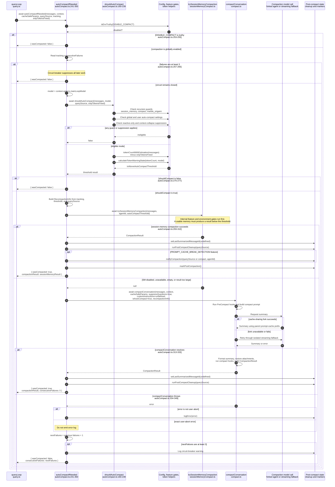

Two asymmetries are intentional:

- Session-memory success does not return `consecutiveFailures: 0`; only the full `compactConversation()` success path explicitly resets it (`autoCompact.ts:328-333`). The query loop replaces its broader tracking state after any successful compaction.
- The `try`/`catch` begins only around `compactConversation()` (`autoCompact.ts:312`). An exception thrown by `shouldAutoCompact()` or `trySessionMemoryCompaction()` is not converted into `{ wasCompacted: false }` by this function; it propagates to its caller.

### Circuit breaker

`MAX_CONSECUTIVE_AUTOCOMPACT_FAILURES = 3` (`autoCompact.ts:70`). Threaded through `AutoCompactTrackingState.consecutiveFailures`:

```ts
// Resets to 0 on success
// Increments on every catch in autoCompactIfNeeded
// shouldAutoCompact short-circuits once it hits 3
```

Without this, sessions where context is irrecoverably over the limit hammered the API on every turn. BQ 2026-03-10: 1,279 sessions had 50+ consecutive failures in a single session, wasting ~250K API calls/day fleet-wide.

### Delegation to session memory

When the threshold is breached, `autoCompactIfNeeded` calls `trySessionMemoryCompaction` first (`autoCompact.ts:288`). If session memory has been populated and the result fits under the threshold, the cheaper SM path is used and `compactConversation` is skipped entirely. Otherwise auto-compact runs the full LLM-summary path.

---

## Full Compaction (`compact.ts`)

`compactConversation()` is the workhorse. It:

1. Runs **PreCompact** hooks (may inject custom instructions, may produce a user-display message).
2. Runs a **summarization API call** through one of two paths.
3. **Clears caches** (`readFileState`, `loadedNestedMemoryPaths`).
4. **Generates post-compact attachments** in parallel (files, async-agent status, plan, plan mode, invoked skills, deltas).
5. Runs **SessionStart** hooks with `source: 'compact'` to restore hook-provided continuation context. Built-in CLAUDE.md/UserContext and system-prompt memory are refreshed separately through post-compact cache invalidation.
6. **Builds the boundary marker** with `preCompactDiscoveredTools` for deferred-tool state preservation.
7. Runs **PostCompact** hooks.
8. Returns a `CompactionResult`.

### `compactConversation()` detailed sequence

The following diagram follows `compactConversation()` in source order (`compact.ts:387-763`). All work occurs inside one outer `try`; any thrown error transfers control to the `catch`, and the `finally` progress reset runs after both success and failure.

```mermaid
sequenceDiagram
    autonumber
    participant Caller as Auto or manual<br/>compact caller
    participant CC as compactConversation<br/>compact.ts:387-763
    participant UI as Progress and SDK status<br/>callbacks
    participant Hooks as Hook subsystem
    participant SUM as streamCompactSummary
    participant PTL as PTL retry helpers
    participant ATT as Attachment builders
    participant CTX as Context and session state
    participant TEL as Telemetry and markers

    Caller->>CC: await compactConversation(messages, context,<br/>cacheSafeParams, suppressFollowUpQuestions,<br/>customInstructions, isAutoCompact, recompactionInfo)

    alt messages is empty<br/>compact.ts:397-399
        CC->>CC: throw ERROR_MESSAGE_NOT_ENOUGH_MESSAGES
    else messages are available
        CC->>CC: preCompactTokenCount = tokenCountWithEstimation(messages)
        CC->>CTX: getAppState()
        CC->>TEL: logPermissionContextForAnts()

        CC->>UI: onCompactProgress(hooks_start, pre_compact)
        CC->>UI: setSDKStatus(compacting)
        CC->>Hooks: await executePreCompactHooks(trigger,<br/>customInstructions, abortSignal)
        Hooks-->>CC: newCustomInstructions and userDisplayMessage
        CC->>CC: mergeHookInstructions(user, hook)
        CC->>UI: setStreamMode(requesting)<br/>reset response length<br/>onCompactProgress(compact_start)

        CC->>CTX: Read tengu_compact_cache_prefix
        CC->>CC: getCompactPrompt(merged instructions)<br/>create summaryRequest user message

        loop Summary request and prompt-too-long recovery<br/>compact.ts:450-491
            CC->>SUM: await streamCompactSummary(messagesToSummarize,<br/>summaryRequest, context, cacheSafeParams)
            Note over SUM: Prefer cache-sharing fork.<br/>Fall back to isolated streaming request.
            SUM-->>CC: assistant summaryResponse
            CC->>CC: getAssistantMessageText(summaryResponse)

            alt response is not prompt_too_long
                Note over CC: Exit retry loop
            else response is prompt_too_long
                CC->>CC: Increment ptlAttempts
                CC->>PTL: truncateHeadForPTLRetry(messagesToSummarize,<br/>summaryResponse), at most 3 retries
                alt truncation cannot produce a retry set
                    PTL-->>CC: null
                    CC->>TEL: log tengu_compact_failed(prompt_too_long)
                    CC->>CC: throw ERROR_MESSAGE_PROMPT_TOO_LONG
                else retry set is available
                    PTL-->>CC: truncated messages
                    CC->>TEL: log tengu_compact_ptl_retry
                    CC->>CC: messagesToSummarize = truncated
                    CC->>CC: retryCacheSafeParams.forkContextMessages = truncated
                end
            end
        end

        alt summary text is empty<br/>compact.ts:493-506
            CC->>TEL: Log debugging and tengu_compact_failed(no_summary)
            CC->>CC: throw no-summary error
        else summary starts with API error prefix<br/>compact.ts:507-515
            CC->>TEL: log tengu_compact_failed(api_error)
            CC->>CC: throw summary as Error
        else usable summary text
            CC->>CTX: Snapshot readFileState
            CC->>CTX: Clear readFileState and loadedNestedMemoryPaths

            par Restore recently read files
                CC->>ATT: createPostCompactFileAttachments(snapshot, context, maxFiles)
                ATT-->>CC: fileAttachments
            and Capture asynchronous-agent state
                CC->>ATT: createAsyncAgentAttachmentsIfNeeded(context)
                ATT-->>CC: asyncAgentAttachments
            end

            CC->>ATT: createPlanAttachmentIfNeeded(agentId)
            ATT-->>CC: optional plan attachment
            CC->>ATT: await createPlanModeAttachmentIfNeeded(context)
            ATT-->>CC: optional plan-mode attachment
            CC->>ATT: createSkillAttachmentIfNeeded(agentId)
            ATT-->>CC: optional invoked-skills attachment
            CC->>ATT: Rebuild deferred-tool, agent-listing,<br/>and MCP-instruction delta attachments

            CC->>UI: onCompactProgress(hooks_start, session_start)
            CC->>Hooks: await processSessionStartHooks(compact, model)
            Hooks-->>CC: hookMessages

            CC->>CC: createCompactBoundaryMessage(auto or manual,<br/>preCompactTokenCount, last message UUID)
            CC->>CTX: extractDiscoveredToolNames(messages)
            opt deferred tools were discovered before compaction
                CC->>CC: Save sorted names in<br/>boundary.compactMetadata.preCompactDiscoveredTools
            end
            CC->>CC: Build text summary message with transcript path<br/>and compact-summary flags

            CC->>CC: Derive compact-call token total,<br/>resulting-context estimate, and API usage
            CC->>TEL: log tengu_compact with usage,<br/>recompaction, and context metrics
            opt PROMPT_CACHE_BREAK_DETECTION feature
                CC->>TEL: notifyCompaction(querySource, agentId)
            end
            CC->>TEL: markPostCompaction()
            CC->>CTX: reAppendSessionMetadata()
            opt KAIROS feature
                CC->>CTX: void writeSessionTranscriptSegment(messages)<br/>fire and forget
            end

            CC->>UI: onCompactProgress(hooks_start, post_compact)
            CC->>Hooks: await executePostCompactHooks(trigger,<br/>raw compact summary, abortSignal)
            Hooks-->>CC: optional userDisplayMessage
            CC->>CC: Combine PreCompact and PostCompact display messages
            CC-->>Caller: CompactionResult(boundary, summary,<br/>attachments, hookMessages, usage)
        end
    end

    opt any operation above throws<br/>compact.ts:749-756
        alt manual compaction
            CC->>UI: addErrorNotificationIfNeeded(error)
        else auto-compaction
            Note over CC: Suppress user notification.<br/>Caller tracks failure and may retry later.
        end
        CC--xCaller: rethrow error
    end

    Note over CC,UI: finally, compact.ts:757-762
    CC->>UI: setStreamMode(requesting)
    CC->>UI: reset response length
    CC->>UI: onCompactProgress(compact_end)
    CC->>UI: setSDKStatus(null)
```

Three boundaries are worth keeping explicit:

- `compactConversation()` returns a `CompactionResult`; it does not replace the caller's active message array. `queryLoop()` or the command caller later orders the boundary, summary, attachments, and hook results through `buildPostCompactMessages()`.
- The prompt-too-long retry changes both `messagesToSummarize` and `cacheSafeParams.forkContextMessages`. The forked summary path reads the latter, while the isolated fallback reads the former.
- The summary stored in `summaryMessages` is text. Files, active-agent state, plan state, invoked skills, deferred-tool state, and hook output survive through separately constructed post-compact attachments and messages.

### The two summarization paths

`streamCompactSummary()` (`compact.ts:1136`) chooses between two paths via the `tengu_compact_cache_prefix` flag (default `true`):

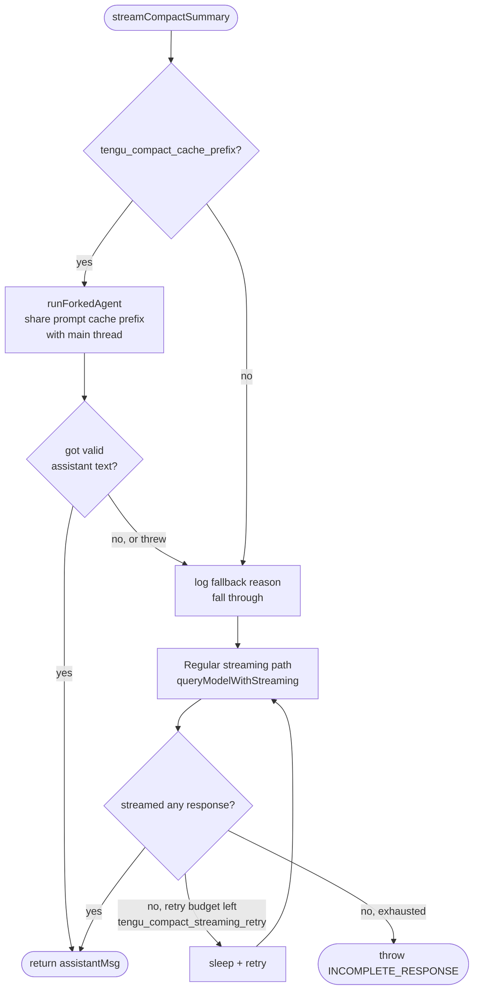

**Forked agent path** (preferred). Reuses the main conversation's prompt cache by sending identical cache-key params (system, tools, model, messages prefix, thinking config). Critically does **not** set `maxOutputTokens` — that would clamp `budget_tokens` via `Math.min(budget, maxOutputTokens-1)` in `claude.ts`, creating a thinking config mismatch that invalidates the cache. The Jan 2026 experiment confirmed the `false` path is 98% cache miss, costs ~0.76% of fleet cache_creation (~38B tok/day), concentrated in ephemeral envs (CCR/GHA/SDK) where GB is disabled — the flag is kept as a kill switch.

**Streaming fallback**. Used when the forked path fails or is disabled. Can safely set `maxOutputTokensOverride: min(COMPACT_MAX_OUTPUT_TOKENS, getMaxOutputTokensForModel(model))` because it doesn't share cache. Retries on empty response up to `MAX_COMPACT_STREAMING_RETRIES = 2` when `tengu_compact_streaming_retry` is enabled.

A 30-second `setInterval` heartbeat fires `sendSessionActivitySignal()` and re-emits the `compacting` SDK status during the call to prevent WebSocket idle timeouts on bridge connections (compaction API calls can take 5-10+ seconds).

### Prompts and the analysis block

`services/compact/prompt.ts` defines three templates:

| Template | Used by | Position of kept messages |
|---|---|---|
| `BASE_COMPACT_PROMPT` | `compactConversation` | None — full replacement |
| `PARTIAL_COMPACT_PROMPT` | `partialCompactConversation('from')` | Before the summarized portion |
| `PARTIAL_COMPACT_UP_TO_PROMPT` | `partialCompactConversation('up_to')` | After the summary (continuing-work framing) |

All three are wrapped with a `NO_TOOLS_PREAMBLE` (front) and `NO_TOOLS_TRAILER` (end) that forbid tool calls. The preamble is aggressive on purpose: cache-sharing fork inherits the parent's full tool set, and Sonnet 4.6+ adaptive-thinking models occasionally attempt tool calls despite the trailer instruction. A denied tool call on `maxTurns: 1` means no text output → falls through to streaming fallback (2.79% on 4.6 vs 0.01% on 4.5).

Output structure:

```xml
<analysis>
  [drafting scratchpad — improves quality, has no informational value]
</analysis>
<summary>
  1. Primary Request and Intent: ...
  2. Key Technical Concepts: ...
  3. Files and Code Sections: ...
  4. Errors and fixes: ...
  5. Problem Solving: ...
  6. All user messages: ...
  7. Pending Tasks: ...
  8. Current Work: ...
  9. Optional Next Step: ...
</summary>
```

`formatCompactSummary()` strips the `<analysis>` block and replaces `<summary>` tags with `Summary:` before the text reaches the next-turn context. The `<analysis>` block is purely a chain-of-thought scratchpad to improve summary quality — keeping it post-formatting would waste tokens and confuse the next turn.

### Image and attachment stripping

`stripImagesFromMessages()` replaces image and document blocks with `[image]` / `[document]` text markers before sending for compaction. Images aren't needed for summarization and routinely push the compact API call itself over the prompt-too-long limit, especially in CCD sessions. Recurses into `tool_result` content arrays.

`stripReinjectedAttachments()` filters out `skill_discovery` / `skill_listing` attachment messages on `EXPERIMENTAL_SKILL_SEARCH` builds — these are re-surfaced by `resetSentSkillNames()` and the next turn's discovery signal, so feeding them to the summarizer wastes tokens and pollutes the summary with stale skill suggestions.

### PTL retry (`truncateHeadForPTLRetry` + `groupMessagesByApiRound`)

CC-1180 escape hatch — when the compact request itself hits prompt-too-long, the user is otherwise stuck. The retry strategy peels the oldest API-round groups until the gap is covered:

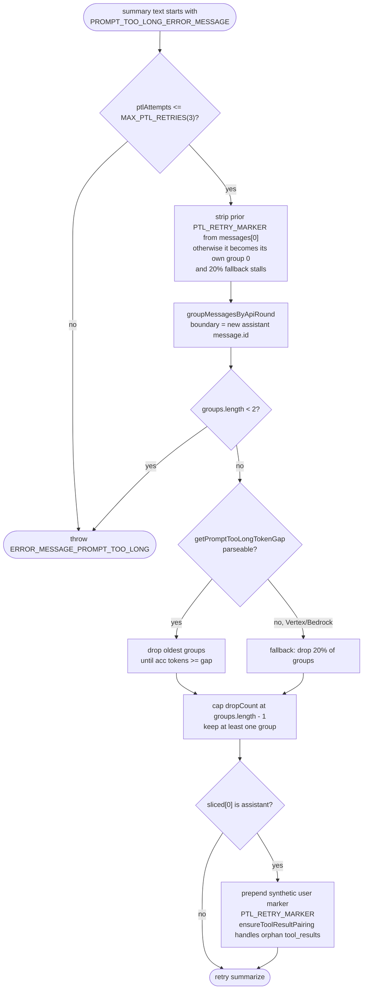

`groupMessagesByApiRound()` (`grouping.ts`) uses a single gate: a NEW assistant `message.id` starts a new group. The API contract guarantees every tool_use is resolved before the next assistant turn, so the assistant-id boundary is API-safe by construction. Tracking unresolved tool_use IDs was rejected because it pins the gate shut forever on malformed inputs (dangling tool_use after resume/truncation). For those cases, the fork's own `ensureToolResultPairing` repairs the split at API time.

The groups deliberately do not follow the more intuitive human-turn shape `[user prompt, assistant response]`. Internal `user` messages also carry tool results, so that shape would split a required tool pair across groups: `[u0, a0: tool_use X] [u1: tool_result X, a1]`. Starting a group at each new assistant response instead produces `[u0] [a0: tool_use X, u1: tool_result X] [a1]`, keeping the assistant response and its ensuing tool results removable as one unit. It also gives a single-human-prompt agentic session multiple groups to peel as successive tool rounds accumulate; grouping only by real user prompts would leave that whole workload as one indivisible group and make the retry impossible.

For an ordinary tool-free conversation this boundary can cut across the semantic question-answer pairs—for example, `[u0] [a0, u1] [a1, u2] [a2]`. That is an accepted trade-off in this lossy last-resort path. `truncateHeadForPTLRetry()` drops whole oldest groups until their estimated tokens cover `tokenGap`, always keeps at least one group, and prepends `PTL_RETRY_MARKER` when the retained sequence starts with an assistant message.

### Post-compact attachments — budgets and dedup

The generated summary preserves **semantic conversation state**: requests, decisions, findings, errors, and unfinished work. Its compression necessarily removes exact working material such as source text, skill instructions, plan content, task identifiers, and capability announcements. `compactConversation()` reconstructs a bounded set of that high-value context as typed attachment messages (`compact.ts:517-585`) so the first post-compact model call can continue without spending additional tool turns, latency, and tokens to rediscover or reload it.

```text
Pre-compact context
    ├─ conversation meaning ──LLM summary──────────────┐
    └─ exact working context ─typed reconstruction─────┤
                                                       ▼
Post-compact context
    boundary → summary → attachments → SessionStart hook results
```

`buildPostCompactMessages()` is the ordering authority. Full compaction has no `messagesToKeep`, so the restored attachments immediately follow the summary; partial and session-memory variants may place a preserved segment between them.

| Attachment | Source | Per-item cap | Total budget | Dedup rule |
|---|---|---|---|---|
| Restored files | `preCompactReadFileState` (recency) | `POST_COMPACT_MAX_TOKENS_PER_FILE = 5_000` | `POST_COMPACT_TOKEN_BUDGET = 50_000`, max 5 files | Skip if path is the target of a `Read` tool in `messagesToKeep` whose result isn't a stub |
| Invoked skills | `getInvokedSkillsForAgent` (agent-scoped, recency) | `POST_COMPACT_MAX_TOKENS_PER_SKILL = 5_000` (head-truncate w/ marker) | `POST_COMPACT_SKILLS_TOKEN_BUDGET = 25_000` | None — agent-scoped already |
| Plan file | `getPlan(agentId)` | Full plan | n/a | n/a |
| Plan mode reminder | `appState.toolPermissionContext.mode === 'plan'` | Marker only | n/a | n/a |
| Async agent status | `appState.tasks` | One per non-retrieved, non-pending, non-self agent | n/a | n/a |
| Deferred tools delta | `getDeferredToolsDeltaAttachment(tools, model, [], 'compact_full')` | n/a | Compact-full passes `[]` as previously-announced → full set | n/a |
| Agent listing delta | `getAgentListingDeltaAttachment(context, [])` | n/a | Same | n/a |
| MCP instructions delta | `getMcpInstructionsDeltaAttachment(mcpClients, tools, model, [])` | Same | n/a | n/a |

Each attachment restores a different continuation invariant:

- **Restored files** (`createPostCompactFileAttachments`, `compact.ts:1415-1464`) preserve exact source content that the summary may only describe. The function snapshots `readFileState` before clearing it, selects the most recently read eligible files, and re-reads them through `FileReadTool` so validation and on-disk freshness are preserved. This avoids an immediate repeat `Read` merely to recover working context.
- **Async agent status** (`createAsyncAgentAttachmentsIfNeeded`, `compact.ts:1568-1599`) reports running agents and completed-but-unretrieved agents with ID, description, status, progress/error summary, and output path. It prevents duplicate launches and keeps outstanding result retrieval visible. Retrieved, pending, and self-agent entries are excluded.
- **Plan file reference** (`createPlanAttachmentIfNeeded`, `compact.ts:1470-1486`) carries the exact plan path and content. The prose summary may explain the plan, but it is not a substitute for the authoritative steps.
- **Plan-mode reminder** (`createPlanModeAttachmentIfNeeded`, `compact.ts:1542-1560`) restores the permission-mode constraint, plan path, and plan-existence state. Without it, a model continuing from the summary could incorrectly begin implementation while the session is still in plan mode.
- **Invoked skills** (`createSkillAttachmentIfNeeded`, `compact.ts:1494-1534`) restore the exact instructions for skills already used by the current agent. Skills are agent-scoped and ordered most-recent-first; per-skill head truncation and the aggregate budget favor current, high-value instructions.
- **Deferred-tools delta** re-announces currently searchable capabilities because previous `deferred_tools_delta` messages were compacted away. Full compaction passes `[]` as the already-announced history, intentionally producing an initial/full delta rather than assuming the summary preserved tool-discovery protocol state.
- **Agent-listing delta** restores the currently usable agent types after MCP-requirement, permission-deny, and `allowedAgentTypes` filtering. This is live capability state, not merely a historical statement that an agent type once existed.
- **MCP-instructions delta** restores current server-provided instructions and applicable client-side ToolSearch guidance. Recomputing it from connected clients avoids treating stale instructions in the old conversation or summary as authoritative.

Two related values use different channels. `boundaryMarker.compactMetadata.preCompactDiscoveredTools` is boundary metadata, not an attachment; it preserves which deferred schemas had already been loaded before their `tool_reference` messages disappeared. `processSessionStartHooks('compact', ...)` returns `hookResults`, not attachments; `buildPostCompactMessages()` places those after the attachment list.

#### Why reconstruct state instead of protecting old messages

An alternative design would mark selected messages as non-compactable, apply size limits to them, and instruct the compact agent to copy them into the result. For ordinary foreground tools, the query loop already waits for completion and appends each `tool_result` before the next model iteration, so auto-compaction normally receives the latest completed foreground results. **The primary reason for reconstruction is therefore not that every old result is stale. It is to retain the most useful exact working context after the LLM compresses those results, avoiding immediate repeat `Read`, skill-loading, plan-recovery, or capability-discovery work.**

Freshness is a secondary benefit for state that can change independently. Compaction suspends its caller but does not freeze the JavaScript event loop: while it awaits hooks, summary generation, and attachment I/O, background agents can progress, files can be changed by external processes or agents, and MCP connectivity or other capability state can change. This is why file restoration re-reads selected paths and why async-agent and capability attachments consult current runtime stores. The stale-state concern is important for these asynchronous or externally mutable sources, not a universal justification for every attachment.

Delegating exact preservation to the summarizing model is also weaker than deterministic reconstruction. A summary such as “the background task completed” is semantically valid but may omit the task ID, output path, status enum, or other fields required to continue the workflow. Asking the model to copy those fields exactly still leaves omission, rewriting, hallucination, and parsing risks; generated prose is not a trustworthy replacement for typed runtime state.

Protecting the original messages has structural and budget costs as well:

- A retained `tool_result` may require its paired `tool_use`, thinking siblings, and surrounding API round to preserve request validity.
- Files, plans, skills, tasks, and capability announcements are scattered through history. Keeping each relevant message can create an unbounded protected set that eventually defeats compaction.
- Truncating or rewriting old messages would alter the historical transcript used by the UI, resume, and diagnostics.
- Scattered protected messages provide poorer locality than one predictable state capsule immediately after the summary.

The implemented split is therefore deliberate:

```text
Historical meaning
    └─ LLM-generated summary

High-value continuation context
    └─ bounded typed reconstruction
       ├─ re-read files
       ├─ current task and plan state
       ├─ agent-scoped invoked skills
       └─ current tool, agent, and MCP capability deltas
```

The design motivations, in priority order, are:

1. Preserve exact, useful working context that the generated summary will compress.
2. Avoid extra tool calls, latency, and repeated input tokens immediately after compaction.
3. Preserve structured identifiers and instructions that generated prose may omit or alter.
4. Refresh asynchronous or externally mutable state where necessary.

The size limits are applied to this reconstructed snapshot rather than by mutating historical messages. Files are selected by recency and constrained by count, per-file, and aggregate budgets; skills are agent-scoped, ordered by invocation recency, head-truncated per item, and constrained by an aggregate budget. A separately maintained “protected state block” would be a viable alternative, but once it is typed, bounded, selectively refreshed, and placed after the summary, it is effectively the attachment design used here.

The skill budgets exist because skills can be large (verify=18.7KB, claude-api=20.1KB) and prior versions re-injected them unbounded on every compact — measured at 5-10K tok/compact. Per-skill head-truncation beats dropping because instructions at the top of a skill file are usually the critical part.

The file-restore dedup pattern (skip files already visible as `Read` results in the preserved tail) mirrors the diff-against-preserved approach in `getDeferredToolsDeltaAttachment`, saving up to ~25K tok/compact in partial-compact paths where `messagesToKeep` is non-empty. Stub Reads (file-unchanged marker) are intentionally **not** counted as preserved — the stub points at an earlier full Read that may have been compacted away.

`sentSkillNames` is **intentionally not reset** after compaction. Re-injecting the full `skill_listing` (~4K tokens) post-compact would be pure cache_creation with marginal benefit — the model still has `SkillTool` in its schema, and `invoked_skills` preserves used-skill content directly. This decision is documented at both `compact.ts:524` and `postCompactCleanup.ts:65`.

---

## Partial Compaction

`partialCompactConversation(allMessages, pivotIndex, ..., direction)` summarizes one half of the conversation around a pivot index. Two directions, each with different cache implications:

| Direction | What's summarized | What's kept | Cache impact |
|---|---|---|---|
| `'from'` (default) | `allMessages.slice(pivotIndex)` (tail) | `allMessages.slice(0, pivotIndex)` (prefix) | **Preserved** — kept messages sit at the front; cache prefix unchanged |
| `'up_to'` | `allMessages.slice(0, pivotIndex)` (prefix) | `allMessages.slice(pivotIndex)` (tail) | **Invalidated** — summary precedes kept messages, new prefix |

For `'up_to'`, the kept messages are scrubbed of prior compact boundaries / `isCompactSummary` user messages before assembly. If a stale boundary survived, `findLastCompactBoundaryIndex`'s backward scan would win and drop the new summary. For `'from'`, those are kept because the new summary sits *after* the kept range, so backward scans still terminate correctly and removing the old summary would lose its covered history.

PTL retry runs against `apiMessages` (which is `messagesToSummarize` for `'up_to'`, `allMessages` for `'from'`). The `'up_to'` path also passes `forkContextMessages: messagesToSummarize` into `cacheSafeParams`, so the forked-agent summary hits cache directly against the prefix slice rather than the full conversation.

### Preserved-segment metadata

For any path that keeps a tail (partial-compact `'from'`, partial-compact `'up_to'`, SM-compact), the boundary marker carries `preservedSegment`:

```ts
preservedSegment: {
  headUuid: messagesToKeep[0].uuid,
  anchorUuid,  // see below
  tailUuid:  messagesToKeep[messagesToKeep.length - 1].uuid,
}
```

`anchorUuid` is what sits immediately before `keep[0]` in the desired chain after the boundary lands:

- **Suffix-preserving** (reactive/session-memory/partial `'from'`): last summary message
- **Prefix-preserving** (partial `'up_to'`): the boundary itself

The loader uses this on session restore to patch `head→anchor` and rewire anchor's other children to point past the preserved segment. Without it, preserved messages would keep their original `parentUuid`s on disk (dedup-skipped during write), and the loader's tail→head walk would either bypass the preserved tail entirely or get tangled in pre-compact branches.

---

## Session Memory Compaction (experiment)

`services/compact/sessionMemoryCompact.ts` is an experiment: instead of running an LLM call to summarize, it **substitutes a pre-extracted memory file** as the summary.

```ts
// Default thresholds (resettable from tengu_sm_compact_config GrowthBook):
DEFAULT_SM_COMPACT_CONFIG = {
  minTokens:            10_000,  // expand backwards until we have this much
  minTextBlockMessages:     5,   // ... AND this many text-block messages
  maxTokens:            40_000,  // hard cap on the preserved tail
}
```

### Gates

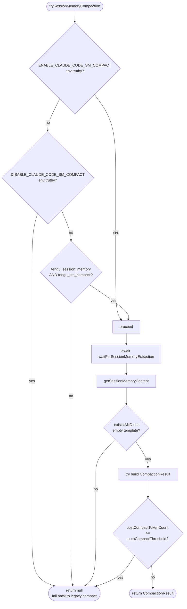

If any gate fails, `autoCompactIfNeeded` falls through to `compactConversation`.

### `calculateMessagesToKeepIndex` and the API-invariant adjuster

The kept-tail computation is bounded by two minimums and one maximum:

1. Start at `lastSummarizedMessageId + 1` (or `messages.length` if no ID).
2. Expand backwards until BOTH `minTokens` (10K) AND `minTextBlockMessages` (5) are met, OR `maxTokens` (40K) is reached.
3. **Floor at the last compact boundary** — the preserved-segment chain has a disk discontinuity there (`att[0]→summary` shortcut from dedup-skip), which would let the loader's tail→head walk bypass inner preserved messages and prune them.
4. Run `adjustIndexToPreserveAPIInvariants(messages, startIndex)`.

`adjustIndexToPreserveAPIInvariants` does two things that are subtle but mandatory:

**(a) Tool pair preservation.** If any kept message has `tool_result` blocks whose `tool_use_id` isn't already covered by `tool_use` blocks in the kept range, walk backwards to find and include the assistant message(s) carrying those `tool_use`s. Otherwise the API rejects with an orphan-tool_result error after `normalizeMessagesForAPI` merging.

**(b) Thinking block preservation.** Streaming yields separate messages per content block — `thinking`, `tool_use`, etc. — with the same `message.id` but different `uuid`s. If `startIndex` lands on one of these streaming siblings, the older sibling carrying the thinking block is excluded. After `normalizeMessagesForAPI` merges by `message.id`, the thinking block has nothing to merge into and is lost. The adjuster scans back for assistant messages sharing a kept `message.id` and includes them.

Both bugs are documented inline with example scenarios at `sessionMemoryCompact.ts:189-230`.

### Resumed-session path

If `lastSummarizedMessageId` is unset but session memory has content (e.g., resuming a session where extraction completed but no compact has run yet), `lastSummarizedIndex = messages.length - 1` — so the kept-tail computation starts with zero messages and expands purely by the threshold floor. The summary then reads as "session memory available" rather than "summary of summarized portion".

### Cache-break false-positive fix

SM-compact has no compact-API-call, so `postCompactTokenCount` and `truePostCompactTokenCount` converge. `autoCompactIfNeeded` invokes `notifyCompaction()` and `markPostCompaction()` explicitly after the SM path succeeds (`autoCompact.ts:302`). Missing this made 20% of `tengu_prompt_cache_break` events false positives.

---

## Reactive Compaction

Reactive compact runs **after** the API returns a `prompt_too_long` (413). The error is **withheld** from the caller during streaming so the loop can transparently recover.

The trigger sequence (`query.ts:1065-1170`):

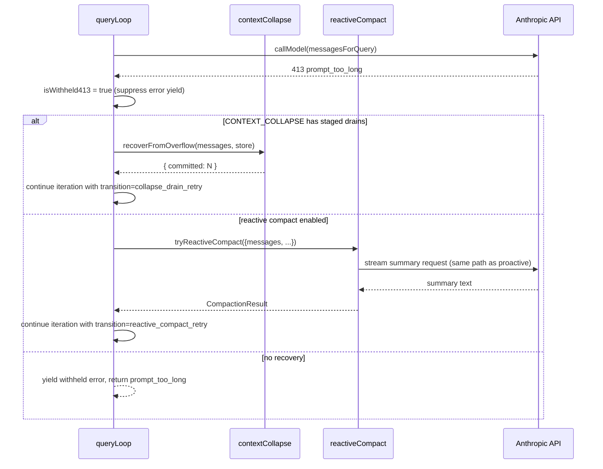

The same `CompactionResult` produced by `compactConversation` flows through `buildPostCompactMessages` — the only difference is the trigger (413 vs. proactive threshold) and that the boundary marker's compact metadata may record this as a reactive trigger for telemetry.

`tengu_cobalt_raccoon` enables "reactive-only mode": suppresses proactive autocompact entirely, lets the API tell the system when to compact. Useful for ant-internal experiments measuring how often the proactive 93% buffer over-fires.

---

## Compact Boundary Markers

Every compaction path produces exactly one `SystemCompactBoundaryMessage`. It is the anchoring entity for:

- `getMessagesAfterCompactBoundary()` — slices the model-facing history to start from the last boundary
- `findLastCompactBoundaryIndex()` — backward scan in REPL message logic
- `applySnipRemovals()` — analog for session restore
- The "context cleared" UI marker in the REPL transcript

```ts
boundaryMarker.compactMetadata = {
  trigger: 'auto' | 'manual',
  preCompactTokenCount: number,
  preCompactDiscoveredTools?: string[],  // sorted; preserved for deferred-tool state
  preservedSegment?: {                    // only for suffix-preserving paths
    headUuid: UUID,
    anchorUuid: UUID,
    tailUuid: UUID,
  },
  userFeedback?: string,                  // partial-compact only
  messagesSummarized?: number,            // partial-compact only
}
```

`preCompactDiscoveredTools` carries `extractDiscoveredToolNames(messages)` because the summary doesn't preserve `tool_reference` blocks. Without this, the post-compact schema filter loses track of which deferred tool schemas the model had already loaded and would stop sending them — undoing all prior `ToolSearch` discovery work.

---

## Compact Warning Suppression

A small store + hook pair coordinates the "X% context left until autocompact" UI banner with compaction events.

```ts
// compactWarningState.ts
export const compactWarningStore = createStore<boolean>(false)
export function suppressCompactWarning(): void
export function clearCompactWarningSuppression(): void

// compactWarningHook.ts
export function useCompactWarningSuppression(): boolean
```

The flow: immediately after a successful compaction (full, microcompact, or SM-compact), `suppressCompactWarning()` is called. The banner stays suppressed until the **next** API response brings back fresh `usage.input_tokens`. This avoids the visual jank where the banner says "5% left" while the just-completed compaction has actually freed half the context — the client's token estimator hasn't seen the new state yet.

`clearCompactWarningSuppression()` fires at the start of each new microcompact attempt so the banner re-engages if the next compact decides not to act.

The hook is in a separate file so `microCompact.ts` can import the pure state functions without pulling React into the print-mode startup path.

---

## Post-Compact Cleanup

`runPostCompactCleanup(querySource)` (`postCompactCleanup.ts`) is called by both `autoCompactIfNeeded` (for both legacy and SM paths) and `compactConversation` callers. It clears module-level state that became invalid when history changed.

The full clear set:

| Reset | Always | Main-thread-only |
|---|---|---|
| `resetMicrocompactState()` | ✓ | — |
| `clearSystemPromptSections()` | ✓ | — |
| `clearClassifierApprovals()` | ✓ | — |
| `clearSpeculativeChecks()` | ✓ | — |
| `clearBetaTracingState()` | ✓ | — |
| `clearSessionMessagesCache()` | ✓ | — |
| `resetContextCollapse()` | — | ✓ (CONTEXT_COLLAPSE feature) |
| `getUserContext.cache.clear()` | — | ✓ |
| `resetGetMemoryFilesCache('compact')` | — | ✓ |
| `sweepFileContentCache()` | — | ✓ (COMMIT_ATTRIBUTION feature) |

The `isMainThreadCompact` gate is the load-bearing safety check:

```ts
const isMainThreadCompact =
  querySource === undefined ||
  querySource.startsWith('repl_main_thread') ||
  querySource === 'sdk'
```

Subagents (`agent:*`) run in the same Node process and share module-level state with the main thread. If a subagent's own compact reset the context-collapse store, the main thread's committed log would be destroyed — exactly the failure mode the marble_origami recursion guard also prevents.

Two non-resets are intentional and documented inline:

- **`sentSkillNames`** — re-injecting the full skill_listing (~4K tokens) post-compact is pure cache_creation with marginal benefit. See `compact.ts:524`.
- **invoked skill content** — must survive across multiple compactions so `createSkillAttachmentIfNeeded()` can include the full skill text in subsequent compaction attachments.

The `getUserContext.cache.clear()` line is more subtle than it looks: `getUserContext` is a memoized outer layer wrapping `getClaudeMds() → getMemoryFiles()`. Clearing only the inner `getMemoryFiles` cache would mean the next turn hits the `getUserContext` cache and never reaches `getMemoryFiles()`, so the armed `InstructionsLoaded` hook never fires.

---

## Telemetry

The `tengu_compact` event is the cross-event correlation backbone. Key fields (`compact.ts:650-695`):

| Field | Why it exists |
|---|---|
| `preCompactTokenCount` / `postCompactTokenCount` / `truePostCompactTokenCount` | Three different numbers: history before, compact API call's total usage, estimated resulting context size |
| `willRetriggerNextTurn` | True when `truePostCompactTokenCount >= autoCompactThreshold` — strong signal of doomed compaction; informs the circuit breaker's design |
| `isRecompactionInChain` / `turnsSincePreviousCompact` / `previousCompactTurnId` | Same-chain loops (H2) vs cross-agent (H1/H5) — `RecompactionInfo` is passed from `autoCompactIfNeeded` so the join doesn't have to happen in BQ |
| `promptCacheSharingEnabled` | Distinguishes the forked-agent path from the streaming fallback in fleet analysis |
| `compactionInputTokens` / `compactionOutputTokens` / `compactionCacheReadTokens` / `compactionCacheCreationTokens` | The compact API call's own usage — separate from the conversation's |
| `queryChainId` / `queryDepth` | Trace correlation across nested forked agents |
| `*` (analyzeContext breakdown) | Per-tool / per-block-type token distribution. Computed **after** the compaction await so the ~11ms sync walk doesn't starve the render loop |

Additional events:

| Event | When |
|---|---|
| `tengu_compact_ptl_retry` | Each `truncateHeadForPTLRetry` attempt; logs `attempt`, `droppedMessages`, `remainingMessages` |
| `tengu_compact_cache_sharing_success` / `_fallback` | Forked-agent path outcome; fallback logs `reason: 'no_text_response' \| 'error'` |
| `tengu_compact_streaming_retry` | Each fallback retry |
| `tengu_compact_failed` | Terminal failure; `reason: 'prompt_too_long' \| 'no_summary' \| 'api_error' \| 'no_streaming_response'` |
| `tengu_cached_microcompact` | Successful cache-edit deletion |
| `tengu_time_based_microcompact` | Time-based MC fire |
| `tengu_partial_compact` | Partial-compact success; includes `direction`, `hasUserFeedback` |
| `tengu_sm_compact_*` | Session-memory experiment events (gate checks, no-memory, threshold breaches, errors) |

---

## Key Source Files

| File | Role |
|---|---|
| `~/git/claude-code/services/compact/compact.ts` | `compactConversation()`, `partialCompactConversation()`, `buildPostCompactMessages()`, attachment generators, PTL retry, `streamCompactSummary` (forked + streaming paths) |
| `~/git/claude-code/services/compact/autoCompact.ts` | `shouldAutoCompact`, `autoCompactIfNeeded`, threshold ladder, circuit breaker, recursion guards |
| `~/git/claude-code/services/compact/microCompact.ts` | `microcompactMessages`, time-based and cached MC dispatch, pending/pinned cache-edits state |
| `~/git/claude-code/services/compact/apiMicrocompact.ts` | `getAPIContextManagement` — server-side `clear_tool_uses_20250919` / `clear_thinking_20251015` |
| `~/git/claude-code/services/compact/sessionMemoryCompact.ts` | `trySessionMemoryCompaction`, `calculateMessagesToKeepIndex`, `adjustIndexToPreserveAPIInvariants` |
| `~/git/claude-code/services/compact/prompt.ts` | BASE/PARTIAL/UP_TO summarization prompts, `formatCompactSummary`, `getCompactUserSummaryMessage` |
| `~/git/claude-code/services/compact/grouping.ts` | `groupMessagesByApiRound` — API-round boundaries for PTL retry |
| `~/git/claude-code/services/compact/postCompactCleanup.ts` | `runPostCompactCleanup` — module-level state resets, main-thread gate |
| `~/git/claude-code/services/compact/compactWarningState.ts` + `compactWarningHook.ts` | Warning-banner suppression store and React hook |
| `~/git/claude-code/services/compact/timeBasedMCConfig.ts` | `tengu_slate_heron` GrowthBook config for time-based microcompact |
| `~/git/claude-code/services/compact/snipCompact.js` | *Feature-gated (HISTORY_SNIP), DCE'd* — model-driven snip cleanup |
| `~/git/claude-code/services/compact/snipProjection.js` | *Feature-gated* — REPL projection view filtering snipped messages |
| `~/git/claude-code/services/compact/reactiveCompact.js` | *Feature-gated (REACTIVE_COMPACT), DCE'd* — 413 recovery path |
| `~/git/claude-code/services/contextCollapse/index.js` | *Feature-gated (CONTEXT_COLLAPSE), DCE'd* — span-by-span collapse subsystem |
| `~/git/claude-code/tools/SnipTool/` | *Feature-gated* — model-callable tool used to drive History Snip |
| `~/git/claude-code/services/SessionMemory/` | Memory-extraction subsystem feeding SM-compact |
| `~/git/claude-code/services/api/promptCacheBreakDetection.ts` | `notifyCompaction` / `notifyCacheDeletion` — false-positive suppression for cache-break events |
