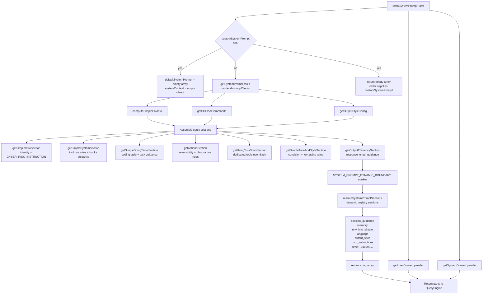
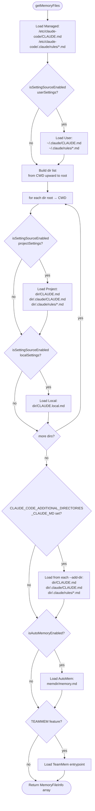
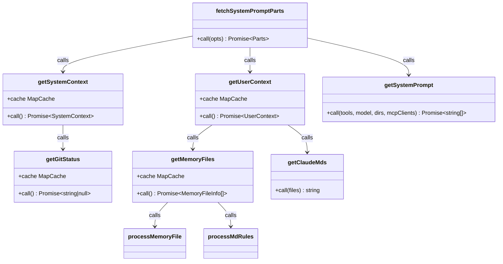

# Context Building Design

## Purpose

The context subsystem builds the **system prompt** and two per-turn context maps — **userContext** and **systemContext** — that are prepended to every API call. Together they give the model its identity, codebase awareness, tool descriptions, and per-session runtime information such as the current date, git status, and CLAUDE.md instructions.

Three source files are central:

| File | Role |
|---|---|
| `~/git/claude-code/context.ts` | Memoized providers: `getUserContext()`, `getSystemContext()`, `getGitStatus()` |
| `~/git/claude-code/utils/queryContext.ts` | `fetchSystemPromptParts()` — assembles all three parts in parallel |
| `~/git/claude-code/constants/prompts.ts` | `getSystemPrompt()` — builds the ordered system prompt string array |

---

## Memoized Context Providers

Both providers use `lodash-es/memoize` — the cache persists for the entire process lifetime unless explicitly cleared.

### `getUserContext()`

Returns `{ claudeMd?, currentDate }`.

- **`claudeMd`** is the merged content of all discovered CLAUDE.md files (see CLAUDE.md Loading below). Omitted from the result if disabled or empty.
- **`currentDate`** is always present: `"Today's date is <ISO date>."`.
- Skipped entirely when `CLAUDE_CODE_DISABLE_CLAUDE_MDS` is set, or when `--bare` mode is active with no explicit `--add-dir`.

### `getSystemContext()`

Returns `{ gitStatus?, cacheBreaker? }`.

- **`gitStatus`** is a multi-line snapshot string (branch, main branch, git user, short status, last 5 commits). Omitted when the cwd is not a git repo, when `CLAUDE_CODE_REMOTE` is set, or when git instructions are disabled by settings.
- **`cacheBreaker`** is present only for `USER_TYPE === 'ant'` when `setSystemPromptInjection()` has been called (ant-only debug tool). Its value is `[CACHE_BREAKER: <injection>]`.

Calling `setSystemPromptInjection(value)` clears both memoize caches immediately so the next call picks up the new value.

---

## Git Status Collection

`getGitStatus()` is itself memoized. It runs five git commands in parallel:

```
git --no-optional-locks status --short
git --no-optional-locks log --oneline -n 5
git branch (current)
git default branch
git config user.name
```

The `status` output is truncated at **2000 characters** with a hint to run `git status` via BashTool if more is needed. The final string is assembled as:

```
This is the git status at the start of the conversation. ...

Current branch: <branch>
Main branch (you will usually use this for PRs): <main>
Git user: <name>

Status:
<truncated status>

Recent commits:
<last 5 oneline>
```

---

## System Prompt Assembly

### Flowchart



`fetchSystemPromptParts()` runs all three fetches concurrently with `Promise.all`. When `customSystemPrompt` is defined, `getSystemPrompt()` and `getSystemContext()` are skipped entirely — the custom prompt replaces the default completely.

### Final Message Construction

QueryEngine assembles the final API request from the returned parts:

```
API call:
  system: [
    ...defaultSystemPrompt,   // static + dynamic sections (or customSystemPrompt)
    ...appendSystemPrompt,    // optional per-session suffix
  ]

  messages: [
    ...history,
    {
      role: "user",
      content: [
        { type: "text", text: "<system-reminder>claudeMd content</system-reminder>" },
        { type: "text", text: "<system-reminder>currentDate</system-reminder>" },
        ...other userContext entries,
      ]
    },
    {
      role: "user",
      content: [
        { type: "text", text: <actual user prompt> }
      ]
    }
  ]
```

`userContext` and `systemContext` entries are injected via `prependUserContext()` and `appendSystemContext()` in `utils/api.ts` on every loop iteration. This means git status and CLAUDE.md are re-injected each turn from the memoized cache — they do not change during a session.

---

## CLAUDE.md Loading

**`getMemoryFiles()`** (`utils/claudemd.ts`) performs the full directory walk and is itself memoized. **`getClaudeMds()`** then serializes the resulting `MemoryFileInfo[]` array into the `claudeMd` string that lands in `userContext`.

### Loading Order (lowest to highest priority)

1. **Managed** — `/etc/claude-code/CLAUDE.md` and `/etc/claude-code/.claude/rules/*.md`. Policy settings; always loaded.
2. **User** — `~/.claude/CLAUDE.md` and `~/.claude/rules/*.md`. Private global instructions for all projects.
3. **Project** — `CLAUDE.md`, `.claude/CLAUDE.md`, `.claude/rules/*.md` discovered by walking from CWD upward to the filesystem root. Files closer to CWD have higher priority (loaded later, more attention from the model).
4. **Local** — `CLAUDE.local.md` in each directory on the same upward walk. Gitignored; user-private project instructions.
5. **AutoMem** — `memdir/memory.md` entrypoint (when auto-memory is enabled). User's consolidated long-term memory.
6. **TeamMem** — team memory entrypoint (when TEAMMEM feature is on).

### Discovery Flowchart



### `@include` Directives

Any memory file can include another file using `@path` syntax (also `@./relative`, `@~/home`, or `@/absolute`). Inclusions are resolved in the same markdown-lex pass that strips HTML comments, up to `MAX_INCLUDE_DEPTH = 5` levels. Circular references are prevented by a `processedPaths` set passed through all recursive calls.

Only text file extensions (`.md`, `.ts`, `.py`, etc.) are resolved — binary extensions (`.png`, `.pdf`) are silently skipped.

### Serialization

`getClaudeMds(files)` iterates the ordered `MemoryFileInfo[]` array and concatenates each file's content with a header line:

```
Contents of /path/to/CLAUDE.md (project instructions, checked into the codebase):

<file content>
```

The full string is prefixed with `MEMORY_INSTRUCTION_PROMPT`:

> Codebase and user instructions are shown below. Be sure to adhere to these instructions. IMPORTANT: These instructions OVERRIDE any default behavior and you MUST follow them exactly as written.

---

## System Prompt Caching Strategy

`SYSTEM_PROMPT_DYNAMIC_BOUNDARY` (`'__SYSTEM_PROMPT_DYNAMIC_BOUNDARY__'`) is a sentinel string inserted into the system prompt array by `getSystemPrompt()`. Everything **before** this marker is static content eligible for `cacheScope: 'global'` (cross-organization cache hit). Everything **after** is session-specific and should not be globally cached.

```mermaid
flowchart LR
    subgraph Static prefix — cacheable globally
        A[Identity + CYBER_RISK]
        B[System rules]
        C[Coding guidelines]
        D[Actions section]
        E[Tool usage guidance]
        F[Tone + output efficiency]
    end
    G([SYSTEM_PROMPT_DYNAMIC_BOUNDARY]) --- H
    subgraph Dynamic suffix — session-local
        H[session_guidance\ntool permissions change per-session]
        I[memory prompt]
        J[env_info: cwd, model, OS]
        K[language preference]
        L[output style]
        M[MCP server instructions\nchanges on connect/disconnect]
        N[token_budget]
    end
```

`splitSysPromptPrefix()` in `utils/api.ts` and `buildSystemPromptBlocks()` in `services/api/claude.ts` consume this boundary to assign Anthropic cache-control headers correctly.

Dynamic sections are managed through a registry (`systemPromptSection` / `DANGEROUS_uncachedSystemPromptSection` from `constants/systemPromptSections.ts`). `DANGEROUS_uncachedSystemPromptSection` is used for the MCP instructions section because MCP servers connect and disconnect between turns — caching those instructions would serve stale content.

---

## Cache Breaking

`setSystemPromptInjection(value)` (ant-only, exposed via ConfigTool) immediately clears both `getUserContext.cache` and `getSystemContext.cache`. On the next turn, both providers re-run from scratch, and the `cacheBreaker` key is injected into `systemContext` with the injection value. This forces a new cache key on the Anthropic API side, useful for debugging prompt-cache behavior in internal builds.

---

## Class Overview


