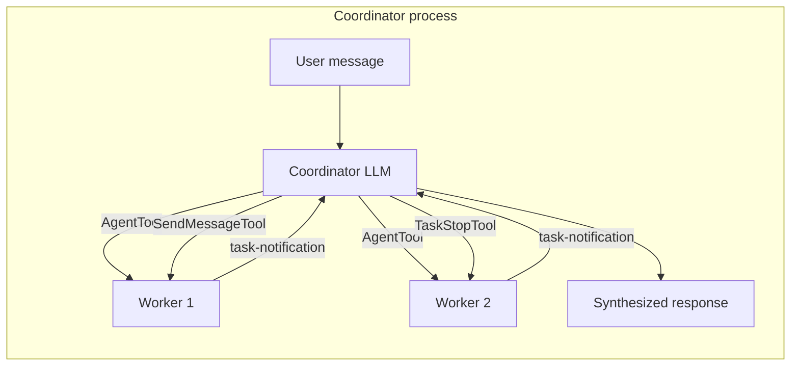
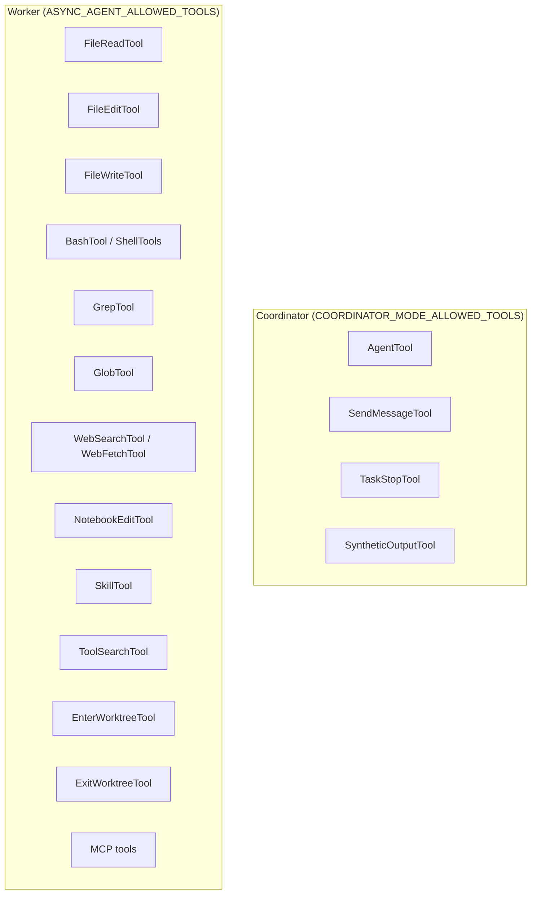
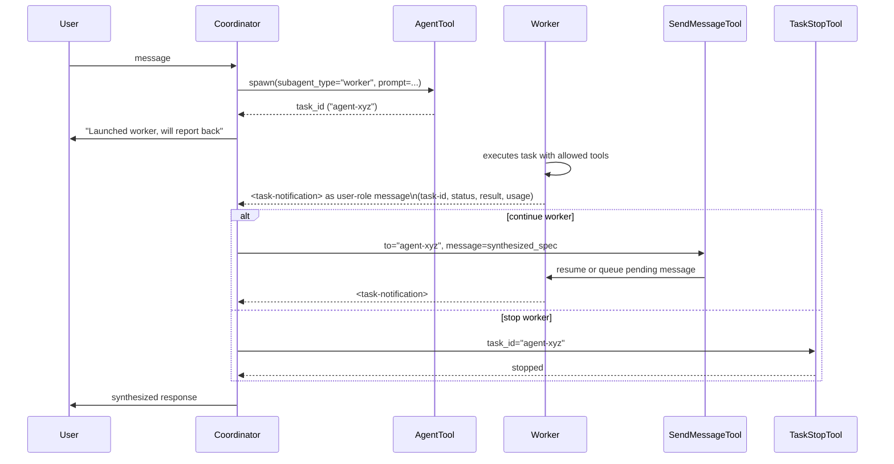

# Coordinator Mode

Coordinator mode transforms the single-agent claude-code binary into a multi-agent orchestrator. The coordinator receives user messages, plans work, spawns async worker agents, and synthesizes results — without doing file or shell work itself.

Activated by setting `CLAUDE_CODE_COORDINATOR_MODE=1` (requires compile-time feature flag `COORDINATOR_MODE`).

---

## Mode Detection

```
isCoordinatorMode()
  └─ feature('COORDINATOR_MODE')  &&  isEnvTruthy(CLAUDE_CODE_COORDINATOR_MODE)
```

`matchSessionMode(sessionMode)` handles resume: if the stored session mode (`'coordinator' | 'normal'`) mismatches the current env var, it flips `process.env.CLAUDE_CODE_COORDINATOR_MODE` live and logs `tengu_coordinator_mode_switched`. No restart required — `isCoordinatorMode()` reads the env var directly with no caching.

---

## Two Roles, One Binary

The same binary serves both roles. Which role a process plays depends entirely on env vars present at startup.



### Tool Sets



In `CLAUDE_CODE_SIMPLE=1` mode, workers are restricted to `Bash`, `FileRead`, and `FileEdit` only. In standard mode, workers receive the full `ASYNC_AGENT_ALLOWED_TOOLS` set minus internal tools (`TeamCreateTool`, `TeamDeleteTool`, `SendMessageTool`, `SyntheticOutputTool`). The filtered list is passed to the coordinator's user context so the LLM can tell workers what capabilities they have.

---

## System Prompt Injection

`getCoordinatorSystemPrompt()` is injected into the coordinator's system prompt at session start. It covers:

| Section | Content |
|---------|---------|
| Role | Coordinator identity, responsibilities, rules (never thank workers, always synthesize) |
| Tools | AgentTool, SendMessageTool, TaskStopTool, `subscribe_pr_activity` (if available) |
| Task notification format | `<task-notification>` XML schema (task-id, status, summary, result, usage) |
| Worker capabilities | Varies: full toolset vs simple (Bash/Read/Edit only) |
| Task workflow | Research → Synthesis → Implementation → Verification phases |
| Prompt writing guide | Self-contained prompts, synthesize before delegating, continue vs spawn heuristics |

`getCoordinatorUserContext(mcpClients, scratchpadDir)` is injected as `userContext` (not system prompt) to avoid cache invalidation on MCP connection changes. It lists the worker tool names, connected MCP server names, and the scratchpad directory path if `tengu_scratch` is enabled.

---

## Agent Lifecycle



**Worker notification delivery**: worker results arrive as `user`-role messages with the `<task-notification>` XML opening tag. The coordinator distinguishes them from real user messages by this tag alone.

**SendMessageTool routing**: when `to` is an agent ID or registered agent name, `SendMessageTool` checks app state. If the worker task is `running`, the message is queued for delivery at the worker's next tool round. If the worker is stopped, it auto-resumes via `resumeAgentBackground()` and delivers the message as the resume prompt.

**TaskStopTool**: validates the task ID is present in app state and `status === 'running'` before aborting. Accepts `task_id` (current) or legacy `shell_id` for backward compatibility.

---

## Session Resume

On `--resume`, `matchSessionMode` reads the stored `sessionMode` field:

```
stored: 'coordinator'  &&  current: normal  →  set CLAUDE_CODE_COORDINATOR_MODE=1
stored: 'normal'       &&  current: coord   →  delete CLAUDE_CODE_COORDINATOR_MODE
stored: undefined      →  no-op (pre-mode-tracking session)
```

---

## Concurrency Model

Workers are async by design. The coordinator should launch independent workers in parallel (multiple tool calls in one assistant turn). The system prompt encodes these concurrency rules:

- **Read-only tasks** (research) — unrestricted parallelism
- **Write-heavy tasks** (implementation) — one at a time per file set
- **Verification** — can overlap implementation on disjoint file areas

The coordinator never uses one worker to check on another; workers notify the coordinator when done via `task-notification`.
