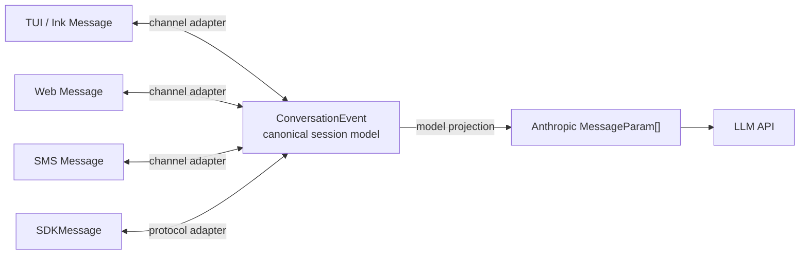

# Future POC: Canonical Conversation Event Layer

## Purpose

This note captures a future architecture direction for message handling. The
current system uses internal `Message[]` as the working state, `SDKMessage` as
the external/headless/bridge protocol, and Anthropic `MessageParam[]` as the LLM
request shape. That works, but it makes the internal message model carry both
agent-domain semantics and REPL-specific concerns.

A cleaner future design would introduce a canonical, channel-neutral middle
layer:



In this design, UI/channel messages are presentation-specific. SDK messages are
a public transport/protocol projection. LLM/API messages are a lossy
model-facing projection. `ConversationEvent` is the durable semantic layer that
preserves intent, provenance, lifecycle, and replay information.

---

## Design Principle

The canonical layer should preserve **conversation/session semantics**. The
LLM/API layer should contain only the minimal prompt transcript needed for
inference.

The canonical layer answers:

- What happened?
- Who or what caused it?
- Where did it originate?
- Should it render?
- Should it be persisted?
- Should it be sent to the model?
- How does it relate to tools, permissions, compaction, replay, and delivery?

The LLM/API projection answers only:

- What user/assistant content should the model condition on?
- What tool-use/tool-result blocks must be preserved?
- What content must be omitted, merged, repaired, or transformed to satisfy API
  constraints?

---

## Proposed Layering

```text
Channel-specific message
  TUIMessage / WebMessage / SMSMessage / SlackMessage
        ^
        |
        v
Canonical event model
  ConversationEvent[]
        ^
        |
        +-- SDKMessage adapter for external protocol / bridge / replay
        |
        v
LLM/API request projection
  Anthropic MessageParam[]
```

The important distinction is that `SDKMessage` should not be the only canonical
domain type. Public SDK protocol stability and internal domain expressiveness
pull in different directions. A durable internal model can be precise and
strict, while `SDKMessage` can remain backward-compatible, permissive, and
transport-friendly.

---

## Canonical Event Categories

The middle layer should be event-oriented rather than only chat-message
oriented.

```ts
type ConversationEvent =
  | UserMessageEvent
  | AssistantMessageEvent
  | ToolUseRequestedEvent
  | ToolResultEvent
  | ToolProgressEvent
  | PermissionEvent
  | AttachmentEvent
  | SystemStatusEvent
  | CompactBoundaryEvent
  | SessionLifecycleEvent
  | ErrorEvent
  | DeliveryEvent
```

### User and Assistant Events

User and assistant events preserve the semantic transcript. They are the primary
source for LLM request projection, but not every field is model-visible.

```ts
type UserMessageEvent = {
  type: 'user_message'
  id: string
  sessionId: string
  turnId: string
  timestamp: string
  source: MessageSource
  content: RichContent[]
  visibility: VisibilityPolicy
  metadata?: {
    isSynthetic?: boolean
    isReplay?: boolean
    permissionMode?: string
    attachments?: AttachmentRef[]
    bridgeOrigin?: boolean
  }
}

type AssistantMessageEvent = {
  type: 'assistant_message'
  id: string
  sessionId: string
  turnId: string
  timestamp: string
  model: string
  content: RichContent[]
  stopReason?: string | null
  usage?: UsageSnapshot
  error?: AssistantError
  visibility: VisibilityPolicy
}
```

### Tool Events

Tool lifecycle should be first-class in the canonical layer. The LLM only sees
the assistant `tool_use` and user `tool_result` projection; clients may need the
full lifecycle for progress, audit, cancellation, and replay.

```ts
type ToolUseRequestedEvent = {
  type: 'tool_use_requested'
  id: string
  sessionId: string
  turnId: string
  assistantMessageId: string
  toolUseId: string
  toolName: string
  input: unknown
  modelVisible: boolean
}

type ToolResultEvent = {
  type: 'tool_result'
  id: string
  sessionId: string
  turnId: string
  toolUseId: string
  toolName: string
  result: unknown
  modelProjection: RichContent[]
  isError: boolean
  metadata?: {
    structuredContent?: Record<string, unknown>
    mcpMeta?: Record<string, unknown>
    persistedFileIds?: string[]
  }
}

type ToolProgressEvent = {
  type: 'tool_progress'
  id: string
  sessionId: string
  turnId: string
  toolUseId: string
  toolName: string
  elapsedMs: number
  progress: unknown
}
```

### Permission and Audit Events

Permissions are session semantics, not model transcript by default. They may
influence future prompts or status displays, but they should not be serialized
as ordinary user text unless a deliberate projection chooses to do so.

```ts
type PermissionEvent = {
  type: 'permission'
  id: string
  sessionId: string
  turnId: string
  toolUseId?: string
  toolName?: string
  action: 'requested' | 'approved' | 'denied' | 'cancelled'
  mode: string
  decisionSource: 'user' | 'rule' | 'classifier' | 'bridge' | 'system'
  reason?: string
  timestamp: string
}
```

### Attachment Events

Attachments need local provenance and model projections. The canonical layer
should preserve both.

```ts
type AttachmentEvent = {
  type: 'attachment'
  id: string
  sessionId: string
  turnId: string
  sourceMessageId?: string
  attachment: {
    kind: 'file' | 'image' | 'document' | 'structured_output' | 'memory'
    localPath?: string
    fileId?: string
    mimeType?: string
    sizeBytes?: number
    metadata?: Record<string, unknown>
  }
  modelProjection?: RichContent[]
  visibility: VisibilityPolicy
}
```

### System, Error, and Lifecycle Events

Session state should live in the middle layer so UI, bridge, SDK, and replay can
share it without leaking it into the LLM prompt.

```ts
type SystemStatusEvent = {
  type: 'system_status'
  id: string
  sessionId: string
  timestamp: string
  level: 'info' | 'warning' | 'error'
  code: string
  message: string
  visibility: VisibilityPolicy
}

type CompactBoundaryEvent = {
  type: 'compact_boundary'
  id: string
  sessionId: string
  timestamp: string
  trigger: 'manual' | 'auto'
  preTokens: number
  summaryMessageId?: string
  preservedSegment?: {
    headId: string
    anchorId: string
    tailId: string
  }
}

type SessionLifecycleEvent = {
  type: 'session_lifecycle'
  id: string
  sessionId: string
  timestamp: string
  action: 'init' | 'running' | 'idle' | 'completed' | 'interrupted'
  model?: string
  cwd?: string
  tools?: string[]
  mcpServers?: { name: string; status: string }[]
}

type ErrorEvent = {
  type: 'error'
  id: string
  sessionId: string
  turnId?: string
  timestamp: string
  code: string
  message: string
  retry?: {
    attempt: number
    maxRetries: number
    delayMs: number
  }
}
```

---

## Cross-Cutting Fields

Most canonical events should share a small common header:

```ts
type ConversationEventBase = {
  id: string
  sessionId: string
  turnId?: string
  parentId?: string
  timestamp: string
  source: MessageSource
  visibility: VisibilityPolicy
}

type MessageSource =
  | 'tui'
  | 'web'
  | 'sms'
  | 'sdk'
  | 'bridge'
  | 'tool'
  | 'system'
  | 'hook'
  | 'mcp'

type VisibilityPolicy = {
  render: boolean
  transcript: boolean
  model: boolean
  sdk: boolean
}
```

This makes visibility a deliberate policy decision rather than a side effect of
message shape.

---

## What Belongs Here but Not in LLM/API Messages

| Category | Canonical layer | LLM/API projection |
|---|---|---|
| Identity | event id, session id, turn id, parent id, timestamp | omitted |
| Channel origin | TUI/web/SMS/SDK/bridge/source user/device | omitted unless needed in prompt |
| Render policy | severity, grouping, collapsed state, visibility flags | omitted |
| Tool lifecycle | requested/progress/result/duration/cancellation | only `tool_use` and `tool_result` blocks |
| Permissions | request, approval, denial, source, audit reason | usually omitted |
| Runtime state | init, model selected, cwd, available tools, MCP status | system prompt/tool params, not chat messages |
| API errors | retry status, delay, categorized error, rate limits | omitted |
| Compaction | boundaries, pre-token counts, preserved segments | affects selected context, boundary omitted |
| Attachments | local path, file id, MIME type, upload status | selected content blocks only |
| Structured output | full result object, MCP `_meta`, file ids | text or tool-result projection only |
| Delivery state | queued, sent, acked, replayed, bridge ids | omitted |
| Cost and usage | token usage, model usage, cost, duration | omitted |
| Security metadata | trust tier, permission mode, origin validation | usually omitted |

---

## Projection Rules

### Canonical to LLM/API

The model projection should:

1. Select events where `visibility.model === true`.
2. Convert user and assistant semantic content into Anthropic user/assistant
   messages.
3. Convert tool lifecycle into valid `tool_use` / `tool_result` pairs.
4. Merge adjacent user events where the provider requires it.
5. Apply compaction and snip projections before request construction.
6. Strip UI-only, SDK-only, delivery-only, and audit-only events.
7. Repair or reject malformed tool-use/tool-result pairings.
8. Preserve provider-specific thinking/redacted-thinking constraints.
9. Add cache controls as a final API-specific step.

### Canonical to SDK

The SDK projection should:

1. Preserve external protocol compatibility.
2. Emit transcript events (`user`, `assistant`) for semantic messages.
3. Emit runtime events (`init`, `result`, `tool_progress`, `api_retry`,
   `compact_boundary`) for external consumers.
4. Convert internal names and metadata to public snake_case fields where needed.
5. Drop fields that are internal-only or security-sensitive.
6. Be tolerant of future event types so older clients can ignore unknown data.

### Canonical to UI Channel

Each UI/channel adapter should:

1. Render only events where `visibility.render === true`.
2. Map canonical severity, grouping, and progress semantics to channel-native
   UI.
3. Preserve local interactions that are channel-specific, such as TUI collapse
   controls or web delivery receipts.
4. Avoid encoding model-facing assumptions in render components.

---

## POC Scope

A useful proof of concept should not refactor the entire message system. Start
with a small vertical slice:

1. Define `ConversationEvent` types for user, assistant, tool result, system
   status, and compact boundary.
2. Add pure adapters:
   - internal `Message` to `ConversationEvent`
   - `ConversationEvent` to Anthropic `MessageParam`
   - `ConversationEvent` to SDK-compatible event
3. Run the POC behind a flag or in tests only.
4. Compare current `normalizeMessagesForAPI()` output with the new projection
   for representative transcripts.
5. Add bridge-focused tests for internal-to-canonical-to-SDK equivalence.
6. Do not change runtime behavior until equivalence is proven.

Recommended first target:

```text
Internal Message[]
  -> ConversationEvent[]
  -> MessageParam[]
```

Use existing `normalizeMessagesForAPI()` as the oracle during the POC.

---

## Migration Strategy

### Phase 1: Shadow Model

Add canonical event types and conversion helpers without changing production
paths. Generate canonical events from existing internal messages in tests and
compare projected API output against current behavior.

### Phase 2: SDK Projection

Add canonical-to-SDK projection tests for bridge and headless events. Keep
`SDKMessage` as a public protocol shape, not the internal source of truth.

### Phase 3: Query Boundary

Introduce canonical events inside `QueryEngine` or a narrow wrapper around
`query()`. Continue converting back to existing internal messages where needed
for UI until render paths can consume canonical events directly.

### Phase 4: Channel Adapters

Move TUI-specific render concerns into a TUI adapter. Add web/SMS/other channel
adapters without changing the model projection.

---

## Risks

| Risk | Mitigation |
|---|---|
| Semantic drift from existing `normalizeMessagesForAPI()` | Use snapshot/equivalence tests against current API payloads. |
| Canonical type becomes a bag of optional fields | Prefer event-specific unions over one giant message interface. |
| Public SDK compatibility constrains internal design | Keep SDK as a projection, not the canonical source of truth. |
| UI-specific fields leak into model projection | Enforce `visibility.model` and explicit projection functions. |
| Model-facing repair logic gets duplicated | Centralize API projection and keep provider-specific logic at the final boundary. |
| Migration touches too much code at once | Start with a shadow POC and one vertical slice. |

---

## Success Criteria

The POC is useful if it can demonstrate:

- A transcript can round-trip through `ConversationEvent[]` without losing
  session semantics.
- The LLM/API projection matches current `normalizeMessagesForAPI()` behavior
  for representative conversations.
- The SDK projection can reproduce current headless/bridge events for the same
  inputs.
- UI/channel adapters do not need to know Anthropic API constraints.
- API projection does not need to know TUI rendering details.

---

## Open Design Decisions

- Whether canonical events should be append-only event log records or a
  normalized current-state view.
- Whether `tool_use` blocks remain embedded in assistant message content or are
  always split into separate `ToolUseRequestedEvent` records.
- Whether visibility policy is stored directly on every event or derived from
  event type plus source.
- Whether compact/snip should rewrite canonical event history or create
  projection-only views.
- How much of MCP structured content should remain in canonical events versus
  SDK-only projections.

---

## Recommended Naming

Prefer a name that communicates internal domain semantics:

- `ConversationEvent`
- `AgentEvent`
- `SessionEvent`
- `CanonicalMessage`
- `ProtocolEvent`

Avoid making public `SDKMessage` the sole canonical name. It can remain an
external protocol projection from the canonical layer.
