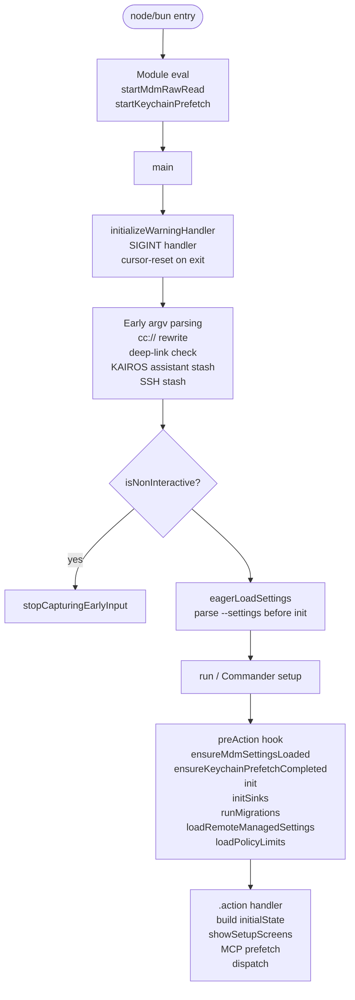
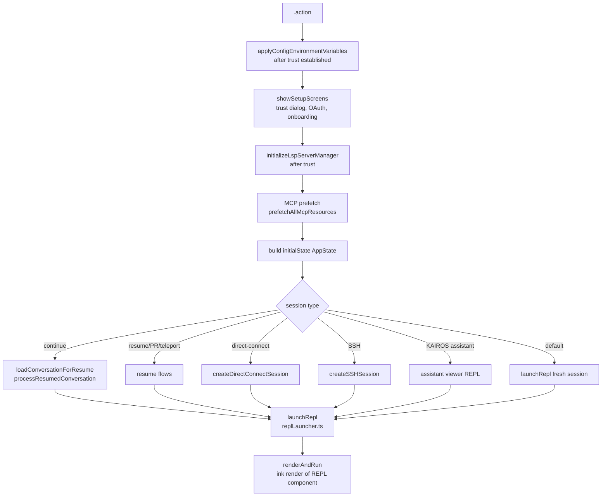
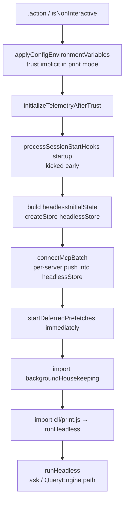

# main.tsx — CLI Entry Point

`main.tsx` is the monolithic entry point (~4700 lines). It owns CLI argument parsing (Commander.js), startup orchestration, subsystem initialization, and dispatches to either the interactive REPL or the headless/SDK path. It never imports `QueryEngine` — that lives exclusively in `cli/print.ts`.

---

## Module-Evaluation Side Effects

Three actions fire **before any other imports resolve**, in the first three lines of the file:

```
profileCheckpoint('main_tsx_entry')   // startup profiler
startMdmRawRead()                      // fires MDM subprocess reads in background (~135ms window)
startKeychainPrefetch()                // fires two macOS keychain reads in background
```

This overlaps expensive I/O with the module-loading phase. `profileCheckpoint('main_tsx_imports_loaded')` fires at line 208 after all imports complete.

---

## Startup Sequence



### `main()` (line 586)

1. Windows PATH security: `process.env.NoDefaultCurrentDirectoryInExePath = '1'`
2. `initializeWarningHandler()` — install process warning handler
3. `process.on('exit', resetCursor)` — restore terminal cursor on any exit
4. `process.on('SIGINT', ...)` — `process.exit(0)` unless `-p` mode (print.ts installs its own SIGINT handler)
5. Early argv rewriting: `cc://`/`cc+unix://` URL detection, LODESTONE deep-link, KAIROS assistant stash, SSH stash
6. Compute `isNonInteractive`: `hasPrintFlag || hasInitOnlyFlag || hasSdkUrl || !process.stdout.isTTY` → `setIsInteractive(!isNonInteractive)`
7. `eagerLoadSettings()` — parse `--settings`/`--setting-sources` before `init()`
8. `await run()` — Commander setup and parse

### `preAction` hook (fires before every command, not on `--help`)

1. `await Promise.all([ensureMdmSettingsLoaded(), ensureKeychainPrefetchCompleted()])` — waits for module-eval prefetches
2. `await init()` — main initialization (`entrypoints/init.js`)
3. `initSinks()` — analytics logging
4. Plugin dir: `setInlinePlugins()` + `clearPluginCache()`
5. `runMigrations()` — config migrations (currently version 11; idempotent)
6. `void loadRemoteManagedSettings()` — enterprise settings (non-blocking)
7. `void loadPolicyLimits()` — policy limits (non-blocking)

### `runMigrations()` (line 327)

Runs when `getGlobalConfig().migrationVersion !== 11`. Migrations include model-alias renames (`migrateSonnet45ToSonnet46`, `migrateOpusToOpus1m`), settings format migrations, and permission migrations.

---

## CLI Structure (Commander.js)

### Default command — `claude [prompt]`

The main interactive/headless command. Has ~60 named options. Key ones:

| Flag | Purpose |
|------|---------|
| `-p, --print` | Headless mode; enables `isNonInteractive` |
| `--bare` | Minimal mode: no hooks, LSP, plugins, CLAUDE.md auto-discovery, keychain reads; sets `CLAUDE_CODE_SIMPLE=1` |
| `--init-only` | Run setup + session-start hooks, then exit |
| `--output-format <format>` | `text` / `json` / `stream-json` (print mode only) |
| `--input-format <format>` | `text` / `stream-json` (print mode only) |
| `-c, --continue` | Resume most recent conversation |
| `-r, --resume [value]` | Resume by session ID or picker |
| `--model <model>` | Model override |
| `--system-prompt <prompt>` | Replace system prompt |
| `--append-system-prompt <prompt>` | Append to system prompt |
| `--permission-mode <mode>` | Permission mode override |
| `--dangerously-skip-permissions` | Bypass all permission checks |
| `--mcp-config <configs...>` | Inline MCP server JSON or file paths |
| `--add-dir <dirs...>` | Additional directories for tool access |
| `--max-turns <turns>` | Max agentic turns (print mode only) |
| `--max-budget-usd <amount>` | Dollar spend cap |
| `--settings <file-or-json>` | Settings JSON file or inline string |
| `--agents <json>` | Custom agent definitions |

Additional options are added after the main `.action()` via feature flags (`feature('COORDINATOR_MODE')`, `feature('KAIROS')`, `feature('BRIDGE_MODE')`, ant-build conditions, etc.), covering worktrees, KAIROS proactive, swarm teammate identity, bridge, SSH, and more.

**Print-mode optimization (line 3884):** In `-p` mode, all subcommand registration is **skipped** (saves ~65ms, mostly from `isBridgeEnabled()` keychain reads). Commander parses immediately after the default command is registered.

### Subcommands (interactive mode only)

| Command | Purpose |
|---------|---------|
| `mcp serve/add/remove/list/get/add-json/add-from-claude-desktop/reset-project-choices` | MCP server management |
| `auth login/status/logout` | OAuth and API key auth |
| `plugin validate/list/install/uninstall/enable/disable/update` | Plugin management |
| `agents` | List configured agents |
| `doctor` | Health check |
| `update` / `upgrade` | Self-update |
| `install [target]` | Native build install |
| `server` | Start Claude Code session server (`DIRECT_CONNECT`) |
| `open <cc-url>` | Connect to server in headless mode (`DIRECT_CONNECT`) |
| `ssh <host> [dir]` | SSH to remote host (`SSH_REMOTE`) |
| `remote-control` / `rc` | Bridge mode connect (`BRIDGE_MODE`) |
| `assistant [sessionId]` | KAIROS viewer client (`KAIROS`) |
| `auto-mode defaults/config/critique` | Auto-mode inspection (`TRANSCRIPT_CLASSIFIER`) |
| `up`, `log`, `error`, `export`, `task *`, `completion` | ANT-ONLY internal commands |

---

## Interactive vs. Headless Dispatch

Decision computed at lines 800–812 and stored via `setIsInteractive()`:

```
isNonInteractive = hasPrintFlag || hasInitOnlyFlag || hasSdkUrl || !process.stdout.isTTY
```

Inside `.action()` at line 2586:

```typescript
if (isNonInteractiveSession) {
  void runHeadless(...)
  return
}
// else: launchRepl() variants
```

**`--init-only`** is a third mode: runs setup hooks + session-start hooks (both forced-sync), then `gracefulShutdownSync(0)` and returns.

---

## Interactive Path



**`initialState`** is an `AppState` object built at lines 2927–3037 containing: settings, model, tools, MCP state, agent definitions, bridge/remote state, notifications, thinking config, attribution, speculation state, and more. Passed as props into the REPL component.

`launchRepl` is imported from `./replLauncher.js`; `renderAndRun` from `./interactiveHelpers.js`.

**`startDeferredPrefetches()`** is called after first Ink render (not before, to avoid blocking the UI). Fires: `initUser()`, `getUserContext()`, `prefetchSystemContextIfSafe()`, quota prefetches, AWS/GCP credential checks, `initializeAnalyticsGates()`, `settingsChangeDetector.initialize()`, `skillChangeDetector.initialize()`, and more. Skipped entirely under `--bare` or `CLAUDE_CODE_EXIT_AFTER_FIRST_RENDER`.

---

## Headless Path



`runHeadless` is **lazy-imported** (`import('src/cli/print.js')`) and called non-awaited — process exits when it completes. It receives: input prompt, state getter/setter, commands, tools, SDK MCP configs, agent definitions, and a large options object covering output format, continuation, resume, model, budget, system prompt, session hooks promise, and more.

`cli/print.ts` owns the `QueryEngine` import — this is the only path where `QueryEngine` is used.

---

## Special Modes

### Bare Mode (`--bare` / `CLAUDE_CODE_SIMPLE=1`)
Skips hooks, LSP, plugin sync, CLAUDE.md auto-discovery, keychain reads, background prefetches, claude.ai MCP fetch, and event loop stall detector. Requires explicit `--mcp-config` and `--add-dir` flags.

### Coordinator Mode (`CLAUDE_CODE_COORDINATOR_MODE=1`)
`coordinatorModeModule` is compile-time feature-gated (`feature('COORDINATOR_MODE')`). If active: `applyCoordinatorToolFilter(tools)`, `saveMode('coordinator')`. Coordinator gets its own system prompt — the shared addendum is not added.

### Bridge / Remote Control (`--remote-control` / `--rc`)
Feature-gated (`feature('BRIDGE_MODE')`). Checked after trust/GrowthBook auth. Sets `replBridgeEnabled` in `initialState`.

### KAIROS / Proactive (`feature('KAIROS')`)
`isAssistantMode()` and `isKairosEnabled()` checked early. If active: `setKairosActive(true)`, `initializeAssistantTeam()`, assistant system prompt addendum appended. `claude assistant [sessionId]` launches a viewer REPL with `viewerOnly: true`.

### Teleport / Remote (`--teleport`, `--remote`)
`--remote` creates a CCR session via `teleportToRemoteWithErrorHandling()`; sets `isRemoteMode`, uses `createRemoteSessionConfig()`. `--teleport` opens interactive picker or direct-resumes via `fetchSession()` + `validateSessionRepository()`.

### SSH (`feature('SSH_REMOTE')`)
Early argv stashes host/cwd in `_pendingSSH`. `createSSHSession()` or `createLocalSSHSession()` is called before `launchRepl`, setting `originalCwd` and `directConnectServerUrl`.

### Direct Connect (`feature('DIRECT_CONNECT')`)
`cc://` / `cc+unix://` URLs are detected and argv-rewritten before Commander parses. `createDirectConnectSession()` negotiates with the server; `claude server` starts the server side.

### Worktree (`-w, --worktree`)
Feature-gated. Parses PR reference from worktree name (`#N` or GitHub URL), optionally enables tmux.

### Deep Link (`feature('LODESTONE')`)
`--handle-uri` or macOS `__CFBundleIdentifier` launch: `handleDeepLinkUri()` / `handleUrlSchemeLaunch()`, then `process.exit()`.

---

## Subsystem Initialization

| Subsystem | When | How |
|-----------|------|-----|
| MDM settings | Module eval → preAction | `startMdmRawRead()` → `ensureMdmSettingsLoaded()` |
| Keychain | Module eval → preAction | `startKeychainPrefetch()` → `ensureKeychainPrefetchCompleted()` |
| GrowthBook | `initializeAnalyticsGates()` in `startDeferredPrefetches` | Flag evaluation; ant users may call `initializeGrowthBook()` earlier for model alias resolution |
| MCP (interactive) | After trust dialog, before first render | `prefetchAllMcpResources(regularMcpConfigs)` |
| MCP (headless) | Immediately after headlessStore created | `connectMcpBatch()` with 5s timeout for claude.ai configs |
| LSP | After trust dialog (interactive only) | `initializeLspServerManager()` |
| autoDream | Via `backgroundHousekeeping` import | Both interactive and headless paths trigger `import('./utils/backgroundHousekeeping.js')` |
| Plugins | Before setup screens | `initBuiltinPlugins()` + `initBundledSkills()` + `initializeVersionedPlugins()` |
| Concurrent sessions | In `.action()` | `registerSession()` → `countConcurrentSessions()` (PID files in `~/.claude/sessions/`) |
| Session hooks | Before MCP in both paths | `processSetupHooks()` + `processSessionStartHooks()` |

---

## Key Environment Variables

| Variable | Effect |
|----------|--------|
| `CLAUDE_CODE_SIMPLE` | Set by `--bare`; gates hooks, LSP, CLAUDE.md discovery |
| `CLAUDE_CODE_ENTRYPOINT` | Entrypoint label (cli, sdk-cli, github-action, …) |
| `CLAUDE_CODE_ALLOW_DEBUG` | Bypass debug-mode security guard |
| `CLAUDE_CODE_COORDINATOR_MODE` | Enable coordinator mode |
| `CLAUDE_CODE_REMOTE` | CCR mode; enables all hook events |
| `CLAUDE_CODE_ENVIRONMENT_KIND` | `'bridge'` → sets session source |
| `CLAUDE_CODE_EXIT_AFTER_FIRST_RENDER` | Skip deferred prefetches |
| `ANTHROPIC_MODEL` | Model override |
| `GITHUB_ACTIONS` | GitHub Actions detection → clientType |
| `NoDefaultCurrentDirectoryInExePath` | Windows PATH security (set at startup) |

---

## Signal Handlers and Cleanup

**`process.on('exit', resetCursor)`** — writes `SHOW_CURSOR` ANSI escape to stderr (or stdout) on any exit, ensuring the terminal cursor is restored even after abnormal exits.

**`process.on('SIGINT', ...)`** — `process.exit(0)` unless `-p` mode. In print mode, `cli/print.ts` installs its own SIGINT handler that aborts the in-flight query and calls `gracefulShutdown`.

**Security guard (lines 266–271):**
```typescript
if ("external" !== 'ant' && isBeingDebugged() && !process.env.CLAUDE_CODE_ALLOW_DEBUG) {
  process.exit(1);
}
```
`isBeingDebugged()` inspects `process.execArgv`, `NODE_OPTIONS`, and the Node inspector API.

**`gracefulShutdown` / `gracefulShutdownSync`** — called on trust dialog rejection, org policy failure, SSH rejection, teleport error, and `--init-only` exit.

**`profileReport()`** — fires after `program.parseAsync()` completes; logs startup timing to Statsig.
