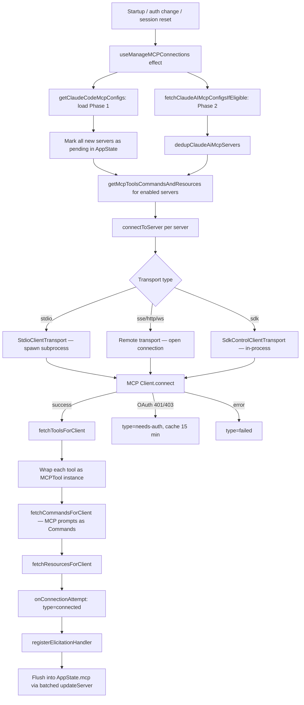
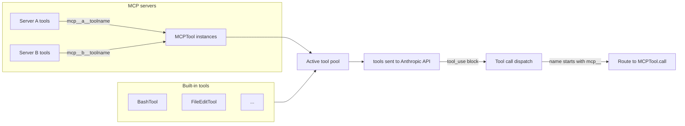

# MCP Integration

## Purpose

MCP (Model Context Protocol) lets external tool servers connect to Claude Code. Once connected, an MCP server's tools appear alongside built-in tools in the active tool pool. The model can invoke them using the same tool-use mechanism as any built-in tool. Resources and prompts (skills) exposed by the server are also made available.

## Key Types (`services/mcp/types.ts`)

### `MCPServerConnection`

A discriminated union representing a server in any lifecycle state:

| Variant | Meaning |
|---------|---------|
| `ConnectedMCPServer` | Live connection; holds `Client`, `capabilities`, `serverInfo`, `instructions`, `config`, `cleanup()` |
| `PendingMCPServer` | Connecting or reconnecting; includes `reconnectAttempt` and `maxReconnectAttempts` |
| `FailedMCPServer` | Connection attempt failed; holds `error` string |
| `NeedsAuthMCPServer` | Server requires OAuth; cached for 15 minutes |
| `DisabledMCPServer` | Manually disabled by user |

### `ScopedMcpServerConfig`

`McpServerConfig` (one of seven transport variants) plus:
- `scope: ConfigScope` — where the config originated: `'local'` | `'user'` | `'project'` | `'dynamic'` | `'enterprise'` | `'claudeai'` | `'managed'`
- `pluginSource?: string` — if a plugin provided the server, the plugin's identifier

### `ServerResource`

`Resource` from the MCP SDK plus `server: string` (which server provided it). Resources have URI, name, description, and mimeType.

### `MCPCliState`

Serialized snapshot of MCP state: `clients`, `configs`, `tools`, `resources`, `normalizedNames`.

## Transport Types

| Type string | Transport | Notes |
|-------------|-----------|-------|
| `stdio` (default) | `StdioClientTransport` | Spawns a subprocess; communicates over stdin/stdout. No automatic reconnect on close. |
| `sse` | `SSEClientTransport` | Server-Sent Events over HTTP. Reconnects automatically with exponential backoff on close. |
| `http` | `StreamableHTTPClientTransport` | MCP Streamable HTTP spec (2025-03-26). Reconnects automatically. |
| `ws` / `ws-ide` | `WebSocketTransport` | WebSocket; reconnects automatically. IDE variant used for VS Code extension integration. |
| `sse-ide` | `SSEClientTransport` | SSE variant for IDE extensions. |
| `sdk` | `SdkControlClientTransport` | In-process SDK-controlled transport; no subprocess. |
| `claudeai-proxy` | `StreamableHTTPClientTransport` | claude.ai-hosted connector servers; OAuth bearer token attached by `createClaudeAiProxyFetch`. |

Stdio and sdk transports do not attempt automatic reconnection when closed. All remote transports (sse, http, ws, sse-ide, ws-ide) retry with exponential backoff: starting at 1 s, doubling each attempt, capped at 30 s, for a maximum of 5 attempts.

## Tool Naming

MCP tools are registered under a namespaced identifier:

```
mcp__{normalizedServerName}__{normalizedToolName}
```

`normalizeNameForMCP()` converts the server and tool names to a safe identifier. `buildMcpToolName(serverName, toolName)` and `getMcpPrefix(serverName)` are the canonical builders in `mcpStringUtils.ts`.

When `CLAUDE_AGENT_SDK_MCP_NO_PREFIX` mode is active, the `mcp__server__` prefix is omitted and tools are registered by their bare tool name.

## Connection Lifecycle



## Tool Pool Integration



`tools.ts` assembles the active tool pool by calling `getTools()`, which merges `AppState.mcp.tools` (the MCP tool instances) with the built-in tool set. No special registration step is needed; the state update from `onConnectionAttempt` makes tools available for the next turn.

## Tool Deferral (ToolSearch)

When `isToolSearchEnabledOptimistic()` is true, tools are sent to the API with `defer_loading: true`. The model must call `ToolSearch` to retrieve a tool's full schema before using it.

The `_meta['anthropic/alwaysLoad']` field on an MCP tool's metadata controls deferral:
- `true` — never deferred; schema is sent immediately regardless of ToolSearch mode
- `false` or absent — eligible for deferral

## MCPTool Instance

Each tool exposed by a connected MCP server is represented as an `MCPTool` instance (from `tools/MCPTool/MCPTool.ts`). The base `MCPTool` object is a template; `connectToServer` overrides the following fields for each concrete tool:

- `name` — the namespaced `mcp__server__tool` identifier
- `description()` — forwarded from the MCP server's tool definition (capped at 2048 characters)
- `inputSchema` — the tool's JSON Schema from the server
- `call()` — invokes `client.callTool()` on the server's MCP client
- `userFacingName()` — `"serverName - toolDisplayName (MCP)"`
- `checkPermissions()` — delegates to the permission system

## Resource Support

Two built-in tools handle MCP resources:

- `ListMcpResourcesTool` — lists all resources across all connected servers from `AppState.mcp.resources`
- `ReadMcpResourceTool` — reads a specific resource by URI, dispatched to the appropriate server's `client.readResource()`

Resources are refreshed when the server emits a `resources/list_changed` notification.

## Live Update Notifications

Connected servers can push `list_changed` notifications to invalidate cached data:

| Notification | Response |
|-------------|---------|
| `tools/list_changed` | Invalidate `fetchToolsForClient` cache, re-fetch, `updateServer` |
| `prompts/list_changed` | Invalidate `fetchCommandsForClient` cache, re-fetch prompts + MCP skills, `updateServer` |
| `resources/list_changed` | Invalidate `fetchResourcesForClient` cache, re-fetch; if MCP_SKILLS, also refresh prompts and skill index |

Updates are coalesced: `updateServer` batches pending updates via a 16 ms `setTimeout` window and applies them all in a single `setAppState` call.

## Connection Manager (`MCPConnectionManager.tsx`)

`MCPConnectionManager` is a React (Ink) context provider rendered at the root of the REPL tree. It owns no visible UI. Its two responsibilities:

1. Wraps `useManageMCPConnections(dynamicMcpConfig, isStrictMcpConfig)` to run the connection lifecycle.
2. Exposes `reconnectMcpServer(serverName)` and `toggleMcpServer(serverName)` via `MCPConnectionContext` so any descendant can trigger reconnections or enable/disable servers.

`useManageMCPConnections` is where all lifecycle logic lives: initialization, two-phase config loading, connection batching, list-changed handlers, reconnection backoff, and channel notification registration.

## OAuth and Authentication

### OAuth flow (`auth.ts`, `xaaIdpLogin.ts`)

Remote servers (sse, http, claudeai-proxy) that require authentication go through an OAuth flow. `ClaudeAuthProvider` implements the MCP SDK's auth provider interface. Token refresh is handled by `checkAndRefreshOAuthTokenIfNeeded`. A server that returns 401 during connection is marked `type: 'needs-auth'` and cached for 15 minutes in `~/.claude/mcp-needs-auth-cache.json`.

### Elicitation (`elicitationHandler.ts`)

MCP servers can request input from the user via the `elicit` JSON-RPC request (MCP error code -32042 for URL-based auth flows). `registerElicitationHandler` sets up two handlers on the connected client:

1. `ElicitRequestSchema` handler — queues an `ElicitationRequestEvent` into `AppState.elicitation.queue`. The REPL renders a dialog from this queue. Elicitation hooks are checked first; if a hook provides a response, the dialog is skipped.
2. `ElicitationCompleteNotificationSchema` handler — sets `completed: true` on a pending URL-mode elicitation, allowing the dialog to dismiss automatically.

Form-mode elicitations present a structured input form. URL-mode elicitations open a browser URL and wait for server confirmation.

## Channel Permissions (`channelPermissions.ts`)

Servers that declare `capabilities.experimental['claude/channel']` and `capabilities.experimental['claude/channel/permission']` can relay permission prompts over messaging channels (Telegram, iMessage, Discord). This feature is gated by the `tengu_harbor_permissions` GrowthBook flag.

When a permission dialog fires, it is also sent via the channel. The user's reply (`yes <id>` / `no <id>`) is parsed by the channel server, which emits a `notifications/claude/channel/permission` notification with `{ request_id, behavior }`. `ChannelPermissionCallbacks.resolve()` matches it against the pending map and resolves the dialog race.

The `shortRequestId()` function generates a 5-letter ID from the tool use ID using FNV-1a hash with a 25-character alphabet (a–z minus 'l') and a blocklist of offensive substrings.

## Config Sources and Scopes

`getClaudeCodeMcpConfigs()` (in `config.ts`) merges configs from multiple sources in priority order:

1. Enterprise managed settings (`scope: 'enterprise'`)
2. User global settings, `~/.claude/settings.json` (`scope: 'user'`)
3. Project `.claude/settings.json` or `.mcp.json` (`scope: 'project'`)
4. Local `.claude/settings.local.json` (`scope: 'local'`)
5. Plugin-provided servers (`scope: 'dynamic'`)
6. claude.ai-provided connectors (`scope: 'claudeai'`)
7. CLI `--mcp-server` / `dynamicMcpConfig` flags (merged last, highest precedence)

When `--strict-mcp-config` is set (`isStrictMcpConfig = true`), only the `dynamicMcpConfig` from CLI flags is used; all file-based configs are skipped.
