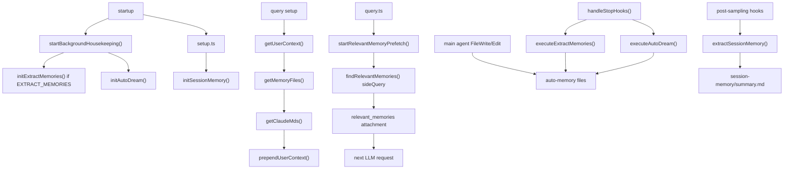

# Memory System

Claude Code has several memory systems that share Markdown files and forked
agents, but they have different lifetimes, activation gates, and prompt
injection paths. This document describes the low-level behavior in the source:
where memory is stored, when agents create or update it, how it is loaded into
LLM requests, and which tool restrictions protect background writers.

AutoDream's consolidation gates and UI task state are covered in
[autodream.md](./autodream.md). This document covers how AutoDream fits into
the broader memory system.

---

## Source Map

| Area                                           | Source                                                                        |
| ---------------------------------------------- | ----------------------------------------------------------------------------- |
| Instruction-memory discovery and serialization | `utils/claudemd.ts`, `context.ts`, `utils/api.ts`                             |
| Auto-memory path resolution and enablement     | `memdir/paths.ts`                                                             |
| Auto-memory prompt contract and file format    | `memdir/memdir.ts`, `memdir/memoryTypes.ts`                                   |
| Topic-memory manifest scanning                 | `memdir/memoryScan.ts`                                                        |
| Relevant-memory selection                      | `memdir/findRelevantMemories.ts`, `utils/attachments.ts`, `utils/messages.ts` |
| Background memory extraction                   | `services/extractMemories/extractMemories.ts`                                 |
| AutoDream consolidation                        | `services/autoDream/`                                                         |
| Team memory paths, validation, and sync        | `memdir/teamMemPaths.ts`, `services/teamMemorySync/`                          |
| Agent memory                                   | `tools/AgentTool/agentMemory.ts`, `tools/AgentTool/agentMemorySnapshot.ts`    |
| Session memory                                 | `services/SessionMemory/`, `services/compact/sessionMemoryCompact.ts`         |
| Memory UI                                      | `commands/memory/memory.tsx`, `components/memory/MemoryFileSelector.tsx`      |

---

## Memory Stores

| Store                  | Scope                                               | File shape                                           | Loaded by                                                          | Written by                          |
| ---------------------- | --------------------------------------------------- | ---------------------------------------------------- | ------------------------------------------------------------------ | ----------------------------------- |
| **Instruction memory** | Managed, user, project, local                       | `CLAUDE.md`, `.claude/rules/*.md`, `CLAUDE.local.md` | `getMemoryFiles()` -> `getClaudeMds()`                             | User or `/memory` editor            |
| **Auto-memory**        | Project by canonical git root                       | `MEMORY.md` index plus topic `.md` files             | `loadMemoryPrompt()`, `getMemoryFiles()`, relevant-memory prefetch | Main agent, extractor, AutoDream    |
| **Team memory**        | Project, under auto-memory                          | `team/MEMORY.md` plus team files                     | `getMemoryFiles()`, team prompt paths                              | Main agent, extractor, sync service |
| **Agent memory**       | Agent type with `user`, `project`, or `local` scope | `MEMORY.md` plus topic files                         | `loadAgentMemoryPrompt()`                                          | Agent with memory enabled           |
| **Session memory**     | Current session only                                | `session-memory/summary.md`                          | Session-memory compact path                                        | Session-memory fork or `/summary`   |

Important scope distinction:

```text
auto-memory: project-scoped by default
agent memory: scope-selectable, with user/global, project, and local scopes
```

Auto-memory is keyed to the current project because most captured facts are
repo-specific. Agent memory is keyed by agent type and selected scope because a
custom agent may need reusable behavior across repositories or checkout-local
state for one repository.

## When the memory are generated

- **Instruction memory: User proactively do this (edit file or use `/init` command)**

- **Auto memory:**

  - **User request**

  - **After every turn, the stop hook triggers the activity, if it is eligible, a forked sub agent is created for this task.**

- **Team memory:**

  - **After every turn, the stop hook triggers the activity, if it is eligible, a forked sub agent is created for this task.**

- **Agent memory:**

  - **For memory-enabled sub agent, in the agent prompt, it contains a dedicated memory prompt for this task.**

- **Session memory:**

  - **After every turn, the stop hook triggers the activity, if it is eligible, a forked sub agent is created for this task.**

---

## End-to-End Runtime Map



---

## Auto-Memory Enablement And Path Resolution

`isAutoMemoryEnabled()` in `memdir/paths.ts` is the shared gate for auto-memory,
agent memory, team memory, relevant-memory recall, extractor, AutoDream, and
memory-related skills.

Enablement precedence:

1. `CLAUDE_CODE_DISABLE_AUTO_MEMORY` truthy -> disabled.
2. `CLAUDE_CODE_DISABLE_AUTO_MEMORY` defined falsy -> enabled.
3. `CLAUDE_CODE_SIMPLE` -> disabled.
4. Remote mode without `CLAUDE_CODE_REMOTE_MEMORY_DIR` -> disabled.
5. `autoMemoryEnabled` setting -> use the setting.
6. Default -> enabled.

`getAutoMemPath()` resolves the project memory directory:

1. `CLAUDE_COWORK_MEMORY_PATH_OVERRIDE`, if present and valid.
2. `autoMemoryDirectory` from trusted settings sources:
   `policySettings`, `flagSettings`, `localSettings`, `userSettings`.
3. Default:

```text
{memoryBase}/projects/{sanitize(canonicalGitRootOrProjectRoot)}/memory/
```

`memoryBase` is `CLAUDE_CODE_REMOTE_MEMORY_DIR` when set, otherwise the Claude
config home, normally `~/.claude`.

Security rules:

- `autoMemoryDirectory` from project settings is intentionally ignored. A repo
  cannot redirect memory writes to sensitive user paths.
- Path overrides must be absolute and are rejected when they normalize to root,
  drive roots, UNC paths, relative paths, null-byte paths, or near-root paths.
- The default path uses `findCanonicalGitRoot(getProjectRoot())` when possible,
  so worktrees of the same repository share auto-memory.

Auto-memory file layout:

```text
{autoMemPath}/
  MEMORY.md
  *.md
  logs/YYYY/MM/YYYY-MM-DD.md
  team/
    MEMORY.md
  .consolidate-lock
```

`MEMORY.md` is an index, not the main content store. Topic files hold durable
memory bodies.

---

## Durable Auto-Memory File Contract

`memdir/memdir.ts` builds the prompt contract that tells the main agent how to
save and forget durable memory.

Core prompt contract:

- A direct "remember" request should be saved immediately.
- A "forget" request should find matching memories and remove or correct them.
- Current-turn work belongs in tasks/plans, not durable memory.
- When indexing is enabled, write or update a topic file first, then add a
  short pointer to `MEMORY.md`.
- When skip-index mode is enabled, write the topic file without updating the
  index.
- `MEMORY.md` should stay concise: one pointer per line, each roughly under
  150 characters.
- AutoMem and TeamMem entrypoints are truncated when parsed if they exceed
  `MAX_ENTRYPOINT_LINES = 200` or about `25 KB`.

Topic memory types are defined in `memdir/memoryTypes.ts`:

| Type        | Meaning                                                           |
| ----------- | ----------------------------------------------------------------- |
| `user`      | Stable user preferences and personal working style                |
| `feedback`  | User corrections or feedback that should affect future behavior   |
| `project`   | Stable project facts not already better represented in repo docs  |
| `reference` | Reusable references, external process notes, caveats, and gotchas |

The prompt explicitly rejects saving:

- Code architecture, project structure, file paths, and implementation details
  that should live in checked-in documentation.
- Git history and ephemeral debugging notes.
- Current task state, temporary TODOs, and one-off plans.
- Facts already in `CLAUDE.md`.
- Broad activity summaries unless the user identifies the non-obvious fact that
  should persist.

Assistant/KAIROS mode can write daily logs via `getAutoMemDailyLogPath()`:

```text
{autoMemPath}/logs/YYYY/MM/YYYY-MM-DD.md
```

Those logs are later distilled into topic files and `MEMORY.md` by a dream pass.

---

## Instruction Memory Loading

`context.ts` calls `getUserContext()`, which loads memory files with:

```text
getMemoryFiles() -> filterInjectedMemoryFiles() -> getClaudeMds()
```

`getMemoryFiles()` is memoized in `utils/claudemd.ts`. It discovers files in
priority order:

1. Managed: `/etc/claude-code/CLAUDE.md` and
   `/etc/claude-code/.claude/rules/*.md`.
2. User: `~/.claude/CLAUDE.md` and `~/.claude/rules/*.md`.
3. Project: `CLAUDE.md`, `.claude/CLAUDE.md`, `.claude/rules/*.md` while
   walking from CWD upward.
4. Local: `CLAUDE.local.md` while walking from CWD upward.
5. Additional directories from `CLAUDE_CODE_ADDITIONAL_DIRECTORIES_CLAUDE_MD`.
6. AutoMem: `{autoMemPath}/MEMORY.md`, when auto-memory is enabled.
7. TeamMem: `{autoMemPath}/team/MEMORY.md`, when TEAMMEM is enabled.

Later files are serialized later and are therefore higher priority in the
instruction block.

Parsing details:

- `@include` directives are resolved up to depth 5.
- Circular includes are suppressed through the processed-path set.
- Includes inside code strings or code blocks are ignored.
- Missing includes are ignored.
- Non-text extensions are skipped.
- Block HTML comments are stripped.
- Frontmatter `paths` can make rule files conditional.
- User, project, and local memory can be filtered by `claudeMdExcludes`;
  Managed, AutoMem, and TeamMem are not excluded by that setting.

`getClaudeMds()` serializes the resulting `MemoryFileInfo[]` into the
`claudeMd` user context. `utils/api.ts` then prepends that context as a meta
user message:

```text
<system-reminder>
As you answer the user's questions, you can use the following context:
# claudeMd
...
IMPORTANT: this context may or may not be relevant...
</system-reminder>
```

This is a `user` message with `isMeta: true`, not a top-level Anthropic
`system` message.

---

## Memory Prompt Injection

Instruction-memory loading and memory-use instructions are separate:

- `getMemoryFiles()` and `getClaudeMds()` put `CLAUDE.md`-style content and
  memory entrypoints into user context.
- `loadMemoryPrompt()` puts memory operating instructions into the system
  prompt: where memory lives, what to save, how to forget, and how to update
  topic files and `MEMORY.md`.

`loadMemoryPrompt()` behavior:

1. Return `null` if auto-memory is disabled.
2. If KAIROS daily-log mode is active, return the assistant daily-log prompt.
3. If TEAMMEM is enabled, build the combined private/team prompt.
4. Otherwise ensure the auto-memory directory exists and return auto-memory
   instructions.

The prompt can run in two index modes:

| Mode                                    | Behavior                                                              |
| --------------------------------------- | --------------------------------------------------------------------- |
| Normal                                  | Write topic file, then update `MEMORY.md` index                       |
| Skip index, gated by `tengu_moth_copse` | Write topic file only; retrieval uses topic manifests and attachments |

Agent memory uses the same memory-prompt shape through
`loadAgentMemoryPrompt(agentType, scope)`, with an extra scope note.

---

## Relevant-Memory Prefetch

Relevant-memory prefetch is query-time recall. It selects existing topic files
for the current request. It does not create, extract, or consolidate memories.

Call path:

```text
query.ts
  -> startRelevantMemoryPrefetch(messages, toolUseContext)
  -> getRelevantMemoryAttachments()
  -> findRelevantMemories()
  -> createAttachmentMessage({ type: 'relevant_memories' })
  -> utils/messages.ts wraps each memory in <system-reminder>
```

Start gates in `startRelevantMemoryPrefetch()`:

1. Auto-memory must be enabled.
2. Feature flag `tengu_moth_copse` must be true.
3. There must be a last real user message.
4. The extracted user text must be non-empty.
5. Single-word prompts are skipped.
6. The session-level surfaced-memory byte budget must not be exhausted.

Candidate selection:

- If the user mentions an agent, recall searches that agent's memory directory.
- Otherwise it searches the default auto-memory directory.
- `scanMemoryFiles(memoryDir)` recursively scans topic `.md` files.
- `MEMORY.md` is explicitly excluded.
- Each candidate reads only the first 30 lines.
- Frontmatter fields such as `type` and `description` are parsed from the topic
  file itself.
- The selector does not read `MEMORY.md` and does not ask the side model to
  choose from the index.
- If there are no candidate topic files, no side query is made.

Side query:

```text
Query: <last user prompt>

Available memories:
[project] auth-refresh.md (2026-06-01T10:00:00.000Z): Token refresh retry caveat
[user] review-style.md (...): User prefers findings-first review

Recently used tools: ...
```

`findRelevantMemories()` uses the default Sonnet model and asks for up to five
filenames that are clearly useful. Recently successful tools suppress reference
docs about tools that are already working, while still allowing gotcha memories.

Selected memories are read by `readMemoriesForSurfacing()` with:

- `MAX_MEMORY_LINES = 200`
- `MAX_MEMORY_BYTES = 4096`
- truncate-with-note behavior when a selected file exceeds the limit

Injection timing:

- The prefetch starts at the beginning of a user turn.
- `query.ts` consumes the result only if the promise has settled by the
  post-tools collection point.
- If it has not settled, the loop does not wait. It may be consumed on a later
  loop iteration in the same turn.
- Surfaced paths are recorded so the same memory is not re-injected repeatedly.
- Files already read, written, or edited by tools are filtered out.

Request shape when prefetch is disabled:

```jsonc
{
  "messages": [
    {
      "role": "user",
      "content": "<system-reminder>\n# claudeMd\nContents of /repo/CLAUDE.md ...\n\nContents of ~/.claude/projects/repo/memory/MEMORY.md ...\n\n- [Auth refresh edge case](auth-refresh.md) - Token refresh retry caveat\n</system-reminder>"
    },
    {
      "role": "user",
      "content": "Please fix the auth token refresh bug"
    }
  ]
}
```

Request shape when prefetch is enabled and a topic file is selected:

```jsonc
{
  "messages": [
    {
      "role": "user",
      "content": "<system-reminder>\n# claudeMd\nContents of /repo/CLAUDE.md ...\n</system-reminder>"
    },
    {
      "role": "user",
      "content": "Please fix the auth token refresh bug"
    },
    {
      "role": "user",
      "content": "<system-reminder>\nMemory (saved 3 days ago): ~/.claude/projects/repo/memory/auth-refresh.md:\n\n---\ntype: project\ndescription: Token refresh flow has a retry-loop caveat.\n---\n\n# Auth refresh retry-loop edge case\n...\n</system-reminder>"
    }
  ]
}
```

Tradeoff:

| Mode              | Context behavior                                                                   | Strength                           | Cost                                                                         |
| ----------------- | ---------------------------------------------------------------------------------- | ---------------------------------- | ---------------------------------------------------------------------------- |
| Prefetch disabled | Always load `MEMORY.md` entrypoints through `claudeMd`                             | Deterministic index visibility     | Mostly pointers; model must decide to read topic files; index grows noisy    |
| Prefetch enabled  | Remove AutoMem/TeamMem entrypoints and inject selected topic bodies as attachments | Bounded, actionable memory content | Side-query cost; selector can miss; late prefetch can miss the first request |

---

## Background Auto-Memory Extraction

Background extraction creates or updates durable auto-memory after an eligible
main-agent turn. It is best effort and fire-and-forget in interactive mode.

Registration:

```text
startBackgroundHousekeeping()
  -> if feature('EXTRACT_MEMORIES') initExtractMemories()
```

Turn-end call site:

```text
handleStopHooks()
  -> if not bare/simple
  -> if feature('EXTRACT_MEMORIES')
  -> if !toolUseContext.agentId
  -> if isExtractModeActive()
  -> executeExtractMemories(stopHookContext, appendSystemMessage)
```

`isExtractModeActive()` requires:

- `tengu_passport_quail` true.
- In non-interactive sessions, `tengu_slate_thimble` must also be true.

`executeExtractMemoriesImpl()` then applies additional gates:

1. Main agent only.
2. `tengu_passport_quail` still true.
3. Auto-memory enabled.
4. Remote mode off.
5. If another extraction is running, stash the latest context and run one
   trailing extraction after the current one.

`runExtraction()` then applies extraction-level skips:

1. If the main agent already wrote to auto-memory after the extractor cursor,
   skip the fork and advance the cursor.
2. Increment `turnsSinceLastExtraction`.
3. Run only when the throttle passes:

```text
turnsSinceLastExtraction >= (tengu_bramble_lintel ?? 1)
```

Default throttle is `1`, so the fork can run every eligible turn if no other
skip applies. That means every eligible turn may call the extractor entrypoint,
but the forked extraction agent does not necessarily run every turn.

Forked-agent call:

```text
runForkedAgent({
  promptMessages: [extract prompt],
  cacheSafeParams: createCacheSafeParams(context),
  canUseTool: createAutoMemCanUseTool(memoryDir),
  querySource: 'extract_memories',
  forkLabel: 'extract_memories',
  skipTranscript: true,
  maxTurns: 5
})
```

Prompt-cache behavior:

- `createCacheSafeParams(context)` preserves the parent system prompt, user
  context, system context, model/tool context, and parent messages.
- `runForkedAgent()` uses:

```text
initialMessages = [...forkContextMessages, ...promptMessages]
```

- The API request still uses `toolUseContext.options.tools`.
- The extractor does not shrink the advertised tool schema list because tools
  are part of the prompt-cache key.
- The tool subset is enforced at runtime by `canUseTool`, not by changing the
  API tool list.

Allowed tools from `createAutoMemCanUseTool()`:

| Tool                 | Access                                           |
| -------------------- | ------------------------------------------------ |
| REPL                 | Allowed; inner primitive calls are checked again |
| FileRead, Grep, Glob | Allowed                                          |
| Bash                 | Allowed only when `BashTool.isReadOnly()` passes |
| FileWrite, FileEdit  | Allowed only inside the auto-memory directory    |
| Other tools          | Denied                                           |

Before invoking the fork, the extractor scans existing topic headers with
`scanMemoryFiles()` and passes a manifest into the extraction prompt so the
fork does not spend a turn listing memory files.

After a successful fork:

- `lastMemoryMessageUuid` advances to the last processed message.
- Written paths are extracted from the fork's Edit/Write tool uses.
- `MEMORY.md` updates are treated as mechanical index updates.
- User-visible "memory saved" notification counts topic files, not the index.

---

## AutoDream Consolidation

AutoDream is a consolidation pass, not first-pass extraction. It periodically
reads recent transcripts, daily logs, and existing topic files, then merges,
prunes, and re-indexes auto-memory.

Source path:

```text
startBackgroundHousekeeping()
  -> initAutoDream()

handleStopHooks()
  -> if not bare/simple
  -> if !toolUseContext.agentId
  -> executeAutoDream(stopHookContext, appendSystemMessage)
```

High-level gates:

1. Not KAIROS.
2. Not remote mode.
3. Auto-memory enabled.
4. AutoDream enabled by `autoDreamEnabled` setting or `tengu_onyx_plover`.
5. Time since last consolidation meets `minHours`, default 24.
6. Session scan throttle passes, 10 minutes.
7. Enough sessions touched since last consolidation, default 5.
8. Consolidation lock acquired.

The dream fork uses the same `createAutoMemCanUseTool(memoryRoot)` restriction
as background extraction. Detailed lock, force, prompt-phase, and DreamTask UI
behavior is documented in [autodream.md](./autodream.md).

---

## Team Memory

Team memory is enabled when:

```text
isAutoMemoryEnabled() && tengu_herring_clock
```

Local path:

```text
{getAutoMemPath()}/team/
{getAutoMemPath()}/team/MEMORY.md
```

Because the team directory is under auto-memory, it is project-scoped by the
same canonical git root.

Write hardening in `memdir/teamMemPaths.ts`:

- Relative keys reject null bytes, backslashes, absolute paths, URL-encoded
  traversal, and Unicode-normalized traversal.
- Write validation resolves the deepest existing ancestor to detect symlink
  escapes.
- Dangling symlinks, symlink loops, prefix attacks, and unverified containment
  fail closed.
- `FileEditTool` and `FileWriteTool` call `checkTeamMemSecrets()` before
  writing team memory content.

`services/teamMemorySync/` optionally syncs local team memory with the server.
The watcher is separate from prompt loading; prompt loading reads the local team
entrypoint.

---

## Agent Memory

Agent memory is loaded only for agents whose definition enables memory. It uses
the same prompt shape as auto-memory but a different path resolver.

`getAgentMemoryDir(agentType, scope)`:

| Scope     | Directory                                       |
| --------- | ----------------------------------------------- |
| `user`    | `{memoryBase}/agent-memory/{agentType}/`        |
| `project` | `{cwd}/.claude/agent-memory/{agentType}/`       |
| `local`   | `{cwd}/.claude/agent-memory-local/{agentType}/` |

When `CLAUDE_CODE_REMOTE_MEMORY_DIR` is set, local agent memory moves to:

```text
{remoteMemoryDir}/projects/{sanitize(projectRoot)}/agent-memory-local/{agentType}/
```

Entrypoint:

```text
{agentMemoryDir}/MEMORY.md
```

`loadAgentMemoryPrompt(agentType, scope)` ensures the directory asynchronously
and builds a memory prompt with a scope-specific note. Agent memory snapshots
are separate:

```text
{cwd}/.claude/agent-memory-snapshots/{agentType}/snapshot.json
```

The important design difference is that auto-memory defaults to project scope,
while agent memory is scope-selectable. A user-scoped agent memory can carry
agent-specific behavior or preferences across repositories; project/local scopes
keep agent memory tied to a repository or checkout.

---

## Session Memory

Session memory is not durable user preference memory. It is a per-session notes
file used to make compaction less lossy.

Path from `utils/permissions/filesystem.ts`:

```text
{getProjectDir(getCwd())}/{getSessionId()}/session-memory/summary.md
```

Directory/file permissions:

- Directory: `0700`
- File: `0600`

Registration:

```text
setup.ts -> initSessionMemory()
```

`initSessionMemory()` registers the post-sampling hook only when:

1. Remote mode is off.
2. Auto-compact is enabled.

The hook then applies runtime gates:

1. `querySource === 'repl_main_thread'`.
2. Feature gate `tengu_session_memory` is true.
3. Config is lazily initialized from `tengu_sm_config`, with defaults.

Default thresholds from `DEFAULT_SESSION_MEMORY_CONFIG`:

| Field                        | Default | Meaning                                                   |
| ---------------------------- | ------- | --------------------------------------------------------- |
| `minimumMessageTokensToInit` | `10000` | Do not initialize session memory before this context size |
| `minimumTokensBetweenUpdate` | `5000`  | Require this much context growth since last extraction    |
| `toolCallsBetweenUpdates`    | `3`     | Tool-call threshold for an update                         |

`shouldExtractMemory(messages)`:

1. If session memory is not initialized, require current context tokens to be
   at least `minimumMessageTokensToInit`, then mark initialized.

2. Always require token growth since last extraction to meet
   `minimumTokensBetweenUpdate`.

3. Also require either:

   - tool calls since the last update >= `toolCallsBetweenUpdates`, or

   - the last assistant turn had no tool calls, which is treated as a natural
     conversation break.

Update mechanics:

- Claude Code creates or reads `summary.md`.
- If the file is new, it writes the session-memory template.
- It reads current notes through `FileReadTool`.
- It builds an update prompt containing the current notes:

```text
<current_notes_content>
{{currentNotes}}
</current_notes_content>
```

- It runs a forked agent with:

```text
querySource: 'session_memory'
forkLabel: 'session_memory'
forkContextMessages: current conversation
canUseTool: only FileEditTool on summary.md
```

The update is incremental in when it triggers, but cumulative in what it
maintains. The fork edits the existing structured notes file in place. It is not
append-only and it is not strictly a summary of only messages since the last
extraction.

After success:

- The current token count is recorded for the next update threshold.
- `lastSummarizedMessageId` is updated when the last assistant turn has no tool
  calls, avoiding a boundary that would orphan tool results.
- `sessionMemoryCompact` can use `lastSummarizedMessageId` as the boundary
  between conversation already represented in session memory and messages that
  still need to be preserved after compaction.

Manual path:

```text
/summary -> manuallyExtractSessionMemory()
```

Manual extraction bypasses automatic thresholds but uses the same file setup,
prompt builder, forked `session_memory` query source, and exact-file Edit-only
tool restriction.

---

## Memory UI

`/memory`:

```text
commands/memory/memory.tsx
  -> clearMemoryFileCaches()
  -> getMemoryFiles()
  -> MemoryFileSelector
```

The selector can:

- Open existing memory and instruction files.
- Create missing user/project instruction files before opening an editor.
- Open the auto-memory folder.
- Open the team-memory folder when enabled.
- Open agent-memory folders for agents with memory.
- Toggle `autoMemoryEnabled` and `autoDreamEnabled`.

`/remember`:

- Implemented by `skills/bundled/remember.ts`.
- Enabled when auto-memory is enabled.
- Reviews auto-memory entries and proposes promotion to longer-lived
  instruction files such as `CLAUDE.md`, `CLAUDE.local.md`, or team memory.
- Does not modify files without user approval.

---

## Caching And Invalidation

`getMemoryFiles()` is memoized. Cache controls:

| Function                           | Behavior                                                         |
| ---------------------------------- | ---------------------------------------------------------------- |
| `clearMemoryFileCaches()`          | Clears memoized memory-file loader without firing hooks          |
| `resetGetMemoryFilesCache(reason)` | Clears cache and arms the instructions-loaded hook for next load |

`/memory` clears and primes the cache before rendering.

Relevant-memory attachment surfacing does not use `getMemoryFiles()` as its
source. It scans topic files separately with `scanMemoryFiles()`, tracks
surfaced paths in the transcript, and resets naturally after compaction because
old `relevant_memories` attachment messages leave the active context.

Forked background agents preserve prompt-cache compatibility by reusing
cache-safe parent parameters. Tool restrictions are enforced with `canUseTool`
instead of changing the API tool schema list, because the tool list is part of
the prompt-cache key.

---

## Operational Invariants

- Auto-memory and team-memory entrypoints are indexes; durable detail belongs
  in topic files.
- Prefetch mode does not use `MEMORY.md` as the source for side-query
  selection. It uses topic-file frontmatter and first lines.
- Background extraction and AutoDream cannot write outside the auto-memory
  directory through their allowed tool predicate.
- Session memory is not inserted by `getMemoryFiles()` and is not a durable
  user preference store.
- Auto-memory topic files are Markdown; file tools provide text editing, not
  rich document editing.
- Memory can become stale. `memdir/memoryAge.ts` adds freshness text to
  surfaced topic memories and reminds the model to verify current code state
  before asserting memory claims as fact.
