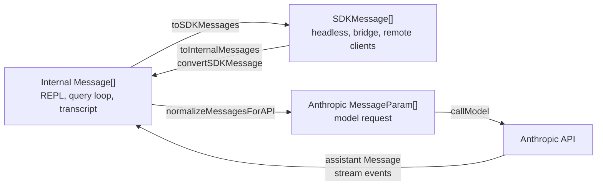

# Message Types and Conversion Boundaries

## Purpose

Claude Code uses three different message families that are easy to conflate:

| Family | Primary type | Used by | Sent to model? |
|---|---|---|---|
| Internal / UI messages | `Message` and `NormalizedMessage` from `src/types/message.js` | REPL state, Ink rendering, transcripts, `query.ts`, tools | Only after API normalization |
| SDK / bridge messages | `SDKMessage` from `entrypoints/agentSdkTypes.ts` / `entrypoints/sdk/coreTypes.generated.ts` | headless output, Agent SDK, bridge / CCR transports, remote session replay | No, except user / assistant payloads after conversion back to internal |
| LLM / API messages | Anthropic SDK `MessageParam` and `Message` | `services/api/claude.ts` request construction and model responses | Yes |

The boundaries are intentionally explicit. Internal messages preserve local UI
and session state. SDK messages expose a stable event protocol to external
consumers. API messages are the reduced model-facing transcript accepted by the
Anthropic Messages API.

---

## Source Map

| Path | Role |
|---|---|
| `src/types/message.js` | Internal message type surface imported throughout the tree. In this recovered checkout, the corresponding TS source file is not present, so the concrete union is inferred from imports, constructors, and exhaustive switches. |
| `utils/messages.ts` | Internal message constructors, UI normalization, API normalization, compaction helpers, tool-use pairing repair. |
| `utils/messages/mappers.ts` | Internal `Message[]` to SDK `SDKMessage[]`, SDK messages back to internal messages, compact metadata conversion, rate-limit metadata conversion. |
| `remote/sdkMessageAdapter.ts` | Live remote/CCR SDK event to REPL-renderable internal message adapter. |
| `entrypoints/sdk/coreSchemas.ts` | Zod schemas for the public SDK message protocol. |
| `entrypoints/sdk/coreTypes.generated.ts` | Generated TypeScript aliases inferred from the SDK schemas. |
| `entrypoints/sdk/controlTypes.ts` | Adjacent control protocol. `StdoutMessage` is `SDKMessage | SDKControlRequest | SDKControlResponse`. |
| `QueryEngine.ts` | Headless/SDK session lifecycle; converts internal query-loop messages into SDK output events. |
| `bridge/replBridge.ts` | Sends REPL internal messages to claude.ai by injecting `toSDKMessages`. Daemon callers can send already-built SDK messages. |
| `services/api/claude.ts` | Final API request construction: normalizes internal messages and maps them to Anthropic `MessageParam`. |
| `query.ts` | Main LLM loop. Carries internal `Message[]`, yields internal messages/events, and calls `services/api/claude.ts`. |

---

## Internal / UI Messages and Query Events

Internal messages are the application's working conversation format. They are
used by the REPL, tools, session storage, compaction, permissions, and the
`query()` loop. They preserve information that the model should not necessarily
see, such as render-only progress, system status, timestamps, UUIDs, virtual
messages, local command metadata, and full structured tool output.

`query()` also yields adjacent event records, such as stream events and
tool-use summaries, that travel through the same rendering/headless plumbing
but are not necessarily persisted as ordinary conversation `Message` records.

### Core Shapes and Events

The internal message type definitions are imported from `src/types/message.js`.
The source file is missing in this recovered checkout, but the active persisted
shapes and adjacent query-yielded events are visible through constructors and
switch statements:

| Type / event | Produced by | Meaning |
|---|---|---|
| `user` | `createUserMessage()` | User input, synthetic user caveats, slash-command breadcrumbs, tool results, compact summaries, bridge-origin text. Holds an Anthropic-style `{ role: 'user', content }` payload plus local metadata. |
| `assistant` | `createAssistantMessage()` / model response handling | Assistant output with Anthropic assistant `message` payload, usage, error fields, request id, timestamp, UUID, virtual flag. |
| `system` | `createSystemMessage()` and specialized helpers | Local system events: informational notices, permission retries, bridge status, local command output, compact boundaries, API retry errors, metrics, memory notices, hook summaries. Most are filtered before the API. |
| `attachment` | attachment helpers | File snapshots, plan-mode exits, structured output, queued commands, memory/context attachments. Attachments are often projected into user content during API normalization or used only for rendering. |
| `progress` | `createProgressMessage()` | Tool-execution progress for UI. Not sent to the API. |
| `stream_event` | query/remote stream handling | Adjacent raw Anthropic stream event for partial rendering. Not persisted as model context. |
| `tool_use_summary` | `createToolUseSummaryMessage()` | Adjacent human-readable summary of a completed tool batch for SDK/headless consumers. |

`UserMessage` and `AssistantMessage` intentionally embed Anthropic-compatible
role/content payloads, but they are not API-ready by themselves. They may carry
local-only fields (`isMeta`, `isVirtual`, `isVisibleInTranscriptOnly`,
`toolUseResult`, `mcpMeta`, image paste ids, source tool UUIDs, permission mode,
error metadata) that must be interpreted at the boundary.

### Normalized Messages

`normalizeMessages()` in `utils/messages.ts` creates `NormalizedMessage[]` for
display and analysis. It splits multi-block user and assistant messages into one
message per content block and derives stable UUIDs from the parent UUID plus
block index. String user content is converted into a `{ type: 'text', text }`
block. Attachments, progress, and system messages pass through as single
messages.

This normalization is a UI/view operation. It should not be confused with
`normalizeMessagesForAPI()`, which is the model-facing boundary.

---

## SDK / Bridge Messages

`SDKMessage` is Claude Code's external event protocol. It is what headless
sessions, the Agent SDK, bridge transports, direct-connect sessions, and remote
session viewers consume. It is not the LLM wire format.

The schemas live in `entrypoints/sdk/coreSchemas.ts`; generated aliases live in
`entrypoints/sdk/coreTypes.generated.ts`.

### SDK Message Categories

| SDK type / subtype | Purpose |
|---|---|
| `user` | User message event. Contains an API-shaped user `message`, session id, optional UUID/timestamp, synthetic flag, priority, and optional full `tool_use_result`. |
| `user` with `isReplay: true` | Replay of prior user/local-command messages to an SDK consumer. Requires UUID and session id. |
| `assistant` | Assistant message event. Contains an Anthropic assistant `message`, session id, UUID, parent tool-use id, optional error metadata. |
| `result` / `success` | Terminal success event for a headless turn/session. Carries result text, cost, usage, model usage, permission denials, stop reason, structured output, fast-mode state. |
| `result` / error subtypes | Terminal failure event. Error subtypes include execution error, max turns, max budget, and max structured-output retries. |
| `system` / `init` | Session initialization event: tools, MCP servers, model, cwd, permission mode, slash commands, output style, skills, plugins, version, API key source. |
| `stream_event` | Raw Anthropic stream event exposed when partial messages are requested. |
| `system` / `compact_boundary` | Compaction marker with SDK-shaped compact metadata. |
| `system` / `status` | Status event, currently used for compacting and optional permission mode. |
| `system` / `api_retry` | Retryable API failure notification with attempt count, delay, HTTP status, and categorized error. |
| `system` / hook subtypes | Hook started/progress/response events with hook metadata, output, stderr/stdout, exit code, and outcome. |
| `tool_progress` | Tool progress event with tool name, tool-use id, parent tool-use id, elapsed seconds, optional task id. |
| `auth_status` | Authentication progress/status event. |
| `system` / task subtypes | Background task started/progress/notification/session-state events. |
| `tool_use_summary` | Summary of a completed batch of tool calls and the tool-use ids it summarizes. |
| `rate_limit_event` | Rate-limit state exposed to SDK clients. |
| `system` / `files_persisted` | File upload/persistence result event. |
| `system` / `elicitation_complete` | MCP elicitation completion notification. |
| `prompt_suggestion` | Predicted next user prompt event. |
| `streamlined_text` / `streamlined_tool_use_summary` | Internal streamlined-output variants that replace rich assistant/tool-use content with text summaries. |

### Why SDKMessage Exists

External consumers need events that the model should never see:

- session lifecycle (`init`, `result`, session state)
- transport and replay metadata (`session_id`, `uuid`, `isReplay`)
- partial stream events
- retry/status/auth/rate-limit notifications
- tool progress and summaries
- hook and task state
- structured tool output kept outside model context
- compact boundaries so remote clients can replay or display history correctly

This makes `SDKMessage` a protocol envelope around model-facing payloads and
runtime events.

### Adjacent Control Protocol

`entrypoints/sdk/controlTypes.ts` defines control requests and responses used by
structured IO and bridge clients. Those messages are not part of `SDKMessage`,
but transports often handle them together via `StdoutMessage =
SDKMessage | SDKControlRequest | SDKControlResponse`.

Control messages cover operations such as interrupt, end session, initialize,
set permission mode, set model, MCP operations, reload plugins, get settings,
remote control, and permission responses.

---

## LLM / API Messages

The Anthropic Messages API receives `MessageParam[]`, not `SDKMessage[]`.
Claude Code aliases:

| Alias | Underlying SDK type |
|---|---|
| `APIUserMessage` | Anthropic `MessageParam` |
| `APIAssistantMessage` | Anthropic `Message` |
| `RawMessageStreamEventType` | Anthropic `RawMessageStreamEvent` |

The model-facing request contains only normalized conversation messages with
roles `user` and `assistant`. The system prompt is passed separately as the API
`system` parameter. Tool schemas are passed separately as the API `tools`
parameter. Most internal `system`, `progress`, `attachment`, SDK lifecycle, and
control messages are not part of the model transcript.

### API Conversion Helpers

`services/api/claude.ts` provides the final mapping:

| Function | Input | Output | Notes |
|---|---|---|---|
| `userMessageToMessageParam()` | internal `UserMessage` | Anthropic `MessageParam` role `user` | Clones array content to avoid mutation; optionally adds prompt-cache control to the final block. |
| `assistantMessageToMessageParam()` | internal `AssistantMessage` | Anthropic `MessageParam` role `assistant` | Preserves assistant content; optionally adds prompt-cache control while avoiding thinking/redacted-thinking blocks. |
| `addCacheBreakpoints()` | normalized user/assistant messages | `MessageParam[]` | Adds exactly one message-level cache marker, then optionally inserts cached microcompact edits. |

Before these helpers run, `services/api/claude.ts` calls
`normalizeMessagesForAPI()`, then performs model-specific post-processing:
tool-search cleanup, tool-use/tool-result pairing repair, advisor block
stripping, and other request-shaping passes.

---

## Conversion Paths

### Internal to SDK

`toSDKMessages(messages: Message[]): SDKMessage[]` in
`utils/messages/mappers.ts` is the main internal-to-SDK converter.

| Internal message | SDK output |
|---|---|
| `assistant` | `SDKAssistantMessage` with normalized assistant message, session id, UUID, parent tool-use id `null`, optional error. |
| `user` | `SDKUserMessage` with user `message`, session id, UUID, timestamp, synthetic flag, optional `tool_use_result`. |
| `system` / `compact_boundary` | `SDKCompactBoundaryMessage` with snake_case compact metadata. |
| `system` / `local_command` with stdout/stderr XML tags | Synthetic `SDKAssistantMessage` via `localCommandOutputToSDKAssistantMessage()`. |
| Other internal messages | Dropped. They are local-only or have a different SDK emission path. |

`normalizeAssistantMessageForSDK()` performs SDK-specific assistant cleanup.
For `ExitPlanModeV2`, it injects plan content into the tool input because the
tool reads the plan from file internally, while SDK consumers expect the plan in
the tool input object.

`localCommandOutputToSDKAssistantMessage()` strips ANSI, unwraps local-command
stdout/stderr XML tags, and emits a complete synthetic assistant message. This
is deliberately not emitted as `system/local_command_output` in that path
because downstream mobile/session-ingress consumers understand assistant text
more broadly.

### SDK to Internal

There are two SDK-to-internal adapters:

| Adapter | Used by | Behavior |
|---|---|---|
| `toInternalMessages()` | SDK replay/import paths | Converts SDK `assistant`, SDK `user`, and SDK `system/compact_boundary` into internal messages. Drops other SDK events. |
| `convertSDKMessage()` | live CCR/direct-connect/remote REPL rendering | Converts SDK assistant messages, selected user tool results/text, stream events, error results, init/status/compact system events, and tool progress into renderable internal messages or stream events. Ignores SDK-only events that should not render. |

`convertSDKMessage()` intentionally ignores many SDK events: success `result`
messages, auth status, tool-use summaries, rate-limit events, and unknown
future event types. This keeps the REPL resilient when a backend sends a newer
SDK protocol than the local client knows.

### Internal to API

`normalizeMessagesForAPI(messages, tools)` is the primary model-facing boundary.
It performs these responsibilities before any Anthropic `MessageParam` is
created:

1. Reorder attachments so they attach to the correct nearby user turn.
2. Drop virtual user/assistant messages. Virtual messages are display-only.
3. Build targeted strip rules for image/PDF/request-too-large synthetic API
   errors so failed media blocks are not resent forever.
4. Drop `progress`, most `system` messages, and synthetic API error messages.
5. Convert `system/local_command` messages into user messages when command
   output should remain visible to the model in later turns.
6. Merge consecutive user messages, because some providers do not support
   adjacent user turns.
7. Strip or repair tool-reference blocks depending on tool-search availability
   and the currently available tool names.
8. Normalize tool-use inputs and tool-result content for the active API
   feature set.
9. Preserve API rules around thinking and redacted-thinking blocks.

After `normalizeMessagesForAPI()`, `services/api/claude.ts` applies additional
request-level repair:

- remove tool-search-only fields when the selected model does not support tool
  search
- call `ensureToolResultPairing()` to synthesize missing tool results or remove
  orphaned tool results
- strip advisor blocks unless the advisor beta header is present
- add prompt-cache breakpoints and cached microcompact edits

Finally, `userMessageToMessageParam()` and
`assistantMessageToMessageParam()` produce the `MessageParam[]` sent to
Anthropic.

### API to Internal

Model responses enter the system as Anthropic stream events and final assistant
messages. `query.ts` yields:

- raw stream events for partial rendering / SDK partial output
- internal assistant messages for completed assistant content
- internal user messages for tool results
- internal system messages for retry, compaction, and local status
- terminal return values describing why the loop stopped

Tool calls arrive as `tool_use` blocks in an assistant message. Tool execution
produces internal user messages containing `tool_result` blocks. Those tool
result messages are appended to history and sent back to the API on the next
iteration after API normalization.

---

## Bridge and Remote Sessions

The bridge uses SDK messages as its transport protocol even when the local REPL
stores internal messages.

`bridge/replBridge.ts` accepts an injected `toSDKMessages` callback. The REPL
wrapper passes `utils/messages/mappers.ts`'s converter. This injection avoids
importing the full React/command registry into Agent SDK bundles through the
mapper's transitive dependencies.

Bridge paths:

| Path | Direction | Conversion |
|---|---|---|
| Initial REPL history flush | internal `Message[]` to bridge events | `toSDKMessages(cappedMessages)` plus current bridge session id |
| Incremental REPL forwarding | new internal messages to bridge events | `toSDKMessages(filtered)` |
| Daemon/headless bridge | SDK messages already produced | `writeSdkMessages()` skips internal conversion |
| Remote/CCR inbound messages | SDK events to REPL display | `convertSDKMessage()` |

The bridge treats SDK events as replayable session events, not as direct model
context. If a remote event needs to affect the model, it is converted into
internal messages first and later passes through the normal API normalization
boundary.

---

## QueryEngine SDK Emission

`QueryEngine.submitMessage()` is the headless/SDK emission boundary. It owns
mutable internal messages for the session, calls `query()`, records transcripts,
and yields SDK messages to the caller.

Important emission cases:

| Internal event from processing/query | SDK message yielded |
|---|---|
| Session start | `system/init` with tools, model, permissions, MCP server statuses, skills, plugins. |
| Replayed user/local-command input | `user` replay message or synthetic assistant for local-command output. |
| Assistant message from `query()` | `assistant`. |
| Tool-result user message from `query()` | `user`. |
| Raw stream event and partial messages enabled | `stream_event`. |
| `system/compact_boundary` | `system/compact_boundary`; may also GC pre-boundary internal messages in headless mode. |
| `system/api_error` | `system/api_retry`. |
| `tool_use_summary` | `tool_use_summary`. |
| Terminal success/failure | `result`. |

This is why SDK output contains both model transcript events and runtime
lifecycle events.

---

## Compaction, Snip, and Message Visibility

Compaction and snip introduce another important distinction: what remains in UI
history is not always what is sent to the model.

| Mechanism | Internal/UI behavior | API behavior | SDK behavior |
|---|---|---|---|
| Compact boundary | Stored as internal `system/compact_boundary`. REPL can keep scrollback. | Boundary itself is filtered; request uses messages after the last boundary. | Emitted as SDK `system/compact_boundary` with compact metadata. |
| History snip in REPL | Full history remains for scrollback. | `getMessagesAfterCompactBoundary()` can project a snipped view before API normalization. | Bridge/session consumers receive SDK events according to the forwarding path. |
| History snip in headless | `QueryEngine` can physically remove snipped messages via `snipReplay`. | Future turns use the reduced internal store. | Boundary/control records are consumed or emitted according to the SDK path. |
| Microcompact | Tool result content may be cleared/replaced internally. | API sees compacted content and cache edits after normalization. | SDK consumers may receive summaries or compact-related events, not raw internal cache edits. |

---

## Rules of Thumb

- Use internal `Message` for local state, REPL rendering, tools, and `query()`.
- Use `NormalizedMessage` for UI display, grouping, timestamp/model labels, and
  per-content-block rendering.
- Use `SDKMessage` for process boundaries: SDK output, bridge transports,
  remote session replay, and external clients.
- Use Anthropic `MessageParam` only at the API boundary.
- Do not send SDK lifecycle events directly to the model.
- Do not assume an internal message should render, be persisted, be bridged, and
  be sent to the model. Each boundary has its own filter/converter.
- Add new internal message types with an explicit decision for:
  `normalizeMessages()`, `normalizeMessagesForAPI()`, `toSDKMessages()`,
  `toInternalMessages()` or `convertSDKMessage()`, transcript storage, and UI
  rendering.
- Add new SDK message types in `coreSchemas.ts` first, regenerate/export the
  inferred types, and make old clients ignore the new type gracefully.

---

## Sources

- `utils/messages.ts`
- `utils/messages/mappers.ts`
- `remote/sdkMessageAdapter.ts`
- `entrypoints/sdk/coreSchemas.ts`
- `entrypoints/sdk/coreTypes.generated.ts`
- `entrypoints/sdk/controlTypes.ts`
- `QueryEngine.ts`
- `bridge/replBridge.ts`
- `services/api/claude.ts`
- `query.ts`
