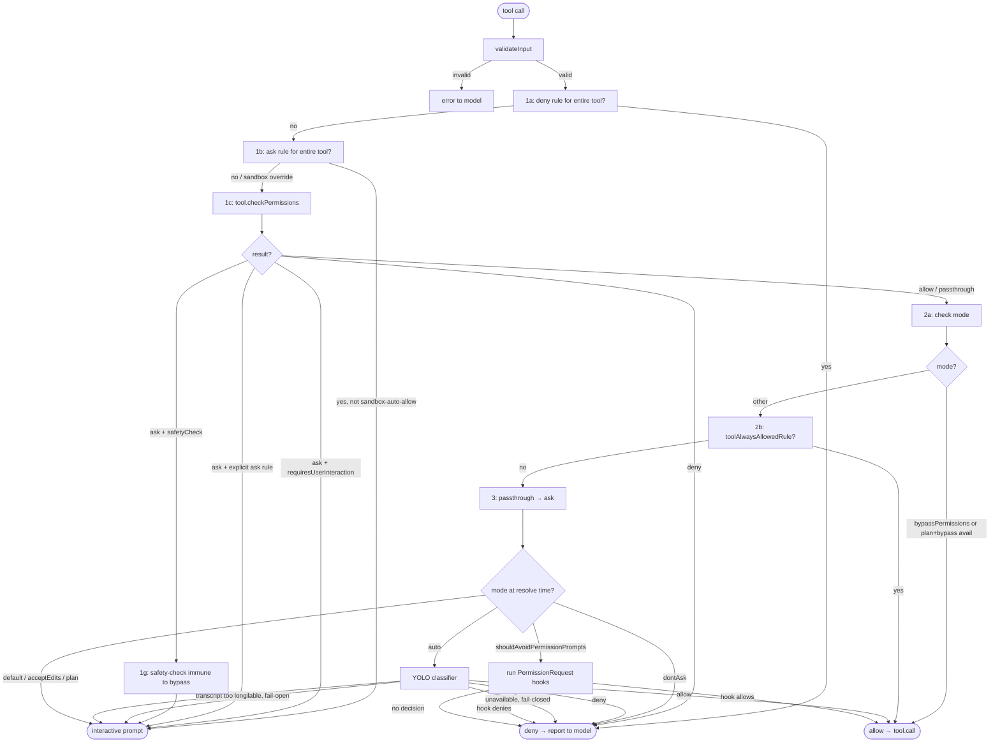

# Permission System

## Purpose

The permission system governs every tool call: it decides whether a call is allowed automatically, requires user confirmation, or is denied outright. The design separates static rule evaluation (cheap, synchronous) from interactive and ML-classifier paths (expensive, async) so the common fast path — a pre-approved rule or bypass mode — returns immediately without touching the UI or making API requests.

---

## Permission Modes

There are five user-addressable modes and two internal-only modes.

| Mode | Behavior |
|---|---|
| `default` | Interactive. Prompts the user for each new tool/pattern not covered by an explicit allow rule. |
| `acceptEdits` | Auto-approves file edits within the working directory; everything else prompts. |
| `bypassPermissions` | Skips all permission checks except deny rules, explicit ask rules, and safety-check paths. Intended for fully trusted, sandboxed contexts. |
| `dontAsk` | Converts every `ask` decision to `deny`. The model can only use tools already explicitly allowed. |
| `plan` | Read-only planning phase. When the user entered plan mode from `bypassPermissions`, `isBypassPermissionsModeAvailable` is set so the original mode can be restored on exit. |
| `auto` *(internal, TRANSCRIPT_CLASSIFIER flag)* | ML classifier path. The YOLO classifier evaluates each `ask` decision and either auto-approves or blocks without prompting. |
| `bubble` *(internal)* | Coordinator sub-mode; bubbles permission decisions up to the parent agent. |

---

## `ToolPermissionContext`

The immutable context object threaded through every permission check. Constructed once per session and updated via `applyPermissionUpdate`.

```
ToolPermissionContext
  mode: PermissionMode
  additionalWorkingDirectories: ReadonlyMap<string, AdditionalWorkingDirectory>
  alwaysAllowRules: ToolPermissionRulesBySource
  alwaysDenyRules: ToolPermissionRulesBySource
  alwaysAskRules: ToolPermissionRulesBySource
  isBypassPermissionsModeAvailable: boolean
  isAutoModeAvailable?: boolean
  strippedDangerousRules?: ToolPermissionRulesBySource
  shouldAvoidPermissionPrompts?: boolean
  awaitAutomatedChecksBeforeDialog?: boolean
  prePlanMode?: PermissionMode
```

| Field | Description |
|---|---|
| `mode` | Active permission mode |
| `additionalWorkingDirectories` | Paths beyond cwd where file operations are permitted without prompting |
| `alwaysAllowRules` | Pre-approved patterns keyed by source; e.g., `Bash(git *)` from `projectSettings` |
| `alwaysDenyRules` | Blanket denies; e.g., `Bash(rm -rf /)` — these fire before any other check |
| `alwaysAskRules` | Patterns that always prompt regardless of allow rules |
| `isBypassPermissionsModeAvailable` | True when the session started in bypass mode; allows plan mode to restore it |
| `strippedDangerousRules` | Allow rules that were removed for being overly broad (audit trail) |
| `shouldAvoidPermissionPrompts` | True for background/headless agents that cannot show UI; `ask` auto-denies after hooks run |
| `awaitAutomatedChecksBeforeDialog` | True for coordinator workers: classifier runs before the permission dialog appears |
| `prePlanMode` | Saved mode before model-initiated plan mode entry |

### `ToolPermissionRulesBySource`

Rules are stored bucketed by source so the system knows where each rule came from and where to persist changes.

```
ToolPermissionRulesBySource = {
  [source in PermissionRuleSource]?: string[]
}
```

Sources: `userSettings`, `projectSettings`, `localSettings`, `flagSettings`, `policySettings`, `cliArg`, `command`, `session`.

Priority (highest to lowest for conflict resolution): `policySettings` → `flagSettings` → `cliArg` → `userSettings` → `projectSettings` → `localSettings` → `command` → `session`.

---

## `PermissionResult`

The union returned by `checkPermissions` and `hasPermissionsToUseTool`.

| Behavior | Meaning |
|---|---|
| `allow` | Proceed. May include `updatedInput` with a sanitized/modified input and a `decisionReason`. |
| `deny` | Block. Includes a `message` reported back to the model and a `decisionReason`. |
| `ask` | Prompt the user (or classifier). Includes `message`, optional `suggestions` for one-click rules, and optional `pendingClassifierCheck` for async pre-evaluation. |
| `passthrough` | Tool-level no-opinion; converted to `ask` by `hasPermissionsToUseTool`. |

`PermissionDecisionReason` records why a decision was made. Types include `rule`, `mode`, `classifier`, `hook`, `safetyCheck`, `workingDir`, `asyncAgent`, `sandboxOverride`, `subcommandResults`, and `other`.

---

## Permission Check Flow



### Steps in plain terms

**Steps 1a–1g** are rule-based and synchronous. They run before any mode check and before bypass mode is consulted, so deny rules and explicit ask rules cannot be overridden by `bypassPermissions`.

- **1a**: Blanket deny rule for the tool name → immediate deny.
- **1b**: Blanket ask rule for the tool name → ask (unless the Bash sandbox can auto-allow it).
- **1c**: `tool.checkPermissions()` — tool-specific logic evaluates the actual input (e.g., Bash subcommand matching, file path checks).
- **1d**: Tool returned deny → deny.
- **1e**: Tool requires user interaction even in bypass mode → respect its ask.
- **1f**: Tool returned ask from an explicit ask rule (not just "no opinion") → respect the rule even in bypass mode.
- **1g**: Safety-check paths (`.git/`, `.claude/`, shell configs) → bypass-immune; always prompt.

**Step 2a**: If no rule objected, check `bypassPermissions` mode (or plan mode inheriting bypass). Allow immediately.

**Step 2b**: Check the allow-rules table. If the entire tool is allowed, allow immediately.

**Step 3**: Tool returned passthrough → convert to ask. Then apply mode-based resolution:
- `dontAsk` → deny.
- `auto` → YOLO ML classifier decides.
- `shouldAvoidPermissionPrompts` → run `PermissionRequest` hooks, then auto-deny if no hook acts.
- `default` / `acceptEdits` / `plan` → show interactive permission prompt.

---

## Auto Mode (YOLO Classifier)

When `mode = 'auto'` (feature flag `TRANSCRIPT_CLASSIFIER`), the classifier path runs before the UI is shown. Two fast paths skip the expensive classifier API call:

1. **`acceptEdits` fast path**: re-evaluate the tool's `checkPermissions` as if mode were `acceptEdits`. If it would allow (e.g., a file edit in the working directory), skip the classifier.
2. **Safe-tool allowlist**: tools on the `isAutoModeAllowlistedTool` list are auto-approved without a classifier call.

If neither fast path fires, `classifyYoloAction` makes an API call with the conversation transcript. The classifier returns `{ shouldBlock, reason, model, usage }`. A two-stage approach is used for high-stakes decisions (stage 1: fast, stage 2: extended thinking).

**Denial tracking**: consecutive and total denial counts are tracked in `DenialTrackingState`. When a threshold is exceeded (`DENIAL_LIMITS`), the system falls back to interactive prompting so the user can review the blocked transcript. In headless mode (`shouldAvoidPermissionPrompts`), exceeding the limit throws `AbortError` to stop the agent.

**Fail modes**:
- Classifier unavailable + `tengu_iron_gate_closed` flag: deny.
- Classifier unavailable + flag off: fall back to normal prompting (fail open).
- Transcript too long: fall back to normal prompting (deterministic error, no retry benefit).

---

## Protected Files and Directories

`utils/permissions/filesystem.ts` defines the files and directories that trigger a `safetyCheck` ask result. These are bypass-immune (step 1g) and cannot be automatically edited regardless of mode.

**Protected files** (DANGEROUS_FILES):
`.gitconfig`, `.gitmodules`, `.bashrc`, `.bash_profile`, `.zshrc`, `.zprofile`, `.profile`, `.ripgreprc`, `.mcp.json`, `.claude.json`

**Protected directories** (DANGEROUS_DIRECTORIES):
`.git`, `.vscode`, `.idea`, `.claude`

When a file edit targets one of these paths, `checkPathSafetyForAutoEdit` returns `{ behavior: 'ask', decisionReason: { type: 'safetyCheck', classifierApprovable: boolean } }`. The `classifierApprovable` flag controls whether auto mode can delegate to the classifier (true for sensitive-file paths like `.claude/`) or must always prompt (false for Windows UNC path bypass attempts and cross-machine bridge messages).

---

## `canUseTool` Function

`CanUseToolFn` is the callable passed to every `tool.call()` invocation. Its signature:

```typescript
type CanUseToolFn = (
  tool: Tool,
  input: Input,
  toolUseContext: ToolUseContext,
  assistantMessage: AssistantMessage,
  toolUseID: string,
  forceDecision?: PermissionDecision,
) => Promise<PermissionDecision>
```

In the REPL, `useCanUseTool` creates this function. It calls `hasPermissionsToUseTool` (the full pipeline above), then dispatches to one of three handlers based on the agent context:

- `handleInteractivePermission` — shows the `PermissionRequest` UI component and waits for the user's choice.
- `handleCoordinatorPermission` — bubbles the decision request up to the coordinator agent.
- `handleSwarmWorkerPermission` — handles swarm worker permission escalation.

In `QueryEngine` (SDK / non-interactive mode), the `canUseTool` wrapper collects `SDKPermissionDenial[]` entries so they can be attached to the final result message for SDK consumers.

---

## Rule Sources and Persistence

Rules can be added from multiple sources. Persistence depends on source:

| Source | Persisted | Editable |
|---|---|---|
| `userSettings` | `~/.claude/settings.json` | Yes |
| `projectSettings` | `.claude/settings.json` | Yes |
| `localSettings` | `.claude/settings.local.json` | Yes |
| `policySettings` | Managed policy file | Read-only |
| `flagSettings` | CLI / env flags | Read-only |
| `cliArg` | `--allowedTools` flag | In-memory |
| `command` | `/allowed-tools` slash command | In-memory |
| `session` | Granted during session | In-memory |

`applyPermissionUpdate` and `persistPermissionUpdates` handle in-memory and on-disk mutations respectively. `syncPermissionRulesFromDisk` replaces disk-sourced rules atomically (clears all disk sources before re-applying) to ensure removed rules don't persist as stale entries.

---

## Sources

- `~/git/claude-code/Tool.ts` — `ToolPermissionContext` type
- `~/git/claude-code/types/permissions.ts` — all permission types
- `~/git/claude-code/utils/permissions/permissions.ts` — `hasPermissionsToUseTool`, full pipeline
- `~/git/claude-code/utils/permissions/filesystem.ts` — protected files and directories
- `~/git/claude-code/hooks/useCanUseTool.tsx` — `CanUseToolFn` and REPL integration
