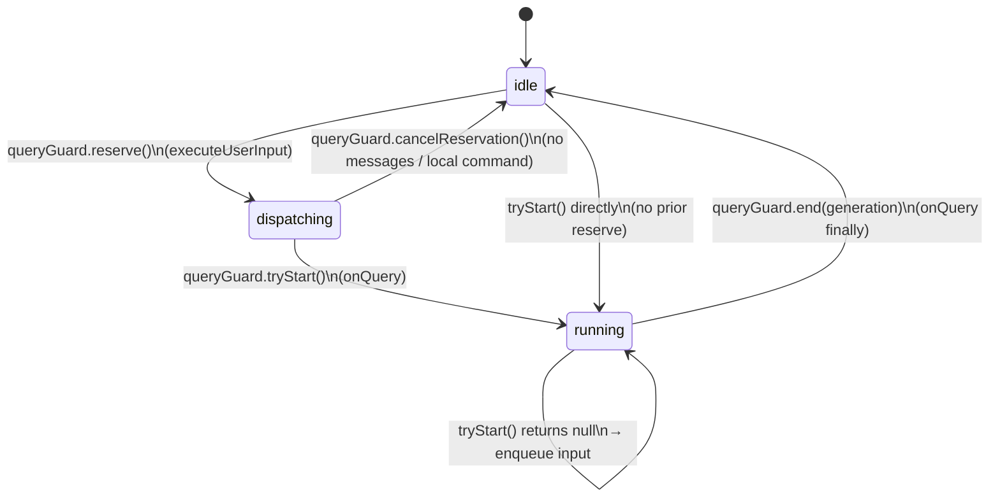
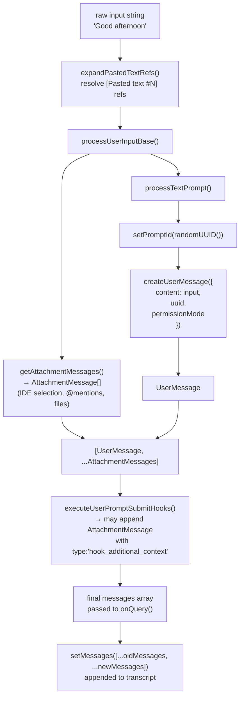
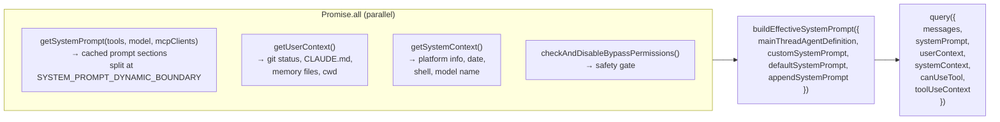
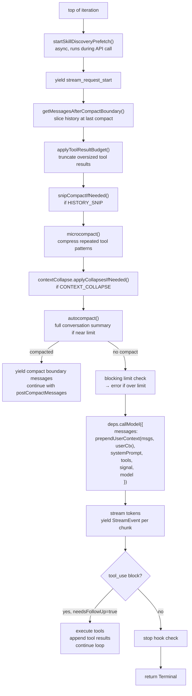
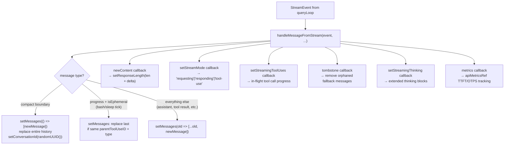

# Prompt Submission Flow — "Good afternoon" → displayed answer

End-to-end walkthrough of what happens when a user types a plain text prompt and presses Enter, from the TUI input handler through the Anthropic API and back to the rendered transcript.

---

## Layer Map

```
┌─────────────────────────────────────────────────────────────────┐
│  TUI Layer       REPL.tsx                                       │
│                  onSubmit → onQuery → onQueryImpl → onQueryEvent│
├─────────────────────────────────────────────────────────────────┤
│  Input Layer     handlePromptSubmit.ts                          │
│                  handlePromptSubmit → executeUserInput          │
├─────────────────────────────────────────────────────────────────┤
│  Message Layer   processUserInput/                              │
│                  processUserInput → processUserInputBase        │
│                  → processTextPrompt                            │
│                  → executeUserPromptSubmitHooks                 │
├─────────────────────────────────────────────────────────────────┤
│  Query Layer     query.ts                                       │
│                  query → queryLoop → callModel (streaming)      │
├─────────────────────────────────────────────────────────────────┤
│  API Layer       services/api/                                  │
│                  Anthropic SDK streaming HTTP                   │
└─────────────────────────────────────────────────────────────────┘
```

---

## Full Sequence Diagram

```mermaid
sequenceDiagram
    actor User
    participant PromptInput
    participant onSubmit as onSubmit<br/>(REPL.tsx:3142)
    participant hPS as handlePromptSubmit<br/>(handlePromptSubmit.ts:120)
    participant eUI as executeUserInput<br/>(handlePromptSubmit.ts:396)
    participant rwW as runWithWorkload<br/>(workloadContext.ts)
    participant pUI as processUserInput<br/>(processUserInput.ts:85)
    participant pUIB as processUserInputBase<br/>(processUserInput.ts:281)
    participant pTP as processTextPrompt<br/>(processTextPrompt.ts:19)
    participant hooks as executeUserPromptSubmitHooks<br/>(hooks.ts)
    participant onQuery as onQuery<br/>(REPL.tsx:2855)
    participant onQImpl as onQueryImpl<br/>(REPL.tsx:2661)
    participant queryFn as query()<br/>(query.ts:219)
    participant qLoop as queryLoop()<br/>(query.ts:241)
    participant API as Anthropic API
    participant onQE as onQueryEvent<br/>(REPL.tsx:2584)
    participant Messages as <Messages><br/>(transcript UI)

    User->>PromptInput: types "Good afternoon" + Enter
    PromptInput->>onSubmit: onSubmit(input, helpers)

    Note over onSubmit: repinScroll()<br/>resume proactive if paused<br/>not slash cmd → skip immediate path<br/>add to history<br/>clear input field<br/>setUserInputOnProcessing(input)<br/>resetTimingRefs()<br/>await awaitPendingHooks()

    onSubmit->>hPS: handlePromptSubmit({input, commands, onQuery, ...})

    Note over hPS: filter orphaned image refs<br/>expandPastedTextRefs()<br/>not exit/quit cmd<br/>not immediate cmd<br/>queryGuard not active → not queued<br/>startQueryProfile()<br/>wrap in QueuedCommand

    hPS->>eUI: executeUserInput({queuedCommands:[cmd], ...})

    Note over eUI: createAbortController()<br/>setAbortController(controller)<br/>queryGuard.reserve()

    eUI->>rwW: runWithWorkload(turnWorkload, callback)

    Note over rwW: sets AsyncLocalStorage context<br/>for workload propagation across<br/>void-detached bg agents

    rwW->>pUI: processUserInput({input, mode:'prompt', context, ...})

    Note over pUI: setUserInputOnProcessing(input)<br/>queryCheckpoint('process_user_input_base_start')

    pUI->>pUIB: processUserInputBase(input, mode, ...)

    Note over pUIB: no images → skip image resize<br/>getAttachmentMessages() → IDE selection,<br/>@mentions, file attachments<br/>not bash mode → skip processBashCommand<br/>not slash cmd → skip processSlashCommand<br/>not ultraplan keyword

    pUIB->>pTP: processTextPrompt(input, [], [], attachmentMessages, uuid, ...)

    Note over pTP: setPromptId(randomUUID())<br/>startInteractionSpan(text)<br/>logOTelEvent('user_prompt')<br/>matchesNegativeKeyword() → false<br/>logEvent('tengu_input_prompt')<br/>createUserMessage({content: input})

    pTP-->>pUIB: {messages:[UserMessage, ...attachmentMsgs], shouldQuery:true}
    pUIB-->>pUI: {messages:[UserMessage], shouldQuery:true}

    Note over pUI: shouldQuery=true → run hooks<br/>queryCheckpoint('hooks_start')

    pUI->>hooks: for await hookResult of executeUserPromptSubmitHooks(input, mode, context)

    Note over hooks: runs UserPromptSubmit hooks<br/>plain text → no blocking hooks<br/>may append additionalContexts

    hooks-->>pUI: (no blocking, no additional context)

    Note over pUI: queryCheckpoint('hooks_end')

    pUI-->>rwW: {messages:[UserMessage], shouldQuery:true}

    Note over rwW: (back in executeUserInput callback)<br/>file history snapshot if enabled<br/>setToolJSX(null, clearLocalJSX:true)<br/>resetHistory()

    rwW->>onQuery: onQuery(newMessages, abortController, shouldQuery=true, [], model)

    Note over onQuery: queryGuard.tryStart() → thisGeneration<br/>resetTimingRefs()<br/>setMessages([...old, UserMessage]) ← transcript append<br/>apiMetricsRef.current = []<br/>setStreamingToolUses([])<br/>setStreamingText(null)<br/>await mrOnBeforeQuery(input, messages)<br/>await onBeforeQueryCallback if set

    onQuery->>onQImpl: onQueryImpl(allMessages, newMessages, controller, true, [], model)

    Note over onQImpl: closeOpenDiffs(ideClient)<br/>maybeMarkProjectOnboardingComplete()<br/>generateSessionTitle() (Haiku, async)<br/>update alwaysAllowRules in store<br/>shouldQuery=true → proceed<br/>getToolUseContext(messages, newMessages, controller, model)

    Note over onQImpl: queryCheckpoint('context_loading_start')<br/>Promise.all:<br/>  checkAndDisableBypassPermissionsIfNeeded()<br/>  getSystemPrompt(tools, model, mcpClients)<br/>  getUserContext()<br/>  getSystemContext()<br/>queryCheckpoint('context_loading_end')<br/>buildEffectiveSystemPrompt({...})<br/>toolUseContext.renderedSystemPrompt = systemPrompt

    Note over onQImpl: queryCheckpoint('query_start')<br/>resetTurnHookDuration()<br/>resetTurnToolDuration()

    onQImpl->>queryFn: for await event of query({messages, systemPrompt, userContext, ...})

    queryFn->>qLoop: yield* queryLoop(params, consumedCommandUuids)

    Note over qLoop: initialize state, budgetTracker<br/>startRelevantMemoryPrefetch()<br/>enter while(true) loop

    Note over qLoop: iteration 1:<br/>startSkillDiscoveryPrefetch()<br/>yield {type:'stream_request_start'}<br/>getMessagesAfterCompactBoundary()<br/>applyToolResultBudget()<br/>snip if HISTORY_SNIP<br/>microcompact()<br/>contextCollapse if enabled<br/>autocompact() → no-op (first turn, small context)<br/>token blocking limit check → OK

    qLoop->>API: deps.callModel({messages, systemPrompt, tools, signal, model, ...})

    Note over API: streams response tokens

    loop streaming tokens
        API-->>qLoop: stream event (text delta / tool_use / end)
        qLoop-->>onQImpl: yield StreamEvent
        onQImpl->>onQE: onQueryEvent(event)

        Note over onQE: handleMessageFromStream(event,<br/>  newMessage callback,<br/>  newContent callback,<br/>  setStreamMode,<br/>  setStreamingToolUses,<br/>  tombstone callback,<br/>  setStreamingThinking,<br/>  metrics callback<br/>)

        alt text delta
            onQE->>Messages: setMessages([...old, AssistantMessage])
            onQE->>Messages: setResponseLength(len + delta.length)
        else tool_use block
            onQE->>Messages: setStreamingToolUses([...])
            onQE->>Messages: setStreamMode('tool-use')
        else thinking block
            onQE->>Messages: setStreamingThinking({...})
        end
    end

    Note over qLoop: needsFollowUp = false (plain text, no tool use)<br/>stop hook check → none active<br/>return {reason:'end_turn'}

    qLoop-->>queryFn: Terminal {reason:'end_turn'}
    queryFn-->>onQImpl: (generator exhausted)

    Note over onQImpl: queryCheckpoint('query_end')<br/>resetLoadingState()<br/>logQueryProfileReport()<br/>onTurnComplete?.(messages)

    onQImpl-->>onQuery: (returns)

    Note over onQuery: finally block:<br/>queryGuard.end(thisGeneration)<br/>setLastQueryCompletionTime()<br/>resetLoadingState()<br/>mrOnTurnComplete(messages, aborted)<br/>sendBridgeResultRef.current()

    onQuery-->>eUI: (returns)
    eUI-->>hPS: (returns)
    hPS-->>onSubmit: (returns)

    Note over onSubmit: deferred stash restore if needed

    Messages->>User: renders assistant response in transcript
```



---

## QueryGuard State Machine

`QueryGuard` (`utils/QueryGuard.js`) ensures only one query runs at a time. Input arriving during a running query is enqueued rather than dropped.



States:
- **idle** — no query active, input accepted immediately
- **dispatching** — `reserve()` called by `executeUserInput` while processing input; concurrent `handlePromptSubmit` calls see `isActive=true` and queue
- **running** — `tryStart()` called by `onQuery`; guard blocks new queries

---

## Message Construction Pipeline



---

## Context Assembly in `onQueryImpl`

Before calling `query()`, `onQueryImpl` assembles the full context in parallel:



---

## `queryLoop` Per-Iteration Pipeline

Each iteration of the `while(true)` loop in `queryLoop` runs this pipeline before calling the API:



---

## `onQueryEvent` — Stream Event → UI State



---

## Key Data Structures

### `QueuedCommand`
```ts
{
  value: string | ContentBlockParam[]  // expanded input text
  preExpansionValue?: string           // raw input before [Pasted text #N] expansion
  mode: PromptInputMode                // 'prompt' | 'bash' | 'task-notification'
  pastedContents?: Record<number, PastedContent>  // images/text pastes
  uuid?: string                        // for dedup / lifecycle tracking
  skipSlashCommands?: boolean          // true for remote bridge messages
  bridgeOrigin?: boolean               // true if from mobile/web client
  isMeta?: boolean                     // user-hidden, model-visible
  workload?: string                    // ALS tag for background prioritization
  origin?: MessageOrigin               // stamped by executeUserInput post-return
}
```

### `ProcessUserInputBaseResult`
```ts
{
  messages: (UserMessage | AssistantMessage | AttachmentMessage | SystemMessage | ProgressMessage)[]
  shouldQuery: boolean          // false for local-only commands
  allowedTools?: string[]       // skill frontmatter tool restriction
  model?: string                // skill model override
  effort?: EffortValue          // extended thinking effort level
  resultText?: string           // output for -p headless mode
  nextInput?: string            // chain to next command (e.g. /discover)
  submitNextInput?: boolean
}
```

### `UserMessage` (created by `processTextPrompt`)
```ts
{
  type: 'user'
  message: { role: 'user', content: string | ContentBlockParam[] }
  uuid: string
  promptId: string               // set via setPromptId() for OTel tracing
  permissionMode?: PermissionMode
  isMeta?: boolean
  origin?: MessageOrigin
  imagePasteIds?: number[]
}
```

---

## Timing / Profiling Checkpoints

`queryCheckpoint()` (from `utils/queryProfiler.ts`) stamps named milestones. These are logged via `logQueryProfileReport()` at turn end when profiling is enabled.

| Checkpoint | Location |
|---|---|
| `query_process_user_input_base_start` | entry of `processUserInput` |
| `query_image_processing_start/end` | image resize in `processUserInputBase` |
| `query_pasted_image_processing_start/end` | pasted image resize |
| `query_attachment_loading_start/end` | `getAttachmentMessages` |
| `query_process_user_input_base_end` | exit of `processUserInputBase` |
| `query_hooks_start/end` | `executeUserPromptSubmitHooks` |
| `query_process_user_input_start/end` | `executeUserInput` loop |
| `query_file_history_snapshot_start/end` | file history snapshot |
| `query_context_loading_start/end` | `getSystemPrompt` + user/system context |
| `query_query_start` | entry of `for await query()` |
| `query_fn_entry` | top of each `queryLoop` iteration |
| `query_snip_start/end` | history snip |
| `query_microcompact_start/end` | microcompact |
| `query_autocompact_start/end` | autocompact |
| `query_api_loop_start` | token blocking limit check |
| `query_api_streaming_start` | `callModel` stream start |
| `query_end` | generator exhausted |
