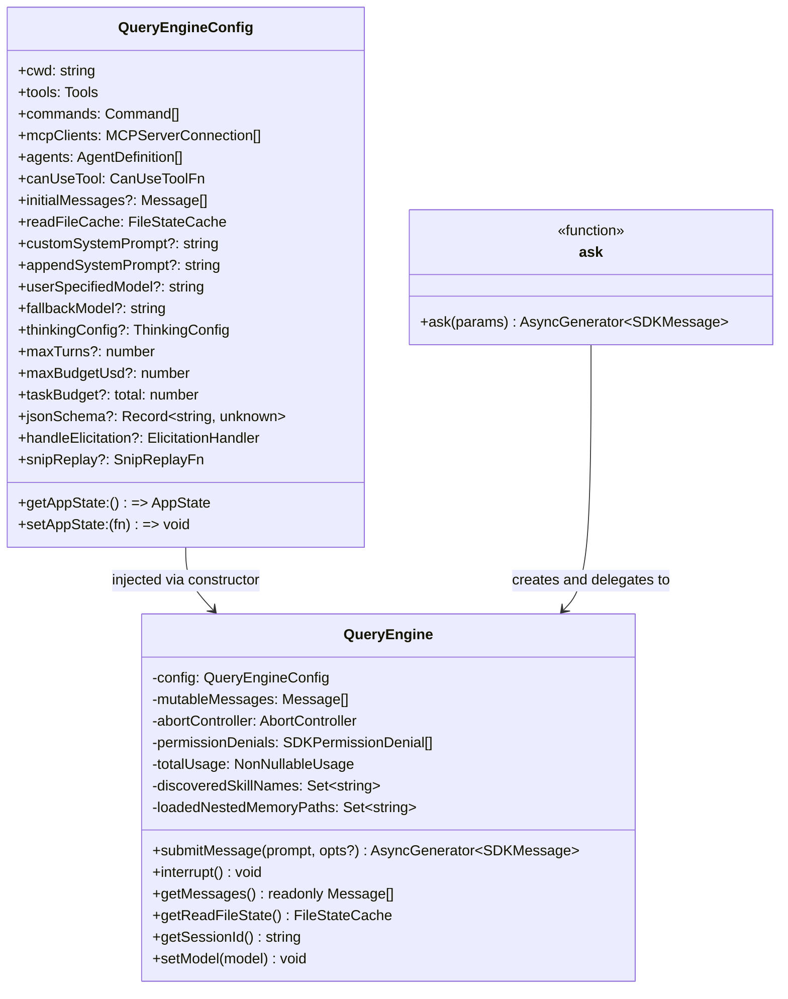
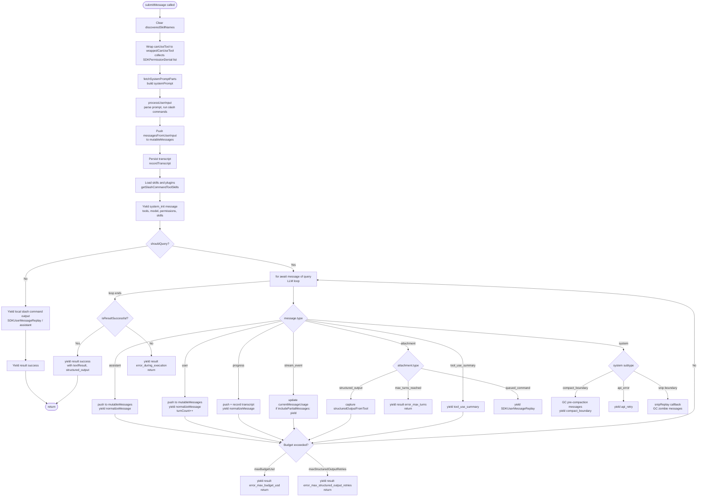
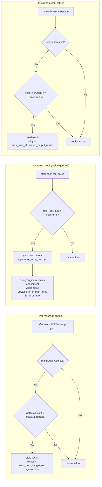

# QueryEngine

Source: `QueryEngine.ts`

---

## Purpose

`QueryEngine` owns the query lifecycle and session state for a single conversation. One instance is created per conversation. State — messages, file cache, usage totals, permission denials — persists across `submitMessage()` calls, making multi-turn SDK sessions straightforward.

Both the headless/SDK path (`ask()`) and the REPL use `QueryEngine`. The REPL keeps full history for UI scrollback; the SDK path may GC pre-compaction messages when `snipReplay` fires.

---

## Class Overview



---

## `submitMessage()` Pipeline



---

## Budget Control



---

## Permission Denial Tracking

`wrappedCanUseTool` wraps the caller-supplied `canUseTool` function. Every call whose result is not `allow` appends an `SDKPermissionDenial` record to `this.permissionDenials`. The full list is attached to every `result` message so SDK callers know which tools were blocked during the session.

```
wrappedCanUseTool(tool, input, ctx, assistantMsg, toolUseID, forceDecision)
  → calls canUseTool(...)
  → if result.behavior !== 'allow':
      permissionDenials.push({ tool_name, tool_use_id, tool_input })
  → return result
```

---

## `ask()` — Convenience Wrapper

`ask()` is a one-shot generator that creates a `QueryEngine`, calls `submitMessage()` once, and returns the engine's read-file state to the caller when done.

When the `HISTORY_SNIP` feature flag is compiled in, `ask()` injects a `snipReplay` callback. On each `compact_boundary` system message, this callback invokes `snipCompactIfNeeded()` and replaces `mutableMessages` with the snipped result — bounding memory in long headless sessions without affecting the REPL (which projects its own view via `projectSnippedView`).

```
ask(params):
  engine = new QueryEngine({
    ...params,
    snipReplay: (yieldedMsg, store) => {
      if (!isSnipBoundaryMessage(yieldedMsg)) return undefined
      return snipCompactIfNeeded(store, { force: true })
    }
  })
  yield* engine.submitMessage(prompt, { uuid, isMeta })
  setReadFileCache(engine.getReadFileState())
```

---

## SDKMessage Types

Messages yielded by `submitMessage()`:

| type | subtype | When |
|---|---|---|
| `system` | _(init)_ | Once per `submitMessage()` call; carries tools, model, permissions, skills |
| `user` | — | User message replay (when `replayUserMessages`) |
| `assistant` | — | Each assistant content block |
| `progress` | — | Tool-execution progress events |
| `stream_event` | — | Raw API stream events (only if `includePartialMessages`) |
| `attachment` | — | File snapshots, memory attachments, queued commands |
| `tool_use_summary` | — | Haiku-generated summary of a tool batch |
| `system` | `compact_boundary` | Context-window compaction completed |
| `system` | `api_retry` | Retryable API error; includes attempt/delay metadata |
| `result` | `success` | Turn completed normally |
| `result` | `error_max_turns` | `maxTurns` reached |
| `result` | `error_max_budget_usd` | `maxBudgetUsd` exceeded |
| `result` | `error_max_structured_output_retries` | Structured-output retry limit hit |
| `result` | `error_during_execution` | Unexpected terminal state (includes diagnostic errors[]) |

All `result` messages include: `duration_ms`, `duration_api_ms`, `num_turns`, `stop_reason`, `session_id`, `total_cost_usd`, `usage`, `modelUsage`, `permission_denials`, `fast_mode_state`.
