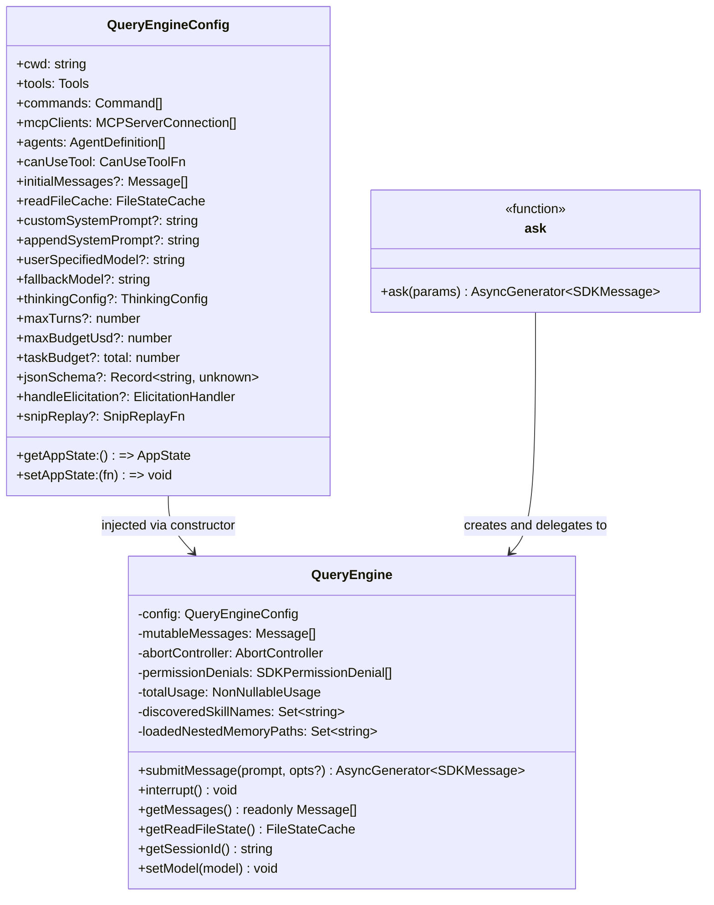
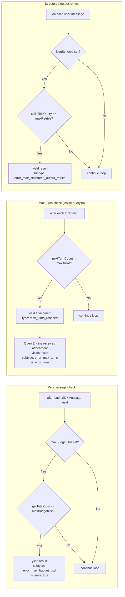

# QueryEngine

Source: `QueryEngine.ts`

---

## Purpose

`QueryEngine` owns the headless/SDK query lifecycle and session state for a
single conversation. One instance is created per conversation. State — messages,
file cache, usage totals, permission denials — persists across `submitMessage()`
calls, making multi-turn SDK sessions straightforward.

`QueryEngine` is a coordinator, not the low-level model/API loop or the storage
implementation. It assembles turn inputs, processes slash commands and
attachments, keeps the mutable internal message store, calls `query()` in
`query.ts`, reacts to each yielded query event, emits SDK-facing messages, and
asks `utils/sessionStorage.ts` to persist transcript state. `query.ts` owns the
underlying agent loop: model streaming, tool dispatch, follow-up turns,
compaction triggers, and API retry behavior.

The SDK path may GC pre-compaction messages when `snipReplay` fires. Interactive
REPL mode owns its UI scrollback separately and calls `query()` directly rather
than using `QueryEngine`.

```text
QueryEngine.submitMessage()
  -> build system/user context
  -> process user input and slash commands
  -> append user input and attachments to mutableMessages
  -> persist via recordTranscript()
  -> yield SDK init/status events
  -> call query() in query.ts
  -> consume assistant/user/system/attachment/progress events
  -> update mutableMessages, usage, turns, and permission denials
  -> normalize internal messages into SDKMessage events
  -> handle compact, snip, max-turn, budget, and final result cases
```

---

## Class Overview




---

## `submitMessage()` source-order walkthrough (`QueryEngine.ts:209-1156`)

`submitMessage()` is one headless/SDK user turn. It is an async generator with
three simultaneous responsibilities:

- update the `QueryEngine` instance state that survives into later turns;
- drive one `query()` invocation and translate its internal event protocol;
- yield the public SDK event stream, ending with exactly one `result` event on
  every normal terminal branch.

The caller does not send values back through `next(value)`. It advances the
generator to receive events. Awaiting a yielded SDK event therefore applies
backpressure to `submitMessage()`, which in turn can delay consumption of the
underlying `query()` generator.

### State scopes

The method combines instance state, turn-local state, and configuration
snapshots. Keeping those scopes separate explains which values accumulate
across calls and which reset for each submission.

| Scope | Values | Lifecycle |
| --- | --- | --- |
| Engine instance | `mutableMessages`, `totalUsage`, `permissionDenials`, `readFileState`, `loadedNestedMemoryPaths` | Created in the constructor and retained across `submitMessage()` calls. |
| Reset at turn entry | `discoveredSkillNames` | Cleared before processing each new prompt. |
| Turn-local snapshot | `initialAppState`, initial model/thinking configuration, `persistSession`, `startTime` | Fixed during this call even if selected app-state fields later change. |
| Query-event accumulators | `messages`, `currentMessageUsage`, `turnCount`, `lastStopReason`, `structuredOutputFromTool`, error watermark | Created after input processing and discarded after the terminal `result`. |

`permissionDenials` and `totalUsage` are intentionally not cleared at turn
entry. Result messages therefore report the engine's accumulated session view,
whereas `turnCount` and the structured-output retry delta describe this one
submission.

### End-to-end sequence

The sequence stays at the `submitMessage()` boundary. Model streaming, tool
execution, compaction selection, and query-loop recovery are expanded in
[query-loop-internals.md](./query-loop-internals.md).

```mermaid
sequenceDiagram
    autonumber
    actor Caller as SDK / cli/print caller
    participant QE as QueryEngine.submitMessage
    participant Ctx as Prompt and context loaders
    participant Input as processUserInput
    participant Catalog as Skills and plugin cache
    participant Store as sessionStorage
    participant Q as query()

    Caller->>QE: Start generator with prompt and optional uuid/isMeta
    QE->>QE: Clear turn skill discoveries, set cwd, snapshot config and time
    QE->>QE: Create wrappedCanUseTool that records every non-allow decision
    QE->>Ctx: fetchSystemPromptParts(tools, model, directories, MCP)
    Ctx-->>QE: defaultSystemPrompt, userContext, systemContext
    opt Custom prompt plus memory-path override
        QE->>Ctx: loadMemoryPrompt()
        Ctx-->>QE: memory mechanics prompt
    end
    QE->>QE: Assemble effective system prompt
    opt Structured-output schema and synthetic output tool are present
        QE->>QE: Register structured-output enforcement hook
    end

    QE->>QE: Build mutable ProcessUserInputContext
    opt First submission with an orphaned permission
        QE->>Input: handleOrphanedPermission(...)
        Input-->>QE: Zero or more SDK messages
        QE-->>Caller: yield orphan-recovery messages
    end
    QE->>Input: processUserInput(prompt, mode=prompt, querySource=sdk)
    Input-->>QE: messages, shouldQuery, allowedTools, model, resultText
    QE->>QE: Append input messages to mutableMessages and snapshot messages

    opt Persistence enabled and input produced messages
        QE->>Store: recordTranscript(messages)
        alt Bare mode
            Note over QE,Store: Fire-and-forget&#59; query startup is not blocked
        else Normal headless mode
            Store-->>QE: Input transcript accepted
            opt Eager-flush or Cowork mode
                QE->>Store: flushSessionStorage()
            end
        end
    end

    QE->>QE: Select replay acknowledgements and update alwaysAllowRules.command
    QE->>QE: Resolve post-command model and rebuild ToolUseContext
    par Load turn catalog data
        QE->>Catalog: getSlashCommandToolSkills(cwd)
    and
        QE->>Catalog: loadAllPluginsCacheOnly()
    end
    Catalog-->>QE: skills and enabled plugins
    QE-->>Caller: yield system init event

    alt shouldQuery is false: local command completed without model execution
        loop Input messages
            QE-->>Caller: yield command output, synthetic assistant, or compact boundary
        end
        opt Persistence enabled
            QE->>Store: recordTranscript(messages)
            opt Eager-flush or Cowork mode
                QE->>Store: flushSessionStorage()
            end
        end
        QE-->>Caller: yield result(success, resultText, stop_reason=null)
        QE-->>Caller: return
    else shouldQuery is true
        opt File history enabled
            QE->>QE: Start one fire-and-forget snapshot per selectable input message
        end
        QE->>Q: query(messages, contexts, wrappedCanUseTool, limits)

        loop For each event yielded by query()
            Q-->>QE: Internal message or control event

            opt assistant, user, or compact_boundary
                opt Preserved compact tail must exist durably
                    QE->>Store: record transcript through preserved tail
                    Store-->>QE: Tail write accepted
                end
                QE->>QE: Append event to turn-local messages
                alt assistant
                    QE->>Store: recordTranscript(messages), fire-and-forget
                    Note over QE,Store: Avoids blocking the upstream stream before message_delta<br/>can finalize usage and stop_reason
                else user or compact_boundary
                    QE->>Store: recordTranscript(messages), awaited
                end
                opt First transcript-bearing response and replay enabled
                    QE-->>Caller: yield initial user-message acknowledgement(s)
                end
            end

            alt assistant
                QE->>QE: Capture synthetic stop reason and append to mutableMessages
                QE-->>Caller: yield normalized assistant block(s)
            else user tool result or continuation
                QE->>QE: Increment turnCount and append to mutableMessages
                QE-->>Caller: yield normalized user event(s)
            else progress
                QE->>QE: Append to both in-memory arrays
                QE->>Store: Start transcript dedup bookkeeping
                QE-->>Caller: yield supported normalized progress
            else stream_event
                QE->>QE: Reset/update usage&#59; capture stop_reason&#59; accumulate on message_stop
                opt includePartialMessages
                    QE-->>Caller: yield raw SDK stream_event
                end
            else attachment
                QE->>QE: Append and start transcript recording
                opt structured_output
                    QE->>QE: Save structured result payload
                end
                opt queued_command and replay enabled
                    QE-->>Caller: yield SDK user replay
                end
                opt max_turns_reached
                    QE-->>Caller: yield result(error_max_turns)
                    QE-->>Caller: return
                end
            else system
                alt snipReplay recognizes boundary
                    QE->>QE: Optionally replace mutableMessages&#59; consume boundary
                else ordinary system event
                    QE->>QE: Append to mutableMessages
                    opt compact_boundary
                        QE->>QE: Trim both in-memory arrays to boundary
                        QE-->>Caller: yield SDK compact_boundary
                    end
                    opt api_error
                        QE-->>Caller: yield SDK api_retry
                    end
                end
            else tool_use_summary
                QE-->>Caller: yield SDK tool_use_summary
            else tombstone or stream_request_start
                Note over QE: No SDK event is emitted
            end

            alt maxBudgetUsd reached
                QE-->>Caller: yield result(error_max_budget_usd)
                QE-->>Caller: return
            else Structured-output retry limit reached on a user event
                QE-->>Caller: yield result(error_max_structured_output_retries)
                QE-->>Caller: return
            end
        end

        QE->>QE: Select last assistant/user result and snapshot diagnostics
        opt Eager-flush or Cowork mode
            QE->>Store: flushSessionStorage()
        end
        alt Result shape is invalid
            QE-->>Caller: yield result(error_during_execution, turn-scoped errors)
        else Result is valid
            QE->>QE: Extract final non-synthetic text and API-error flag
            QE-->>Caller: yield result(success, usage, stop_reason, structured_output)
        end
        QE-->>Caller: return
    end
```



### 1. Enter the turn and assemble context (`QueryEngine.ts:213-333`)

The initial destructure snapshots configuration references and defaults. The
method clears only `discoveredSkillNames`, sets the process working directory,
records whether session persistence is enabled, and starts the duration clock.

`wrappedCanUseTool()` delegates to the injected authorization callback. Every
result other than `allow` appends an SDK-compatible denial record containing
the canonical tool name, tool-use ID, and submitted input. It does not alter
the authorization decision.

The initial model comes from a user-specified model when present, otherwise
from global model selection. Thinking defaults to adaptive unless explicitly
configured or disabled by the default-thinking gate. `fetchSystemPromptParts()`
then loads the default prompt, base user context, and system context using the
initial app-state permission directories. Coordinator context is merged into
the user context.

System-prompt assembly has three ordered layers:

1. caller custom prompt, or the default prompt when no custom prompt exists;
2. memory mechanics, only when a custom prompt and memory-path override both
   exist;
3. caller `appendSystemPrompt` text.

When both `jsonSchema` and the synthetic structured-output tool are available,
the method registers enforcement before processing the prompt.

### 2. Build the mutable input context (`QueryEngine.ts:335-408`)

The first `ProcessUserInputContext` is intentionally writable. Its
`setMessages(fn)` replaces `this.mutableMessages`, allowing local slash commands
such as force-snip to rewrite the engine store before the current prompt is
appended. It also carries the engine abort controller, cumulative read-file
state, memory and skill tracking sets, app-state accessors, and no-op UI
callbacks suitable for headless execution.

An injected orphaned permission is handled at most once per `QueryEngine`
instance. `hasHandledOrphanedPermission` flips before iterating the recovery
generator, preventing a later `submitMessage()` call from replaying the same
decision. Recovery SDK messages are yielded before the new prompt is processed.

### 3. Process, append, and make the input resumable (`QueryEngine.ts:410-486`)

`processUserInput()` parses the prompt as SDK input, expands attachments and
commands, and returns five values that control the rest of the method:

| Return value | Consumer |
| --- | --- |
| `messages` | Appended to `mutableMessages`, then copied into turn-local `messages`. |
| `shouldQuery` | Selects local-command early return versus `query()`. |
| `allowedTools` | Replaces `toolPermissionContext.alwaysAllowRules.command`. |
| `model` | Overrides the initial model for this turn. |
| `resultText` | Becomes the local-command success result when no query runs. |

Input transcript persistence occurs before model execution. In ordinary
headless mode, `recordTranscript(messages)` is awaited so a process killed
before the first API response can still resume from the accepted user prompt.
Eager-flush and Cowork modes additionally wait for the buffered storage queue.
Bare mode starts the same write but does not block query startup.

Replay acknowledgements exclude meta caveats, tool results, task-originated
messages, and other non-selectable input. They are not yielded immediately;
the model path waits until the first transcript-bearing query event proves that
the turn has advanced.

### 4. Rebuild execution context and emit init (`QueryEngine.ts:488-555`)

The post-command model is `modelFromUserInput ?? initialMainLoopModel`. A second
`ProcessUserInputContext` captures this model and the updated `messages`
snapshot. Its `setMessages` becomes a no-op because prompt/slash-command
mutation is finished; file-history and attribution updaters are reused from the
first context.

Skill definitions and enabled-plugin metadata load concurrently. Plugin loading
is cache-only so SDK/CCR startup does not perform a network install. The method
then yields `buildSystemInitMessage(...)` before deciding whether a model query
is required. Consequently, even a local slash command produces the standard SDK
initialization event first.

### 5. Local-command terminal path (`QueryEngine.ts:556-639`)

When `shouldQuery` is false, no `query()` generator is created. The method scans
the messages returned by `processUserInput()` and translates only supported
local results:

- user records containing local stdout/stderr, plus compact summaries, become
  `SDKUserMessageReplay` events with ANSI escapes removed;
- `system/local_command` stdout/stderr becomes a synthetic SDK assistant event
  so remote/mobile clients render assistant-style output;
- compact boundaries become SDK compact-boundary system events.

The complete local array is then recorded again to catch command-produced
messages, optionally flushed, and followed by `result/success`. Its
`stop_reason` is `null`, usage remains the engine accumulator, and `num_turns`
uses `messages.length - 1`. The generator returns immediately afterward.

### 6. Prepare the model path (`QueryEngine.ts:641-686`)

Selectable input messages start fire-and-forget file-history snapshots when
both file history and session persistence are enabled. Snapshot completion is
not a gate for the model request.

The method initializes response-local accounting:

| Value | Initial meaning |
| --- | --- |
| `currentMessageUsage = EMPTY_USAGE` | Usage for the current Anthropic response; reset again on every `message_start`. |
| `turnCount = 1` | SDK-visible agentic turn count; incremented for each yielded internal user message. |
| `hasAcknowledgedInitialMessages = false` | One-shot replay gate. |
| `structuredOutputFromTool = undefined` | Last structured-output attachment payload. |
| `lastStopReason = null` | Updated by synthetic assistant messages or raw `message_delta`. |
| `errorLogWatermark` | Reference marking the beginning of errors attributable to this submission. |
| `initialStructuredOutputCalls` | Baseline used to count schema retries introduced by this call only. |

`query()` receives the local message snapshot, assembled contexts, wrapped
permission callback, rebuilt tool context, fallback model, source `sdk`, and
turn/task limits. QueryEngine does not inspect `query()`'s returned `Terminal`;
its `for await` loop consumes yielded events, and completion is detected when
that generator ends.

### 7. Pre-dispatch persistence and replay gate (`QueryEngine.ts:687-755`)

Assistant messages, user messages, and full compact boundaries enter a common
pre-dispatch block before type-specific handling.

For a compact boundary with a `preservedSegment.tailUuid`, QueryEngine first
locates that UUID in `mutableMessages` and records the prefix through the tail.
The ordering is required because storage cannot relink a preserved segment to a
tail that was never written.

The current event is then appended to turn-local `messages`. User and compact
boundary writes are awaited. Assistant writes are fire-and-forget so
`submitMessage()` immediately requests the next `query()` event. The API layer
yields an assistant fragment at `content_block_stop`, then later processes
`message_delta`, which mutates the final fragment's usage and `stop_reason`.
Awaiting the lazy transcript write here would hold generator backpressure until
the storage drain completed and prevent the delta from being consumed first.

```text
content_block_stop
  -> QueryEngine receives AssistantMessage with provisional usage/stop_reason
  -> start recordTranscript(messages), do not await
  -> request next query() event
message_delta
  -> API layer mutates the last yielded assistant object
  -> QueryEngine independently updates currentMessageUsage and lastStopReason
storage drain
  -> serializes the queued assistant reference
```

The per-file storage queue preserves write order, but the final assistant
metadata still has a temporal coupling: persistence expects the direct object
mutation to occur before lazy serialization. QueryEngine's SDK result metadata
does not depend on that timing because the `stream_event` branch separately
reads the raw `message_delta`.

After the first transcript-bearing query event, selectable initial user
messages are replayed once when `replayUserMessages` is enabled. Finally, every
internal user event increments `turnCount` before type-specific dispatch.

### 8. Dispatch each query event (`QueryEngine.ts:757-969`)

The switch translates the internal `query()` protocol into engine state,
transcript work, and public SDK events. The common persistence block described
above has already handled assistant, user, and compact-boundary events before
this dispatch runs.

| Internal event | Engine-state effect | Persistence effect | SDK-visible effect |
| --- | --- | --- | --- |
| `tombstone` | None; it is only a removal control signal for the query loop. | None in this branch. | Suppressed. |
| `assistant` | Capture a non-null synthetic `stop_reason`; append to `mutableMessages`. | Already started by the common block. | Yield normalized assistant block(s). |
| `progress` | Append to `mutableMessages` and turn-local `messages`. | Start `recordTranscript()` so the next submission's dedup walk sees it; progress does not become a parent-chain participant or resumable transcript message. | Yield supported normalized progress. |
| `user` | Append to `mutableMessages`; `turnCount` was incremented before the switch. | Already awaited by the common block. | Yield normalized user/tool-result event(s). |
| `stream_event` | Maintain usage for the current API response and capture `stop_reason`. | None. | Yield the raw stream event only when `includePartialMessages` is enabled. |
| `attachment` | Append to both arrays; capture structured output, enforce max turns, or replay a queued command. | Start `recordTranscript()` for dedup bookkeeping. | Normally suppressed; selected attachment subtypes produce a replay or terminal result. |
| `stream_request_start` | None. | None. | Suppressed. |
| `system` | Give `snipReplay` first refusal; otherwise append the event and apply compact-boundary trimming. | Full compact boundaries were handled by the common block. | Yield only compact-boundary and API-retry events. |
| `tool_use_summary` | None. | None. | Yield a summary with its preceding tool-use IDs. |

#### Stream accounting

`currentMessageUsage` describes one Anthropic response, while
`this.totalUsage` accumulates completed responses across the engine session.
`message_start` resets the current value and incorporates initial/cache usage;
`message_delta` adds output usage and captures its terminal `stop_reason`; and
`message_stop` folds the completed current value into `this.totalUsage`.

This is independent of whether raw partial events are exposed to the caller.
The accounting branch always consumes them; `includePartialMessages` controls
only the additional SDK `stream_event` yield.

#### Compact and snip controls

`snipReplay` receives every internal system message before ordinary system
handling. A defined callback result consumes the boundary. When it reports an
executed snip, QueryEngine replaces all of `mutableMessages` with the replayed
store; when it reports no execution, the signal is still not appended.

A full `compact_boundary` follows the ordinary system path. After appending the
boundary, QueryEngine removes all earlier entries from both `mutableMessages`
and turn-local `messages`, leaving the boundary at index zero. It then yields
the SDK compact-boundary event. This aligns subsequent engine memory with the
post-compaction working set already selected inside `query()`.

#### Maximum-turn terminal

`query()` reports the maximum-turn limit as an
`attachment/max_turns_reached`. QueryEngine optionally flushes persistent
storage, yields `result/error_max_turns` using the attachment's authoritative
turn count and limit, and returns immediately. No later per-event guard or
normal final-result classification runs.

### 9. Apply per-event terminal guards (`QueryEngine.ts:971-1049`)

After every nonterminal switch branch, QueryEngine applies two submission-wide
limits in fixed order:

1. If cumulative session cost has reached `maxBudgetUsd`, optionally flush
   storage, yield `result/error_max_budget_usd`, and return.
2. On an internal user event only, compare the structured-output call counter
   with its value at submission start. If the delta reaches
   `maxStructuredOutputRetries` (environment default: five), yield
   `result/error_max_structured_output_retries` and return.

Because these checks are outside the switch, the triggering internal event can
first update engine state, start persistence, and yield its normalized SDK
event. The terminal `result` follows when the caller next advances the
generator.

### 10. Classify and emit the final result (`QueryEngine.ts:1051-1155`)

Normal exhaustion of `query()` selects the last assistant or user message and
snapshots errors logged since this submission's watermark. Eager-flush and
Cowork modes wait for storage before result classification.

A final shape is accepted when it is any of the following:

- an assistant message whose last block is text, thinking, or redacted thinking;
- a user message whose content consists entirely of tool results;
- an otherwise non-passing final assistant/user shape when the captured
  `stop_reason` is `end_turn`, covering a response with no assistant content.

Anything else yields `result/error_during_execution` with only the
turn-attributable diagnostics. On success, QueryEngine extracts text only from
the final non-synthetic assistant message, detects API-error tool results,
attaches any structured-output payload, and yields `result/success` with the
engine's cumulative usage, cost, permission denials, captured stop reason, and
this submission's `turnCount`. The method then returns.

### Queued commands

`queued_command` has two different paths, depending on whether the queue is
drained outside QueryEngine or inside an already-running `query()` loop.

**Outer queue drain.** In headless / SDK streaming mode, `cli/print.ts` owns the
outer command queue. After a query finishes, `drainCommandQueue()` dequeues
pending commands, batches compatible prompt-mode commands, and calls `ask()`.
`ask()` creates a QueryEngine and calls `submitMessage(prompt, { uuid, isMeta })`.
From QueryEngine's perspective this is just the next normal top-level prompt:
`processUserInput()` creates user messages, QueryEngine appends them to
`mutableMessages`, snapshots `messages`, persists the transcript, and starts a
fresh `query()` call (`cli/print.ts:1930-1962`,
`QueryEngine.ts:1186-1292`, `QueryEngine.ts:410-434`).

```text
cli/print.ts drainCommandQueue()
  -> dequeue command
  -> ask({ prompt: command.value, promptUuid: command.uuid, isMeta })
  -> QueryEngine.submitMessage(prompt)
  -> processUserInput() creates normal user message(s)
  -> query() starts a fresh LLM loop
```

This path does **not** create an `attachment/queued_command` message.

**Mid-turn queue drain.** If `query()` is already running and the model produced
tool calls, the loop reaches a safe checkpoint after tool execution. At that
point `query.ts` snapshots pending queue entries, excludes slash commands, scopes
the entries to the main thread or current subagent, and passes them to
`getAttachmentMessages()`. `getQueuedCommandAttachments()` converts prompt and
task-notification entries into `attachment/queued_command` messages. `query.ts`
yields those attachments and pushes them into `toolResults`, so the next
recursive model call inside the same `query()` loop sees them alongside the tool
results (`query.ts:1547-1590`, `utils/attachments.ts:1044-1083`,
`query.ts:1714-1728`).

```text
query() API call returns assistant tool_use
  -> run tools
  -> query.ts drains eligible queued commands
  -> getQueuedCommandAttachments()
  -> yield attachment { type: 'queued_command', prompt, ... }
  -> push attachment into toolResults
  -> next recursive API call includes it in context
```

So `queued_command` means "async prompt/notification delivered mid-turn." If the
current query has already ended, the outer queue processor turns the same pending
input into a normal next prompt instead.

---

## Message State Layers

QueryEngine works with three related but deliberately different message
representations. They often contain the same conversation facts, but they do not
have the same lifetime, filtering, or persistence responsibilities.

| Layer | Scope | Main use | Source handle |
| --- | --- | --- | --- |
| `messages` | Per `submitMessage()` call / per `query()` invocation | Working input for `query()` and transcript-write buffer for yielded assistant/user/compact messages | `QueryEngine.ts:433-435`, `QueryEngine.ts:675-686` |
| `mutableMessages` | Per `QueryEngine` instance | Live SDK/headless session store across `submitMessage()` calls; source for `getMessages()` and future turn input processing | `QueryEngine.ts:200-203`, `QueryEngine.ts:430-434`, `QueryEngine.ts:1162-1164` |
| persistent session transcript | Per persisted session file | Replay/resume log with parent chain, metadata, sidecars, and transcript-only control entries | `utils/sessionStorage.ts` |

### `messages`

`messages` is a local snapshot created from `mutableMessages` after
`processUserInput()` has produced the current prompt, slash-command output, and
attachments:

```ts
this.mutableMessages.push(...messagesFromUserInput)
const messages = [...this.mutableMessages]
```

That local array is passed into `query()`. Inside `query.ts`, each loop iteration
derives a model-facing working view with
`getMessagesAfterCompactBoundary(messages)`, then applies snip, microcompact,
context-collapse projection, and auto-compact handling to that working view.
Those transforms rewrite `messagesForQuery`; they do not directly rewrite the
original `messages` array passed by QueryEngine.

QueryEngine still appends selected yielded messages to this local `messages`
array before writing the transcript. In the query loop, assistant messages,
tool-result user messages, and `system/compact_boundary` messages are pushed to
`messages` and then passed to `recordTranscript()`. This makes `messages` a
per-call bridge between live query output and durable transcript writes.

### `mutableMessages`

`mutableMessages` is the long-lived in-memory store for the QueryEngine
instance. It starts from `config.initialMessages`, is passed into
`processUserInput()`, receives the current input messages, and is exposed through
`getMessages()`. It lets a headless SDK session continue across many
`submitMessage()` calls without reloading the session file.

It is broader than the single model-facing request. During a live turn it may
include events that are useful to the SDK session but are not necessarily the
same shape as the API payload. For example, QueryEngine pushes yielded
assistant/user/system messages into `mutableMessages`, handles attachment replay
messages, tracks progress for SDK output, and lets the optional `snipReplay`
callback physically rewrite the store in long-running headless sessions.

### Persistent session transcript

The persistent transcript is the durable JSONL/session-storage view, not just a
copy of either in-memory array. `recordTranscript()` writes transcript messages
and session metadata through `utils/sessionStorage.ts`. The storage layer defines
transcript messages as `user`, `assistant`, `attachment`, and `system`; progress
messages are explicitly not transcript messages because they are ephemeral UI
state.

The transcript also carries replay/resume structure that is not model-facing:
`parentUuid`, `logicalParentUuid`, sidechain metadata, file snapshots,
context-collapse commit/snapshot entries, content-replacement records, and other
session-management entries. On resume, storage reconstructs a conversation chain
from those records and supplies `initialMessages` to a new QueryEngine.

## Compact Boundary Effects

`compact_boundary` is the boundary for full conversation-level compaction
results. It is created as a `system` message with subtype `compact_boundary` and
metadata such as `trigger`, `preTokens`, optional `userContext`, and optional
`messagesSummarized` (`utils/messages.ts:4530-4555`). It is separate from
`microcompact_boundary`, snip boundaries, context-collapse commit records, and
API-side context-management edits.

### In `query()`

At the start of each query-loop iteration, `query.ts` builds:

```ts
let messagesForQuery = [...getMessagesAfterCompactBoundary(messages)]
```

`getMessagesAfterCompactBoundary()` slices from the last `compact_boundary`
onward, including the boundary marker itself. The boundary is later filtered out
before the Anthropic API payload is built, but keeping it in the internal array
gives future iterations a stable cut point. When auto-compact or reactive
compact returns a `CompactionResult`, `query.ts` yields
`buildPostCompactMessages(result)` and replaces `messagesForQuery` with that
post-compact sequence.

### In `mutableMessages`

When QueryEngine receives a yielded `system/compact_boundary`, it first pushes
the boundary into `mutableMessages`. Then it removes every older entry before
that boundary from `mutableMessages` and from the local `messages` array:

```ts
const mutableBoundaryIdx = this.mutableMessages.length - 1
if (mutableBoundaryIdx > 0) {
  this.mutableMessages.splice(0, mutableBoundaryIdx)
}

const localBoundaryIdx = messages.length - 1
if (localBoundaryIdx > 0) {
  messages.splice(0, localBoundaryIdx)
}
```

That is SDK/headless garbage collection. After a full compact, future
`submitMessage()` calls no longer need the pre-compact in-memory history because
the summary, preserved tail, attachments, and hook results form the new live
context.

### In the persistent transcript

QueryEngine records `system/compact_boundary` through the same transcript path
as assistant and tool-result user messages. Before writing a compact boundary
with preserved-segment metadata, it may flush the in-memory tail first so the
storage layer can relink the preserved segment correctly.

On the storage side, `insertMessageChain()` writes a compact boundary with
`parentUuid: null` and stores the previous chain parent as `logicalParentUuid`.
That makes the boundary a new durable root for the post-compact chain while
preserving a logical link to the pre-compact history. During load,
`isCompactBoundaryMessage()` is also used to discard stale context-collapse
commit/snapshot state that referenced messages before the compact boundary.

The result is that all three layers agree on the post-compact context, but they
get there differently:

| Layer | After compact boundary |
| --- | --- |
| `messages` | Local per-call array is trimmed so later transcript writes and query-loop work start at the boundary. |
| `mutableMessages` | Long-lived SDK store is trimmed for memory/GC; future `submitMessage()` calls begin from the boundary. |
| persistent transcript | Boundary is saved as a durable system message and becomes a new chain root for resume/replay. |

---

## Budget Control



---

## Permission Denial Tracking

`wrappedCanUseTool` wraps the caller-supplied `canUseTool` function. Every call whose result is not `allow` appends an `SDKPermissionDenial` record to `this.permissionDenials`. The full list is attached to every `result` message so SDK callers know which tools were blocked during the session.

```
wrappedCanUseTool(tool, input, ctx, assistantMsg, toolUseID, forceDecision)
  → calls canUseTool(...)
  → if result.behavior !== 'allow':
      permissionDenials.push({ tool_name, tool_use_id, tool_input })
  → return result
```

---

## `ask()` — Convenience Wrapper

`ask()` is a one-shot generator that creates a `QueryEngine`, calls `submitMessage()` once, and returns the engine's read-file state to the caller when done.

```
ask(params):
  engine = new QueryEngine({
    ...params,
    snipReplay: (yieldedMsg, store) => {       // only injected when HISTORY_SNIP compiled in
      if (!isSnipBoundaryMessage(yieldedMsg)) return undefined
      return snipCompactIfNeeded(store, { force: true })
    }
  })
  yield* engine.submitMessage(prompt, { uuid, isMeta })
  setReadFileCache(engine.getReadFileState())
```

### HISTORY_SNIP and the `snipReplay` callback

`HISTORY_SNIP` is a **model-initiated, surgical message removal** feature — distinct from auto-compact, which replaces old history with an LLM-generated prose summary. Snip lets the model drop specific older turns without summarization by calling `SnipTool`.

**How it works end-to-end:**

**1 — ID tagging.** When `HISTORY_SNIP` is enabled, every user message gets an `[id:uuid]` tag appended to its content (`appendMessageTagToUserMessage` in `messages.ts`) before the payload is sent to the API. This gives the model a stable handle to reference specific turns.

**2 — SnipTool.** The model calls `SnipTool` with a list of UUIDs it wants removed. The tool writes a **`snip_boundary` system message** into the message store — a control record saying "these UUIDs are snipped".

**3 — Two paths for applying the snip.** The REPL and the SDK handle snip boundaries differently because they have different constraints:

|          | REPL                                                              | SDK / headless (`ask()`)                                    |
| -------- | ----------------------------------------------------------------- | ----------------------------------------------------------- |
| Goal     | Keep full history for UI scrollback                               | Bound memory — no UI needs the old messages                 |
| Approach | **Project** a filtered view at API-call time                      | **Actually remove** snipped messages from `mutableMessages` |
| Function | `projectSnippedView()` inside `getMessagesAfterCompactBoundary()` | `snipCompactIfNeeded()` via `snipReplay` callback           |

**REPL path.** `getMessagesAfterCompactBoundary()` calls `projectSnippedView(messages)` every time it builds the API payload. This filters snipped messages on-the-fly but leaves `AppState.messages` untouched so the user can still scroll up and see the full history.

**SDK path — `snipReplay`.** Inside `QueryEngine.submitMessage()`, every system message yielded by `query()` is tested against `snipReplay` first. When it recognises a snip boundary, `snipCompactIfNeeded` walks `mutableMessages`, finds all UUIDs marked for removal, and physically rewrites the array:

```typescript
// Inside submitMessage() system message handler:
const snipResult = this.config.snipReplay?.(message, this.mutableMessages)
if (snipResult !== undefined) {
  if (snipResult.executed) {
    this.mutableMessages.length = 0
    this.mutableMessages.push(...snipResult.messages)
  }
  break   // snip boundary is consumed, not pushed to mutableMessages
}
```

The boundary message itself is consumed by the `break` — it never enters `mutableMessages`. In long headless sessions there is no UI, so removed messages have no value; keeping them would grow `mutableMessages` without bound across many turns.

---

## SDKMessage Types

Messages yielded by `submitMessage()`:

| type               | subtype                               | When                                                                       |
| ------------------ | ------------------------------------- | -------------------------------------------------------------------------- |
| `system`           | _(init)_                              | Once per `submitMessage()` call; carries tools, model, permissions, skills |
| `user`             | —                                     | User message replay (when `replayUserMessages`)                            |
| `assistant`        | —                                     | Each assistant content block                                               |
| `progress`         | —                                     | Tool-execution progress events                                             |
| `stream_event`     | —                                     | Raw API stream events (only if `includePartialMessages`)                   |
| `attachment`       | —                                     | File snapshots, memory attachments, queued commands                        |
| `tool_use_summary` | —                                     | Haiku-generated summary of a tool batch                                    |
| `system`           | `compact_boundary`                    | Context-window compaction completed                                        |
| `system`           | `api_retry`                           | Retryable API error; includes attempt/delay metadata                       |
| `result`           | `success`                             | Turn completed normally                                                    |
| `result`           | `error_max_turns`                     | `maxTurns` reached                                                         |
| `result`           | `error_max_budget_usd`                | `maxBudgetUsd` exceeded                                                    |
| `result`           | `error_max_structured_output_retries` | Structured-output retry limit hit                                          |
| `result`           | `error_during_execution`              | Unexpected terminal state (includes diagnostic errors[])                   |

All `result` messages include: `duration_ms`, `duration_api_ms`, `num_turns`, `stop_reason`, `session_id`, `total_cost_usd`, `usage`, `modelUsage`, `permission_denials`, `fast_mode_state`.
