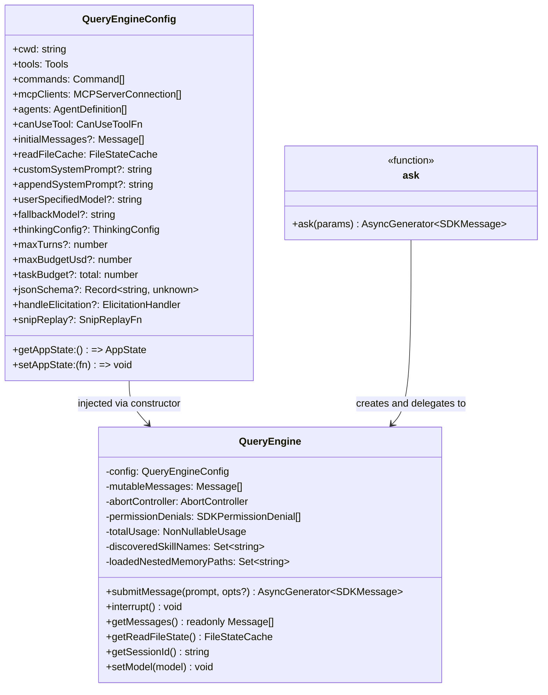
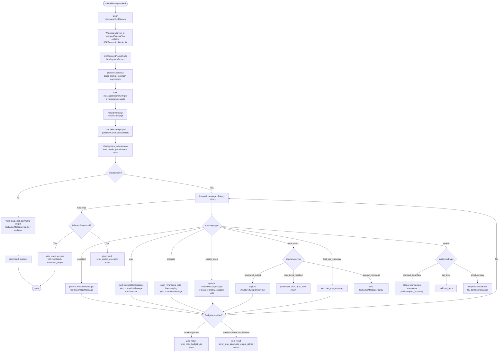
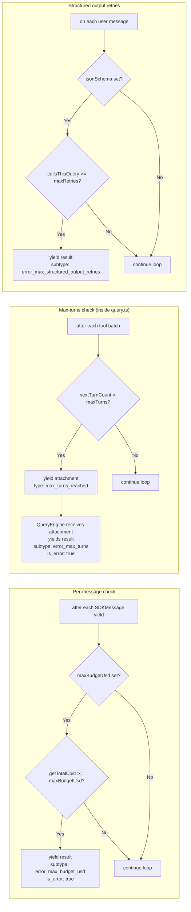

# QueryEngine

Source: `QueryEngine.ts`

---

## Purpose

`QueryEngine` owns the headless/SDK query lifecycle and session state for a
single conversation. One instance is created per conversation. State — messages,
file cache, usage totals, permission denials — persists across `submitMessage()`
calls, making multi-turn SDK sessions straightforward.

`QueryEngine` is a coordinator, not the low-level model/API loop or the storage
implementation. It assembles turn inputs, processes slash commands and
attachments, keeps the mutable internal message store, calls `query()` in
`query.ts`, reacts to each yielded query event, emits SDK-facing messages, and
asks `utils/sessionStorage.ts` to persist transcript state. `query.ts` owns the
underlying agent loop: model streaming, tool dispatch, follow-up turns,
compaction triggers, and API retry behavior.

The SDK path may GC pre-compaction messages when `snipReplay` fires. Interactive
REPL mode owns its UI scrollback separately and calls `query()` directly rather
than using `QueryEngine`.

```text
QueryEngine.submitMessage()
  -> build system/user context
  -> process user input and slash commands
  -> append user input and attachments to mutableMessages
  -> persist via recordTranscript()
  -> yield SDK init/status events
  -> call query() in query.ts
  -> consume assistant/user/system/attachment/progress events
  -> update mutableMessages, usage, turns, and permission denials
  -> normalize internal messages into SDKMessage events
  -> handle compact, snip, max-turn, budget, and final result cases
```

---

## Class Overview




---

## `submitMessage()` Pipeline



The `progress` branch consumes live status generated during tool execution,
rather than model-authored conversation content. QueryEngine retains the event
in `mutableMessages` and invokes the transcript write path so its deduplication
walk preserves ordering, but session storage excludes progress itself from the
durable transcript and `parentUuid` chain. QueryEngine then normalizes supported
progress kinds for SDK callers. See
[Query Loop Design: Progress messages](./query-loop.md#progress-messages) for
the creation and emission path from `tool.call(..., onProgress)` through
`query()`.

The `stream_event` branch similarly consumes transport-level events that
originate in the Anthropic API layer. QueryEngine always uses selected events
for response usage and `stop_reason` accounting, and only re-emits them to SDK
callers when `includePartialMessages` is enabled. See
[Query Loop Design: API stream events](./query-loop.md#api-stream-events) for
the raw-event and assembled-assistant-message paths.

### Queued Commands

`queued_command` has two different paths, depending on whether the queue is
drained outside QueryEngine or inside an already-running `query()` loop.

**Outer queue drain.** In headless / SDK streaming mode, `cli/print.ts` owns the
outer command queue. After a query finishes, `drainCommandQueue()` dequeues
pending commands, batches compatible prompt-mode commands, and calls `ask()`.
`ask()` creates a QueryEngine and calls `submitMessage(prompt, { uuid, isMeta })`.
From QueryEngine's perspective this is just the next normal top-level prompt:
`processUserInput()` creates user messages, QueryEngine appends them to
`mutableMessages`, snapshots `messages`, persists the transcript, and starts a
fresh `query()` call (`cli/print.ts:1930-1962`,
`QueryEngine.ts:1186-1292`, `QueryEngine.ts:410-434`).

```text
cli/print.ts drainCommandQueue()
  -> dequeue command
  -> ask({ prompt: command.value, promptUuid: command.uuid, isMeta })
  -> QueryEngine.submitMessage(prompt)
  -> processUserInput() creates normal user message(s)
  -> query() starts a fresh LLM loop
```

This path does **not** create an `attachment/queued_command` message.

**Mid-turn queue drain.** If `query()` is already running and the model produced
tool calls, the loop reaches a safe checkpoint after tool execution. At that
point `query.ts` snapshots pending queue entries, excludes slash commands, scopes
the entries to the main thread or current subagent, and passes them to
`getAttachmentMessages()`. `getQueuedCommandAttachments()` converts prompt and
task-notification entries into `attachment/queued_command` messages. `query.ts`
yields those attachments and pushes them into `toolResults`, so the next
recursive model call inside the same `query()` loop sees them alongside the tool
results (`query.ts:1547-1590`, `utils/attachments.ts:1044-1083`,
`query.ts:1714-1728`).

```text
query() API call returns assistant tool_use
  -> run tools
  -> query.ts drains eligible queued commands
  -> getQueuedCommandAttachments()
  -> yield attachment { type: 'queued_command', prompt, ... }
  -> push attachment into toolResults
  -> next recursive API call includes it in context
```

So `queued_command` means "async prompt/notification delivered mid-turn." If the
current query has already ended, the outer queue processor turns the same pending
input into a normal next prompt instead.

---

## Message State Layers

QueryEngine works with three related but deliberately different message
representations. They often contain the same conversation facts, but they do not
have the same lifetime, filtering, or persistence responsibilities.

| Layer | Scope | Main use | Source handle |
| --- | --- | --- | --- |
| `messages` | Per `submitMessage()` call / per `query()` invocation | Working input for `query()` and transcript-write buffer for yielded assistant/user/compact messages | `QueryEngine.ts:433-435`, `QueryEngine.ts:675-686` |
| `mutableMessages` | Per `QueryEngine` instance | Live SDK/headless session store across `submitMessage()` calls; source for `getMessages()` and future turn input processing | `QueryEngine.ts:200-203`, `QueryEngine.ts:430-434`, `QueryEngine.ts:1162-1164` |
| persistent session transcript | Per persisted session file | Replay/resume log with parent chain, metadata, sidecars, and transcript-only control entries | `utils/sessionStorage.ts` |

### `messages`

`messages` is a local snapshot created from `mutableMessages` after
`processUserInput()` has produced the current prompt, slash-command output, and
attachments:

```ts
this.mutableMessages.push(...messagesFromUserInput)
const messages = [...this.mutableMessages]
```

That local array is passed into `query()`. Inside `query.ts`, each loop iteration
derives a model-facing working view with
`getMessagesAfterCompactBoundary(messages)`, then applies snip, microcompact,
context-collapse projection, and auto-compact handling to that working view.
Those transforms rewrite `messagesForQuery`; they do not directly rewrite the
original `messages` array passed by QueryEngine.

QueryEngine still appends selected yielded messages to this local `messages`
array before writing the transcript. In the query loop, assistant messages,
tool-result user messages, and `system/compact_boundary` messages are pushed to
`messages` and then passed to `recordTranscript()`. This makes `messages` a
per-call bridge between live query output and durable transcript writes.

### `mutableMessages`

`mutableMessages` is the long-lived in-memory store for the QueryEngine
instance. It starts from `config.initialMessages`, is passed into
`processUserInput()`, receives the current input messages, and is exposed through
`getMessages()`. It lets a headless SDK session continue across many
`submitMessage()` calls without reloading the session file.

It is broader than the single model-facing request. During a live turn it may
include events that are useful to the SDK session but are not necessarily the
same shape as the API payload. For example, QueryEngine pushes yielded
assistant/user/system messages into `mutableMessages`, handles attachment replay
messages, tracks progress for SDK output, and lets the optional `snipReplay`
callback physically rewrite the store in long-running headless sessions.

### Persistent session transcript

The persistent transcript is the durable JSONL/session-storage view, not just a
copy of either in-memory array. `recordTranscript()` writes transcript messages
and session metadata through `utils/sessionStorage.ts`. The storage layer defines
transcript messages as `user`, `assistant`, `attachment`, and `system`; progress
messages are explicitly not transcript messages because they are ephemeral UI
state.

The transcript also carries replay/resume structure that is not model-facing:
`parentUuid`, `logicalParentUuid`, sidechain metadata, file snapshots,
context-collapse commit/snapshot entries, content-replacement records, and other
session-management entries. On resume, storage reconstructs a conversation chain
from those records and supplies `initialMessages` to a new QueryEngine.

## Compact Boundary Effects

`compact_boundary` is the boundary for full conversation-level compaction
results. It is created as a `system` message with subtype `compact_boundary` and
metadata such as `trigger`, `preTokens`, optional `userContext`, and optional
`messagesSummarized` (`utils/messages.ts:4530-4555`). It is separate from
`microcompact_boundary`, snip boundaries, context-collapse commit records, and
API-side context-management edits.

### In `query()`

At the start of each query-loop iteration, `query.ts` builds:

```ts
let messagesForQuery = [...getMessagesAfterCompactBoundary(messages)]
```

`getMessagesAfterCompactBoundary()` slices from the last `compact_boundary`
onward, including the boundary marker itself. The boundary is later filtered out
before the Anthropic API payload is built, but keeping it in the internal array
gives future iterations a stable cut point. When auto-compact or reactive
compact returns a `CompactionResult`, `query.ts` yields
`buildPostCompactMessages(result)` and replaces `messagesForQuery` with that
post-compact sequence.

### In `mutableMessages`

When QueryEngine receives a yielded `system/compact_boundary`, it first pushes
the boundary into `mutableMessages`. Then it removes every older entry before
that boundary from `mutableMessages` and from the local `messages` array:

```ts
const mutableBoundaryIdx = this.mutableMessages.length - 1
if (mutableBoundaryIdx > 0) {
  this.mutableMessages.splice(0, mutableBoundaryIdx)
}

const localBoundaryIdx = messages.length - 1
if (localBoundaryIdx > 0) {
  messages.splice(0, localBoundaryIdx)
}
```

That is SDK/headless garbage collection. After a full compact, future
`submitMessage()` calls no longer need the pre-compact in-memory history because
the summary, preserved tail, attachments, and hook results form the new live
context.

### In the persistent transcript

QueryEngine records `system/compact_boundary` through the same transcript path
as assistant and tool-result user messages. Before writing a compact boundary
with preserved-segment metadata, it may flush the in-memory tail first so the
storage layer can relink the preserved segment correctly.

On the storage side, `insertMessageChain()` writes a compact boundary with
`parentUuid: null` and stores the previous chain parent as `logicalParentUuid`.
That makes the boundary a new durable root for the post-compact chain while
preserving a logical link to the pre-compact history. During load,
`isCompactBoundaryMessage()` is also used to discard stale context-collapse
commit/snapshot state that referenced messages before the compact boundary.

The result is that all three layers agree on the post-compact context, but they
get there differently:

| Layer | After compact boundary |
| --- | --- |
| `messages` | Local per-call array is trimmed so later transcript writes and query-loop work start at the boundary. |
| `mutableMessages` | Long-lived SDK store is trimmed for memory/GC; future `submitMessage()` calls begin from the boundary. |
| persistent transcript | Boundary is saved as a durable system message and becomes a new chain root for resume/replay. |

---

## Budget Control



---

## Permission Denial Tracking

`wrappedCanUseTool` wraps the caller-supplied `canUseTool` function. Every call whose result is not `allow` appends an `SDKPermissionDenial` record to `this.permissionDenials`. The full list is attached to every `result` message so SDK callers know which tools were blocked during the session.

```
wrappedCanUseTool(tool, input, ctx, assistantMsg, toolUseID, forceDecision)
  → calls canUseTool(...)
  → if result.behavior !== 'allow':
      permissionDenials.push({ tool_name, tool_use_id, tool_input })
  → return result
```

---

## `ask()` — Convenience Wrapper

`ask()` is a one-shot generator that creates a `QueryEngine`, calls `submitMessage()` once, and returns the engine's read-file state to the caller when done.

```
ask(params):
  engine = new QueryEngine({
    ...params,
    snipReplay: (yieldedMsg, store) => {       // only injected when HISTORY_SNIP compiled in
      if (!isSnipBoundaryMessage(yieldedMsg)) return undefined
      return snipCompactIfNeeded(store, { force: true })
    }
  })
  yield* engine.submitMessage(prompt, { uuid, isMeta })
  setReadFileCache(engine.getReadFileState())
```

### HISTORY_SNIP and the `snipReplay` callback

`HISTORY_SNIP` is a **model-initiated, surgical message removal** feature — distinct from auto-compact, which replaces old history with an LLM-generated prose summary. Snip lets the model drop specific older turns without summarization by calling `SnipTool`.

**How it works end-to-end:**

**1 — ID tagging.** When `HISTORY_SNIP` is enabled, every user message gets an `[id:uuid]` tag appended to its content (`appendMessageTagToUserMessage` in `messages.ts`) before the payload is sent to the API. This gives the model a stable handle to reference specific turns.

**2 — SnipTool.** The model calls `SnipTool` with a list of UUIDs it wants removed. The tool writes a **`snip_boundary` system message** into the message store — a control record saying "these UUIDs are snipped".

**3 — Two paths for applying the snip.** The REPL and the SDK handle snip boundaries differently because they have different constraints:

|          | REPL                                                              | SDK / headless (`ask()`)                                    |
| -------- | ----------------------------------------------------------------- | ----------------------------------------------------------- |
| Goal     | Keep full history for UI scrollback                               | Bound memory — no UI needs the old messages                 |
| Approach | **Project** a filtered view at API-call time                      | **Actually remove** snipped messages from `mutableMessages` |
| Function | `projectSnippedView()` inside `getMessagesAfterCompactBoundary()` | `snipCompactIfNeeded()` via `snipReplay` callback           |

**REPL path.** `getMessagesAfterCompactBoundary()` calls `projectSnippedView(messages)` every time it builds the API payload. This filters snipped messages on-the-fly but leaves `AppState.messages` untouched so the user can still scroll up and see the full history.

**SDK path — `snipReplay`.** Inside `QueryEngine.submitMessage()`, every system message yielded by `query()` is tested against `snipReplay` first. When it recognises a snip boundary, `snipCompactIfNeeded` walks `mutableMessages`, finds all UUIDs marked for removal, and physically rewrites the array:

```typescript
// Inside submitMessage() system message handler:
const snipResult = this.config.snipReplay?.(message, this.mutableMessages)
if (snipResult !== undefined) {
  if (snipResult.executed) {
    this.mutableMessages.length = 0
    this.mutableMessages.push(...snipResult.messages)
  }
  break   // snip boundary is consumed, not pushed to mutableMessages
}
```

The boundary message itself is consumed by the `break` — it never enters `mutableMessages`. In long headless sessions there is no UI, so removed messages have no value; keeping them would grow `mutableMessages` without bound across many turns.

---

## SDKMessage Types

Messages yielded by `submitMessage()`:

| type               | subtype                               | When                                                                       |
| ------------------ | ------------------------------------- | -------------------------------------------------------------------------- |
| `system`           | _(init)_                              | Once per `submitMessage()` call; carries tools, model, permissions, skills |
| `user`             | —                                     | User message replay (when `replayUserMessages`)                            |
| `assistant`        | —                                     | Each assistant content block                                               |
| `progress`         | —                                     | Tool-execution progress events                                             |
| `stream_event`     | —                                     | Raw API stream events (only if `includePartialMessages`)                   |
| `attachment`       | —                                     | File snapshots, memory attachments, queued commands                        |
| `tool_use_summary` | —                                     | Haiku-generated summary of a tool batch                                    |
| `system`           | `compact_boundary`                    | Context-window compaction completed                                        |
| `system`           | `api_retry`                           | Retryable API error; includes attempt/delay metadata                       |
| `result`           | `success`                             | Turn completed normally                                                    |
| `result`           | `error_max_turns`                     | `maxTurns` reached                                                         |
| `result`           | `error_max_budget_usd`                | `maxBudgetUsd` exceeded                                                    |
| `result`           | `error_max_structured_output_retries` | Structured-output retry limit hit                                          |
| `result`           | `error_during_execution`              | Unexpected terminal state (includes diagnostic errors[])                   |

All `result` messages include: `duration_ms`, `duration_api_ms`, `num_turns`, `stop_reason`, `session_id`, `total_cost_usd`, `usage`, `modelUsage`, `permission_denials`, `fast_mode_state`.
