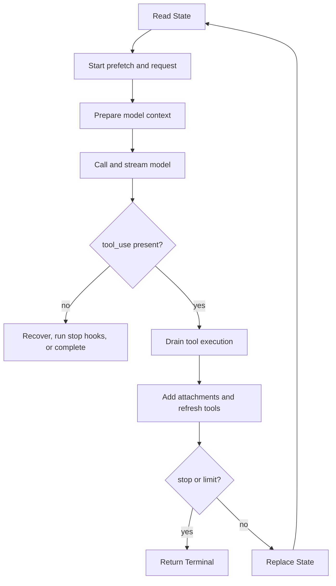

# Query Loop Internals

Source: `query.ts:241-1729` (`queryLoop()`)

---

## Purpose and reading model

This document is the source-order, statement-level walkthrough of
`queryLoop()`. The shorter [query-loop.md](./query-loop.md) describes the
subsystem and its major flows; this document explains how the implementation
advances from one source region to the next, what each region reads and writes,
and why the ordering matters.

“Line by line” here means every executable region and control-flow branch is
covered in source order. Logging, profiling, and instrumentation calls are
grouped with the operation they measure. Line numbers identify the recovered
source snapshot and may drift; function and variable names are the durable
retrieval handles.

---

## Function contract (`query.ts:241-251`)

`queryLoop()` is an async generator with two output channels:

- `yield` publishes intermediate request events, messages, tombstones, and
  tool-use summaries.
- `return` produces one `Terminal` value describing why the loop stopped.

`params` supplies the initial conversation, prompts, tools, authorization
callback, limits, and injectable dependencies. `consumedCommandUuids` is an
out-parameter owned by `query()`: the loop appends IDs when queued commands
become attachments, and the wrapper marks them complete after normal exit.

The caller does not send actions through `next(value)`. Injected callbacks and
`ToolUseContext` provide capabilities; yielded values report observable work.

---

## State model (`query.ts:252-304`)

### Immutable inputs

The initial destructure extracts values that remain fixed for one invocation:

| Value | Role |
|---|---|
| `systemPrompt`, `userContext`, `systemContext` | Prompt layers assembled before each API call. |
| `canUseTool` | Injected tool-authorization callback. |
| `fallbackModel` | Optional retry model. |
| `querySource` | Identifies SDK, REPL, agent, compaction, and memory callers. |
| `maxTurns` | Hard cap on model/tool follow-up iterations. |
| `skipCacheWrite` | Suppresses API cache writes when requested. |
| `deps` | Test seam for model calls, compaction, and UUID generation. |

### Cross-iteration register

`state` is the explicit state-machine register. Each continuation replaces the
entire object.

| Field | Initial value | Meaning |
|---|---|---|
| `messages` | `params.messages` | Conversation entering context preparation. |
| `toolUseContext` | `params.toolUseContext` | Tools, app state, abort controller, file state, and options. |
| `maxOutputTokensOverride` | caller value | Per-request output-token override. |
| `autoCompactTracking` | `undefined` | Compaction turn ID, age, and failure count. |
| `stopHookActive` | `undefined` | Whether a blocking stop hook caused the previous continuation. |
| `maxOutputTokensRecoveryCount` | `0` | Number of truncation recoveries consumed. |
| `hasAttemptedReactiveCompact` | `false` | One-shot reactive-compaction guard. |
| `turnCount` | `1` | Model call number within the user turn. |
| `pendingToolUseSummary` | `undefined` | Prior tool-batch summary promise. |
| `transition` | `undefined` | Reason the preceding iteration continued. |

`budgetTracker` persists across transitions when `TOKEN_BUDGET` is compiled in.
`taskBudgetRemaining` is loop-local because it changes only at compaction sites.
Before compaction the server sees full history; afterward the client carries
forward tokens summarized out of view.

`buildQueryConfig()` snapshots runtime configuration once. The once-per-turn
memory prefetch is bound with `using`, guaranteeing disposal on return, throw,
or generator closure. Its complete lifecycle is described below.

### Relevant-memory prefetch (`query.ts:297-304`,
`utils/attachments.ts:2196-2541`)

`startRelevantMemoryPrefetch()` performs query-time recall of existing memory
files. It does not create or consolidate memories. It is called before entering
`while (true)`, so at most one memory-selection request runs for the entire user
turn, even when tools or recovery cause several loop iterations.

The function returns `undefined` unless all startup gates pass:

1. Auto-memory is enabled.
2. Runtime flag `tengu_moth_copse` is true.
3. History contains a non-meta user message.
4. That message has extractable text.
5. The trimmed text contains whitespace; single-word prompts are skipped.
6. Previously surfaced memory content is below the session byte limit.

`collectSurfacedMemories()` derives both the surfaced-path set and byte count
from existing `relevant_memories` attachments. Because it scans current
messages rather than separate state, full compaction naturally resets the
throttle when old attachments leave the active history.

When the gates pass, the prefetch:

1. extracts the last real user prompt;
2. collects recently successful tool names since the preceding real user turn;
3. creates a child abort controller linked to the query controller;
4. calls `getRelevantMemoryAttachments()` with active agent definitions,
   cumulative `readFileState`, successful tools, and already surfaced paths;
5. converts non-abort failures into an empty result while logging them.

Memory-directory selection is prompt-sensitive. An agent mention searches that
agent's configured memory directory; otherwise recall searches the default
auto-memory directory. Candidate selection runs concurrently across directories,
filters paths already surfaced or present in `readFileState`, and retains at
most five results. `readMemoriesForSurfacing()` then reads selections in
parallel, limiting each file to 200 lines and 4096 bytes. Truncated content is
kept with a note directing the model to use the read tool for the full file;
individual read failures are dropped.

The returned `MemoryPrefetch` handle contains:

| Field | Lifecycle |
|---|---|
| `promise` | Resolves to zero or more attachments; errors are already contained. |
| `settledAt` | Starts `null`; `promise.finally()` records settlement time. |
| `consumedOnIteration` | Starts `-1`; the query loop sets it after injection. |
| `[Symbol.dispose]()` | Aborts outstanding work and emits latency/consumption telemetry. |

Linking the child controller to `toolUseContext.abortController` makes Escape
cancel the side request immediately. The `using` binding adds a second safety
net: every generator exit aborts remaining work and records whether the result
was hidden by the first iteration.

At `query.ts:1592-1614`, collection is deliberately zero-wait. The loop consumes
the promise only when `settledAt !== null` and `consumedOnIteration === -1`.
If it is still running, the current iteration proceeds and a later tool
iteration may try again. Before injection,
`filterDuplicateMemoryAttachments()` removes files read, written, edited, or
surfaced while the side request was running. Survivors are then recorded in
`readFileState`; doing this after filtering avoids treating the prefetch's own
selections as pre-existing reads. Each surviving attachment is yielded and
appended to `toolResults`, then the handle records `turnCount - 1`.

#### Practical effect on the model request

Relevant-memory prefetch does **not** rewrite the user's original text. It may
add hidden `<system-reminder>` context to a later model request, normally after
the first model response has requested tools and those tools have completed.

```text
User prompt
  ├─ main queryLoop starts the model request
  └─ memory selector starts asynchronously
       ├─ inspect the last real user prompt
       ├─ select up to five relevant memory files
       └─ read at most 200 lines / 4096 bytes from each

Model requests tools
  -> tools execute
  -> post-tool collection point
       ├─ prefetch unfinished: skip without waiting
       └─ prefetch finished: deduplicate and add memories to next request
```

For example, suppose the user submits:

```text
Fix the authentication refresh bug
```

and recall selects `auth-refresh.md` containing a prior finding about preserving
the token audience during a retry. The first API request contains the ordinary
user message. If the model then calls `Read`, the second request is conceptually:

```jsonc
[
  {
    "role": "user",
    "content": "Fix the authentication refresh bug"
  },
  {
    "role": "assistant",
    "content": [{ "type": "tool_use", "id": "tool_1", "name": "Read" }]
  },
  {
    "role": "user",
    "content": [
      {
        "type": "tool_result",
        "tool_use_id": "tool_1",
        "content": "...current file contents..."
      },
      {
        "type": "text",
        "text": "<system-reminder>\nMemory: .../auth-refresh.md:\n\nPreserve the original token audience when retrying after a 401.\n</system-reminder>"
      }
    ]
  }
]
```

`normalizeAttachmentForAPI()` performs this conversion: each selected memory
becomes a meta user message whose stable header and content are wrapped in
`<system-reminder>` (`utils/messages.ts:3708-3721`). API normalization can merge
that reminder with the preceding user tool-result message
(`utils/messages.ts:2269-2290`). Thus the model sees the original request,
current tool output, and historical context together; the user did not type the
memory text and the visible user prompt is unchanged.

Common outcomes make the timing easier to see:

| Situation | Effect |
|---|---|
| Model answers without tools | The no-tool branch returns before the post-tool collection point, so the prefetched memory is not injected. |
| Prefetch finishes before tools finish | Selected memories are appended to the next model request. |
| Prefetch is still running after tools | The loop does not wait. A later iteration that reaches the post-tool collection point may consume it. |
| Model independently reads a selected memory file | `readFileState` deduplication removes the prefetched copy. |
| Memory was already surfaced in active history | It is excluded so the five-file selection budget can be used for new material. |
| Prompt is a single word such as `continue` | Prefetch never starts because the prompt lacks enough selection context. |

If a slow prefetch misses one post-tool collection point, it is not guaranteed
to appear later: another iteration must reach that collection point. If the
next model response ends without tools, the loop completes before another
memory check. Full compaction can make an old memory eligible again because its
prior attachment has left active model context.

In practical terms, relevant-memory prefetch is speculative retrieval that may
enrich a future tool-follow-up request without delaying the current request. It
does not create a visible user turn and does not guarantee injection.

### Skill-discovery prefetch: recovered boundary (`query.ts:65-68`,
`query.ts:323-335`, `query.ts:1617-1628`)

Skill discovery has a different lifetime. The module is loaded only when the
compile-time `EXPERIMENTAL_SKILL_SEARCH` feature exists, and one prefetch is
started at the top of each loop iteration rather than once per user turn:

```ts
startSkillDiscoveryPrefetch(null, messages, toolUseContext)
```

The available call-site comments establish these behaviors:

- an internal write-pivot guard returns early for non-write iterations;
- discovery overlaps context preparation, model streaming, and tool execution;
- this path replaces a formerly blocking `assistant_turn` discovery call;
- initial user-input discovery remains a separate blocking attachment path;
- the post-tool collection point awaits
  `collectSkillDiscoveryPrefetch()` and converts every returned attachment into
  a message that is both yielded and appended to `toolResults`;
- collection emits `hidden_by_main_turn` telemetry indicating whether main-turn
  work fully hid prefetch latency.

The referenced implementation module,
`services/skillSearch/prefetch.ts`, is absent from this recovered checkout.
Consequently, its handle shape, candidate-ranking algorithm, precise write
pivot, cancellation semantics, error handling, and deduplication rules cannot
be verified here. Those details must not be inferred from the two call sites.

#### Practical effect on the model request

Skill-discovery prefetch does not rewrite the user's original text either. It
speculatively searches for skills that may have become relevant during an agent
trajectory, especially after the model reaches a write-oriented point. If it
returns model-facing attachments, those attachments are added to the next API
request after the current tool batch.

```text
One queryLoop iteration
  -> start skill discovery asynchronously
       └─ recovered comments: return early without a write pivot
  -> prepare context and stream the model
  -> execute requested tools
  -> post-tool collection point
       └─ await collection of this iteration's prefetch handle
            ├─ no attachments: next request is unchanged
            └─ attachments: yield them and append them to next request
```

This differs from relevant-memory prefetch in two important ways:

| Property | Relevant memory | Skill discovery |
|---|---|---|
| Lifetime | Once per user turn | Once per query-loop iteration |
| Collection | Consume only if already settled; never wait | Await collection when a handle exists |
| Selection signal | Last real user prompt | Recovered comments identify a write-pivot guard |
| Complete implementation available | Yes | No; feature-gated module is absent |

For example, consider this trajectory:

```text
User: Add a release workflow for this package
  -> model reads package and CI files
  -> model reaches a write-oriented iteration
  -> skill discovery runs concurrently with that iteration
  -> tools finish
  -> discovered-skill attachments are collected
  -> next model request receives any model-facing skill context
```

The first API request still contains the ordinary user request. Conceptually,
if collection returns a model-facing skill-listing attachment, a later request
can contain:

```jsonc
[
  {
    "role": "user",
    "content": "Add a release workflow for this package"
  },
  {
    "role": "assistant",
    "content": [
      { "type": "tool_use", "id": "tool_1", "name": "Read" }
    ]
  },
  {
    "role": "user",
    "content": [
      {
        "type": "tool_result",
        "tool_use_id": "tool_1",
        "content": "...package and workflow contents..."
      },
      {
        "type": "text",
        "text": "<system-reminder>\nThe following skills are available for use with the Skill tool:\n\nrelease-workflow: Create and validate release automation\n</system-reminder>"
      }
    ]
  }
]
```

This example illustrates the verified downstream behavior of a `skill_listing`
attachment, not the missing prefetch module's exact output contract.
`normalizeAttachmentForAPI()` turns `skill_listing` into a meta user message
wrapped in `<system-reminder>` (`utils/messages.ts:3728-3737`) and can merge it
with the preceding user tool-result message (`utils/messages.ts:2269-2290`).

Not every skill-related attachment affects the model request. A
`dynamic_skill` attachment is deliberately normalized to no API messages; it
is UI information because the corresponding skills are loaded separately and
made available through the Skill tool (`utils/messages.ts:3723-3726`). Since
the prefetch implementation is absent, this checkout cannot prove which
attachment subtype or subtypes its collection function returns.

Common outcomes are therefore:

| Situation | Verified effect |
|---|---|
| Feature is not compiled in | `skillPrefetch` is `null`; no search or injection occurs. |
| Iteration has no qualifying write pivot | Recovered comments say the prefetch returns early; the request is unchanged. |
| Model answers without tools | The no-tool completion branch returns before the post-tool collection point. |
| A prefetch handle exists after tools | Collection is awaited; returned attachments are yielded and appended to `toolResults`. |
| Collection returns `skill_listing` | Its listing becomes hidden model context in a system reminder. |
| Collection returns `dynamic_skill` | It remains UI-only and contributes no API message. |

Turn-zero discovery is separate. During initial user-input attachment assembly,
`getTurnZeroSkillDiscovery()` can run as a blocking attachment task using the
user's text as its signal (`utils/attachments.ts:789-813`). The inter-turn
prefetch described here replaces the older blocking `assistant_turn` search and
tries to hide discovery latency under model and tool work.

In practical terms, skill-discovery prefetch is speculative, per-iteration
capability discovery. It may make newly relevant skills visible to a later
model request, but the current recovered tree does not support stronger claims
about how candidates are ranked or exactly which attachment shape is returned.

---

## Iteration overview



---

## 1. Enter an iteration (`query.ts:306-364`)

At the top of `while (true)`, `toolUseContext` is copied to a mutable local;
all other state fields are destructured as iteration-constant bindings. A prior
iteration affects them only by reaching `state = next; continue`.

Skill discovery starts for the current message view and overlaps model/tool
work. Unlike memory recall, this occurs once per loop iteration and is bounded
by the feature-gated recovered interface described above. The loop then yields
`stream_request_start`, records profiling markers, and creates query tracking:

- an existing chain keeps its ID and increments depth;
- a new chain receives a UUID at depth zero.

Tracking is copied into `toolUseContext` and follows all downstream tool work
and transitions.

---

## 2. Build the model-facing context (`query.ts:365-549`)

This pipeline converts iteration history into the exact API message view. Its
order is deliberate.

### Compact-boundary cut (`query.ts:365-367`)

`getMessagesAfterCompactBoundary()` discards history before the last full
compact boundary. Spreading creates a working array, so transforms do not
mutate `State.messages`. Prior autocompaction metadata becomes local `tracking`.

### Tool-result budget (`query.ts:369-394`)

`applyToolResultBudget()` replaces oversized tool-result bodies before other
compaction layers run. Replacement records are persisted only for resumable
agent or main-thread sources; tools with infinite result limits are exempt.
This precedes microcompaction because cached microcompaction matches tool IDs,
not result content.

### History snip (`query.ts:396-410`)

When enabled, snip rewrites the working view, reports estimated tokens freed,
and may yield a boundary signal. `snipTokensFreed` corrects later warning and
autocompaction calculations whose surviving usage metadata can be stale.

### Microcompaction (`query.ts:412-426`)

`deps.microcompact()` receives the budgeted/snipped view. Cached
microcompaction defers its boundary: only the later API response contains the
authoritative `cache_deleted_input_tokens` value.

### Context-collapse projection (`query.ts:428-447`)

Context collapse projects its commit log over the working view before full
autocompaction. If granular summaries reduce the request sufficiently, full
conversation summarization can be avoided. Projection yields nothing; its
store is separate from the REPL history.

### Proactive autocompaction (`query.ts:449-543`)

The loop assembles the full system prompt and calls `deps.autocompact()` with
the current view, cache-safe prompt inputs, query source, prior tracking, and
snip correction.

On success it:

1. records token and usage metrics;
2. updates task-budget carryover from the final pre-compact context;
3. resets compaction tracking with a new turn ID;
4. builds and yields post-compact summary, attachment, hook, and boundary
   messages;
5. uses those post-compact messages for the API call in the same iteration.

On failure it preserves the reported consecutive-failure count for the next
iteration's circuit breaker. Finally, `toolUseContext.messages` is replaced
with the exact prepared view, so tools and hooks see what the model sees.

---

## 3. Prepare model execution (`query.ts:551-650`)

Four iteration-local accumulators are created:

- `assistantMessages`: internal assistant output from this model call;
- `toolResults`: normalized tool results and attachments for the next call;
- `toolUseBlocks`: every observed tool request;
- `needsFollowUp`: reliable tool-continuation signal.

The code does not trust `stop_reason === 'tool_use'`; observing a real
`tool_use` block sets `needsFollowUp`.

If streaming tool execution is enabled, `StreamingToolExecutor` is created
before the API call. Otherwise blocks are collected for `runTools()`. Runtime
model selection considers permission mode, configured model, and plan-mode
large-context behavior. Internal builds also create one prompt-dump fetch
wrapper per iteration to avoid retaining request bodies in many closures.

The hard blocking-limit check is skipped after successful compaction, for
compaction/memory workers, and when reactive compaction or context collapse
must observe a real API overflow. Otherwise it subtracts snip savings from the
estimate. At the limit it yields a synthetic prompt-too-long message and
returns `blocking_limit` before the API call.

The media-recovery flag is sampled once so the streaming-withhold and
post-stream-recovery branches cannot disagree if experiment state changes.

---

## 4. Call and stream the model (`query.ts:650-954`)

### Nested retry scopes

The outer `try` converts thrown model/runtime failures to terminal output. The
inner `while (attemptWithFallback)` and `try` allow model fallback without
leaving the current state-machine iteration.

### Request construction (`query.ts:659-708`)

`deps.callModel()` receives the prepared history with user context prepended,
full system prompt, thinking configuration, tools, abort signal, selected
model, agents, MCP state, effort/advisor settings, cache behavior, query
tracking, and task budget. Permission context is fetched lazily from app state.

### Streaming fallback repair (`query.ts:709-741`)

If the lower API layer abandons a partial streaming attempt, the next event
causes the loop to:

1. yield tombstones for assistant messages already exposed;
2. clear assistant/tool accumulators and `needsFollowUp`;
3. discard and recreate the streaming executor.

This removes invalid partial thinking blocks and prevents old tool results from
being paired with fallback tool IDs.

### Outward message clone (`query.ts:742-787`)

For assistant tool-use messages, `backfillObservableInput()` may add legacy or
derived fields needed by SDK/transcript consumers. The loop clones only when
fields were added. The original message remains byte-stable for API replay and
prompt caching; overwrites such as expanded paths are not serialized outward.

### Recoverable-error withholding (`query.ts:788-825`)

Prompt-too-long, media-size, and max-output-token assistant errors can be
withheld from the caller. They are still appended to `assistantMessages`, so
post-stream code can recover or later yield the exact error. This prevents a
temporary error from appearing before a successful retry.

### Assistant and tool accumulation (`query.ts:826-862`)

Every assistant message enters `assistantMessages`. Its tool blocks enter
`toolUseBlocks`, set `needsFollowUp`, and are submitted immediately to the
streaming executor when active. After every model event, already-completed tool
updates are yielded and normalized user tool-results enter `toolResults`.

### Deferred cache boundary (`query.ts:866-892`)

After streaming, cached microcompaction subtracts its captured baseline from
cumulative API deletion usage. A positive delta produces a boundary containing
actual deleted-token savings.

### Model fallback (`query.ts:893-953`)

On `FallbackTriggeredError`, the loop switches model, repairs missing tool
results, clears attempt-local arrays, recreates the streaming executor, updates
the context model, strips model-bound thinking signatures in internal builds,
yields a warning, and continues the inner retry loop. Other errors propagate to
the outer catch.

---

## 5. Convert thrown failures (`query.ts:955-997`)

Image size/resize exceptions yield a friendly assistant error and return
`image_error`. Other exceptions first synthesize missing tool results for any
exposed tool uses, then yield the real assistant API error and return
`model_error` with the original exception.

Repairing missing results preserves the invariant that every exposed
`tool_use` has a matching `tool_result`, even though no later API call occurs.

---

## 6. Post-stream ordering (`query.ts:999-1060`)

Post-sampling hooks fire asynchronously when assistant output exists.

Abort is then handled before summaries, recovery, stop hooks, or ordinary tool
processing. A streaming executor is fully drained so it can generate synthetic
results for queued/running tools; without one, missing results are synthesized
directly. Optional computer-use cleanup runs, non-submit aborts yield an
interruption message, and the loop returns `aborted_streaming`.

Only after the abort check does the loop await and yield the prior iteration's
tool-use summary. Its generation overlapped the current model stream.

---

## 7. No-tool completion and recovery (`query.ts:1062-1358`)

This branch runs when no tool block was observed.

### Collapse-drain retry (`query.ts:1065-1117`)

For a withheld 413, context collapse gets first recovery priority. Unless the
previous transition was already `collapse_drain_retry`, staged collapses are
committed. A non-empty result becomes a complete new `State` and restarts the
outer loop.

### Reactive compaction (`query.ts:1119-1183`)

Prompt-too-long and media failures may trigger full reactive compaction. On
success, task-budget carryover is updated, post-compact messages are yielded,
and a state containing only those messages continues with
`reactive_compact_retry`. The one-shot guard becomes true.

On failure the withheld error is yielded, stop-failure hooks run, and the loop
returns `prompt_too_long` or `image_error`. Stop hooks are skipped because no
valid model completion exists and a blocking hook could create a retry cycle.

### Output-token recovery (`query.ts:1185-1256`)

The withheld max-output error has two recovery levels:

1. An eligible capped request retries the same history with a 64k override via
   `max_output_tokens_escalate`.
2. While below the recovery limit, partial assistant output and a hidden resume
   instruction are appended via `max_output_tokens_recovery`.

If both are exhausted, the withheld error is yielded.

### API error, stop hooks, and token budget (`query.ts:1258-1358`)

Remaining API-error messages fire stop-failure hooks and return `completed`.
Here `completed` means the loop is finished; QueryEngine separately derives
outward success from the final message and stop reason.

`handleStopHooks()` can yield messages. A veto returns
`stop_hook_prevented`; blocking errors are appended to a new state with
`stop_hook_blocking`. The reactive-compaction guard is preserved to prevent a
compact/413/hook retry cycle.

When token-budget logic requests more useful work, assistant output plus a
hidden nudge becomes `token_budget_continuation`. Otherwise the loop returns
`completed`.

---

## 8. Execute and normalize tools (`query.ts:1360-1409`)

When `needsFollowUp` is true, the loop drains either the streaming executor or
`runTools()`. For each update it:

1. yields the message;
2. records `hook_stopped_continuation` attachments;
3. normalizes API-compatible user results into `toolResults`;
4. applies returned context modifiers while retaining query tracking.

This is the bridge between effectful tool execution and the next model-facing
history.

---

## 9. Prepare tool follow-up (`query.ts:1411-1533`)

For eligible main-thread batches, tool summary generation starts without being
awaited. Inputs contain the last assistant text and each tool's name, input,
and matching result found by `tool_use_id`. The promise moves into the next
state and errors collapse to `null`.

Abort during tools performs optional cleanup, yields a tool interruption for
non-submit aborts, optionally emits max-turn data, and returns `aborted_tools`.
A hook continuation stop returns `hook_stopped`.

After a completed model/tool cycle, post-autocompact turn age increments.

---

## 10. Assemble attachments (`query.ts:1535-1676`)

Attachments are added only after all tool results because ordinary user content
cannot be interleaved into the assistant-tool-use/tool-result protocol pair.

The loop snapshots eligible queued commands. Sleep makes `later` notifications
eligible; otherwise only `next` notifications drain. Slash commands remain for
local dispatch. Main threads drain unscoped commands, while subagents drain
only task notifications addressed to their agent ID.

`getAttachmentMessages()` receives prospective history. Each attachment is
yielded and appended to `toolResults`.

The once-per-turn memory prefetch is consumed only when already settled and not
previously consumed. Results are filtered against cumulative read-file state;
if not settled, the loop waits zero time and can try again next iteration.

The per-iteration skill prefetch is treated differently: when a handle exists,
the loop awaits `collectSkillDiscoveryPrefetch()` at this point. Its work was
started before the request, so model/tool latency normally hides the wait. Each
returned attachment is yielded and appended to the next model context.

Only commands actually converted to prompt/task-notification attachments are
removed. Their lifecycle becomes `started`; completion is deferred to the
outer `query()` wrapper.

Finally, `refreshTools()` can expose newly connected MCP tools to the next
iteration, and query tracking is reattached to the resulting context.

---

## 11. Build the next turn (`query.ts:1678-1728`)

`nextTurnCount` increments when tool results are about to drive another model
call. Optional background-session task summaries use the exact prospective
history.

If `maxTurns` would be exceeded, the loop yields `max_turns_reached` and returns
`max_turns`. Otherwise it replaces `State` with:

```ts
{
  messages: [...messagesForQuery, ...assistantMessages, ...toolResults],
  toolUseContext: toolUseContextWithQueryTracking,
  autoCompactTracking: tracking,
  turnCount: nextTurnCount,
  maxOutputTokensRecoveryCount: 0,
  hasAttemptedReactiveCompact: false,
  pendingToolUseSummary: nextPendingToolUseSummary,
  maxOutputTokensOverride: undefined,
  stopHookActive,
  transition: { reason: 'next_turn' },
}
```

Prepared history, context modifiers, refreshed tools, and compaction tracking
survive. Per-response output/reactive recovery guards reset. The summary
promise and stop-hook state move forward. Reaching the bottom of `while (true)`
starts the next iteration with this complete replacement.

---

## Transition table

| Transition or terminal | Trigger | Key effect |
|---|---|---|
| `collapse_drain_retry` | Withheld 413 and staged collapses | Retry with drained granular context. |
| `reactive_compact_retry` | Full reactive compact succeeds | Retry from post-compact messages; set guard. |
| `max_output_tokens_escalate` | First eligible capped overflow | Retry same history with 64k override. |
| `max_output_tokens_recovery` | Output overflow below retry limit | Append partial output and resume nudge. |
| `stop_hook_blocking` | Stop hook returns blocking errors | Append errors and mark hook active. |
| `token_budget_continuation` | More useful output budget remains | Append assistant output and budget nudge. |
| `next_turn` | Tools completed | Append assistant/tool results and increment turn. |
| `blocking_limit` | Pre-API hard token limit | Yield prompt-too-long error. |
| `image_error` | Image exception or unrecovered media failure | Yield error, then terminate. |
| `model_error` | Unexpected model/runtime throw | Repair tool pairs and yield real error. |
| `aborted_streaming` | Abort during model stream | Repair tool pairs before exit. |
| `prompt_too_long` | Withheld 413 cannot recover | Surface withheld error. |
| `stop_hook_prevented` | Stop hook veto | Stop without another model call. |
| `completed` | Clean end, budget end, or final API error | QueryEngine interprets final success. |
| `aborted_tools` | Abort during tool execution | Yield interruption/limit metadata as applicable. |
| `hook_stopped` | Tool hook prevents follow-up | Stop after tool/hook messages. |
| `max_turns` | Prospective follow-up exceeds limit | Yield structured limit attachment. |

---

## Critical ordering invariants

1. Tool-result budgeting, snip, microcompaction, collapse, and autocompaction
   run in that order.
2. Observable tool input is cloned for outward consumers; replay input remains
   cache-stable.
3. Recoverable errors remain accumulated while hidden and must be recovered or
   explicitly yielded before return.
4. Abort repair precedes all other post-stream actions so no exposed tool use
   lacks a result.
5. Tool results precede ordinary attachments in the next API sequence.
6. Tool summary generation overlaps the next model call.
7. Every continuation replaces complete `State` rather than mutating a subset
   of scalar registers.
8. A `Terminal` reason reports why the loop stopped; outward SDK success is a
   higher-layer QueryEngine decision.

---

## Related documents

- [query-loop.md](./query-loop.md) — subsystem overview.
- [query-engine.md](./query-engine.md) — headless consumer and session state.
- [permissions.md](./permissions.md) — `canUseTool` policy.
- [compaction.md](./compaction.md) — context-reduction strategies.
- [messages.md](./messages.md) — internal, SDK, and API message boundaries.
