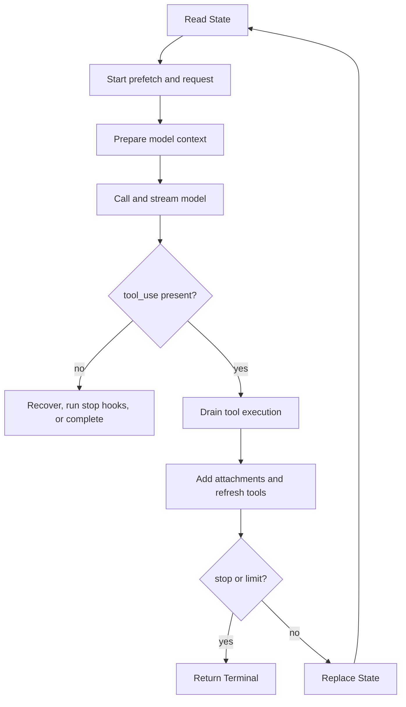
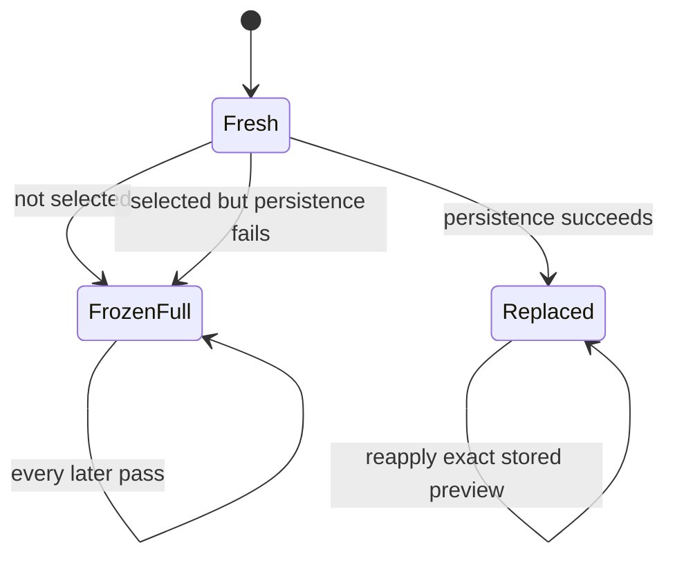
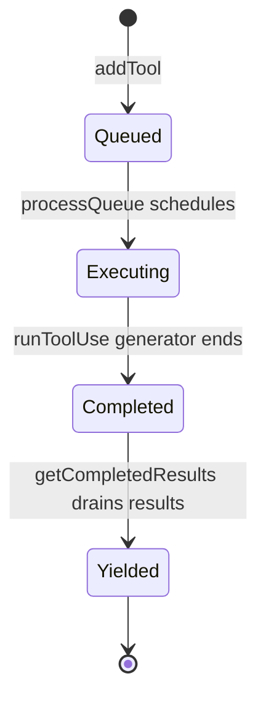

# Query Loop Internals

Source: `query.ts:241-1729` (`queryLoop()`)

---

## Purpose and reading model

This document is the source-order, statement-level walkthrough of
`queryLoop()`. The shorter [query-loop.md](./query-loop.md) describes the
subsystem and its major flows; this document explains how the implementation
advances from one source region to the next, what each region reads and writes,
and why the ordering matters.

“Line by line” here means every executable region and control-flow branch is
covered in source order. Logging, profiling, and instrumentation calls are
grouped with the operation they measure. Line numbers identify the recovered
source snapshot and may drift; function and variable names are the durable
retrieval handles.

---

## Function contract (`query.ts:241-251`)

`queryLoop()` is an async generator with two output channels:

- `yield` publishes intermediate request events, messages, tombstones, and
  tool-use summaries.
- `return` produces one `Terminal` value describing why the loop stopped.

`params` supplies the initial conversation, prompts, tools, authorization
callback, limits, and injectable dependencies. `consumedCommandUuids` is an
out-parameter owned by `query()`: the loop appends IDs when queued commands
become attachments, and the wrapper marks them complete after normal exit.

The caller does not send actions through `next(value)`. Injected callbacks and
`ToolUseContext` provide capabilities; yielded values report observable work.

---

## State model (`query.ts:252-304`)

### Immutable inputs

The initial destructure extracts values that remain fixed for one invocation:

| Value | Role |
|---|---|
| `systemPrompt`, `userContext`, `systemContext` | Prompt layers assembled before each API call. |
| `canUseTool` | Injected tool-authorization callback. |
| `fallbackModel` | Optional retry model. |
| `querySource` | Identifies SDK, REPL, agent, compaction, and memory callers. |
| `maxTurns` | Hard cap on model/tool follow-up iterations. |
| `skipCacheWrite` | Suppresses API cache writes when requested. |
| `deps` | Test seam for model calls, compaction, and UUID generation. |

### Cross-iteration register

`state` is the explicit state-machine register. Each continuation replaces the
entire object.

| Field | Initial value | Meaning |
|---|---|---|
| `messages` | `params.messages` | Conversation entering context preparation. |
| `toolUseContext` | `params.toolUseContext` | Tools, app state, abort controller, file state, and options. |
| `maxOutputTokensOverride` | caller value | Per-request output-token override. |
| `autoCompactTracking` | `undefined` | Compaction turn ID, age, and failure count. |
| `stopHookActive` | `undefined` | Whether a blocking stop hook caused the previous continuation. |
| `maxOutputTokensRecoveryCount` | `0` | Number of truncation recoveries consumed. |
| `hasAttemptedReactiveCompact` | `false` | One-shot reactive-compaction guard. |
| `turnCount` | `1` | Model call number within the user turn. |
| `pendingToolUseSummary` | `undefined` | Prior tool-batch summary promise. |
| `transition` | `undefined` | Reason the preceding iteration continued. |

`budgetTracker` persists across transitions when `TOKEN_BUDGET` is compiled in.
`taskBudgetRemaining` is loop-local because it changes only at compaction sites.
Before compaction the server sees full history; afterward the client carries
forward tokens summarized out of view.

`buildQueryConfig()` snapshots runtime configuration once. The once-per-turn
memory prefetch is bound with `using`, guaranteeing disposal on return, throw,
or generator closure. Its complete lifecycle is described below.

### Relevant-memory prefetch (`query.ts:297-304`,
`utils/attachments.ts:2196-2541`)

`startRelevantMemoryPrefetch()` performs query-time recall of existing memory
files. It does not create or consolidate memories. It is called before entering
`while (true)`, so at most one memory-selection request runs for the entire user
turn, even when tools or recovery cause several loop iterations.

The function returns `undefined` unless all startup gates pass:

1. Auto-memory is enabled.
2. Runtime flag `tengu_moth_copse` is true.
3. History contains a non-meta user message.
4. That message has extractable text.
5. The trimmed text contains whitespace; single-word prompts are skipped.
6. Previously surfaced memory content is below the session byte limit.

`collectSurfacedMemories()` derives both the surfaced-path set and byte count
from existing `relevant_memories` attachments. Because it scans current
messages rather than separate state, full compaction naturally resets the
throttle when old attachments leave the active history.

When the gates pass, the prefetch:

1. extracts the last real user prompt;
2. collects recently successful tool names since the preceding real user turn;
3. creates a child abort controller linked to the query controller;
4. calls `getRelevantMemoryAttachments()` with active agent definitions,
   cumulative `readFileState`, successful tools, and already surfaced paths;
5. converts non-abort failures into an empty result while logging them.

Memory-directory selection is prompt-sensitive. An agent mention searches that
agent's configured memory directory; otherwise recall searches the default
auto-memory directory. Candidate selection runs concurrently across directories,
filters paths already surfaced or present in `readFileState`, and retains at
most five results. `readMemoriesForSurfacing()` then reads selections in
parallel, limiting each file to 200 lines and 4096 bytes. Truncated content is
kept with a note directing the model to use the read tool for the full file;
individual read failures are dropped.

The returned `MemoryPrefetch` handle contains:

| Field | Lifecycle |
|---|---|
| `promise` | Resolves to zero or more attachments; errors are already contained. |
| `settledAt` | Starts `null`; `promise.finally()` records settlement time. |
| `consumedOnIteration` | Starts `-1`; the query loop sets it after injection. |
| `[Symbol.dispose]()` | Aborts outstanding work and emits latency/consumption telemetry. |

Linking the child controller to `toolUseContext.abortController` makes Escape
cancel the side request immediately. The `using` binding adds a second safety
net: every generator exit aborts remaining work and records whether the result
was hidden by the first iteration.

At `query.ts:1592-1614`, collection is deliberately zero-wait. The loop consumes
the promise only when `settledAt !== null` and `consumedOnIteration === -1`.
If it is still running, the current iteration proceeds and a later tool
iteration may try again. Before injection,
`filterDuplicateMemoryAttachments()` removes files read, written, edited, or
surfaced while the side request was running. Survivors are then recorded in
`readFileState`; doing this after filtering avoids treating the prefetch's own
selections as pre-existing reads. Each surviving attachment is yielded and
appended to `toolResults`, then the handle records `turnCount - 1`.

#### Practical effect on the model request

Relevant-memory prefetch does **not** rewrite the user's original text. It may
add hidden `<system-reminder>` context to a later model request, normally after
the first model response has requested tools and those tools have completed.

```text
User prompt
  ├─ main queryLoop starts the model request
  └─ memory selector starts asynchronously
       ├─ inspect the last real user prompt
       ├─ select up to five relevant memory files
       └─ read at most 200 lines / 4096 bytes from each

Model requests tools
  -> tools execute
  -> post-tool collection point
       ├─ prefetch unfinished: skip without waiting
       └─ prefetch finished: deduplicate and add memories to next request
```

For example, suppose the user submits:

```text
Fix the authentication refresh bug
```

and recall selects `auth-refresh.md` containing a prior finding about preserving
the token audience during a retry. The first API request contains the ordinary
user message. If the model then calls `Read`, the second request is conceptually:

```jsonc
[
  {
    "role": "user",
    "content": "Fix the authentication refresh bug"
  },
  {
    "role": "assistant",
    "content": [{ "type": "tool_use", "id": "tool_1", "name": "Read" }]
  },
  {
    "role": "user",
    "content": [
      {
        "type": "tool_result",
        "tool_use_id": "tool_1",
        "content": "...current file contents..."
      },
      {
        "type": "text",
        "text": "<system-reminder>\nMemory: .../auth-refresh.md:\n\nPreserve the original token audience when retrying after a 401.\n</system-reminder>"
      }
    ]
  }
]
```

`normalizeAttachmentForAPI()` performs this conversion: each selected memory
becomes a meta user message whose stable header and content are wrapped in
`<system-reminder>` (`utils/messages.ts:3708-3721`). API normalization can merge
that reminder with the preceding user tool-result message
(`utils/messages.ts:2269-2290`). Thus the model sees the original request,
current tool output, and historical context together; the user did not type the
memory text and the visible user prompt is unchanged.

Common outcomes make the timing easier to see:

| Situation | Effect |
|---|---|
| Model answers without tools | The no-tool branch returns before the post-tool collection point, so the prefetched memory is not injected. |
| Prefetch finishes before tools finish | Selected memories are appended to the next model request. |
| Prefetch is still running after tools | The loop does not wait. A later iteration that reaches the post-tool collection point may consume it. |
| Model independently reads a selected memory file | `readFileState` deduplication removes the prefetched copy. |
| Memory was already surfaced in active history | It is excluded so the five-file selection budget can be used for new material. |
| Prompt is a single word such as `continue` | Prefetch never starts because the prompt lacks enough selection context. |

If a slow prefetch misses one post-tool collection point, it is not guaranteed
to appear later: another iteration must reach that collection point. If the
next model response ends without tools, the loop completes before another
memory check. Full compaction can make an old memory eligible again because its
prior attachment has left active model context.

In practical terms, relevant-memory prefetch is speculative retrieval that may
enrich a future tool-follow-up request without delaying the current request. It
does not create a visible user turn and does not guarantee injection.

### Skill-discovery prefetch: recovered boundary (`query.ts:65-68`,
`query.ts:323-335`, `query.ts:1617-1628`)

Skill discovery has a different lifetime. The module is loaded only when the
compile-time `EXPERIMENTAL_SKILL_SEARCH` feature exists, and one prefetch is
started at the top of each loop iteration rather than once per user turn:

```ts
startSkillDiscoveryPrefetch(null, messages, toolUseContext)
```

The available call-site comments establish these behaviors:

- an internal write-pivot guard returns early for non-write iterations;
- discovery overlaps context preparation, model streaming, and tool execution;
- this path replaces a formerly blocking `assistant_turn` discovery call;
- initial user-input discovery remains a separate blocking attachment path;
- the post-tool collection point awaits
  `collectSkillDiscoveryPrefetch()` and converts every returned attachment into
  a message that is both yielded and appended to `toolResults`;
- collection emits `hidden_by_main_turn` telemetry indicating whether main-turn
  work fully hid prefetch latency.

The referenced implementation module,
`services/skillSearch/prefetch.ts`, is absent from this recovered checkout.
Consequently, its handle shape, candidate-ranking algorithm, precise write
pivot, cancellation semantics, error handling, and deduplication rules cannot
be verified here. Those details must not be inferred from the two call sites.

#### Why discovery is needed when QueryEngine already loads skills

There are three different skill surfaces, and only one is the full runtime
inventory:

```text
QueryEngine SDK inventory       model-facing discovery       SkillTool
-------------------------       ----------------------       ---------
Tell the outer SDK client       Tell the model which         Resolve and load
which skills exist              skill may be relevant        the selected skill
```

QueryEngine calls `getSlashCommandToolSkills()` only after it has built
`userContext` (`QueryEngine.ts:288-308`, `QueryEngine.ts:529-551`). The result is
passed to `buildSystemInitMessage({ skills })`, an SDK-facing initialization
event. It is not added to `userContext`, `systemContext`, or `systemPrompt` and
therefore is not automatically part of the Anthropic API request made by
`queryLoop()`.

The model learns ordinary skill names through a separate `skill_listing`
attachment. `getSkillListingAttachments()` formats the listing within a budget,
and `normalizeAttachmentForAPI()` converts it to a meta user
`<system-reminder>` (`utils/attachments.ts:2661-2750`,
`utils/messages.ts:3728-3737`). The SkillTool prompt itself contains invocation
rules but no embedded inventory; it explicitly tells the model that available
skills are announced in system-reminder messages
(`tools/SkillTool/prompt.ts:173-195`).

Without experimental skill search, this model-facing listing contains the
runtime skill commands, subject to a one-percent context-window character
budget. Names are retained, but non-bundled descriptions can be shortened or
reduced to names only (`tools/SkillTool/prompt.ts:20-170`). In that mode, the
model is close to the proposed design: inspect the static list, choose a skill,
then call SkillTool to load it.

With skill search enabled, however, the full static list is deliberately not
sent. `getSkillListingAttachments()` calls `filterToBundledAndMcp()` and retains
only bundled and MCP skills; if that subset exceeds 30 entries it falls back to
bundled-only. Source comments identify user, project, and plugin skills as the
potentially 200-plus “long tail” routed through discovery
(`utils/attachments.ts:2638-2659`, `utils/attachments.ts:2685-2697`). Remote
skills are also model-discovered and never appear in the static listing
(`tools/SkillTool/SkillTool.ts:1024-1026`).

```text
Full runtime skill registry
  ├─ bundled skills ────────── static model-facing listing
  ├─ MCP skills ────────────── static model-facing listing
  ├─ user skills ───────────── on-demand discovery
  ├─ project skills ────────── on-demand discovery
  ├─ plugin skills ─────────── on-demand discovery
  └─ remote skills ─────────── model discovery only
```

Discovery still does not execute a skill. It exposes a candidate name and
description; the model must then invoke SkillTool, which resolves the current
runtime registry and loads the selected skill's full instructions. The runtime
registry remains the source of truth even if the transcript contains an old
listing.

#### Practical inter-turn effect

Turn-zero discovery uses the original user text and runs as a blocking
attachment task during initial input assembly
(`utils/attachments.ts:789-813`). Inter-turn discovery handles intent that
becomes clear only after the model has inspected the project:

```text
User: Fix why publishing fails
  -> model reads package and CI configuration
  -> evidence reveals a release/provenance workflow problem
  -> a later iteration reaches a write pivot
  -> discovery identifies a release-workflow skill
  -> model invokes SkillTool("release-workflow")
  -> SkillTool loads and executes the full skill
```

At each query-loop iteration, prefetch starts before context preparation and
model streaming. If the recovered module's write-pivot guard finds no relevant
write trajectory, it returns early. Otherwise discovery overlaps the main
request and tool execution. After tools, the loop awaits collection, yields
each returned attachment, and appends it to the next model context.

```text
start skill discovery
       │
       ├──────── runs concurrently ────────┐
       │                                    │
       │  context → model stream → tools    │
       │                                    │
       └──────────── collect result ◀────────┘
```

This prefetch placement is specifically a latency optimization. The older
`assistant_turn` discovery call blocked during attachment processing, while
source comments report that 97% of those calls found nothing. The replacement
starts work earlier and records `hidden_by_main_turn`; comments expect main-turn
latency to hide discovery in more than 98% of cases because discovery takes
roughly 250-573 ms while model/tool turns usually take 2-30 seconds
(`query.ts:323-330`, `query.ts:1617-1619`). Prefetch does not make selection
itself cheaper; it removes most selection latency from the critical path.

The architectural and performance motivations are therefore separate:

| Mechanism | Purpose |
|---|---|
| On-demand skill discovery | Avoid sending the entire long-tail catalog and find skills made relevant by the evolving trajectory. |
| Inter-turn prefetch | Hide discovery latency beneath work the query loop already performs. |
| SkillTool | Load and execute the full instructions for a skill already identified by the model. |

The available `Attachment` union includes a `skill_discovery` shape carrying
name, description, optional short ID, signal, and source
(`utils/attachments.ts:538-542`). However, both the discovery implementation
and its feature-gated API-normalization path are absent from this checkout, so
the exact rendered reminder and ranking behavior cannot be reconstructed.
`dynamic_skill` is a separate UI-only attachment, while `skill_listing` is the
static announcement described above; neither should be assumed to be the
prefetch result.

This also explains the design boundary precisely: if the model genuinely
received the complete, current skill catalog on every API call, inter-turn
semantic discovery would be mostly redundant. In the experimental design it
does not: QueryEngine's complete list goes to the SDK host, and the model-facing
static list is intentionally reduced so discovery can cover the long tail.

---

## Iteration overview



---

## 1. Enter an iteration (`query.ts:306-364`)

At the top of `while (true)`, `toolUseContext` is copied to a mutable local;
all other state fields are destructured as iteration-constant bindings. A prior
iteration affects them only by reaching `state = next; continue`.

Skill discovery starts for the current message view and overlaps model/tool
work. Unlike memory recall, this occurs once per loop iteration and is bounded
by the feature-gated recovered interface described above. The loop then yields
`stream_request_start`, records profiling markers, and creates query tracking:

- an existing chain keeps its ID and increments depth;
- a new chain receives a UUID at depth zero.

Tracking is copied into `toolUseContext` and follows all downstream tool work
and transitions.

---

## 2. Build the model-facing context (`query.ts:365-549`)

This pipeline converts iteration history into the exact API message view. Its
order is deliberate.

### Compact-boundary cut (`query.ts:365-367`)

`getMessagesAfterCompactBoundary()` discards history before the last full
compact boundary. Spreading creates a working array, so transforms do not
mutate `State.messages`. Prior autocompaction metadata becomes local `tracking`.

### Tool-result budget (`query.ts:369-394`)

`applyToolResultBudget()` protects the model from a batch of parallel tool
results whose aggregate size is excessive. This is distinct from the ordinary
per-tool persistence limit:

```text
per-tool persistence
  protects against one enormous result

applyToolResultBudget()
  protects against many individually acceptable results
  merged into one API user message
```

For example, six parallel 40K-character results may each remain below their
individual limit but form a 240K user message after API normalization. The
default aggregate limit is 200,000 characters
(`constants/toolLimits.ts:35-49`), with a positive finite GrowthBook
`tengu_hawthorn_window` override taking precedence.

The query-loop wrapper passes four values:

```ts
applyToolResultBudget(
  messagesForQuery,
  toolUseContext.contentReplacementState,
  persistReplacements ? recordContentReplacementCallback : undefined,
  toolsWithInfiniteResultLimits,
)
```

The wrapper itself (`utils/toolResultStorage.ts:911-936`) is intentionally
small. If state is undefined it returns the original array. Otherwise it calls
`enforceToolResultBudget()`, forwards newly created replacement records to the
optional transcript callback, and returns the transformed messages.

#### Detailed contract and invariants

The function family has two contracts:

```ts
applyToolResultBudget(
  messages: Message[],
  state: ContentReplacementState | undefined,
  writeToTranscript?: (records: ToolResultReplacementRecord[]) => void,
  skipToolNames?: ReadonlySet<string>,
): Promise<Message[]>

enforceToolResultBudget(
  messages: Message[],
  state: ContentReplacementState,
  skipToolNames?: ReadonlySet<string>,
): Promise<{
  messages: Message[]
  newlyReplaced: ToolResultReplacementRecord[]
}>
```

Preconditions and ownership:

| Input | Ownership and assumptions |
|---|---|
| `messages` | Ordered internal conversation history. The algorithm reads it but never mutates the array, messages, content arrays, or blocks in place. |
| `state` | Stable, mutable, per-conversation-thread decision store. `enforceToolResultBudget()` mutates both collections in place. |
| `writeToTranscript` | Notification callback for decisions created by this invocation only. It is not called for cached reapplications. |
| `skipToolNames` | Tool names whose fresh results are frozen in full and excluded from aggregate accounting. |

Postconditions:

1. Every eligible candidate ID encountered is in `state.seenIds` when the
   promise resolves.
2. `state.replacements.keys()` is a subset of `state.seenIds`.
3. An ID already in `seenIds` without a replacement never gains one later.
4. An ID already in `replacements` always receives the exact stored string in
   the returned message view.
5. `newlyReplaced` contains only successful first-time replacements from this
   invocation.
6. If no replacement is required, the exact input `messages` array is returned.
7. If replacements are required, the outer array is new, but unchanged message
   objects retain reference identity.

The core state invariant can be written as:

```text
replacement(id) exists  =>  id ∈ seenIds

id ∈ seenIds and replacement(id) absent
  => id is permanently full-content/frozen

replacement(id) exists
  => every future model-facing view uses replacement(id) byte-for-byte
```

#### Exact control-flow algorithm

The implementation at `utils/toolResultStorage.ts:769-908` is equivalent to:

```text
groups := collectCandidatesByMessage(messages)
nameById := buildToolNameMap(messages) only when skipToolNames is non-empty
limit := getPerMessageBudgetLimit() once for this invocation

replacementMap := empty Map       // replacements applied to returned messages
toPersist := empty list           // fresh candidates selected for disk write
newlyReplaced := empty list       // transcript records created this call

for each candidate group:
    partition group into mustReapply, frozen, fresh

    for each mustReapply candidate:
        replacementMap[id] := state.replacements[id]

    if fresh is empty:
        add every group ID to seenIds
        continue

    skipped := fresh candidates whose tool name is exempt
    add every skipped ID to seenIds
    eligible := fresh minus skipped

    frozenSize := sum(size of frozen)
    freshSize := sum(size of eligible)

    if frozenSize + freshSize > limit:
        selected := largest-first candidates from eligible
                    until estimated remainder <= limit
    else:
        selected := empty

    synchronously add every non-selected group ID to seenIds
    append selected candidates to toPersist

if replacementMap is empty and toPersist is empty:
    return original messages and no records

persist every candidate in toPersist concurrently

for each persistence result, in original toPersist order:
    add candidate ID to seenIds
    if persistence failed:
        leave it without a replacement (permanently frozen full)
    else:
        replacementMap[id] := generated preview
        state.replacements[id] := generated preview
        newlyReplaced += exact serializable record

if replacementMap is empty:
    return original messages and no records

return replaceToolResultContents(messages, replacementMap), newlyReplaced
```

The budget limit is sampled once per enforcement call. A runtime flag change
can affect only fresh groups encountered afterward; prior full/preview choices
remain frozen independently of the new limit.

#### 1. Reconstruct API-level message groups

Internal messages do not map one-to-one to Anthropic API messages. Parallel
results may appear internally as:

```text
assistant tool_use A+B+C
user tool_result A
progress
user tool_result B
attachment
user tool_result C
```

`normalizeMessagesForAPI()` merges those user-side values into one wire user
message. `collectCandidatesByMessage()` mirrors that behavior
(`utils/toolResultStorage.ts:575-639`):

- user messages contribute candidate blocks;
- progress, attachment, and system messages do not break a group;
- a new assistant response normally creates a boundary;
- repeated assistant fragments with the same message ID do not create a new
  boundary, because API normalization merges them.

The budget therefore sees `size(A) + size(B) + size(C)`, not three independent
under-budget messages. This is especially important when progress messages
interleave with parallel results.

The grouping scan maintains two local registers:

```ts
groups: ToolResultCandidate[][]
current: ToolResultCandidate[]
seenAsstIds: Set<string>
```

Its transition rules are:

| Current internal message | Action |
|---|---|
| `user` | Extract eligible result blocks and append them to `current`. |
| First occurrence of assistant message ID `X` | Flush non-empty `current`, clear it, and add `X` to `seenAsstIds`. |
| Later occurrence of assistant message ID `X` | Do not flush; API normalization will merge this fragment with the earlier `X`. |
| Progress, attachment, system, tombstone, or other message | Ignore for grouping; it is filtered or merged and does not create a wire boundary. |
| End of input | Flush non-empty `current`. |

Two non-obvious traces demonstrate why assistant identity, rather than simple
adjacency, is used.

Consecutive fragments of the same streamed assistant response:

```text
internal:
  assistant X: tool_use A
  user: result A
  assistant X: tool_use B
  user: result B

scan:
  assistant X first    -> flush empty; remember X
  result A             -> current=[A]
  assistant X repeated -> no flush
  result B             -> current=[A,B]
  EOF                  -> groups=[[A,B]]
```

Interleaved coordinator/teammate responses:

```text
internal:
  assistant X: tool_use A
  user: result A
  assistant Y: tool_use B
  user: result B
  assistant X: tool_use C
  user: result C

scan:
  X first    -> remember X
  A          -> current=[A]
  Y first    -> flush [A]; remember Y
  B          -> current=[B]
  X repeated -> no flush
  C          -> current=[B,C]
  EOF        -> groups=[[A],[B,C]]
```

That second grouping mirrors `normalizeMessagesForAPI()` walking backward past
different-ID assistant messages to merge later fragments of the same response.
It is not equivalent to simply splitting on every internal assistant object.

#### 2. Extract eligible results

`collectCandidatesFromMessage()` considers a block only when it is a non-empty
`tool_result` with no image content and is not already represented by a
`<persisted-output>` string (`utils/toolResultStorage.ts:498-573`). String size
is `content.length`; arrays sum their text-block lengths without allocating a
serialized copy.

`queryLoop()` also exempts tools whose `maxResultSizeChars` is infinite. Read is
the main example: it bounds its own output, and persisting Read output merely to
tell the model to Read the persisted file would be circular. Exempt results are
marked seen but do not count toward the fresh aggregate budget.

#### 3. Freeze prior decisions

`ContentReplacementState` is carried on `ToolUseContext` for the lifetime of a
conversation thread:

```ts
type ContentReplacementState = {
  seenIds: Set<string>
  replacements: Map<string, string>
}
```

Candidates are partitioned by `tool_use_id`
(`utils/toolResultStorage.ts:641-667`):

| Category | Meaning |
|---|---|
| `mustReapply` | Previously replaced; reuse the exact cached preview string. |
| `frozen` | Previously shown in full; never replace it on a later turn. |
| `fresh` | Never shown to the model; eligible for a new decision. |

This protects prompt-cache prefixes. If a 40K result was sent in full on one
turn, replacing it with a preview on a later turn would change already cached
bytes. Conversely, regenerating an old preview could change paths, wording, or
formatting. The implementation therefore reapplies the stored string exactly
and never revisits an unreplaced result's fate.

The per-candidate state machine is:



| Before pass | Current action | State after pass | Wire representation |
|---|---|---|---|
| ID absent from both collections | Under budget or exempt | Add to `seenIds` | Original full content |
| ID absent from both collections | Selected; persist succeeds | Add to `seenIds` and `replacements` | New persisted preview |
| ID absent from both collections | Selected; persist fails | Add only to `seenIds` | Original full content |
| ID in `seenIds`, absent from `replacements` | No new budget decision | Unchanged | Original full content |
| ID in `replacements` | Map lookup | Unchanged | Exact stored preview |

There is deliberately no transition from `FrozenFull` to `Replaced`, even if a
later group is over budget. There is also no regeneration transition from
`Replaced` to a newly formatted preview.

#### 4. Select fresh results

For each API-level group, the function calculates:

```text
frozenSize + eligibleFreshSize
```

If the total exceeds the limit, `selectFreshToReplace()` sorts fresh results
largest-first and selects until its estimated remainder is within budget
(`utils/toolResultStorage.ts:669-692`). Frozen results are never selected. If
frozen content alone exceeds the limit, the overage is accepted until a later
compaction removes it.

Selection subtracts each original result's full size before the preview exists.
Because a replacement includes an approximately 2K preview, the final wire
message can remain slightly above the nominal limit; the limit is a context
heuristic rather than an exact serialized-byte guarantee.

Worked selection example, with a 200K limit:

```text
frozen results: F=70K
fresh results:  A=90K, B=60K, C=40K

initial estimated total = 70 + 90 + 60 + 40 = 260K
sort fresh descending   = [A=90, B=60, C=40]
select A                = estimated remainder 170K
stop                    = 170K <= 200K
```

The returned wire view contains full F/B/C plus A's approximately 2K preview:

```text
actual approximate visible total = 70 + 60 + 40 + 2 = 172K
```

If `F` alone were 230K, every fresh candidate could be replaced and the group
would still exceed 200K. The implementation accepts this because changing F
would violate prefix stability; microcompaction or later full compaction owns
removal of that old content.

#### 5. Persist and replace concurrently

Selected fresh candidates are persisted concurrently. `persistToolResult()`
writes them beneath:

```text
<project-session-dir>/<session-id>/tool-results/<tool-use-id>.txt
<project-session-dir>/<session-id>/tool-results/<tool-use-id>.json
```

Files use exclusive `wx` creation, so replay does not rewrite an existing file.
Arrays containing non-text content cannot be persisted. A successful result is
replaced with:

```text
<persisted-output>
Output too large (...). Full output saved to: .../tool-results/<id>.txt

Preview (first 2 KB):
...
</persisted-output>
```

The preview is constructed by `buildLargeToolResultMessage()`
(`utils/toolResultStorage.ts:186-199`). The model retains immediate context and
can explicitly read the saved file when it needs the remainder.

After each persistence attempt, the ID is marked seen. Success atomically adds
the exact preview to `state.replacements`; failure leaves the original content
and freezes that full-content decision. `replaceToolResultContents()` then
shallow-clones only messages and blocks whose content changes
(`utils/toolResultStorage.ts:694-726`).

The mutation timing around the persistence `await` is load-bearing:

```text
before Promise.all:
  mark every non-selected ID seen synchronously
  do not mark selected IDs yet

await concurrent disk writes

after each result:
  failure -> add ID to seenIds
  success -> add ID to seenIds and replacements in the same synchronous step
```

If a selected ID were added to `seenIds` before its write completed, another
observer could temporarily see `seen=true` and `replacement=absent`, classify
the result as frozen-full, and build a different prompt prefix. Delaying both
updates until after the await avoids that intermediate state. The code is
prepared for contexts that may eventually share state concurrently even though
ordinary cache-sharing forks currently clone it.

`Promise.all()` preserves the input ordering of `toPersist` in
`freshReplacements`, regardless of disk-write completion order. Transcript
records and state updates therefore follow deterministic selection order.

Object identity after `replaceToolResultContents()` is precise:

```text
message has no selected result
  -> return original Message reference

message contains selected result
  -> clone Message
  -> clone message payload
  -> allocate a new content array
  -> clone only selected tool_result blocks
  -> retain all unrelated block references
```

This minimizes allocations while ensuring neither persistent history nor the
caller's array is modified in place.

#### 6. Record decisions for resume

Each new successful replacement produces:

```ts
{
  kind: 'tool-result',
  toolUseId,
  replacement, // exact string shown to the model
}
```

`queryLoop()` supplies a transcript callback only for resumable
`repl_main_thread*` and `agent:*` sources. It writes a separate
`content-replacement` transcript entry through
`recordContentReplacement()` (`utils/sessionStorage.ts:1113-1125`,
`utils/sessionStorage.ts:1494-1499`). Ephemeral forked callers do not persist
these decisions because they do not read them back on resume.

On resume, `reconstructContentReplacementState()` marks every loaded candidate
ID seen, restores recorded exact replacement strings, and can inherit parent
replacements for cache-sharing subagent forks
(`utils/toolResultStorage.ts:938-1011`). Thus the resumed request uses the same
full-content or preview representation as the original process.

The transcript record is metadata alongside ordinary message rows; it does not
replace the original stored tool-result row:

```text
JSONL message row:
  original user/tool_result content

JSONL content-replacement row:
  toolUseId -> exact model-facing preview

resume:
  load original messages
  load replacement records
  reconstruct state
  reapply preview while building the next API view
```

Keeping original content in message history permits deterministic replay while
the separate record preserves exactly what the model saw. Main-thread records
are indexed by `sessionId`; subagent records carry `agentId` and are written to
the sidechain file (`utils/sessionStorage.ts:1200-1207`,
`utils/sessionStorage.ts:3682-3693`).

Resume reconstruction is conservative:

1. Re-run candidate grouping over loaded messages.
2. Add every candidate ID to `seenIds`, even if no replacement record exists.
   Presence in the transcript proves that the model previously saw the result,
   so it must be frozen.
3. Restore a record only if its kind is `tool-result` and its ID still exists in
   active candidates. Records for compacted-away IDs are ignored.
4. For a resumed fork, fill missing mappings from the parent state's live
   replacements. Explicit sidechain records take precedence.

This gap-fill is required because a cache-sharing fork can inherit a parent's
preview without creating a new sidechain record: reapplication is not a
`newlyReplaced` decision. On resume, the original sidechain message plus parent
mapping must reproduce that inherited preview.

#### 7. Feature and caller boundaries

`provisionContentReplacementState()` returns undefined unless runtime flag
`tengu_hawthorn_steeple` is enabled. In that case a cold thread receives fresh
state; a resumed thread reconstructs state immediately so content the model
previously saw in full is frozen before the first new budget pass.

The recovered REPL explicitly provisions this state. QueryEngine's SDK
`ToolUseContext` construction does not visibly set `contentReplacementState`,
so this mechanism is a no-op on that path unless another integration supplies
the state.

REPL lifecycle details:

- initial mount calls `provisionContentReplacementState()` once through a lazy
  React state initializer, avoiding repeated O(messages × blocks)
  reconstruction on render (`screens/REPL.tsx:1492-1505`);
- `/resume` reconstructs after switching session ID so new files and metadata
  target the resumed session (`screens/REPL.tsx:1912-1925`);
- in-session branching preserves the existing state because tool-use IDs are
  retained;
- `/clear`, rewind, and compaction do not clear the maps. Stale UUID keys cannot
  match new tool uses and are therefore inert;
- forked agents clone parent state to preserve the same cache prefix without
  sharing mutable collections (`utils/forkedAgent.ts:402`);
- AgentTool resume reconstructs sidechain decisions and fills inherited gaps
  from the parent (`tools/AgentTool/resumeAgent.ts:63-79`).

#### Failure and exclusion matrix

| Condition | Immediate result | Persistent state | Later behavior |
|---|---|---|---|
| Feature state absent | Return original array | No mutation | Enforcement remains disabled for that context. |
| No eligible candidate | Return original array | No relevant mutation | Nothing to reapply. |
| Candidate contains image block | Excluded before partition | ID is not learned by this mechanism | Image remains untouched. |
| Content already starts with `<persisted-output>` | Excluded before partition | Existing mechanism owns it | No double persistence. |
| Tool name is exempt | Full content retained | ID added to `seenIds` | Permanently frozen full. |
| Group is under budget | Full content retained | Fresh IDs added to `seenIds` | Permanently frozen full. |
| Group is over budget | Largest eligible fresh results selected | Non-selected IDs frozen immediately | Selected IDs await persistence. |
| Selected array contains non-text block | Persistence returns an error | ID frozen full | It is never retried or replaced later. |
| Directory/file write fails except `EEXIST` | Persistence returns an error and logs | ID frozen full | Original content remains stable. |
| File already exists (`EEXIST`) | Reuse deterministic path and build preview | ID becomes replaced | Exact preview cached and recorded. |
| Transcript callback absent | Preview still applied in memory | State retains mapping | Ephemeral caller works, but no process-resume reconstruction exists. |
| `recordContentReplacement()` rejects | `query.ts` catches and logs the detached promise rejection | Live state still retains mapping | Resume durability may be lost; current process remains consistent. |
| Frozen content alone exceeds limit | Accept overage | Frozen state unchanged | Later compaction must remove it. |
| Runtime limit changes | New limit applies only to fresh groups | Old decisions unchanged | Cached prefixes remain stable. |

#### Complexity and resource bounds

Let `M` be internal messages, `B` total content blocks, `C` eligible candidates,
and `S` selected fresh results:

| Phase | Complexity |
|---|---|
| Candidate grouping | O(M + B) time, O(C + distinct assistant IDs) temporary space. |
| Tool-name map, when exemptions exist | O(M + B) time. |
| Partitioning | O(C) time. |
| Largest-first selection | O(F log F) per group for `F` fresh candidates. |
| Replacement application | O(M + B) time when any replacement exists. |
| Disk persistence | O(total selected content) I/O, launched concurrently for S files. |
| Long-lived state | O(number of seen IDs + total stored preview characters). |

Each replacement preview is approximately 2K characters plus wrapper text.
Stale state is bounded by the number of tool results encountered during the
REPL process; UUID-based lookup prevents semantic collision after history is
cleared or compacted.

#### End-to-end two-turn trace

Assume a 200K limit and three parallel fresh results:

```text
A=120K, B=70K, C=50K; total=240K
```

First enforcement:

```text
collect group                   -> [A,B,C]
partition                       -> fresh=[A,B,C]
sort                            -> [A=120,B=70,C=50]
select A                        -> estimated remainder=120K
mark B,C seen                   -> frozen full
persist A                       -> tool-results/A.txt
mark A seen + store preview     -> replaced
return wire group               -> [preview(A), full(B), full(C)]
emit transcript record          -> A -> exact preview(A)
```

Second enforcement after a new tool turn adds result D:

```text
old group [A,B,C]:
  A -> mustReapply exact preview
  B,C -> frozen full
  no new decision

new group [D]:
  D -> fresh
  evaluate independently against 200K
```

The 120K old group and new group are not summed across turns. The limit applies
per normalized user message, not to total conversation history. Full-history
growth is handled by microcompaction, context collapse, and autocompaction.

In compact form:

```text
applyToolResultBudget(messages)
  -> state absent: return unchanged
  -> group results as API normalization will group them
  -> exclude images, existing previews, and exempt tools
  -> reapply previous decisions exactly
  -> calculate each fresh aggregate group
  -> choose the largest fresh results
  -> persist full content and substitute stable previews
  -> record exact replacements for resume
  -> return transformed model-facing history
```

The load-bearing invariant is: once a tool result has been shown to the model,
either in full or as a preview, its representation never changes within that
conversation thread.

This transformation precedes microcompaction because cached microcompaction
matches `tool_use_id` rather than inspecting result content; the two mechanisms
therefore compose without depending on each other's representation.

### History snip (`query.ts:396-410`)

When enabled, snip rewrites the working view, reports estimated tokens freed,
and may yield a boundary signal. `snipTokensFreed` corrects later warning and
autocompaction calculations whose surviving usage metadata can be stale.

### Microcompaction (`query.ts:412-426`)

`deps.microcompact()` receives the budgeted/snipped view. Cached
microcompaction defers its boundary: only the later API response contains the
authoritative `cache_deleted_input_tokens` value.

### Context-collapse projection (`query.ts:428-447`)

Context collapse projects its commit log over the working view before full
autocompaction. If granular summaries reduce the request sufficiently, full
conversation summarization can be avoided. Projection yields nothing; its
store is separate from the REPL history.

### Proactive autocompaction (`query.ts:449-543`)

The loop assembles the full system prompt and calls `deps.autocompact()` with
the current view, cache-safe prompt inputs, query source, prior tracking, and
snip correction.

On success it:

1. records token and usage metrics;
2. updates task-budget carryover from the final pre-compact context;
3. resets compaction tracking with a new turn ID;
4. builds and yields post-compact summary, attachment, hook, and boundary
   messages;
5. uses those post-compact messages for the API call in the same iteration.

On failure it preserves the reported consecutive-failure count for the next
iteration's circuit breaker. Finally, `toolUseContext.messages` is replaced
with the exact prepared view, so tools and hooks see what the model sees.

---

## 3. Prepare model execution (`query.ts:551-650`)

Four iteration-local accumulators are created:

- `assistantMessages`: internal assistant output from this model call;
- `toolResults`: normalized tool results and attachments for the next call;
- `toolUseBlocks`: every observed tool request;
- `needsFollowUp`: reliable tool-continuation signal.

The code does not trust `stop_reason === 'tool_use'`; observing a real
`tool_use` block sets `needsFollowUp`.

If streaming tool execution is enabled, `StreamingToolExecutor` is created
before the API call. Otherwise blocks are collected for `runTools()`. Runtime
model selection considers permission mode, configured model, and plan-mode
large-context behavior. Internal builds also create one prompt-dump fetch
wrapper per iteration to avoid retaining request bodies in many closures.

The hard blocking-limit check is skipped after successful compaction, for
compaction/memory workers, and when reactive compaction or context collapse
must observe a real API overflow. Otherwise it subtracts snip savings from the
estimate. At the limit it yields a synthetic prompt-too-long message and
returns `blocking_limit` before the API call.

The media-recovery flag is sampled once so the streaming-withhold and
post-stream-recovery branches cannot disagree if experiment state changes.

---

## 4. Call and stream the model (`query.ts:650-954`)

### Nested retry scopes

The outer `try` converts thrown model/runtime failures to terminal output. The
inner `while (attemptWithFallback)` and `try` allow model fallback without
leaving the current state-machine iteration.

### Request construction (`query.ts:659-708`)

`deps.callModel()` receives the prepared history with user context prepended,
full system prompt, thinking configuration, tools, abort signal, selected
model, agents, MCP state, effort/advisor settings, cache behavior, query
tracking, and task budget. Permission context is fetched lazily from app state.

### Streaming fallback repair (`query.ts:709-741`)

If the lower API layer abandons a partial streaming attempt, the next event
causes the loop to:

1. yield tombstones for assistant messages already exposed;
2. clear assistant/tool accumulators and `needsFollowUp`;
3. discard and recreate the streaming executor.

This removes invalid partial thinking blocks and prevents old tool results from
being paired with fallback tool IDs.

### Outward message clone (`query.ts:742-787`)

For assistant tool-use messages, `backfillObservableInput()` may add legacy or
derived fields needed by SDK/transcript consumers. The loop clones only when
fields were added. The original message remains byte-stable for API replay and
prompt caching; overwrites such as expanded paths are not serialized outward.

### Recoverable-error withholding (`query.ts:788-825`)

Prompt-too-long, media-size, and max-output-token assistant errors can be
withheld from the caller. They are still appended to `assistantMessages`, so
post-stream code can recover or later yield the exact error. This prevents a
temporary error from appearing before a successful retry.

### Assistant and tool accumulation (`query.ts:826-862`)

Every assistant message enters `assistantMessages`. Its tool blocks enter
`toolUseBlocks`, set `needsFollowUp`, and are submitted immediately to the
streaming executor when active. After every model event, already-completed tool
updates are yielded and normalized user tool-results enter `toolResults`.

### Deferred cache boundary (`query.ts:866-892`)

After streaming, cached microcompaction subtracts its captured baseline from
cumulative API deletion usage. A positive delta produces a boundary containing
actual deleted-token savings.

### Model fallback (`query.ts:893-953`)

On `FallbackTriggeredError`, the loop switches model, repairs missing tool
results, clears attempt-local arrays, recreates the streaming executor, updates
the context model, strips model-bound thinking signatures in internal builds,
yields a warning, and continues the inner retry loop. Other errors propagate to
the outer catch.

---

## 5. Convert thrown failures (`query.ts:955-997`)

Image size/resize exceptions yield a friendly assistant error and return
`image_error`. Other exceptions first synthesize missing tool results for any
exposed tool uses, then yield the real assistant API error and return
`model_error` with the original exception.

Repairing missing results preserves the invariant that every exposed
`tool_use` has a matching `tool_result`, even though no later API call occurs.

---

## 6. Post-stream ordering (`query.ts:999-1060`)

Post-sampling hooks fire asynchronously when assistant output exists.

Abort is then handled before summaries, recovery, stop hooks, or ordinary tool
processing. A streaming executor is fully drained so it can generate synthetic
results for queued/running tools; without one, missing results are synthesized
directly. Optional computer-use cleanup runs, non-submit aborts yield an
interruption message, and the loop returns `aborted_streaming`.

Only after the abort check does the loop await and yield the prior iteration's
tool-use summary. Its generation overlapped the current model stream.

---

## 7. No-tool completion and recovery (`query.ts:1062-1358`)

This branch runs when no tool block was observed.

### Collapse-drain retry (`query.ts:1065-1117`)

For a withheld 413, context collapse gets first recovery priority. Unless the
previous transition was already `collapse_drain_retry`, staged collapses are
committed. A non-empty result becomes a complete new `State` and restarts the
outer loop.

### Reactive compaction (`query.ts:1119-1183`)

Prompt-too-long and media failures may trigger full reactive compaction. On
success, task-budget carryover is updated, post-compact messages are yielded,
and a state containing only those messages continues with
`reactive_compact_retry`. The one-shot guard becomes true.

On failure the withheld error is yielded, stop-failure hooks run, and the loop
returns `prompt_too_long` or `image_error`. Stop hooks are skipped because no
valid model completion exists and a blocking hook could create a retry cycle.

### Output-token recovery (`query.ts:1185-1256`)

The withheld max-output error has two recovery levels:

1. An eligible capped request retries the same history with a 64k override via
   `max_output_tokens_escalate`.
2. While below the recovery limit, partial assistant output and a hidden resume
   instruction are appended via `max_output_tokens_recovery`.

If both are exhausted, the withheld error is yielded.

### API error, stop hooks, and token budget (`query.ts:1258-1358`)

Remaining API-error messages fire stop-failure hooks and return `completed`.
Here `completed` means the loop is finished; QueryEngine separately derives
outward success from the final message and stop reason.

`handleStopHooks()` can yield messages. A veto returns
`stop_hook_prevented`; blocking errors are appended to a new state with
`stop_hook_blocking`. The reactive-compaction guard is preserved to prevent a
compact/413/hook retry cycle.

When token-budget logic requests more useful work, assistant output plus a
hidden nudge becomes `token_budget_continuation`. Otherwise the loop returns
`completed`.

---

## 8. Execute and normalize tools (`query.ts:1360-1409`)

When `needsFollowUp` is true, the loop must account for every tool request before
constructing the next model call. Streaming execution starts tools at
`query.ts:842` and retrieves already completed work at `query.ts:851`; this
section at `query.ts:1360-1409` performs the final drain. Results are therefore
collected incrementally, not held until the entire batch completes.

### Execution layers

The raw tool interface is promise-based:

```ts
tool.call(
  input,
  context,
  canUseTool,
  assistantMessage,
  onProgress?,
): Promise<ToolResult>
```

`runToolUse()` wraps permission checks, hooks, progress callbacks, errors, and
that final promise in an `AsyncGenerator<MessageUpdateLazy>`. The orchestration
layers consume several such generators:

```text
Tool.call(): Promise<ToolResult>
  -> runToolUse(): progress + hook messages + final result
  -> StreamingToolExecutor / runTools(): scheduling and concurrency
  -> queryLoop(): outward yields + next-turn toolResults
```

One `Tool.call()` has one final `ToolResult`, but its wrapper may emit several
messages. Progress is transient; hook attachments and the normalized final
`user/tool_result` can all belong to the same invocation.

### Streaming executor state model

Each model `tool_use` becomes a `TrackedTool`
(`services/tools/StreamingToolExecutor.ts:19-32`):

```ts
type TrackedTool = {
  id: string
  block: ToolUseBlock
  assistantMessage: AssistantMessage
  status: 'queued' | 'executing' | 'completed' | 'yielded'
  isConcurrencySafe: boolean
  promise?: Promise<void>
  results?: Message[]
  pendingProgress: Message[]
  contextModifiers?: Array<(context: ToolUseContext) => ToolUseContext>
}
```

The status state machine is:



Unknown tools bypass normal execution: `addTool()` creates an immediately
`completed` tracked entry containing an error `tool_result`. Aborted queued tools
similarly become completed with synthetic results when execution is attempted.

### Line 842: enqueue and start without waiting (`query.ts:826-845`)

As assistant content blocks arrive from the API, the loop extracts their
`tool_use` blocks and calls:

```ts
for (const toolBlock of msgToolUseBlocks) {
  streamingToolExecutor.addTool(toolBlock, message)
}
```

`addTool()` performs four operations
(`services/tools/StreamingToolExecutor.ts:73-124`):

1. Resolve the tool definition by name.
2. Parse the model input with the tool's Zod schema.
3. Call `tool.isConcurrencySafe(parsedInput)`; parse failure or exception is
   conservatively classified as non-concurrent.
4. Append a `queued` entry and invoke `void processQueue()`.

The `void` call means model-stream processing does not await either scheduling
or tool completion.

### Parallel scheduling rules

`canExecuteTool()` examines all currently executing entries
(`services/tools/StreamingToolExecutor.ts:126-135`):

```text
no tool executing
  -> safe or unsafe next tool may start

all executing tools are concurrency-safe
  -> another safe tool may start
  -> unsafe tool waits

an unsafe tool is executing
  -> every other tool waits
```

`processQueue()` scans queued entries in registration order. A blocked unsafe
entry causes a `break`, preventing later calls from crossing its exclusive
ordering boundary. Whenever a running promise settles, `promise.finally()`
invokes `processQueue()` again so the next blocked stage can start.

Example:

```text
queue: A=Read(safe), B=Glob(safe), C=Edit(unsafe), D=Read(safe)

A starts ─┐
B starts ─┴─ parallel
C waits
D does not cross C's exclusive boundary

A and B finish
  -> C starts alone
  -> C finishes
  -> D starts
```

### How `executeTool()` creates actual parallelism

`processQueue()` syntactically awaits `executeTool()`, but `executeTool()` does
not await the long-running tool operation. It marks the entry executing, defines
`collectResults()`, starts it, stores its promise, and returns
(`services/tools/StreamingToolExecutor.ts:265-405`):

```ts
const promise = collectResults()
tool.promise = promise

void promise.finally(() => {
  void this.processQueue()
})
```

Consequently, scheduling behaves as:

```text
executeTool(A) -> store promiseA -> return
executeTool(B) -> store promiseB -> return
executeTool(C) -> wait if exclusive
```

`collectResults()` creates a per-tool child abort controller and consumes
`runToolUse()` independently. Non-progress messages accumulate in the entry's
`results[]`; progress enters `pendingProgress[]` and wakes any drain waiting for
progress. Context modifiers are collected separately. When the generator ends,
the entry becomes `completed`.

Only non-concurrent tools apply context modifiers to the executor's shared
context. Concurrent-tool context modifiers are explicitly unsupported, avoiding
nondeterministic concurrent context mutation.

### Line 851: non-blocking retrieval during model streaming

After every yielded model-stream value, `queryLoop()` polls:

```ts
for (const result of streamingToolExecutor.getCompletedResults()) {
  if (result.message) {
    yield result.message
    toolResults.push(
      ...normalizeMessagesForAPI([result.message], tools)
        .filter(message => message.type === 'user'),
    )
  }
}
```

`getCompletedResults()` is a synchronous generator
(`services/tools/StreamingToolExecutor.ts:407-440`). It never waits:

1. Drain every entry's pending progress immediately.
2. Skip entries already marked `yielded`.
3. For a completed entry, change status to `yielded`, emit every buffered result,
   and remove its ID from the in-progress set.
4. Stop scanning at an executing non-concurrent tool because it is an ordering
   barrier.

An executing concurrency-safe tool does not block later safe completions from
being emitted. Therefore safe result order can differ from tool-request order:

```text
A safe: still executing
B safe: completed

getCompletedResults() may emit B before A
```

Exclusive tools preserve the required barrier. “Buffered and ordered” therefore
means ordered where concurrency safety requires it, not global request-order
serialization.

Each emitted message is handled immediately. It is yielded outward for UI/SDK
observers, then normalized. Only normalized user messages enter `toolResults`,
because those contain the model-facing `tool_result` blocks. Progress can be
visible outward without becoming next-turn API content.

### Final blocking drain (`query.ts:1380-1409`)

When model streaming ends, opportunistic polling is no longer sufficient. The
loop selects:

```ts
const toolUpdates = streamingToolExecutor
  ? streamingToolExecutor.getRemainingResults()
  : runTools(toolUseBlocks, assistantMessages, canUseTool, toolUseContext)
```

`getRemainingResults()` waits while any tracked entry is not yet `yielded`
(`services/tools/StreamingToolExecutor.ts:449-490`):

```text
while unfinished tools exist:
  process newly unblocked queue entries
  drain completed results and progress

  if tools still execute and nothing is ready:
    await Promise.race(executing tool promises, progress notification)

perform one final completed-result drain
return
```

`Promise.race()` wakes the drain when the first tool completes or any tool emits
progress; it does not mean the whole batch is considered complete. The enclosing
`while` repeats until every tool reaches `yielded`.

For every update in the final drain, `queryLoop()`:

1. yields its message;
2. records `hook_stopped_continuation` attachments;
3. normalizes user/tool-result messages into the cumulative `toolResults` array;
4. applies a returned context, restoring current query tracking.

Only after the async generator terminates does execution proceed to tool-summary
generation, abort checks, attachments, and construction of the next `State`.

### Non-streaming fallback path

When `StreamingToolExecutor` is disabled, model streaming only accumulates tool
blocks. `runTools()` starts after the response finishes
(`services/tools/toolOrchestration.ts:19-82`). It partitions the calls into:

- consecutive concurrency-safe calls, executed concurrently;
- individual non-concurrent calls, executed serially.

Concurrent batches use `all()` with a default cap of ten
(`services/tools/toolOrchestration.ts:152-176`, `utils/generators.ts:31-72`).
`all()` starts up to the cap, repeatedly awaits `Promise.race()` across generator
`next()` calls, yields whichever update becomes available, and starts another
generator when one finishes. It returns only after its promise set is empty.

Serial batches fully consume one `runToolUse()` generator and apply its context
modifiers before starting the next tool. Thus both paths converge on the same
rule: the next model call begins only after every invocation has reached a
terminal result.

### Result aggregation semantics

There are two levels of accumulation:

```text
per tracked tool:
  results[] = non-progress messages emitted by that tool's runToolUse()

per query-loop iteration:
  toolResults[] = normalized user results from every completed tool
                  plus later attachment messages
```

Results are not returned as one batch object. They are added incrementally as
tools complete, but by the time the next state is constructed, every current
tool has contributed a real or synthetic terminal result.

Worked timeline:

```text
A=Read 300ms, B=Glob 100ms, C=WebFetch 500ms; all safe

t=0    A, B, C start while the model is still streaming
t=100  B completes; line 851 poll emits B; append B to toolResults
t=300  A completes; later poll emits A; append A to toolResults
t=400  model stream ends; enter getRemainingResults()
t=500  C completes; final drain emits C; append C to toolResults
       no unfinished entries remain; final drain returns
       queryLoop may now build the next model turn
```

The resulting array may reflect completion order:

```text
toolResults = [result B, result A, result C]
```

API normalization later preserves correct `tool_use_id` pairing; it does not
depend on array position alone.

### Abort and error completion

Waiting for every tool does not require normal success. The executor synthesizes
matching error `tool_result` messages for queued or running tools affected by
user abort, streaming fallback, or sibling Bash failure. Bash errors cancel
sibling subprocesses because parallel shell commands often form an implicit
dependency chain; independent Read/WebFetch failures do not cancel their
siblings.

The completion invariant is:

```text
before the next model API call:
  every emitted tool_use ID has a corresponding terminal tool_result
  and every tracked entry has reached yielded
```

One boundary remains: a tool may intentionally launch background work and return
a task handle. The executor waits for that immediate `Tool.call()` result, not
for detached work represented by the handle. Completion here means completion
of the tool invocation protocol, not necessarily completion of an external
background task.

---

## 9. Prepare tool follow-up (`query.ts:1411-1533`)

For eligible main-thread batches, tool summary generation starts without being
awaited. Inputs contain the last assistant text and each tool's name, input,
and matching result found by `tool_use_id`. The promise moves into the next
state and errors collapse to `null`.

Abort during tools performs optional cleanup, yields a tool interruption for
non-submit aborts, optionally emits max-turn data, and returns `aborted_tools`.
A hook continuation stop returns `hook_stopped`.

After a completed model/tool cycle, post-autocompact turn age increments.

---

## 10. Assemble attachments (`query.ts:1535-1676`)

Attachments are added only after all tool results because ordinary user content
cannot be interleaved into the assistant-tool-use/tool-result protocol pair.

The loop snapshots eligible queued commands. Sleep makes `later` notifications
eligible; otherwise only `next` notifications drain. Slash commands remain for
local dispatch. Main threads drain unscoped commands, while subagents drain
only task notifications addressed to their agent ID.

`getAttachmentMessages()` receives prospective history. Each attachment is
yielded and appended to `toolResults`.

The once-per-turn memory prefetch is consumed only when already settled and not
previously consumed. Results are filtered against cumulative read-file state;
if not settled, the loop waits zero time and can try again next iteration.

The per-iteration skill prefetch is treated differently: when a handle exists,
the loop awaits `collectSkillDiscoveryPrefetch()` at this point. Its work was
started before the request, so model/tool latency normally hides the wait. Each
returned attachment is yielded and appended to the next model context.

Only commands actually converted to prompt/task-notification attachments are
removed. Their lifecycle becomes `started`; completion is deferred to the
outer `query()` wrapper.

Finally, `refreshTools()` can expose newly connected MCP tools to the next
iteration, and query tracking is reattached to the resulting context.

---

## 11. Build the next turn (`query.ts:1678-1728`)

`nextTurnCount` increments when tool results are about to drive another model
call. Optional background-session task summaries use the exact prospective
history.

If `maxTurns` would be exceeded, the loop yields `max_turns_reached` and returns
`max_turns`. Otherwise it replaces `State` with:

```ts
{
  messages: [...messagesForQuery, ...assistantMessages, ...toolResults],
  toolUseContext: toolUseContextWithQueryTracking,
  autoCompactTracking: tracking,
  turnCount: nextTurnCount,
  maxOutputTokensRecoveryCount: 0,
  hasAttemptedReactiveCompact: false,
  pendingToolUseSummary: nextPendingToolUseSummary,
  maxOutputTokensOverride: undefined,
  stopHookActive,
  transition: { reason: 'next_turn' },
}
```

Prepared history, context modifiers, refreshed tools, and compaction tracking
survive. Per-response output/reactive recovery guards reset. The summary
promise and stop-hook state move forward. Reaching the bottom of `while (true)`
starts the next iteration with this complete replacement.

---

## Transition table

| Transition or terminal | Trigger | Key effect |
|---|---|---|
| `collapse_drain_retry` | Withheld 413 and staged collapses | Retry with drained granular context. |
| `reactive_compact_retry` | Full reactive compact succeeds | Retry from post-compact messages; set guard. |
| `max_output_tokens_escalate` | First eligible capped overflow | Retry same history with 64k override. |
| `max_output_tokens_recovery` | Output overflow below retry limit | Append partial output and resume nudge. |
| `stop_hook_blocking` | Stop hook returns blocking errors | Append errors and mark hook active. |
| `token_budget_continuation` | More useful output budget remains | Append assistant output and budget nudge. |
| `next_turn` | Tools completed | Append assistant/tool results and increment turn. |
| `blocking_limit` | Pre-API hard token limit | Yield prompt-too-long error. |
| `image_error` | Image exception or unrecovered media failure | Yield error, then terminate. |
| `model_error` | Unexpected model/runtime throw | Repair tool pairs and yield real error. |
| `aborted_streaming` | Abort during model stream | Repair tool pairs before exit. |
| `prompt_too_long` | Withheld 413 cannot recover | Surface withheld error. |
| `stop_hook_prevented` | Stop hook veto | Stop without another model call. |
| `completed` | Clean end, budget end, or final API error | QueryEngine interprets final success. |
| `aborted_tools` | Abort during tool execution | Yield interruption/limit metadata as applicable. |
| `hook_stopped` | Tool hook prevents follow-up | Stop after tool/hook messages. |
| `max_turns` | Prospective follow-up exceeds limit | Yield structured limit attachment. |

---

## Critical ordering invariants

1. Tool-result budgeting, snip, microcompaction, collapse, and autocompaction
   run in that order.
2. Observable tool input is cloned for outward consumers; replay input remains
   cache-stable.
3. Recoverable errors remain accumulated while hidden and must be recovered or
   explicitly yielded before return.
4. Abort repair precedes all other post-stream actions so no exposed tool use
   lacks a result.
5. Tool results precede ordinary attachments in the next API sequence.
6. Tool summary generation overlaps the next model call.
7. Every continuation replaces complete `State` rather than mutating a subset
   of scalar registers.
8. A `Terminal` reason reports why the loop stopped; outward SDK success is a
   higher-layer QueryEngine decision.

---

## Related documents

- [query-loop.md](./query-loop.md) — subsystem overview.
- [query-engine.md](./query-engine.md) — headless consumer and session state.
- [permissions.md](./permissions.md) — `canUseTool` policy.
- [compaction.md](./compaction.md) — context-reduction strategies.
- [messages.md](./messages.md) — internal, SDK, and API message boundaries.
