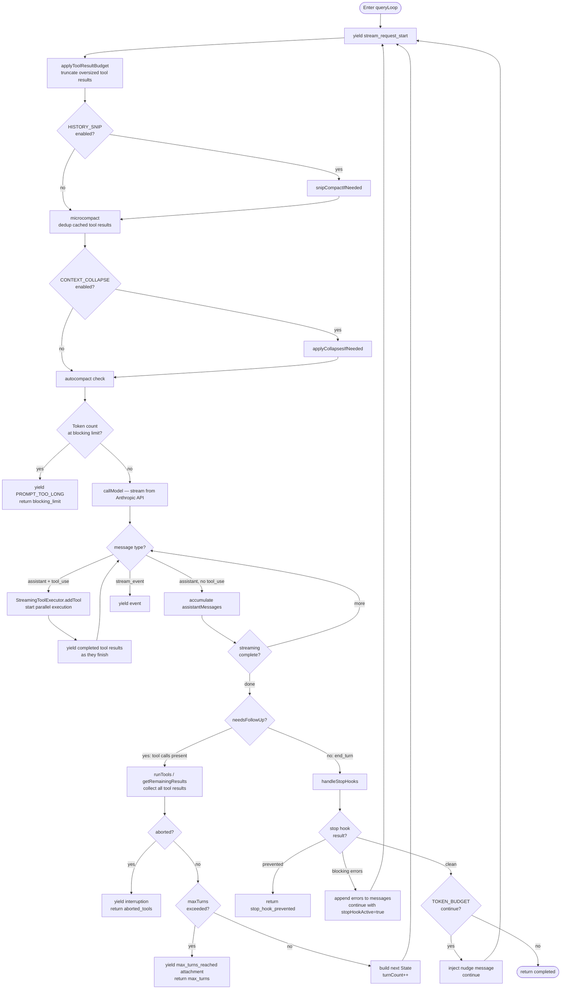
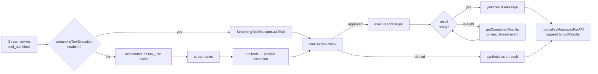
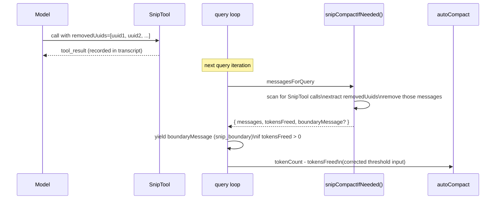
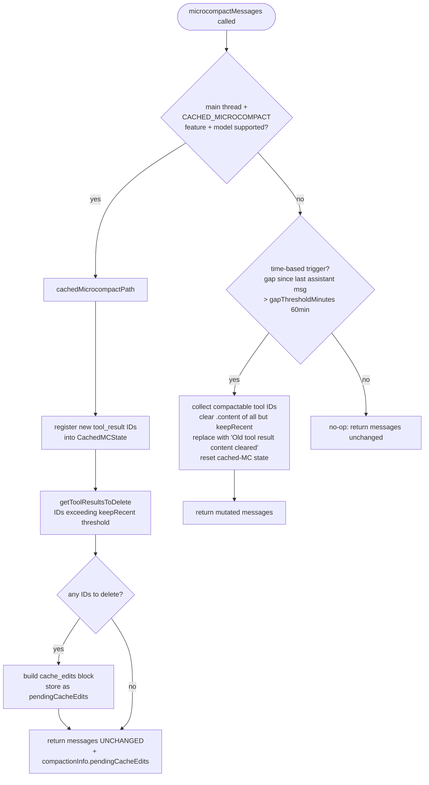
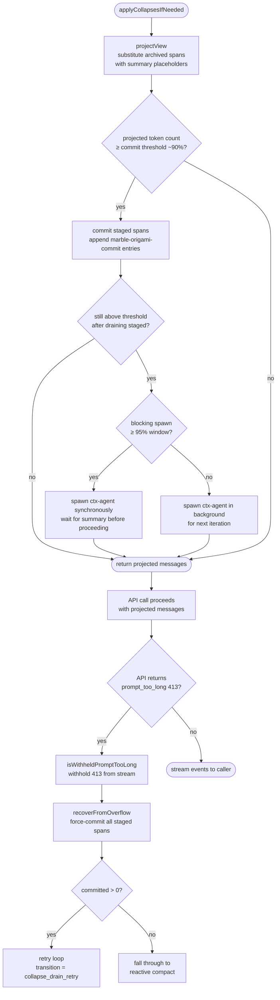
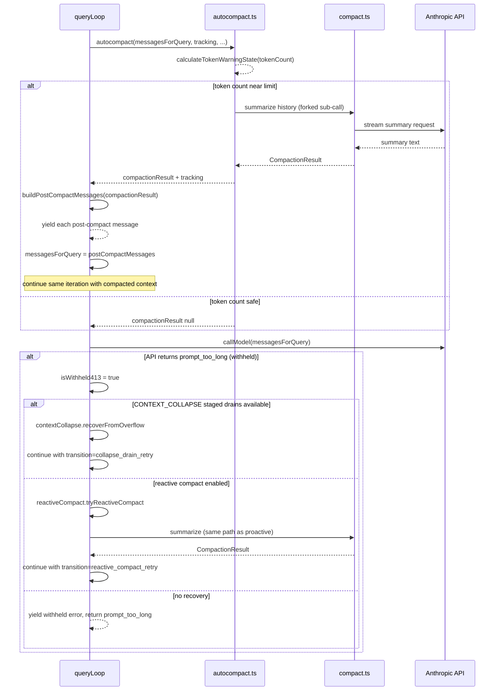
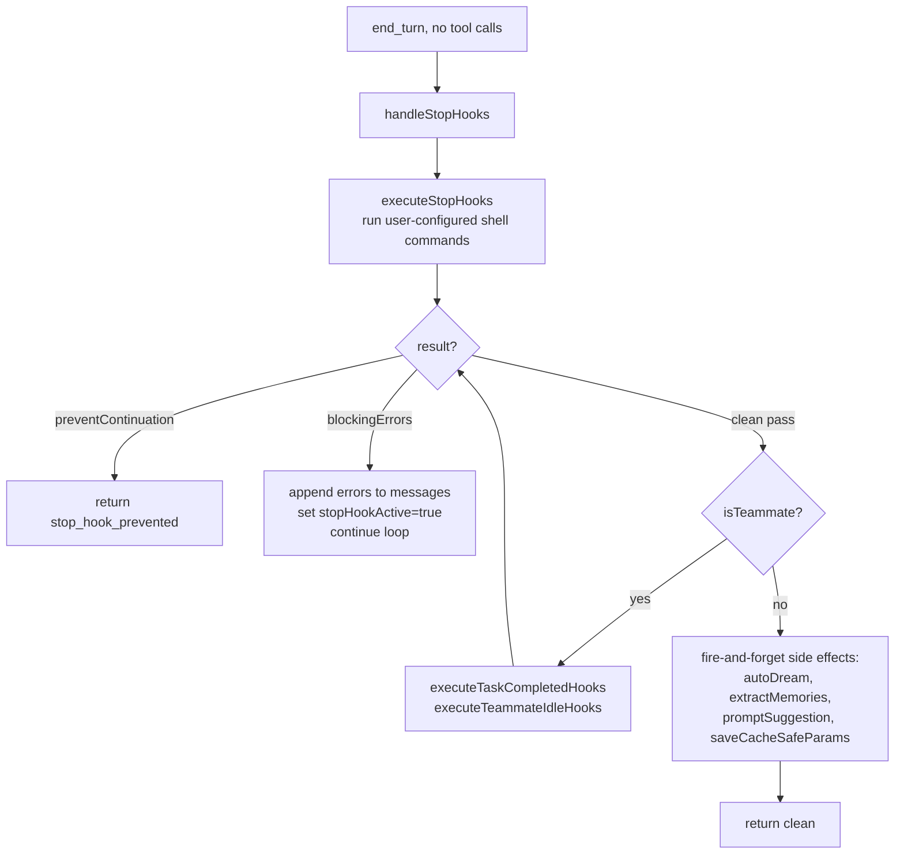

# Query Loop Design

## Purpose

`query.ts` implements the lower-level LLM call loop. The exported `query()` function is an async generator that drives a single user turn: it calls the Anthropic API, executes tool calls in parallel, handles context compaction, tracks token budgets, recovers from errors, and yields typed messages to its caller (**QueryEngine**).

`query()` wraps `queryLoop()`, which contains the `while(true)` main loop. The outer wrapper exists solely to fire `notifyCommandLifecycle('completed')` on any consumed slash commands when the loop exits normally.

---

## Public Interface

```ts
export type QueryParams = {
  messages: Message[]
  systemPrompt: SystemPrompt
  userContext: { [k: string]: string }
  systemContext: { [k: string]: string }
  canUseTool: CanUseToolFn
  toolUseContext: ToolUseContext
  fallbackModel?: string
  querySource: QuerySource
  maxOutputTokensOverride?: number
  maxTurns?: number
  skipCacheWrite?: boolean
  taskBudget?: { total: number }
  deps?: QueryDeps
}

export async function* query(
  params: QueryParams,
): AsyncGenerator<StreamEvent | RequestStartEvent | Message | TombstoneMessage | ToolUseSummaryMessage, Terminal>
```

The generator yields zero or more `Message | StreamEvent` values and then **returns** a `Terminal` object describing why the loop ended (e.g. `{ reason: 'completed' }`, `{ reason: 'max_turns' }`, `{ reason: 'aborted_tools' }`).

---

## Loop State

All mutable cross-iteration state is bundled in a single `State` object. Continue sites replace the whole struct atomically; this makes every transition point explicit.

| Field | Type | Description |
|---|---|---|
| `messages` | `Message[]` | Full conversation history carried into the next iteration |
| `toolUseContext` | `ToolUseContext` | Tool registry, abort controller, app state accessor |
| `autoCompactTracking` | `AutoCompactTrackingState \| undefined` | Tracks turns since last compact and consecutive failures |
| `maxOutputTokensRecoveryCount` | `number` | Number of max-output-tokens retries consumed (cap: 3) |
| `hasAttemptedReactiveCompact` | `boolean` | Guards against infinite reactive-compact spirals |
| `maxOutputTokensOverride` | `number \| undefined` | Escalated token cap for a single retry iteration |
| `pendingToolUseSummary` | `Promise<...> \| undefined` | Haiku summary of previous turn's tool calls, resolved during streaming |
| `stopHookActive` | `boolean \| undefined` | Whether the previous iteration was driven by a stop-hook blocking error |
| `turnCount` | `number` | Monotonically increasing turn counter for `maxTurns` enforcement |
| `transition` | `Continue \| undefined` | Why this iteration started; `undefined` on the first iteration |

---

## Main Loop Flowchart



---

## Tool Execution Flow

Tool calls arrive as `tool_use` blocks inside an assistant message. Two parallel paths exist:

- **StreamingToolExecutor** (default, `config.gates.streamingToolExecution`): tools begin executing as soon as their `tool_use` block appears in the stream. Results are yielded via `getCompletedResults()` interleaved with the ongoing stream.
- **`runTools()`** (fallback): executes all tools after the stream finishes.

Both paths call `canUseTool` per tool to enforce permission mode, and both produce `UserMessage` or `AttachmentMessage` tool-result objects that are appended to `toolResults` for the next iteration.



When the abort controller fires during tool execution, `StreamingToolExecutor.getRemainingResults()` generates synthetic error results for any in-flight tools so the message history never has an unmatched `tool_use` block.

---

## History Snip (`HISTORY_SNIP`)

History Snip is an **ant-only, compile-time gated** (`feature('HISTORY_SNIP')`) strategy where the **model itself** decides which old conversation turns to remove. Every other compaction mechanism is system-driven (thresholds, timers). Snip is model-driven.

### The three moving parts

**`SnipTool`** — registered into the active tool list (`tools.ts:123`) when the feature is on. The model calls it mid-turn with a list of message UUIDs it considers stale. The tool call is recorded in the transcript like any other tool use.

**`[id:UUID]` tags** — before every API call, `sanitizeMessagesForAPI` (`messages.ts:2351`) injects an `[id:UUID]` tag into every non-meta user message (after all merging, so the tag always matches the surviving message's `uuid`). This gives the model stable handles to reference specific turns when calling `SnipTool`.

**`snipCompactIfNeeded()`** — the pre-call cleanup. Runs **first** in the query loop (`query.ts:401`), before microcompact. Scans `messagesForQuery` for recorded `SnipTool` calls, extracts the `removedUuids` they carried, and physically removes those messages from the array.



Returns `tokensFreed` — the rough delta of removed tokens. This is subtracted from `tokenCountWithEstimation` before the autocompact threshold check (`query.ts:638`, `autoCompact.ts:225`) so the system doesn't falsely trigger autocompact in the window between snip clearing space and the stale usage counter catching up.

### Nudge mechanism — `context_efficiency` attachment

When `shouldNudgeForSnips(messages)` returns true (the conversation has grown without recent snips or boundaries), `getContextEfficiencyAttachment()` (`attachments.ts:3963`) emits a `context_efficiency` attachment. This becomes a `<system-reminder>` meta user message carrying `SNIP_NUDGE_TEXT` — a prompt hint telling the model to call `SnipTool` on turns it no longer needs. The nudge interval resets on prior nudges, snip markers, snip boundaries, and compact boundaries.

### REPL vs SDK — two views of history

The REPL keeps the full original `messages` array for UI scrollback, exactly like context collapse's projection model:

- **Model-facing path**: `getMessagesAfterCompactBoundary()` (`messages.ts:4648`) calls `projectSnippedView()` (`snipProjection.js`) to filter snipped messages out before the array reaches the API.
- **SDK / QueryEngine**: a `snipReplay` callback (`QueryEngine.ts:1278`) is injected into `QueryEngineConfig`. On each yielded `snip_boundary` system message it calls `snipCompactIfNeeded(store, { force: true })` and truncates `mutableMessages` in-place — bounding memory in long headless sessions where there is no UI to preserve.

### Session restore

`applySnipRemovals()` (`sessionStorage.ts:1982`) runs during resume. It walks the transcript, finds all entries carrying `snipMetadata.removedUuids`, and deletes those UUIDs from the message map. It then relinks survivors whose `parentUuid` now points to a deleted entry using path-compressed backward resolution, so resumed sessions see the same trimmed history the model last saw.

### Comparison with other compaction mechanisms

| | History Snip | microcompact | context collapse | auto-compact |
|---|---|---|---|---|
| Who decides | **The model** | System (count/time) | System (token threshold) | System (token threshold) |
| Granularity | Individual messages by UUID | Tool result content | Conversation spans | Entire history |
| Output | Messages physically removed | Content zeroed / cache-edited | Projection (summary placeholder) | New summarised array |
| Order in loop | **1st** | 2nd | 3rd | 4th |
| Gating | ant-only, compile-time DCE | ant-only (cached) / all (time-based) | ant-only, compile-time DCE | All builds |
| `tokensFreed` plumbed to autocompact | Yes | No | No (owns threshold) | N/A |
| Nudge to model | `context_efficiency` attachment | No | No | `compaction_reminder` attachment |
| Force command | `/force-snip` | No | No | `/compact` |

---

## Microcompact

Microcompact is a lightweight, pre-API-call trim of old tool result content. It runs **first** in the query loop (before context collapse and auto-compact) on every iteration. Rather than summarising conversation history, it zeroes out the content of old `tool_result` blocks that are unlikely to be re-read by the model.

Only results from `COMPACTABLE_TOOLS` (FileRead, Bash, Grep, Glob, WebSearch, WebFetch, FileEdit, FileWrite) are eligible. The last `keepRecent` results (default: 5) are always preserved.

There are two active paths and one no-op:



### Cached microcompact (ant-only, `CACHED_MICROCOMPACT` feature)

Uses the Anthropic **cache editing beta API** (`cache-editing-2025-04-14`) to delete old tool results from the server's KV cache. The local `Message[]` array is returned **unchanged** — only the server-side cache is edited. This preserves the prompt cache prefix while reducing billed cache-read tokens.

After the API call returns, `consumePendingCacheEdits()` retrieves the queued block. `pinCacheEdits()` stores it by user-message position so it is re-sent on every subsequent request, maintaining the deletion in future cache hits. The microcompact boundary message (reporting `cache_deleted_input_tokens`) is deferred until after the API response so it uses the real server-reported savings rather than a client estimate.

### Time-based microcompact

Fires when the server-side 1-hour prompt cache has almost certainly expired (gap > 60 min, configured via GrowthBook flag `tengu_slate_heron`). Since the full prefix will be rewritten on the next call regardless, clearing old tool results before sending shrinks what gets re-transmitted and re-cached. Content is replaced in-place in the local `Message[]`; no cache-editing API is needed.

### Comparison with auto-compact

| | microcompact | auto-compact |
|---|---|---|
| Trigger | Every call (count/time threshold) | Token count > 93% effective window |
| Scope | Tool result content only | Entire conversation → single summary |
| Cache impact | Cache-editing: server KV preserved; time-based: cold, full rewrite | Full cache invalidation |
| Yields boundary message | Yes (microcompact boundary) | Yes (compact boundary) |

---

## Context Collapse

Context collapse (`CONTEXT_COLLAPSE` feature, internal codename **marble_origami**) is an incremental, span-by-span compaction strategy. It runs **second** in the query loop — after microcompact and **before** auto-compact, which it suppresses when enabled.

Instead of replacing the entire conversation with one summary (as auto-compact does), collapse replaces individual contiguous spans (one assistant turn + its tool calls + results) with a short LLM-generated summary. The REPL always holds the original, complete `messages` array; collapse operates through a **projection layer** (`projectView`) that the API call sees, not the source of truth.

### Collapse anatomy

```
Original messages:     [sys] [u1] [a1 + tools] [u2 tool_results] [u3] [a2] ...
                              ↑──── span 1 archived ────↑
After projectView:     [sys] [<collapsed id="1">summary</collapsed>] [u3] [a2] ...
```

A committed collapse stores:
- `firstArchivedUuid` / `lastArchivedUuid` — span boundary UUIDs in the original array
- `summaryContent` — the model-generated text substituted for the span
- Persisted as `marble-origami-commit` entries in the transcript (append-only log)

Staged collapses are summaries generated by the background ctx-agent but not yet committed. They are stored in the `ContextCollapseSnapshotEntry` (`type: 'marble-origami-snapshot'`) and committed when the token count crosses the commit threshold.

### Query loop integration



### Token threshold ladder

Three thresholds govern the collapse lifecycle:

| Threshold | Action |
|-----------|--------|
| ~90% effective window | Commit staged spans; spawn ctx-agent in background for next spans |
| ~95% effective window | **Blocking spawn** — ctx-agent runs synchronously, query loop waits |
| Real API 413 | `recoverFromOverflow` — drain entire staged queue in one shot, then retry |

Auto-compact sits at ~93% — between the 90% commit start and 95% blocking spawn — but is **suppressed** when context collapse is enabled to prevent the two systems from racing.

### The ctx-agent (`marble_origami` query source)

Summarization is performed by a forked sub-agent with `querySource === 'marble_origami'`. It has read-only access to the span being archived. It is explicitly excluded from auto-compact: if the ctx-agent's own context overflowed and auto-compact fired, `runPostCompactCleanup` would call `resetContextCollapse()`, destroying the main thread's committed log (shared module-level state). A guard in `autoCompact.ts` prevents this.

### State persistence

| Entry type | Purpose |
|-----------|---------|
| `marble-origami-commit` | Append-only log of committed collapses; replayed in order on session resume to reconstruct the projection |
| `marble-origami-snapshot` | Latest staged-queue snapshot; last-wins on restore |

On resume, `restoreFromEntries()` rebuilds the collapse store. `projectView` lazily fills the archived message arrays the first time it encounters each span boundary in the resumed messages.

### Comparison with auto-compact and microcompact

| | microcompact | context collapse | auto-compact |
|---|---|---|---|
| Order in loop | 1st | 2nd | 3rd |
| Scope | Tool result content | Per-span incremental summary | Full conversation summary |
| Granularity | Individual tool results | Individual conversation spans | Entire history |
| Original messages preserved | Content zeroed | Yes (projection only) | No — replaced |
| Cache impact | Cache-editing: no break; time-based: cold | None until commit | Full invalidation |
| Suppresses auto-compact | No | Yes (when enabled) | N/A |
| Emergency recovery | No | `recoverFromOverflow` on real 413 | Reactive compact fallback |
| External builds | No-op | Not compiled (DCE) | Always present |

---

## Compaction Sequence

Auto-compact fires proactively when the token count nears the model's context limit. Reactive compact fires retroactively when the API returns a `prompt_too_long` (413) error that was withheld from the caller during streaming.



---

## Token Budget Tracking

When the `TOKEN_BUDGET` feature flag is on, a **budget tracker** is created once per `queryLoop` entry and checked after every end-turn (no-tool-call) response.

```
createBudgetTracker() → BudgetTracker { continuationCount, lastDeltaTokens, ... }
```

`checkTokenBudget(tracker, agentId, getCurrentTurnTokenBudget(), getTurnOutputTokens())` returns:

- **`continue`** — token spend is below 90% of the budget target and not diminishing returns. The loop injects a meta user message (`nudgeMessage`) and continues without surfacing the decision to the caller.
- **`stop`** — budget exhausted, diminishing returns detected (delta < 500 tokens for 3+ consecutive continuations), or no active budget. The loop returns `completed`.

The feature is specifically for user-specified token targets (e.g. "+500k") and is independent of the context-window compaction system.

---

## Thinking Rules

The source embeds this comment verbatim — these are hard API constraints:

> **Rule 1.** A message that contains a `thinking` or `redacted_thinking` block must be part of a query whose `max_thinking_length > 0`.
>
> **Rule 2.** A thinking block may not be the last block in a content array.
>
> **Rule 3.** Thinking blocks must be preserved for the duration of an assistant trajectory: a single turn, and if that turn contains a `tool_use` block, also its subsequent `tool_result` and the following assistant message.

Violating these rules produces API errors. When a model fallback is triggered (`FallbackTriggeredError`), `stripSignatureBlocks()` removes protected-thinking blocks from history before retrying with the fallback model, because thinking signatures are model-bound.

---

## Error Recovery

### `max_output_tokens` (response truncated)

The error message is **withheld** from the caller during streaming. After the stream ends, three escalation stages fire in order:

1. **OTK escalation** (`tengu_otk_slot_v1` flag): if `maxOutputTokensOverride` is unset, retry the same request at `ESCALATED_MAX_TOKENS` (64k). Fires at most once per turn.
2. **Multi-turn recovery**: inject a meta user message instructing the model to continue from where it stopped. Up to `MAX_OUTPUT_TOKENS_RECOVERY_LIMIT` (3) retries.
3. **Surface the error**: recovery exhausted — yield the withheld error message and return.

### `FallbackTriggeredError` (model unavailable)

Caught inside the inner `while(attemptWithFallback)` loop. The current model is replaced with `fallbackModel`, orphaned partial messages are tombstoned, the streaming executor is discarded and recreated, and the full request is retried.

### Image / PDF errors (`ImageSizeError`, `ImageResizeError`)

Caught in the outer `try/catch`. A user-facing error message is yielded and the loop returns `image_error`.

---

## Stop Hooks

`handleStopHooks()` (`query/stopHooks.ts`) is called after every clean `end_turn` — that is, when no tool calls were made and no withheld error was detected.



When stop hooks inject blocking errors, the loop re-enters with `stopHookActive: true`. This flag is threaded through the next `handleStopHooks` call to prevent double-firing.

---

## Key Source Files

| File | Role |
|---|---|
| `~/git/claude-code/query.ts` | Main loop: `query()`, `queryLoop()`, `State` type |
| `~/git/claude-code/query/stopHooks.ts` | `handleStopHooks()` — stop hook execution and side effects |
| `~/git/claude-code/query/tokenBudget.ts` | `createBudgetTracker()`, `checkTokenBudget()` |
| `~/git/claude-code/query/config.ts` | `buildQueryConfig()` — immutable per-loop config snapshot |
| `~/git/claude-code/services/tools/StreamingToolExecutor.ts` | Parallel streaming tool execution |
| `~/git/claude-code/services/tools/toolOrchestration.ts` | `runTools()` — fallback serial/parallel executor |
| `~/git/claude-code/services/compact/autoCompact.ts` | `calculateTokenWarningState()`, `isAutoCompactEnabled()` |
| `~/git/claude-code/services/compact/compact.ts` | `buildPostCompactMessages()` |
| `~/git/claude-code/services/compact/reactiveCompact.ts` | `tryReactiveCompact()` — 413 recovery |
| `~/git/claude-code/utils/toolResultStorage.ts` | `applyToolResultBudget()` — per-message size enforcement |
