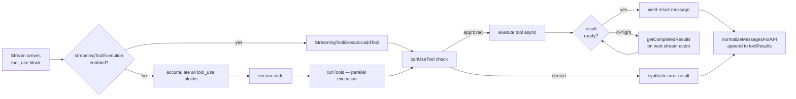
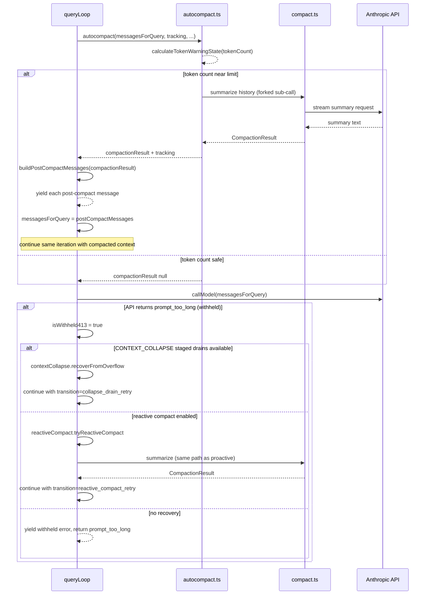
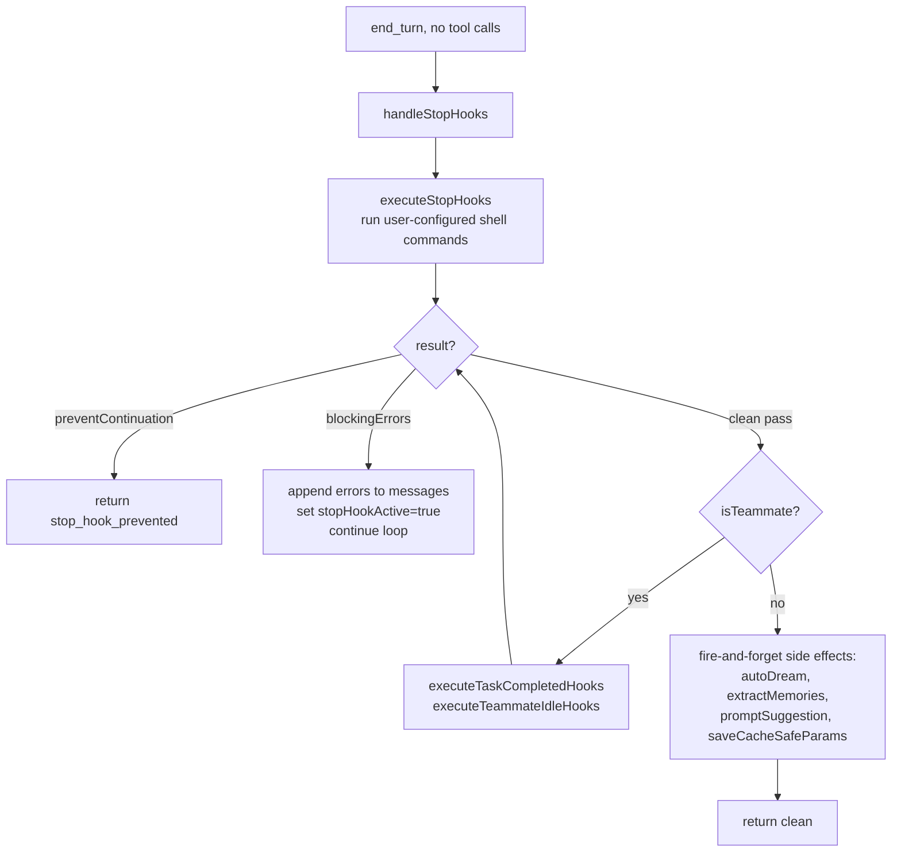

# Query Loop Design

## Purpose

`query.ts` implements the lower-level LLM call loop. The exported `query()` function is an async generator that drives a single user turn: it calls the Anthropic API, executes tool calls in parallel, handles context compaction, tracks token budgets, recovers from errors, and yields typed messages to its caller (**QueryEngine**).

`query()` wraps `queryLoop()`, which contains the `while(true)` main loop. The outer wrapper exists solely to fire `notifyCommandLifecycle('completed')` on any consumed slash commands when the loop exits normally.

---

## Public Interface

```ts
export type QueryParams = {
  messages: Message[]
  systemPrompt: SystemPrompt
  userContext: { [k: string]: string }
  systemContext: { [k: string]: string }
  canUseTool: CanUseToolFn
  toolUseContext: ToolUseContext
  fallbackModel?: string
  querySource: QuerySource
  maxOutputTokensOverride?: number
  maxTurns?: number
  skipCacheWrite?: boolean
  taskBudget?: { total: number }
  deps?: QueryDeps
}

export async function* query(
  params: QueryParams,
): AsyncGenerator<StreamEvent | RequestStartEvent | Message | TombstoneMessage | ToolUseSummaryMessage, Terminal>
```

The generator yields zero or more `Message | StreamEvent` values and then **returns** a `Terminal` object describing why the loop ended (e.g. `{ reason: 'completed' }`, `{ reason: 'max_turns' }`, `{ reason: 'aborted_tools' }`).

---

## Loop State

All mutable cross-iteration state is bundled in a single `State` object. Continue sites replace the whole struct atomically; this makes every transition point explicit.

| Field | Type | Description |
|---|---|---|
| `messages` | `Message[]` | Full conversation history carried into the next iteration |
| `toolUseContext` | `ToolUseContext` | Tool registry, abort controller, app state accessor |
| `autoCompactTracking` | `AutoCompactTrackingState \| undefined` | Tracks turns since last compact and consecutive failures |
| `maxOutputTokensRecoveryCount` | `number` | Number of max-output-tokens retries consumed (cap: 3) |
| `hasAttemptedReactiveCompact` | `boolean` | Guards against infinite reactive-compact spirals |
| `maxOutputTokensOverride` | `number \| undefined` | Escalated token cap for a single retry iteration |
| `pendingToolUseSummary` | `Promise<...> \| undefined` | Haiku summary of previous turn's tool calls, resolved during streaming |
| `stopHookActive` | `boolean \| undefined` | Whether the previous iteration was driven by a stop-hook blocking error |
| `turnCount` | `number` | Monotonically increasing turn counter for `maxTurns` enforcement |
| `transition` | `Continue \| undefined` | Why this iteration started; `undefined` on the first iteration |

---

## Main Loop Flowchart


---

## Tool Execution Flow

Tool calls arrive as `tool_use` blocks inside an assistant message. Two parallel paths exist:

- **StreamingToolExecutor** (default, `config.gates.streamingToolExecution`): tools begin executing as soon as their `tool_use` block appears in the stream. Results are yielded via `getCompletedResults()` interleaved with the ongoing stream.
- **`runTools()`** (fallback): executes all tools after the stream finishes.

Both paths call `canUseTool` per tool to enforce permission mode, and both produce `UserMessage` or `AttachmentMessage` tool-result objects that are appended to `toolResults` for the next iteration.



When the abort controller fires during tool execution, `StreamingToolExecutor.getRemainingResults()` generates synthetic error results for any in-flight tools so the message history never has an unmatched `tool_use` block.

---

## Compaction Sequence

Auto-compact fires proactively when the token count nears the model's context limit. Reactive compact fires retroactively when the API returns a `prompt_too_long` (413) error that was withheld from the caller during streaming.



---

## Token Budget Tracking

When the `TOKEN_BUDGET` feature flag is on, a **budget tracker** is created once per `queryLoop` entry and checked after every end-turn (no-tool-call) response.

```
createBudgetTracker() → BudgetTracker { continuationCount, lastDeltaTokens, ... }
```

`checkTokenBudget(tracker, agentId, getCurrentTurnTokenBudget(), getTurnOutputTokens())` returns:

- **`continue`** — token spend is below 90% of the budget target and not diminishing returns. The loop injects a meta user message (`nudgeMessage`) and continues without surfacing the decision to the caller.
- **`stop`** — budget exhausted, diminishing returns detected (delta < 500 tokens for 3+ consecutive continuations), or no active budget. The loop returns `completed`.

The feature is specifically for user-specified token targets (e.g. "+500k") and is independent of the context-window compaction system.

---

## Thinking Rules

The source embeds this comment verbatim — these are hard API constraints:

> **Rule 1.** A message that contains a `thinking` or `redacted_thinking` block must be part of a query whose `max_thinking_length > 0`.
>
> **Rule 2.** A thinking block may not be the last block in a content array.
>
> **Rule 3.** Thinking blocks must be preserved for the duration of an assistant trajectory: a single turn, and if that turn contains a `tool_use` block, also its subsequent `tool_result` and the following assistant message.

Violating these rules produces API errors. When a model fallback is triggered (`FallbackTriggeredError`), `stripSignatureBlocks()` removes protected-thinking blocks from history before retrying with the fallback model, because thinking signatures are model-bound.

---

## Error Recovery

### `max_output_tokens` (response truncated)

The error message is **withheld** from the caller during streaming. After the stream ends, three escalation stages fire in order:

1. **OTK escalation** (`tengu_otk_slot_v1` flag): if `maxOutputTokensOverride` is unset, retry the same request at `ESCALATED_MAX_TOKENS` (64k). Fires at most once per turn.
2. **Multi-turn recovery**: inject a meta user message instructing the model to continue from where it stopped. Up to `MAX_OUTPUT_TOKENS_RECOVERY_LIMIT` (3) retries.
3. **Surface the error**: recovery exhausted — yield the withheld error message and return.

### `FallbackTriggeredError` (model unavailable)

Caught inside the inner `while(attemptWithFallback)` loop. The current model is replaced with `fallbackModel`, orphaned partial messages are tombstoned, the streaming executor is discarded and recreated, and the full request is retried.

### Image / PDF errors (`ImageSizeError`, `ImageResizeError`)

Caught in the outer `try/catch`. A user-facing error message is yielded and the loop returns `image_error`.

---

## Stop Hooks

`handleStopHooks()` (`query/stopHooks.ts`) is called after every clean `end_turn` — that is, when no tool calls were made and no withheld error was detected.



When stop hooks inject blocking errors, the loop re-enters with `stopHookActive: true`. This flag is threaded through the next `handleStopHooks` call to prevent double-firing.

---

## Key Source Files

| File | Role |
|---|---|
| `~/git/claude-code/query.ts` | Main loop: `query()`, `queryLoop()`, `State` type |
| `~/git/claude-code/query/stopHooks.ts` | `handleStopHooks()` — stop hook execution and side effects |
| `~/git/claude-code/query/tokenBudget.ts` | `createBudgetTracker()`, `checkTokenBudget()` |
| `~/git/claude-code/query/config.ts` | `buildQueryConfig()` — immutable per-loop config snapshot |
| `~/git/claude-code/services/tools/StreamingToolExecutor.ts` | Parallel streaming tool execution |
| `~/git/claude-code/services/tools/toolOrchestration.ts` | `runTools()` — fallback serial/parallel executor |
| `~/git/claude-code/services/compact/autoCompact.ts` | `calculateTokenWarningState()`, `isAutoCompactEnabled()` |
| `~/git/claude-code/services/compact/compact.ts` | `buildPostCompactMessages()` |
| `~/git/claude-code/services/compact/reactiveCompact.ts` | `tryReactiveCompact()` — 413 recovery |
| `~/git/claude-code/utils/toolResultStorage.ts` | `applyToolResultBudget()` — per-message size enforcement |
