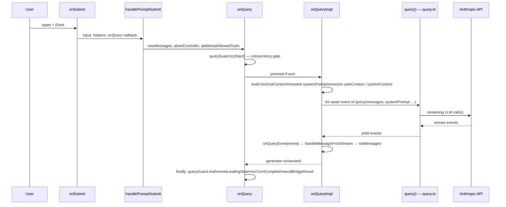
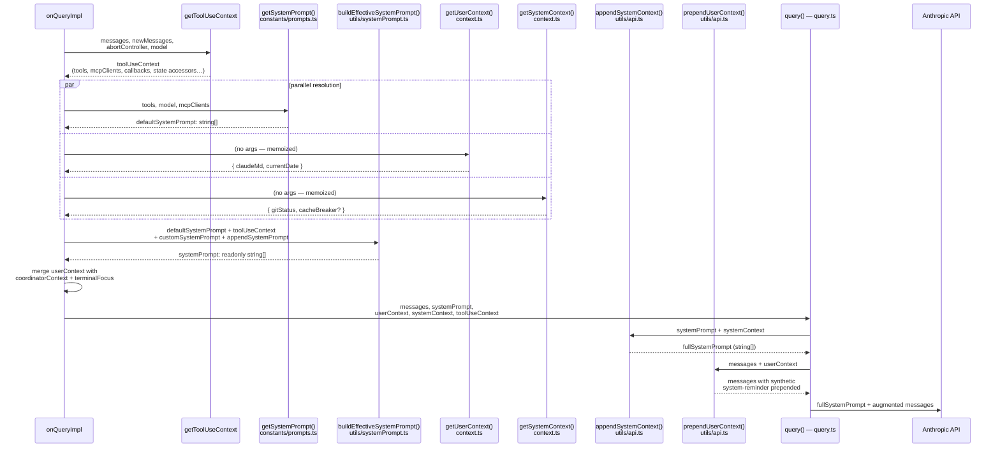

# screens/REPL.tsx — Interactive Terminal Screen

`REPL.tsx` (~5000 lines) is the root React/Ink component for interactive mode. It owns the full conversation loop: user input → LLM query → stream rendering → tool approval → state update. It calls `query()` from `query.ts` **directly** — `QueryEngine` is never imported or used here.

---

## Component Overview

```typescript
export function REPL(props: Props): React.ReactElement
```

### Props (`Props`, lines 526–570)

| Prop | Purpose |
|------|---------|
| `commands` | Slash commands (merged local + MCP + plugins) |
| `initialTools` | Tool list for this session |
| `initialMessages?` | Pre-populated conversation (resume/continue) |
| `pendingHookMessages?` | `Promise<HookResultMessage[]>` — SessionStart hook output, awaited before first API call |
| `mcpClients?` | Pre-connected MCP servers |
| `systemPrompt?` / `appendSystemPrompt?` | System prompt overrides |
| `onBeforeQuery?` | Hook called before each query; can veto |
| `onTurnComplete?` | Called after each completed turn |
| `remoteSessionConfig?` / `directConnectConfig?` / `sshSession?` | Remote transport configs |
| `thinkingConfig` | Extended thinking settings |
| `disableSlashCommands?` | Disable slash command processing |
| `taskListId?` | Ant-only task list watching |

---

## State Model

REPL manages two state layers:

**Local React state** (primary conversation state):

| State | Purpose |
|-------|---------|
| `messages: MessageType[]` | Main conversation array |
| `messagesRef` | Sync mirror of messages for stable closures (updated in the `setMessages` wrapper) |
| `abortController: AbortController \| null` | Current in-flight query controller |
| `toolUseConfirmQueue: ToolUseConfirm[]` | Queue of pending tool approval requests |
| `streamMode: SpinnerMode` | Spinner variant (requesting / responding / tool-use) |
| `streamingToolUses: StreamingToolUse[]` | In-flight tool calls being streamed |
| `streamingThinking: StreamingThinking \| null` | Extended thinking stream |
| `inputValue` | Current prompt input text |
| `inputMode: PromptInputMode` | Input mode (normal / vim / etc.) |
| `screen: 'prompt' \| 'transcript'` | Active display screen |
| `conversationId: UUID` | Bumped on compact/rewind to force row remount |
| `toolJSX` | Arbitrary React node injected by tools or slash commands |

**Global AppState** (cross-component store, `state/AppStateStore.ts`):

Read via `useAppState(selector)`. Contains: `toolPermissionContext`, `verbose`, `mcp`, `plugins`, `agentDefinitions`, `tasks`, `teamContext`, `elicitation`, `pendingWorkerRequest`, and more.

---

## LLM Invocation

REPL calls `query()` from `query.ts` directly — not through `QueryEngine`.



**`QueryGuard`** (`utils/QueryGuard.js`, line 900): a concurrency state machine. `queryGuard.tryStart()` returns `false` if a query is already active — in that case the input is enqueued into `promptQueue` rather than dropped. `queryGuard.forceEnd()` is called by `onCancel` to immediately transition to idle.

**`onQueryImpl`** (line 2661) key steps:
1. Calls `getToolUseContext()` — builds the `ToolUseContext` passed to `query()` and all tools
2. Resolves `systemPrompt` via `getSystemPrompt()` + `buildEffectiveSystemPrompt()`
3. Calls `getUserContext()` and `getSystemContext()` for the user/system context blocks
4. Runs `for await (const event of query({messages, systemPrompt, userContext, systemContext, canUseTool, toolUseContext, querySource})) { onQueryEvent(event) }`
5. On exhaustion: calls `resetLoadingState()`, `onTurnComplete?.(messagesRef.current)`

---

### `onQueryImpl` — Context Assembly Detail

The four context objects built inside `onQueryImpl` control what the model sees and what tools can do. They are assembled in parallel (via `Promise.all`) before the `query()` loop begins.



---

### `toolUseContext` — `ToolUseContext` / `ProcessUserInputContext`

**Built by:** `getToolUseContext()` (`screens/REPL.tsx` line 2392)  
**Type:** `ProcessUserInputContext = ToolUseContext & LocalJSXCommandContext` (`Tool.ts` line 158, `utils/processUserInput/processUserInput.ts` line 62)

`toolUseContext` is the single shared bag of state and callbacks threaded through `query()` and every tool call. It is rebuilt on every turn to capture fresh store state without relying on stale React render closures.

**`options` sub-object** (fields relevant to the query loop):

| Field | Source | Purpose |
|-------|--------|---------|
| `commands` | REPL props | Registered slash commands; available to tools at runtime |
| `tools` | `computeTools()` → `assembleToolPool()` | Fresh tool list read from store, bypassing render-closure staleness |
| `mainLoopModel` | parameter | Model string for this turn |
| `thinkingConfig` | store | Extended thinking on/off + budget |
| `mcpClients` | merged prop + store | Live MCP server connections |
| `mcpResources` | store | Discovered MCP resource manifests |
| `agentDefinitions` | store | Available agent types for subagent spawning |
| `customSystemPrompt` / `appendSystemPrompt` | REPL props | `--system-prompt` / `--append-system-prompt` CLI flags |
| `refreshTools` | `computeTools` callback | Called mid-query (e.g. after MCP reconnect) to rebuild the tool list without restarting the turn |

**Top-level fields** (beyond `options`):

| Field | Purpose |
|-------|---------|
| `abortController` | Shared signal for this turn; tools abort long I/O on cancel |
| `getAppState()` | Pure store read — no side effects; used by tools that need current state |
| `setAppState` | Global state updater; tools write task state, permissions, etc. |
| `messages` / `setMessages` | Current transcript + updater |
| `readFileState` | Ref to file-read cache for CLAUDE.md content dedup |
| `setToolJSX` | Injects arbitrary React UI from a tool into the REPL bottom slot |
| `addNotification` | Posts a banner notification visible in the REPL |
| `onCompactProgress` | Lifecycle callbacks that update the spinner during compaction |
| `renderedSystemPrompt` | Set after `buildEffectiveSystemPrompt` returns; shared with fork subagents so they reuse the parent's prompt cache hit |
| `contentReplacementState` | Per-thread budget tracking for tool result truncation |
| `setInProgressToolUseIDs` | Tracks which tools are currently executing (drives spinner rendering) |
| `setHasInterruptibleToolInProgress` | Signals the REPL whether the current tool can be safely interrupted by Escape |
| `resume` | Callback to restart a session after `SessionEnd` hooks |
| `requestPrompt` | (HOOK_PROMPTS feature) Blocks query until the user answers a hook-injected question |

> **Why `getAppState()` instead of direct closure capture?** Each turn produces ~30 `setMessages` calls. If `onQueryImpl` closed over React state directly, every state update would force the closure — and every tool bound to it — to capture a stale snapshot. `getToolUseContext` reads `store.getState()` (Zustand, not React) which is always fresh, making tool reads consistent across the entire turn even as the transcript grows.

---

### `systemPrompt` — Assembly Pipeline

**Sources:** `getSystemPrompt()` (`constants/prompts.ts` line 444) → `buildEffectiveSystemPrompt()` (`utils/systemPrompt.ts` line 41)  
**Type:** `readonly string[]` (branded `SystemPrompt`)

The system prompt is an **ordered array of string sections**, not a single string. Sections are kept separate so the API layer can apply caching boundaries and so `buildEffectiveSystemPrompt` can splice in agent/coordinator overrides at the right positions.

#### `getSystemPrompt()` — section composition

Returns `string[]` with two logical halves:

**Static / cacheable sections** (before `SYSTEM_PROMPT_DYNAMIC_BOUNDARY`):
- Identity + capabilities intro
- System constraints (OS, shell, CWD)
- Doing-tasks guidance
- Actions / tool-usage instructions
- Tone & style, output efficiency

**Dynamic sections** (resolved per-turn via `resolveSystemPromptSections`):

| Section key | Content | Cached? |
|-------------|---------|---------|
| `session_guidance` | Active slash-command list, enabled tool set | Per session |
| `memory` | `loadMemoryPrompt()` — contents of `memdir/` files | Per call |
| `env_info_simple` | CWD, git branch, platform, shell, OS, model name | Per call |
| `language` | Locale / language instruction from settings | Per session |
| `output_style` | Output style config (compact, verbose, etc.) | Per session |
| `mcp_instructions` | Per-server instruction blocks from connected MCPs | Per call (servers come/go) |
| `scratchpad` | Scratchpad tool instructions (if enabled) | Per session |
| `frc` | Function-result-clearing instructions for model | Static |
| `summarize_tool_results` | Heuristics for when to summarize tool output | Static |
| `token_budget` | Token budget instructions (`TOKEN_BUDGET` feature flag) | Per call |
| `ant_model_override` | Internal model override section (ant builds only) | Per session |
| `numeric_length_anchors` | Token-reduction anchors (ant builds only) | Static |

#### `buildEffectiveSystemPrompt()` — priority override logic

Selects which prompt to use based on runtime context (priority: highest first):

| Condition | Result |
|-----------|--------|
| `overrideSystemPrompt` set (bridge/loop mode) | Replaces everything; `appendSystemPrompt` ignored |
| `COORDINATOR_MODE` feature + env var | `getCoordinatorSystemPrompt()` + `appendSystemPrompt` |
| Agent definition is proactive (KAIROS) | `defaultSystemPrompt` + agent prompt + `appendSystemPrompt` |
| Agent definition is non-proactive | Agent prompt replaces `defaultSystemPrompt` |
| `customSystemPrompt` (`--system-prompt` flag) | Replaces `defaultSystemPrompt` |
| Default | `defaultSystemPrompt` + optional `appendSystemPrompt` |

The result is stored in `toolUseContext.renderedSystemPrompt` so subagent forks can share the same cached prompt bytes with the parent turn.

---

### `userContext` — CLAUDE.md + Date Injection

**Built by:** `getUserContext()` (`context.ts` line 155) + coordinator/focus overrides  
**Type:** `{ [k: string]: string }`  
**Memoized:** yes — cache cleared when `setSystemPromptInjection()` is called

`getUserContext()` returns:

| Key | Value | Omitted when |
|-----|-------|--------------|
| `claudeMd` | Contents of all CLAUDE.md files found by walking the cwd (via `getMemoryFiles`) | `CLAUDE_CODE_DISABLE_CLAUDE_MDS` set, or `--bare` with no `--add-dir` |
| `currentDate` | `"Today's date is YYYY-MM-DD."` | Never |

After the base call, `onQueryImpl` merges in:
- `getCoordinatorUserContext()` — coordinator-specific key/value pairs when MCP coordinator mode is active
- `{ terminalFocus: '…' }` — injected in KAIROS proactive mode when the terminal window is not focused, so the model knows it is operating in the background

**How `userContext` reaches the API — `prependUserContext()`** (`utils/api.ts` line 449):

Rather than adding user context to the system prompt, `prependUserContext` inserts a **synthetic `isMeta: true` user message** as the very first message in the conversation array:

```
<system-reminder>
As you answer the user's questions, you can use the following context:
# claudeMd
<file contents>
# currentDate
Today's date is YYYY-MM-DD.

IMPORTANT: this context may or may not be relevant…
</system-reminder>
```

This approach keeps the user context out of the cacheable system prompt prefix (which changes rarely) while still making it model-visible on every turn.

---

### `systemContext` — Git Status + Cache Breaker

**Built by:** `getSystemContext()` (`context.ts` line 116)  
**Type:** `{ [k: string]: string }`  
**Memoized:** yes — cache cleared alongside `userContext`

| Key | Value | Omitted when |
|-----|-------|--------------|
| `gitStatus` | Current branch, default branch, `git status --short`, last 5 commits, git user name. Truncated at 2,000 chars. | CCR (remote) mode, or git instructions disabled |
| `cacheBreaker` | `"[CACHE_BREAKER: <injection>]"` | `BREAK_CACHE_COMMAND` feature off, or injection not set |

**How `systemContext` reaches the API — `appendSystemContext()`** (`utils/api.ts` line 437):

`appendSystemContext` appends the key/value pairs as `"key: value\n"` lines to the **end of the `systemPrompt` array** (not the messages). This placement keeps the dynamic git snapshot in the system prompt rather than the user turn, separating it from the CLAUDE.md content that goes through `prependUserContext`.

```
systemPrompt (after appendSystemContext):
  [ ...static sections..., ...dynamic sections...,
    "gitStatus: On branch main\n...",
    "cacheBreaker: [CACHE_BREAKER: ...]"   ← only when feature on
  ]
```

> **Why split between `systemContext` and `userContext`?** The system prompt is sent once and benefits from API-level caching across turns. Appending the git snapshot there (as `systemContext`) keeps it in the cached prefix when it hasn't changed. The CLAUDE.md content (as `userContext`) is prepended to the message array instead, making it easy to invalidate per-turn without busting the system prompt cache.

---

## Stream Event Handling (`onQueryEvent`, line 2584)

Calls `handleMessageFromStream(event, ...)` from `utils/messages.ts`, then updates state:

| Event type | Action |
|-----------|--------|
| Compact boundary | `setMessages(() => [newMessage])` — replaces entire history |
| Ephemeral progress (bash/sleep ticks) | Replaces last progress message in-place |
| Everything else | Appends via `setMessages(old => [...old, newMessage])` |
| Tool use block | Adds to `streamingToolUses`, updates `streamMode` |
| Thinking block | Updates `streamingThinking` |

`deferredMessages` (`useDeferredValue(messages)`, line 1318) is passed to `<Messages>` to yield to the input during heavy streaming. When `showStreamingText || !isLoading`, the sync value is used directly.

---

## User Input and Slash Command Handling

### `onSubmit` (line 3142)

`onSubmit` is the central dispatch function for all user input. It is a `useCallback` passed to `<PromptInput onSubmit={...}>`. Every keystroke-Enter, keybinding command, and programmatic submission flows through here.

**Signature:**

```ts
const onSubmit = useCallback(async (
  input: string,
  helpers: PromptInputHelpers,
  speculationAccept?: { state: ActiveSpeculationState; speculationSessionTimeSavedMs: number; setAppState: SetAppState },
  options?: { fromKeybinding?: boolean }
) => { ... }, [...deps])
```

#### Decision tree — six ordered exit paths

```
onSubmit(input)
│
├─ 1. repinScroll() + resume proactive mode
│
├─ 2. Immediate command path  [input starts with '/' AND queryGuard.isActive]
│     ├─ matchingCommand.immediate === true  OR  options.fromKeybinding
│     │   └─ executeImmediateCommand() → setToolJSX({isLocalJSXCommand: true})
│     └─ RETURN EARLY (bypasses queue, history, hooks, handlePromptSubmit)
│
├─ 3. Remote empty-input guard  [activeRemote.isRemoteMode && !input.trim()]
│     └─ RETURN EARLY
│
├─ 4. Idle-return / Willow dialog  [tengu_willow_mode==='dialog' && idle≥75min && tokens≥100K]
│     └─ setIdleReturnPending(input) → RETURN EARLY
│
├─ 5. History + stash management  (runs for all remaining paths)
│
├─ 6. Speculation accept  [speculationAccept !== undefined]
│     └─ handleSpeculationAccept() → optionally onQuery() → RETURN EARLY
│
├─ 7. Remote mode submission  [activeRemote.isRemoteMode && not local-jsx slash command]
│     └─ createUserMessage() + activeRemote.sendMessage() → RETURN EARLY
│
└─ 8. Normal path
      ├─ await awaitPendingHooks()
      ├─ await handlePromptSubmit(...)  → processSlashCommand | processBashCommand | processTextPrompt → onQuery
      └─ deferred stash restore (if slash command or was loading)
```

#### Path 2 — Immediate command

Runs while `queryGuard.isActive` (Claude is processing) for slash commands with `immediate: true` or from a keybinding. Allows commands like `/btw` to execute without waiting for the current turn to finish.

Steps:
1. `expandPastedTextRefs(input, pastedContents)` — resolves `[Pasted text #N]` placeholders before parsing command name/args
2. Finds matching command via `commands.find(...)` by name or alias
3. Clears input only if the submitted text matches what is currently in the prompt (keybinding commands don't own the input field)
4. Logs `tengu_paste_text` and `tengu_immediate_command_executed` analytics
5. Calls `executeImmediateCommand()` (fire-and-forget `void`):
   - Builds an `onDone` callback that: clears `toolJSX`, shows a notification, optionally writes output to transcript (skipped in fullscreen mode), injects `metaMessages` (model-visible, user-hidden), and restores any stashed prompt
   - Calls `getToolUseContext(messagesRef.current, [], createAbortController(), mainLoopModel)` — reads messages via ref to avoid stale closures
   - `await matchingCommand.load()` → `await mod.call(onDone, context, commandArgs)` → `setToolJSX({jsx, isLocalJSXCommand: true})`
6. Returns early — the input is NOT added to history, NOT queued, does NOT call `handlePromptSubmit`

#### Path 4 — Idle-return (Willow)

Feature-gated by `tengu_willow_mode`. When a user returns after ≥75 min idle with a large cached conversation (≥100K input tokens), the "dialog" variant intercepts the submission and shows a blocking `IdleReturnDialog` asking whether to start fresh or continue. Thresholds are overridable via `CLAUDE_CODE_IDLE_THRESHOLD_MINUTES` and `CLAUDE_CODE_IDLE_TOKEN_THRESHOLD`.

#### Path 5 — History and stash management (shared)

Runs for paths 6–8 regardless of which exit path follows:

- **History** (`addToHistory`): skipped for `fromKeybinding`. For speculation accepts, the original input is stored without mode prefix. Bash-mode inputs are also prepended to `shellHistoryCache`.
- **Stash restore vs. input clear**: `submitsNow = !isLoading || speculationAccept || activeRemote.isRemoteMode`. When `submitsNow`:
  - If a `stashedPrompt` exists and not a slash command: restore it immediately (text, cursor, pastedContents)
  - Otherwise: clear input + pastedContents (skip clear for `fromKeybinding`)
  - Reset `inputMode → 'prompt'`, `ideSelection → undefined`, bump `submitCount`
  - Set `userInputOnProcessing` (shows submitted text as placeholder during spinner gap)
  - Call `resetTimingRefs()` to prevent elapsed-time counter from reading epoch 0
- **COMMIT_ATTRIBUTION**: if feature is on, increments `promptCount` in AppState and async-records an attribution snapshot to disk

#### Path 6 — Speculation accept

Calls `handleSpeculationAccept(state, timeSavedMs, setAppState, input, { setMessages, readFileState, cwd })`. If the speculated file edits were sufficient (`!queryRequired`), returns immediately. If more context is needed (`queryRequired`), creates a new `AbortController` and fires `onQuery([], newAbortController, true, [], mainLoopModel)`.

#### Path 7 — Remote mode

Builds a `ContentBlockParam[]` array from text + pasted images, creates a `UserMessage` via `createUserMessage`, appends it to the local transcript via `setMessages`, then `await activeRemote.sendMessage(remoteContent, { uuid })`. Local-jsx slash commands are exempt (fall through to path 8) since they render UI in this process.

#### Path 8 — Normal local submission

1. `await awaitPendingHooks()` — blocks until the `pendingHookMessages` promise (SessionStart hooks) resolves. Idempotent after the first call.
2. `await handlePromptSubmit({input, helpers, queryGuard, isExternalLoading, mode, commands, onInputChange, setPastedContents, setToolJSX, getToolUseContext, messages: messagesRef.current, mainLoopModel, pastedContents, ideSelection, setUserInputOnProcessing, setAbortController, abortController, onQuery, setAppState, querySource, onBeforeQuery, canUseTool, addNotification, setMessages, streamMode: streamModeRef.current, hasInterruptibleToolInProgress: hasInterruptibleToolInProgressRef.current})` — the actual routing to `processSlashCommand`, `processBashCommand`, or `processTextPrompt → onQuery`
3. **Deferred stash restore**: after `handlePromptSubmit` returns, if `isSlashCommand || isLoading` and a stash exists — restore it. This handles two deferred cases: slash commands (which hide the input during execution) and queued input (where `handlePromptSubmit` cleared the input before returning).

#### Dependency array notes (lines 3533–3545)

`messages` is intentionally **excluded** from deps — reads happen via `messagesRef.current`. Reason: each turn produces ~30 `setMessages` calls. Including `messages` would recreate `onSubmit` on every call, causing the REPL render scope (~1776 bytes) and the messages array to accumulate in downstream closures (`PromptInput`, `handleAutoRunIssue`). Heap analysis found ~9 REPL scope copies and ~15 messages array versions after the referenced PRs. `streamMode` is similarly excluded (read via `streamModeRef.current`).

### Keybinding layers

| Handler | Keys | Purpose |
|---------|------|---------|
| `PromptInput` | Enter | Submit prompt |
| `GlobalKeybindingHandlers` | ctrl+o | Toggle transcript mode |
| `CommandKeybindingHandlers` | command shortcuts | Fire slash commands directly |
| `CancelRequestHandler` | Escape / ctrl+c | Call `onCancel()` |
| `ScrollKeybindingHandler` | PgUp/PgDn/g/G/j/k/ctrl+u/d | Scroll transcript |
| `VoiceKeybindingHandler` (VOICE_MODE) | voice keys | Voice dictation |
| `useInput` (transcript mode) | `/`, `n`, `N`, `q`, `[`, `v` | Search, navigation, dump, editor |

---

## Permission / Approval Flow

**`getFocusedInputDialog()`** (line 2017): pure function returning the highest-priority active dialog. Priority order (highest first):

1. `message-selector`
2. Returns `undefined` if user is actively typing (`isPromptInputActive`) — suppresses interrupts while typing
3. `sandbox-permission`
4. `tool-permission`
5. `prompt` (HOOK_PROMPTS)
6. `worker-sandbox-permission`
7. `elicitation` (MCP elicitation)
8. `cost`, `idle-return`, `ultraplan-*`, `ide-onboarding`, `model-switch`, `undercover-callout`, `effort-callout`, `remote-callout`, `lsp-recommendation`, `plugin-hint`, `desktop-upsell`

**Tool approval** (`toolUseConfirmQueue`, line 1101):
- Each entry carries `toolUseID`, `tool.name`, `onAbort`, `recheckPermission`, optional `workerBadge`
- `<PermissionRequest>` rendered when `focusedInputDialog === 'tool-permission'`
- `setToolPermissionContext` calls `setImmediate` to re-run `recheckPermission()` on all queued items when rules change
- Approval pause time is tracked in `totalPausedMsRef` (via `useLayoutEffect`) and excluded from turn duration

**`useCanUseTool`** (line 2382): generates the `canUseTool` callback injected into `query()`. Enqueues into `toolUseConfirmQueue` when a tool requires approval.

**Swarm leader integration** (lines 1178–1181, 2377–2381): `registerLeaderToolUseConfirmQueue` and `registerLeaderSetToolPermissionContext` route worker permission requests to the leader REPL's UI.

---

## Tool Result Rendering

**`toolJSX` state** (line 1032): tools or slash commands can call `setToolJSX({jsx, shouldHidePromptInput, isLocalJSXCommand?, isImmediate?})` via `toolUseContext` to inject arbitrary React nodes:
- `isLocalJSXCommand`: persists while Claude processes (e.g. `/btw`)
- `isImmediate`: rendered in the always-visible `bottom` slot; otherwise in the `scrollable` slot (query paused)

**`<Messages>`** (line 154, `components/Messages.tsx`): renders `displayedMessages`. Receives `toolJSX`, `toolUseConfirmQueue`, `streamingToolUses`, `streamingText`, `inProgressToolUseIDs`.

**`<SpinnerWithVerb>`** (line 4587): shown while `showSpinner` is true. Receives `mode`, `spinnerTip`, `responseLengthRef`, `apiMetricsRef`, `spinnerSuffix` (stop hook message), `loadingStartTimeRef`.

**`<TaskListV2>`** (line 4607): shown in the `bottom` slot when `showExpandedTodos` and no spinner/local-jsx active.

---

## Agent Tasks and Background Tasks

**`tasks`** (AppState): `Record<string, LocalAgentTaskState | InProcessTeammateTaskState | RemoteAgentTaskState>`.

**`viewingAgentTaskId`** (AppState): when set, `displayedMessages` is the agent task's message array instead of the main conversation. A `useEffect` lazy-loads the disk transcript for retained local agents.

**`hasRunningTeammates`** (line 1591): computed from in-process teammate tasks with `status === 'running'`. Keeps spinner alive and defers turn-duration message until all finish.

**`useInboxPoller`** / **`useMailboxBridge`** (lines 4034, 4040): poll/watch mailbox for swarm worker messages; route to `handleIncomingPrompt` or handle permission responses.

**`handleIncomingPrompt`** (line 3996): submits a programmatic prompt as a new turn; respects `queryGuard.isActive` and user-queued command priority.

**`onAgentSubmit`** (line 3548): handles user input while viewing a teammate transcript. Routes to `appendMessageToLocalAgent` / `queuePendingMessage` / `resumeAgentBackground` for local agents, or `injectUserMessageToTeammate` for in-process teammates.

**`<BackgroundTasksDialog>`**: opened via Shift+Down (`useBackgroundTaskNavigation`, line 4387), controlled by `showBashesDialog` state.

---

## Abort / Cancel Handling

**`onCancel()`** (line 2106):
1. Pauses proactive mode
2. `queryGuard.forceEnd()` — forces guard to idle, bumps generation
3. Saves any partial streaming text as an assistant message
4. `resetLoadingState()`
5. Dispatch on `focusedInputDialog`:
   - `'tool-permission'` → `toolUseConfirmQueue[0]?.onAbort()`, clear queue
   - `'prompt'` → reject all prompt queue items, abort controller
   - `activeRemote.isRemoteMode` → `activeRemote.cancelRequest()`
   - otherwise → `abortController?.abort('user-cancel')`
6. `mrOnTurnComplete(messagesRef.current, true)`

**Auto-restore on user-cancel** (line 3010): in `onQuery`'s finally block, if `signal.reason === 'user-cancel'` and guard is idle and input empty and queue empty — finds last user message, calls `restoreMessageSyncRef.current(lastUserMsg)` → `rewindConversationTo` + `setInputValue`.

---

## Bridge Mode Integration

**`useReplBridge(messages, setMessages, abortControllerRef, commands, mainLoopModel)`** (line 3834): replicates messages to claude.ai bridge session. Returns `{sendBridgeResult}`, stored in `sendBridgeResultRef` and called in `onQuery`'s finally block.

**Bridge permission flow** (lines 2267–2309): when `feature('BRIDGE_MODE')` is on and bridge callbacks are set, sandbox permission requests are duplicated to the bridge via `bridgeCallbacks.sendRequest(...)`. Responses resolve the local promise. Cleanup subscriptions keyed by host are tracked in `sandboxBridgeCleanupRef`.

---

## Hook Integration

### Session start hooks

**`useDeferredHookMessages(pendingHookMessages, setMessages)`** (line 1313): the `pendingHookMessages` prop is a `Promise<HookResultMessage[]>` that resolves when SessionStart hooks complete. `awaitPendingHooks()` is called before the first API call in both `processInitialMessage` (line 3105) and `onSubmit` (line 3489).

**`resume()` callback** (line 1735): calls `executeSessionEndHooks(...)` with reason `'resume'`, then `processSessionStartHooks(...)`, appending the resulting hook messages before the session resumes.

### Stop hooks

**`stopHookSpinnerSuffix`** (line 4142): a `useMemo` scanning messages for `ProgressMessage<HookProgress>` where `hookEvent === 'Stop' | 'SubagentStop'`. Computes running hook count and optional custom status message; fed into `<SpinnerWithVerb spinnerSuffix={...}>`.

### Pre/post-compact hooks

Fired inside `query.ts` during compaction. REPL surfaces progress via `toolUseContext.onCompactProgress` callback (line 2497):
- `'hooks_start'` → spinner color = blue, message = "Running PreCompact hooks…"
- `'compact_start'` → message = "Compacting conversation"
- `'compact_end'` → clear color and message

---

## MCP, LSP, and Memory Integration

**MCP:**
- `useMergedClients(initialMcpClients, mcp.clients)` (line 727): merges prop-passed + AppState clients
- `<MCPConnectionManager>` (line 4564): manages dynamic MCP config; key = `remountKey` (bumped on SIGCONT)
- `useMcpConnectivityStatus({mcpClients})` (line 752): notification on disconnection
- `mcp.tools`, `mcp.commands`, `mcp.resources` from AppState are merged into the tool/command pools

**LSP:**
- `useLspInitializationNotification()` (line 767): notification hook on LSP init
- `useLspPluginRecommendation()` (lines 769–772): triggers `'lsp-recommendation'` dialog when relevant; renders `<LspRecommendationMenu>`

**Memory / CLAUDE.md:**
- `onInit()` (line 3792): calls `getMemoryFiles()` on mount; populates `readFileState.current` for all CLAUDE.md and rules files. Content cached with `isPartialView` flag.
- `loadedNestedMemoryPathsRef` (line 1967): session-level dedup set for nested CLAUDE.md attachment, passed via `toolUseContext` to `processUserInput`.

---

## Notable Sub-Components (defined in this file)

**`TranscriptModeFooter`** (line 321): transcript mode bottom bar with keybinding hints and search badge.

**`TranscriptSearchBar`** (line 368): `/`-triggered search bar (less-style). Manages search index warmup, shows `indexing…`. On Enter commits query; on Esc restores anchor.

**`AnimatedTerminalTitle`** (line 484): sets terminal tab title via `useTerminalTitle`. Animates `⠂`/`⠐` at 960ms while loading. Isolated component so animation ticks don't re-render the entire tree. Returns `null` (pure side-effect).
