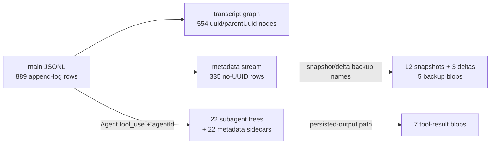
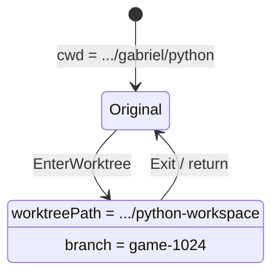
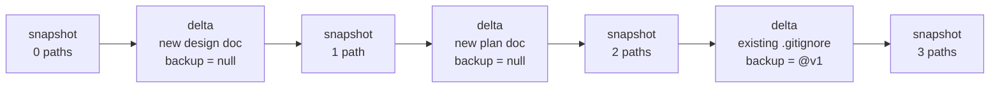

# Sample Main Session JSONL Guide

This guide dissects the current primary session-storage sample and uses a
second independently generated session as a cross-check. Read
`storage-session.md` for the source-backed storage contracts; use this guide for
concrete row counts, relationships, and inspection handles.

## Samples and Evidence Boundary

```text
/home/xiaos/.claude/projects/-home-xiaos-git-gabriel-python/
  a567f577-8ea3-49dc-90e3-bb47d535cfdd.jsonl       # primary
  a567f577-8ea3-49dc-90e3-bb47d535cfdd/
    subagents/
    tool-results/

  7e1e5be2-fd9c-45ea-8ef0-d84eea95e0ae.jsonl       # secondary cross-check
  7e1e5be2-fd9c-45ea-8ef0-d84eea95e0ae/
    subagents/
    tool-results/
```

| Property | Primary `a567…` | Secondary `7e1e…` |
| --- | ---: | ---: |
| Claude Code version | `2.1.235` | `2.1.233` |
| Main JSONL rows | 889 | 1,336 |
| Main file bytes | 1,888,703 | 2,564,522 |
| UUID-bearing transcript rows | 554 | 859 |
| No-UUID metadata rows | 335 | 477 |
| Subagent JSONLs | 22 | 41 |
| Subagent metadata files | 22 | 41 |
| Subagent JSONL rows | 1,158 | 2,056 |
| Tool-result blobs | 7 | 9 |
| Tool-result bytes | 1,186,517 | 10,367,168 |
| File-history full snapshots | 12 | 18 |
| File-history deltas | 3 | 4 |
| Physical file-history blobs | 5 | 6 |

The samples were written by released Claude Code builds, while this repository
is recovered source. A row observed on disk is evidence of sampled-build
behavior, not proof that the current checkout contains its implementation. In
particular, `atis-latch`, `file-history-delta`, `permission-mode`, and
`relocated` are absent from the recovered `Entry` union.

The generated diagram assets have also been rebuilt from the primary sample:

| Diagram | Rendered view | DOT source | Scope |
| --- | --- | --- | --- |
| Parent tree | [`storage-session-sample-main-tree.svg`](./storage-session-sample-main-tree.svg) | [`storage-session-sample-main-tree.dot`](./storage-session-sample-main-tree.dot) | All 554 UUID-bearing main transcript nodes and 553 parent edges. |
| Metadata timeline | [`storage-session-sample-main-metadata-timeline.svg`](./storage-session-sample-main-metadata-timeline.svg) | [`storage-session-sample-main-metadata-timeline.dot`](./storage-session-sample-main-metadata-timeline.dot) | All 335 no-UUID rows in physical append order. |
| File-history timeline | [`storage-session-sample-main-file-history-timeline.svg`](./storage-session-sample-main-file-history-timeline.svg) | [`storage-session-sample-main-file-history-timeline.dot`](./storage-session-sample-main-file-history-timeline.dot) | Readable table of 12 snapshots and 3 deltas. |
| File-history map | [`storage-session-sample-main-file-history-map.svg`](./storage-session-sample-main-file-history-map.svg) | [`storage-session-sample-main-file-history-map.dot`](./storage-session-sample-main-file-history-map.dot) | Append order, message targets, delta bases, and backup-state edges. |

The parent tree and metadata timeline are intentionally tall because they are
complete rather than sampled. Use the focused file-history timeline for the
most readable checkpoint overview; use the edge map when validating joins.

---

## Primary File Layout

```text
a567f577-8ea3-49dc-90e3-bb47d535cfdd.jsonl
a567f577-8ea3-49dc-90e3-bb47d535cfdd/
  subagents/
    agent-<agentId>.jsonl       # 22 files
    agent-<agentId>.meta.json   # 22 files
  tool-results/
    *.txt                       # 7 files

~/.claude/file-history/a567f577-8ea3-49dc-90e3-bb47d535cfdd/
  *                             # 5 backup blobs
```

Three separate relationship systems coexist:



Do not infer a single relationship from physical line adjacency. Transcript
messages use `uuid`/`parentUuid`; subagents use agent/tool-use metadata; large
outputs use embedded file paths; file history uses message and snapshot ids.

---

## Main Row Inventory

| Entry type | Count | UUID graph node? |
| --- | ---: | --- |
| `assistant` | 239 | yes |
| `user` | 153 | yes |
| `attachment` | 127 | yes |
| `system` | 35 | yes |
| `queue-operation` | 48 | no |
| `atis-latch` | 41 | no |
| `mode` | 40 | no |
| `permission-mode` | 40 | no |
| `ai-title` | 39 | no |
| `relocated` | 35 | no |
| `worktree-state` | 34 | no |
| `last-prompt` | 43 | no |
| `file-history-snapshot` | 12 | no |
| `file-history-delta` | 3 | no |
| **Total** | **889** | **554 yes / 335 no** |

The file begins with `last-prompt`, not a graph node. The transcript root is
line 5, an `attachment:hook_success` row with `parentUuid: null`. The file ends
with an `atis-latch` row. This is a useful reminder that append order and graph
order are different views.

### Assistant and user payloads

| Content block / shape | Count |
| --- | ---: |
| Assistant `text` | 78 |
| Assistant `thinking` | 51 |
| Assistant `tool_use` | 110 |
| User string content | 38 |
| User-array `text` | 5 |
| User-array `tool_result` | 110 |

Every observed main-session `tool_use` has a corresponding `tool_result` count,
but count equality alone is not the pairing contract. Pair by
`tool_use.id == tool_result.tool_use_id`; use `sourceToolAssistantUUID` and
`parentUuid` for the stored graph edge.

Other newly visible stamps include `effort: "high"` on 237 assistant rows,
`origin.kind` (`human` or `task-notification`) on 35 user rows, and
`pendingBackgroundAgentCount` on 25 of 34 `turn_duration` rows. An optional
`session_id` appears on 462 transcript rows; it normally equals `sessionId`,
but one interrupted-request row differs, so this guide does not assign it a
stronger meaning.

Observed main tool uses:

| Tool | Count | Tool | Count |
| --- | ---: | --- | ---: |
| `Read` | 24 | `Agent` | 22 |
| `Bash` | 19 | `TaskUpdate` | 14 |
| `AskUserQuestion` | 8 | `TaskCreate` | 7 |
| `Edit` | 6 | `Skill` | 4 |
| `EnterWorktree` | 2 | `SendMessage` | 2 |
| `Write` | 2 |  |  |

---

## Transcript Parent Tree

Only the 554 rows with both `uuid` and `parentUuid` participate in the main
conversation graph.

| Metric | Primary | Secondary cross-check |
| --- | ---: | ---: |
| Nodes | 554 | 859 |
| Roots | 1 | 1 |
| Parent edges | 553 | 858 |
| Leaves | 13 | 13 |
| Parent nodes with multiple children | 12 | 12 |
| Maximum children | 2 | 2 |
| Parent links not pointing to prior UUID row | 14 | 14 |
| Missing parents | 0 | 0 |
| Duplicate UUIDs | 0 | 0 |
| Cycles | 0 | 0 |
| Unreachable nodes | 0 | 0 |

The primary root is:

```text
line 5
type = attachment
attachment.type = hook_success
uuid = 1e8396d1-658d-46f2-b5e8-16d0e27a2b12
parentUuid = null
```

The 13 leaves represent branches retained by append-only persistence. Resume
selects an active leaf and walks backward through `parentUuid`; it does not
replay all 554 nodes as one physical-line sequence.

---

## Attachment Stream

Attachments are UUID-bearing transcript nodes, but normalize into user-role
context or disappear before an API call. The primary sample is dominated by a
new sampled-build reminder type:

| Attachment type | Primary | Secondary |
| --- | ---: | ---: |
| `total_tokens_reminder` | 91 | 150 |
| `hook_success` | 17 | 17 |
| `task_reminder` | 10 | 0 |
| `command_permissions` | 4 | 4 |
| `skill_listing` | 2 | 1 |
| `agent_listing_delta` | 1 | 1 |
| `hook_additional_context` | 1 | 1 |
| `deferred_tools_delta` | 1 | 0 |
| `edited_text_file` | 0 | 1 |
| `queued_command` | 0 | 1 |

`agent_listing_delta` is implemented in the recovered normalizer and becomes a
meta user reminder describing available agent types. `total_tokens_reminder`
has no matching recovered-source normalization case, so this guide records its
shape (`attachment.type`, `attachment.text`) and frequency without inventing
its exact model-facing semantics.

---

## Metadata Timeline

The 335 no-UUID rows are append-log state, not parent-tree nodes.

| Metadata family | Primary observation | How to interpret it |
| --- | --- | --- |
| Titles/prompts | 39 `ai-title`, 43 `last-prompt` | Append-log title/prompt records; use the latest applicable value rather than treating the count as distinct sessions. |
| Modes | 40 `mode: normal`, 40 `permission-mode: bypassPermissions` | Repeated session state; not 40 distinct mode changes. |
| Worktree | 34 `worktree-state`, 35 `relocated` | Session cwd moved into an existing worktree and later returned. |
| Queue | 24 `enqueue`, 24 `dequeue` | Background-agent completion notifications entered and left the command queue. |
| File history | 12 snapshots, 3 deltas | Full checkpoints plus per-path updates. |
| Opaque drift | 41 `atis-latch`, all `atis: ""` | Observed only; no recovered type/handler supports a stronger claim. |

### Worktree and relocation sequence

The meaningful state transition is smaller than the raw counts suggest:



Observed rows:

- 33 non-null `worktree-state` rows and 33 `relocated` rows point at
  `/home/xiaos/git/gabriel/python-workspace`.
- One null `worktree-state` records exit.
- Two `relocated` rows point back to `/home/xiaos/git/gabriel/python`.
- Transcript-message `cwd` values additionally include the nested
  `python-workspace/game-raiden` working directory.

Repeated last-wins metadata is expected in an append log. The recovered source
explicitly re-appends cached session metadata near EOF and treats the last
`worktree-state` value as authoritative on load.

### Queue operations

All 24 primary enqueue rows contain string content; the observed strings are
task-notification wrappers for background agents. Dequeue rows omit content.
The counts balance exactly in the primary. The secondary adds one `remove`
operation, confirming the third operation implemented by the recovered command
queue manager.

---

## File-History Timeline

The new samples do not use the recovered source's
`file-history-snapshot/isSnapshotUpdate:true` representation. They append a
separate `file-history-delta` for the first tracked mutation and later carry the
updated path set in full snapshots. Their backup records also add
`realParentDir`, recording an absolute parent directory while the session moves
between the original checkout and worktree paths; that field is not present in
the recovered backup type, so its restore semantics remain unverified here.

Primary sequence:

| Line | Entry | Snapshot/path state |
| ---: | --- | --- |
| 7-131 | six snapshots | 0 tracked paths |
| 143 | delta | Add new design doc to snapshot `9cc905cd…`; pre-edit backup is null. |
| 159-231 | two snapshots | 1 tracked path |
| 245 | delta | Add new plan doc to snapshot `50bf054a…`; pre-edit backup is null. |
| 282-647 | two snapshots | 2 tracked paths |
| 770 | delta | Add existing `.gitignore` to snapshot `91d4e31a…`; pre-edit backup is `1eeff…@v1`. |
| 874-881 | two snapshots | 3 tracked paths |



Physical primary backup blobs:

| Blob | Bytes | Role |
| --- | ---: | --- |
| `1eeff9330bc08d58@v1` | 3,601 | Existing `.gitignore` before edit. |
| `1eeff9330bc08d58@v2` | 3,680 | Later `.gitignore` checkpoint. |
| `e8a8fa646bc5d644@v2` | 7,262 | First concrete design-doc checkpoint; v1 was null. |
| `fb940146e804c3d2@v2` | 54,971 | First concrete plan checkpoint; v1 was null. |
| `fb940146e804c3d2@v3` | 55,310 | Later plan checkpoint. |

The secondary sample follows the same full-snapshot-plus-delta pattern. Its four
deltas track two new documentation files (null v1) and two existing Python
files (physical v1), providing independent evidence for the interpretation.

---

## Subagent Forest

Each primary `Agent` tool use has one matching subagent transcript and one
metadata sidecar:

| Item | Count |
| --- | ---: |
| Main `Agent` tool uses | 22 |
| `agent-*.jsonl` files | 22 |
| `agent-*.meta.json` files | 22 |
| Subagent JSONL rows | 1,158 |
| Subagent assistant rows | 696 |
| Subagent user rows | 440 |
| Subagent attachment rows | 22 |

All 22 subagent transcripts have exactly one root and no missing parents; 11
contain fan-out. They are separate trees, not descendants in the main file's
`parentUuid` graph.

Every primary metadata sidecar contains:

```text
agentType
description
toolUseId
model
spawnDepth
```

Agent types are 14 `general-purpose` and 8 `superpowers:code-reviewer`. No
primary or secondary metadata sidecar has `worktreePath`; worktree isolation is
therefore supported by the schema but not exercised by these samples.

---

## Tool-Result Sidecars

All seven primary blobs are referenced by ordinary `user` `tool_result` rows in
subagent transcripts. Each reference contains a `<persisted-output>` path and
preview; the matching preceding assistant row is a `Bash` `tool_use`.

| Sidecar | Bytes | Referencing subagent | Result line |
| --- | ---: | --- | ---: |
| `baenpcq0i.txt` | 99,110 | `agent-a71f3a468619ce21d.jsonl` | 5 |
| `bsiogi9sa.txt` | 99,192 | `agent-af9f3a8c5814e5d87.jsonl` | 5 |
| `bpkzzucgk.txt` | 156,341 | `agent-a412386f0568b7ad6.jsonl` | 80 |
| `bz8bxlgeq.txt` | 177,603 | `agent-a7ce16c473075608f.jsonl` | 5 |
| `bus0jom9y.txt` | 177,997 | `agent-abfa7135783906222.jsonl` | 12 |
| `bmqyiaksa.txt` | 203,247 | `agent-a3ba768becd8726a4.jsonl` | 22 |
| `b60ebbrr7.txt` | 273,027 | `agent-ae8b477399755bd14.jsonl` | 14 |

No primary blob is unreferenced, no pointer is unresolved, and no main-session
row contains `<persisted-output>`. The secondary sample independently repeats
all three properties for nine much larger blobs.

The relationship to follow is:

```text
assistant tool_use.id
  == user tool_result.tool_use_id

assistant uuid
  == user parentUuid
  == user sourceToolAssistantUUID

user tool_result.content
  contains absolute path to session/tool-results/<short-task-id>.txt
```

There are no `content-replacement` rows in either sample. The persisted-output
wrapper is embedded directly in the ordinary tool-result transcript row.

---

## Recommended Inspection Order

1. Count top-level `.type` values to separate transcript rows from metadata.
2. Build a UUID map from rows with `.uuid`; validate every non-null
   `.parentUuid` before drawing or traversing the tree.
3. Treat repeated title/mode/worktree rows as append-log snapshots and inspect
   the latest value rather than counting them as distinct state changes.
4. Join `file-history-delta.snapshotMessageId` to
   `file-history-snapshot.snapshot.messageId`; then resolve backup filenames
   under `~/.claude/file-history/<sessionId>/`.
5. Join main `Agent` tool uses to `subagents/*.meta.json` by `toolUseId`, then
   inspect the corresponding `agent-<agentId>.jsonl` tree.
6. Search all main/subagent tool results for `<persisted-output>` and verify
   every referenced blob exists.
7. Compare any inferred type or lifecycle against recovered source. If the
   type is missing, label the conclusion sample-observed rather than
   source-confirmed.

Plain-English model:

```text
main JSONL append log
  transcript rows        -> uuid/parentUuid tree
  metadata rows          -> repeated session state and annotations
  file-history rows      -> snapshot/delta checkpoint stream

session directory
  subagents              -> independent sidechain trees + launch metadata
  tool-results           -> large payloads referenced from tool_result rows

file-history directory
  backup blobs           -> concrete file contents named by snapshot metadata
```
