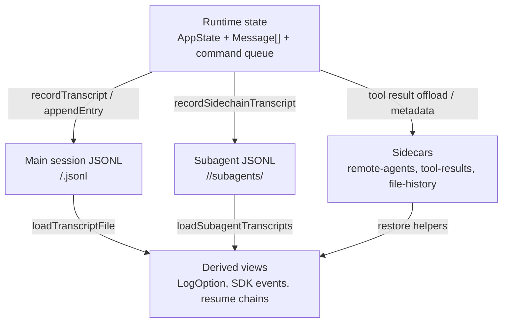

# Session Storage Design

## Purpose

Claude Code stores conversation history as append-only JSONL transcripts under
the Claude config directory. Runtime UI state is richer and process-local, while
the JSONL transcript is the durable source for resume, branch/fork, session
listing, file rewind, attribution restore, subagent restore, and remote
session replay.

This document describes the storage model using the recovered source and two
concrete session samples. The newer primary sample drives the detailed counts;
the secondary sample is used to distinguish stable relationships from
session-specific accidents:

```text
/home/xiaos/.claude/projects/-home-xiaos-git-gabriel-python/
  a567f577-8ea3-49dc-90e3-bb47d535cfdd.jsonl       # primary, Claude Code 2.1.235
  a567f577-8ea3-49dc-90e3-bb47d535cfdd/
    subagents/
    tool-results/
  7e1e5be2-fd9c-45ea-8ef0-d84eea95e0ae.jsonl       # cross-check, Claude Code 2.1.233
  7e1e5be2-fd9c-45ea-8ef0-d84eea95e0ae/
    subagents/
    tool-results/
```

The primary main transcript is 889 JSONL lines and 1,888,703 bytes. Its session
directory contains 22 subagent transcript files, 22 subagent metadata sidecars,
and 7 persisted tool-result blobs. The secondary sample has 1,336 main rows, 41
subagent transcripts, and 9 tool-result blobs.

Version boundary matters: the on-disk samples contain several entries that the
current recovered `types/logs.ts` union does not model (`atis-latch`,
`file-history-delta`, `permission-mode`, and `relocated`). Conversely, the
recovered union contains entry families not exercised by either sample. This
document labels observed sample facts separately from source-backed behavior
instead of treating either artifact as a complete schema.

---

## Source Map

| Path                              | Role                                                                                                                              |
| --------------------------------- | --------------------------------------------------------------------------------------------------------------------------------- |
| `types/logs.ts`                   | Type union for persisted session entries: transcript messages, titles, summaries, snapshots, worktree state, compaction state.    |
| `utils/sessionStorage.ts`         | Main writer/reader for local JSONL transcripts, subagent transcripts, remote-agent metadata, resume log views, and deduplication. |
| `utils/sessionStoragePortable.ts` | Shared portable helpers: path sanitization, lite head/tail reads, session file scanning.                                          |
| `utils/messages.ts`               | Internal message constructors used before persistence.                                                                            |
| `utils/toolResultStorage.ts`      | Persisted content-replacement records and tool-result budget reconstruction.                                                      |
| `utils/fileHistory.ts`            | File-history backup blobs and restore state.                                                                                      |
| `state/AppStateStore.ts`          | Process-local UI/runtime state. Most of this is not persisted directly.                                                           |
| `utils/messageQueueManager.ts`    | Runtime command queue and `queue-operation` transcript entries.                                                                   |

Recovered-source caveat: this checkout imports `src/types/message.js` and
`types/messageQueueTypes.js`, but their TypeScript source files are not present.
The persisted shapes below are therefore derived from `types/logs.ts`,
`utils/sessionStorage.ts`, and the two sample JSONLs.

---

## Storage Layers



### Runtime State

The REPL keeps a process-local `AppState` and active `Message[]`.

`AppState` includes task state, MCP state, plugin state, file history,
attribution, todos, notifications, bridge status, prompt suggestions, active
overlays, and other UI/runtime fields. It is not serialized wholesale. Only
selected state is projected to transcript entries or sidecar files.

### Main Session JSONL

**The main session file is append-only JSONL**. Each line is one `Entry` from the
storage union, **usually either a `TranscriptMessage` or a metadata/snapshot
entry.** It is created lazily on the first user or assistant message so
metadata-only startup sessions do not pollute the resume list.

### Subagent Transcripts

Subagents write separate JSONL files under the session directory:

```text
<projectDir>/<sessionId>/subagents/agent-<agentId>.jsonl
<projectDir>/<sessionId>/subagents/agent-<agentId>.meta.json
```

The JSONL entries are the same transcript shape but have `isSidechain: true`
and `agentId`. Metadata sidecars contain the agent type, original task
description, and originating tool-use id.

### Sidecar Stores

Sidecars hold data that should not live inline in the main transcript:

| Directory                                            | Shape          | Purpose                                                              |
| ---------------------------------------------------- | -------------- | -------------------------------------------------------------------- |
| `<projectDir>/<sessionId>/tool-results/*.txt`        | text blobs     | Oversized tool results persisted outside the transcript.             |
| `<projectDir>/<sessionId>/remote-agents/*.meta.json` | JSON metadata  | Remote task identity for reconnect/restore.                          |
| `~/.claude/file-history/<sessionId>/...`             | backup files   | Rewind/restore file contents.                                        |
| auto-memory paths                                    | Markdown files | Durable memory, team memory, session memory. Covered in `memory.md`. |

---

## Path Layout

Session project directories are rooted at:

```text
{claudeConfigHome}/projects/
```

`getProjectDir(projectPath)` sanitizes the absolute project path by replacing
non-alphanumeric characters with `-`. Long sanitized names are truncated and
receive a hash suffix.

Example:

```text
project path: /home/xiaos/git/gabriel/python
project dir:  ~/.claude/projects/-home-xiaos-git-gabriel-python
session file: ~/.claude/projects/-home-xiaos-git-gabriel-python/a567f577-8ea3-49dc-90e3-bb47d535cfdd.jsonl
```

---

## Main Entry Union

`types/logs.ts` defines the persisted `Entry` union:

```ts
type Entry =
  | TranscriptMessage
  | SummaryMessage
  | CustomTitleMessage
  | AiTitleMessage
  | LastPromptMessage
  | TaskSummaryMessage
  | TagMessage
  | AgentNameMessage
  | AgentColorMessage
  | AgentSettingMessage
  | PRLinkMessage
  | FileHistorySnapshotMessage
  | AttributionSnapshotMessage
  | QueueOperationMessage
  | SpeculationAcceptMessage
  | ModeEntry
  | WorktreeStateEntry
  | ContentReplacementEntry
  | ContextCollapseCommitEntry
  | ContextCollapseSnapshotEntry
```

The primary sample also contains these no-UUID entry types outside that union:

| Observed type | Primary count | Secondary count | Evidence boundary |
| --- | ---: | ---: | --- |
| `atis-latch` | 41 | 0 | Opaque sample-only latch; every primary `atis` value is the empty string. |
| `file-history-delta` | 3 | 4 | Per-file snapshot update used by the sampled 2.1.23x builds. |
| `permission-mode` | 40 | 60 | Persisted permission state, `bypassPermissions` in both samples. |
| `relocated` | 35 | 54 | Records `relocatedCwd`; absent from the recovered union and loader. |

`worktree-state` and `queue-operation`, also prominent in the new samples, are
present in the recovered union. The sampled `worktreeSession` object has two
additional fields (`preEnterOriginalCwd` and `enteredExisting`) that are absent
from the recovered `PersistedWorktreeSession` type, another narrow instance of
version drift.

---

## Sample Session Inventory

The primary main transcript contains:

| Entry type              | Count |
| ----------------------- | -----:|
| `assistant`             | 239   |
| `user`                  | 153   |
| `system`                | 35    |
| `attachment`            | 127   |
| `file-history-snapshot` | 12    |
| `file-history-delta`    | 3     |
| `ai-title`              | 39    |
| `last-prompt`           | 43    |
| `mode`                  | 40    |
| `permission-mode`       | 40    |
| `queue-operation`       | 48    |
| `relocated`             | 35    |
| `worktree-state`        | 34    |
| `atis-latch`            | 41    |

Observed system subtypes:

| System subtype  | Count |
| --------------- | -----:|
| `away_summary`  | 1     |
| `turn_duration` | 34    |

Observed content block counts:

| Block                | Count |
| -------------------- | -----:|
| assistant `text`     | 78    |
| assistant `thinking` | 51    |
| assistant `tool_use` | 110   |
| user string content  | 38    |
| user `text`          | 5     |
| user `tool_result`   | 110   |

Observed assistant tool names:

| Tool              | Count |
| ----------------- | -----:|
| `Agent`           | 22    |
| `Read`            | 24    |
| `Bash`            | 19    |
| `TaskUpdate`      | 14    |
| `AskUserQuestion` | 8     |
| `TaskCreate`      | 7     |
| `Edit`            | 6     |
| `Skill`           | 4     |
| `EnterWorktree`   | 2     |
| `SendMessage`     | 2     |
| `Write`           | 2     |

Subagent inventory:

| Item                          | Count |
| ----------------------------- | -----:|
| Subagent JSONL files          | 22    |
| Subagent metadata files       | 22    |
| Subagent JSONL lines total    | 1,158 |
| Subagent `assistant` entries  | 696   |
| Subagent `user` entries       | 440   |
| Subagent `attachment` entries | 22    |

Cross-check summary:

| Metric | Primary `a567…` | Secondary `7e1e…` |
| --- | ---: | ---: |
| Main JSONL rows | 889 | 1,336 |
| UUID-bearing transcript rows | 554 | 859 |
| No-UUID metadata rows | 335 | 477 |
| Subagent JSONLs / metadata files | 22 / 22 | 41 / 41 |
| Subagent JSONL rows | 1,158 | 2,056 |
| Tool-result blobs | 7 | 9 |
| File-history snapshots / deltas | 12 / 3 | 18 / 4 |

---

## TranscriptMessage

`TranscriptMessage` is the durable form of an internal `Message`. The writer
adds parent-chain and session-stamp metadata around the original message.

```ts
type TranscriptMessage = Message & {
  parentUuid: UUID | null
  logicalParentUuid?: UUID | null
  isSidechain: boolean
  cwd: string
  userType: string
  entrypoint?: string
  sessionId: string
  timestamp: string
  version: string
  gitBranch?: string
  slug?: string
  agentId?: string
  teamName?: string
  agentName?: string
  agentColor?: string
  promptId?: string
}
```

### Common Transcript Fields

| Field               | Applies to                    | Meaning                                                                                                    |
| ------------------- | ----------------------------- | ---------------------------------------------------------------------------------------------------------- |
| `type`              | all entries                   | **Discriminator. For transcript messages this is usually `user`, `assistant`, `system`, or `attachment`.** |
| `uuid`              | transcript messages           | Unique id for this stored message. Used for parent chains, resume, compaction, snip, and deduplication.    |
| `parentUuid`        | transcript messages           | Previous chain participant. `null` starts a chain or marks a hard boundary such as compact boundary.       |
| `logicalParentUuid` | compact boundaries and breaks | Preserves the logical parent when `parentUuid` is intentionally nullified.                                 |
| `timestamp`         | transcript messages           | ISO timestamp when the message was created or persisted.                                                   |
| `isSidechain`       | transcript messages           | `false` for main session; `true` for subagent transcript entries.                                          |
| `sessionId`         | most entries                  | Session UUID. Main and subagent files in the sample share the parent session id.                           |
| `session_id`        | some transcript messages      | Additional sampled on-disk field not declared by recovered `TranscriptMessage`. Usually equals `sessionId`; one primary interrupted-request row carries a different value, so its semantics remain unverified. |
| `cwd`               | transcript messages           | Working directory at persistence time.                                                                     |
| `userType`          | transcript messages           | Build/user category, such as `external`.                                                                   |
| `entrypoint`        | transcript messages           | Entry surface, such as `cli`, SDK, or another launcher.                                                    |
| `version`           | transcript messages           | Claude Code version that wrote the entry. Primary uses `2.1.235`; secondary uses `2.1.233`.                 |
| `gitBranch`         | transcript messages           | Best-effort current Git branch at write time.                                                              |
| `slug`              | transcript messages           | Optional session slug used by plan files/resume-related artifacts. Not present in the sample.              |
| `agentId`           | sidechain entries             | Subagent id when entry belongs to a sidechain transcript.                                                  |
| `teamName`          | sidechain/team entries        | Team/swarm name when applicable.                                                                           |
| `agentName`         | sidechain/team entries        | Human-readable agent name when applicable.                                                                 |
| `agentColor`        | sidechain/team entries        | UI color assigned to an agent when applicable.                                                             |
| `promptId`          | user entries                  | Correlates user prompt messages with telemetry/OTel prompt id.                                             |

Parent-chain behavior:

- `recordTranscript()` deduplicates by `uuid` before writing.
- `insertMessageChain()` assigns `parentUuid` sequentially.
- Tool-result user messages may override the sequential parent with
  `sourceToolAssistantUUID` so they attach to the assistant tool-use message.
- `buildConversationChain()` reconstructs the active transcript by walking
  `parentUuid` backward from a leaf.

---

## User Transcript Entries

User entries wrap an Anthropic-style user message:

```json
{
  "type": "user",
  "message": {
    "role": "user",
    "content": "..."
  }
}
```

or:

```json
{
  "type": "user",
  "message": {
    "role": "user",
    "content": [
      {
        "type": "tool_result",
        "tool_use_id": "toolu_...",
        "content": "..."
      }
    ]
  }
}
```

### User Fields

| Field                     | Meaning                                                                                                                |
| ------------------------- | ---------------------------------------------------------------------------------------------------------------------- |
| `message.role`            | Always `user` for user transcript entries.                                                                             |
| `message.content`         | Either a string, content block array, or tool-result block array.                                                      |
| `isMeta`                  | Marks synthetic/system-generated user content, such as local command caveats or context reminders.                     |
| `permissionMode`          | Permission mode active when the user message was sent. Used for rewind/restoration.                                    |
| `promptSource`            | Source of the user prompt, observed as `typed` in the sample.                                                          |
| `origin`                  | Optional sampled origin object. Primary values are `{kind: "human"}` and `{kind: "task-notification"}`.             |
| `sourceToolAssistantUUID` | UUID of the assistant message containing the matching `tool_use`; used for tool-result parent linkage.                 |
| `sourceToolUseID`         | Tool-use id that produced the user/tool-result message. Observed in sample for some tool results.                      |
| `toolUseResult`           | Full structured tool output object retained for SDK/UI/replay. The LLM usually sees only `message.content` projection. |

### Tool Result Fields

| Field                                                               | Meaning                                                          |
| ------------------------------------------------------------------- | ---------------------------------------------------------------- |
| `message.content[].type`                                            | `tool_result`.                                                   |
| `message.content[].tool_use_id`                                     | Matches an assistant `tool_use.id`.                              |
| `message.content[].content`                                         | Model-visible tool result content. May be string or block array. |
| `message.content[].is_error`                                        | Optional error marker for failed/cancelled tools.                |
| `toolUseResult.success`                                             | Tool-specific structured success flag.                           |
| `toolUseResult.commandName`                                         | Skill/local command name for `Skill` tool results.               |
| `toolUseResult.task`, `taskId`, `statusChange`                      | Task-tool structured data.                                       |
| `toolUseResult.agentId`, `agentType`, `usage`, `toolStats`          | Agent tool result metadata for spawned subagents.                |
| `toolUseResult.stdout`, `stderr`, `interrupted`                     | Bash/tool execution details.                                     |
| `toolUseResult.file`, `filePath`, `originalFile`, `structuredPatch` | Read/edit/write tool data.                                       |

`toolUseResult` is intentionally tool-specific and open-ended. It is not a
stable LLM/API payload; it is retained for UI, SDK, resume, and richer replay.

---

## Assistant Transcript Entries

Assistant entries wrap the Anthropic assistant response object:

```json
{
  "type": "assistant",
  "message": {
    "id": "msg_...",
    "type": "message",
    "role": "assistant",
    "model": "claude-opus-4-8",
    "content": [
      { "type": "tool_use", "id": "toolu_...", "name": "Bash", "input": {} }
    ],
    "stop_reason": "tool_use",
    "usage": {}
  },
  "requestId": "req_..."
}
```

### Assistant Fields

| Field                   | Meaning                                                                                  |
| ----------------------- | ---------------------------------------------------------------------------------------- |
| `message.id`            | Anthropic message id.                                                                    |
| `message.type`          | Anthropic response object type, usually `message`.                                       |
| `message.role`          | Always `assistant`.                                                                      |
| `message.model`         | Model that produced this assistant response.                                             |
| `message.content`       | Array of assistant blocks such as `text`, `thinking`, and `tool_use`.                    |
| `message.stop_reason`   | Why the model stopped. New-sample values: `tool_use`, `end_turn`, `stop_sequence`.       |
| `message.stop_sequence` | Stop sequence if one was hit.                                                            |
| `message.stop_details`  | Optional provider stop details.                                                          |
| `message.diagnostics`   | Optional provider diagnostics. Sample includes `cache_miss_reason`.                      |
| `message.usage`         | Token/cache/server-tool usage for the response.                                          |
| `requestId`             | API request id associated with the response.                                             |
| `effort`                | Sampled reasoning-effort stamp. Present as `high` on 237 of 239 primary assistant rows. |
| `error` / `isApiErrorMessage` | Sampled API-error annotation. One primary row records `server_error` with `isApiErrorMessage: true`. |
| `attributionPlugin`     | Plugin attribution stamped onto the assistant entry. Sample commonly uses `superpowers`. |
| `attributionSkill`      | Skill attribution stamped onto the assistant entry.                                      |
| `attributionAgent`      | Agent attribution in subagent transcripts.                                               |

- **Attributionxxx means who incurs this assistant transcript message**

### Assistant Content Blocks

| Block      | Fields                                            | Meaning                                                                             |
| ---------- | ------------------------------------------------- | ----------------------------------------------------------------------------------- |
| `text`     | `text`                                            | Human-visible assistant text.                                                       |
| `thinking` | `thinking`, signature-related fields when present | Extended-thinking content. Must obey API thinking rules on replay.                  |
| `tool_use` | `id`, `name`, `input`                             | Model request to invoke a Claude Code tool. Paired with a later user `tool_result`. |

---

## System Transcript Entries

System transcript entries are local Claude Code events, not Anthropic system
prompt messages.

Observed across the two new samples (`local_command` occurs only in the
secondary):

| Subtype         | Fields                                 | Meaning                                                              |
| --------------- | -------------------------------------- | -------------------------------------------------------------------- |
| `local_command` | `content`, `level`, `isMeta`           | Local slash/command output or metadata persisted for context/replay. |
| `turn_duration` | `durationMs`, `messageCount`, `pendingBackgroundAgentCount`, `isMeta` | Per-turn timing, message count, and pending-agent count.             |
| `away_summary`  | `content`, `isMeta`                    | Away/idle summary shown to the user.                                 |

Common fields:

| Field          | Meaning                                                 |
| -------------- | ------------------------------------------------------- |
| `subtype`      | Specific system event discriminator.                    |
| `content`      | Human-readable text or XML-tagged local command output. |
| `level`        | UI severity, such as `info`.                            |
| `durationMs`   | Turn duration for `turn_duration`.                      |
| `messageCount` | Number of messages included in a turn-duration metric.  |
| `isMeta`       | Whether this is metadata-style local event.             |

**Most system transcript entries are filtered before the LLM/API request. Some,
such as local command output, can be converted into user messages during API
normalization when the model should retain that context.**

---

## Attachment Transcript Entries

Attachments persist selected non-chat artifacts. In storage terminology,
`attachment` is a real transcript message type: `isTranscriptMessage()` includes
`user`, `assistant`, `attachment`, and `system`, so attachments receive `uuid`,
`parentUuid`, timestamps, session stamps, and participate in the stored parent
chain.

They are not sent to the LLM/API as an Anthropic `role: "attachment"` message.
Before an API request, the message normalizer handles `type: "attachment"` by
calling `normalizeAttachmentForAPI(attachment)`. That function returns zero or
more internal `UserMessage` objects. **Those generated user messages are usually
`isMeta: true` and wrapped as `<system-reminder>` context.** If the previous
normalized message is already a user message, Claude Code merges the
attachment-derived user content into that previous user message; otherwise it
pushes the generated user messages into the API message sequence.

```text
stored attachment transcript message
  -> normalizeAttachmentForAPI(attachment)
  -> [] or UserMessage[]
  -> merge into previous user message when possible
  -> Anthropic API sees user-role context, not attachment-role context
```

**So attachments are best understood as durable context-injection records. They
let resume/API preparation reconstruct local context that was not literally
typed by the user: hook output, selected IDE text, opened files, skill listings,
task reminders, deferred tool availability, memory snippets, file references,
and similar environment/context events.**

The primary sample has 127 attachment entries with these observed attachment
types. The high count is dominated by 91 `total_tokens_reminder` rows:

| Attachment type           | Meaning                                                                                         |
| ------------------------- | ----------------------------------------------------------------------------------------------- |
| `hook_success`            | Hook execution result, including hook name, event, command, stdout/stderr, exit code, duration. |
| `hook_additional_context` | Additional context returned by a hook.                                                          |
| `skill_listing`           | Snapshot of skills available through the `Skill` tool.                                          |
| `command_permissions`     | Local command permission metadata.                                                              |
| `task_reminder`           | Reminder/context for task-tracking tools.                                                       |
| `deferred_tools_delta`    | Delta of deferred tools made available or removed for `ToolSearch`.                             |
| `agent_listing_delta`     | Initial or incremental list of agent types available to the `Agent` tool.                       |
| `total_tokens_reminder`   | Sample-observed token-state reminder; absent from the recovered attachment normalizer.          |

| Attachment type | Primary count | Secondary count |
| --- | ---: | ---: |
| `total_tokens_reminder` | 91 | 150 |
| `hook_success` | 17 | 17 |
| `task_reminder` | 10 | 0 |
| `command_permissions` | 4 | 4 |
| `skill_listing` | 2 | 1 |
| `agent_listing_delta` | 1 | 1 |
| `hook_additional_context` | 1 | 1 |
| `deferred_tools_delta` | 1 | 0 |
| `edited_text_file` | 0 | 1 |
| `queued_command` | 0 | 1 |

Observed attachment fields:

| Field                                                              | Meaning                                           |
| ------------------------------------------------------------------ | ------------------------------------------------- |
| `attachment.type`                                                  | Attachment discriminator.                         |
| `attachment.hookName`                                              | Hook name for hook-related attachments.           |
| `attachment.toolUseID`                                             | Related tool-use id or hook identifier.           |
| `attachment.hookEvent`                                             | Hook lifecycle event, such as `SessionStart`.     |
| `attachment.content`                                               | Text or block content attached to the transcript. |
| `attachment.stdout`, `stderr`, `exitCode`, `command`, `durationMs` | Hook execution details.                           |
| `attachment.allowedTools`, `pendingMcpServers`                     | Context about tools/MCP availability.             |
| `attachment.names`, `addedNames`, `removedNames`, `readdedNames`   | Skill/tool/context name lists.                    |
| `attachment.itemCount`, `skillCount`, `isInitial`                  | Count and initialization metadata.                |
| `attachment.text`                                                   | Text carried by the observed `total_tokens_reminder`. |
| `attachment.addedLines`, `addedTypes`, `removedTypes`               | Agent-listing delta content.                       |

### Attachment API Normalization

**Attachment normalization is type-specific. Some attachment types become
model-visible user-role context; others intentionally disappear by returning
`[]`.**

For the sample attachment types:

| Attachment type           | API normalization behavior                                                                                                                             |
| ------------------------- | ------------------------------------------------------------------------------------------------------------------------------------------------------ |
| `hook_success`            | Converts to a meta user reminder only for `SessionStart` or `UserPromptSubmit` hooks with non-empty `content`; otherwise returns `[]`.                 |
| `hook_additional_context` | Converts non-empty hook context to a meta user reminder. **(Typical once in lifecycle)**                                                               |
| `skill_listing`           | Converts non-empty skill listing content to a meta user reminder that lists skills available through the `Skill` tool. **(Typical once in lifecycle)** |
| `command_permissions`     | Returns `[]`; persisted as local/UI permission context but not sent to the LLM.                                                                        |
| `task_reminder`           | Converts to a meta user reminder only when TodoV2 is enabled; otherwise returns `[]`.                                                                  |
| `deferred_tools_delta`    | Converts added/removed deferred tool lines to a meta user reminder about `ToolSearch` availability.                                                    |
| `agent_listing_delta`     | Converts added/removed agent definitions to a meta user reminder; the initial row can also include the concurrency note.                             |
| `total_tokens_reminder`   | Observed on disk, but no corresponding case exists in the recovered `normalizeAttachmentForAPI`; exact sampled-build projection is therefore unverified. |

Other attachment families follow the same pattern:

| Attachment family                  | API normalization behavior                                                                                                                                                                         |
| ---------------------------------- | -------------------------------------------------------------------------------------------------------------------------------------------------------------------------------------------------- |
| File and directory attachments     | Preloaded context from `@` mentions, attachment extraction, and similar user-provided references. Convert to synthetic tool-use/tool-result style user context, often wrapped as system reminders. |
| IDE attachments                    | Preloaded context from IDE selection/open-file state. Convert selected/opened IDE context to meta user reminders.                                                                                  |
| Memory and skill attachments       | Convert relevant memory or invoked-skill contents to meta user reminders, unless the type is UI-only.                                                                                              |
| Plan/auto-mode attachments         | Convert mode instructions or mode-exit notices to meta user reminders.                                                                                                                             |
| Legacy or UI-only attachment types | Return `[]` so old/resumed sessions do not break API normalization and irrelevant UI state is not sent.                                                                                            |

File/directory attachments are different from normal model-requested `Read` or
`Bash` tool calls. A `file` or `directory` attachment means Claude Code
preloaded context before or around the turn, such as an `@`-mentioned file,
directory mention, IDE selection, or opened-file context. The model later sees
that preloaded context as user-role metadata, but the source row remains an
`attachment` transcript entry.

For an `@file` mention, attachment extraction reads the path through the same
file-reading machinery used by `FileReadTool`. API normalization then converts a
`file` attachment into synthetic `FileReadTool`-style context: a tool-use-shaped
user message followed by a tool-result-shaped user message containing the file
content. If the previous normalized message is already a user message, that
generated context may be merged into the previous user turn before the final API
payload is built.

> Called the Read tool with the following input: {\"file_path\":\"/home/xiaos/git/gabriel/python/forward-proxy/src/forward_proxy/main.py\"}
Result of calling the Read tool:...

Media has two related paths. Pasted images are usually stored directly on the
real `UserMessage.content` as Anthropic `image` blocks, not as attachment
messages. File attachments, however, can normalize file-read outputs whose data
type is `text`, `image`, `notebook`, or `pdf`. Large `@`-mentioned PDFs can use a
lightweight `pdf_reference` attachment instead of inlining the document; the
normalized reminder tells the model to read specific page ranges with `Read`.

In the primary sample, there are no `file`, `directory`,
`compact_file_reference`, `pdf_reference`, `edited_text_file`,
`selected_lines_in_ide`, or `opened_file_in_ide` attachment entries. The project
was still inspected through explicit tool calls. The secondary sample adds one
`edited_text_file` attachment, which confirms that the absence is
session-specific rather than a schema restriction.

### Skill Listing Refresh Semantics

`skill_listing` is an announcement snapshot, not the runtime source of truth for
skills. Once written to JSONL, the entry is immutable like every other transcript
row. If skills are added or reloaded later in the same running session, Claude
Code does not patch the old `skill_listing` entry. It updates runtime caches and
may append a later `skill_listing` attachment for newly unsent skills.

```text
skill files change or plugin reload
  -> clear skill/command caches
  -> reset sentSkillNames()
  -> next attachment pass calls getSkillToolCommands(cwd)
  -> append a new skill_listing attachment if there are newly unsent skills
```

The key process-local state is `sentSkillNames`, keyed by agent id. It prevents
the same skill listing from being injected every turn. `resetSentSkillNames()` is
called when the skill set genuinely changes, such as plugin reload or skill file
change on disk, so new or changed skills can be announced again on a later turn.

The `Skill` tool does not depend on the old `skill_listing` attachment to resolve
skills. At invocation time, the tool checks the current runtime command registry
through command lookup. Therefore a newly loaded skill can be callable even if an
old transcript only contains the original `skill_listing` snapshot.

Resume has one extra optimization: if the recovered transcript already contains a
`skill_listing`, the next full listing may be suppressed to avoid re-injecting a
large repeated context block. In that case, skills added between processes may
not be announced immediately in model-visible context, but the runtime Skill
tool registry can still resolve them.

Plain-English model:

```text
skill_listing attachment = append-only model-facing announcement
Skill tool registry       = live source of truth for invocation
sentSkillNames            = process-local dedupe for announcements
```

Persistence rule: `progress` is never loggable, and most attachments are
filtered for external users. Hook additional context can be retained when the
corresponding environment gate is enabled.

---

## Metadata Entries

### `ai-title`

This is used for session title by calling a haiku model for fast generation.

```json
{
  "type": "ai-title",
  "aiTitle": "game-raiden web application",
  "sessionId": "a567f577-8ea3-49dc-90e3-bb47d535cfdd"
}
```

| Field       | Meaning                                                     |
| ----------- | ----------------------------------------------------------- |
| `aiTitle`   | Generated title. Lower priority than a user `custom-title`. |
| `sessionId` | Session this title belongs to.                              |

### `last-prompt`

```json
{
  "type": "last-prompt",
  "lastPrompt": "still running, let me know when it's done",
  "leafUuid": "b0c60a24-f976-4bb8-a51c-9acbf8b017d8",
  "sessionId": "a567f577-8ea3-49dc-90e3-bb47d535cfdd"
}
```

| Field        | Meaning                                                                                                                            |
| ------------ | ---------------------------------------------------------------------------------------------------------------------------------- |
| `lastPrompt` | Truncated recent prompt for resume/ps display.                                                                                     |
| `leafUuid`   | Observed sample field linking the prompt to a leaf message. Present on disk but not in current recovered `LastPromptMessage` type. |
| `sessionId`  | Session this metadata belongs to.                                                                                                  |

### `mode`

```json
{ "type": "mode", "mode": "normal", "sessionId": "a567f577-8ea3-49dc-90e3-bb47d535cfdd" }
```

| Field       | Meaning                                          |
| ----------- | ------------------------------------------------ |
| `mode`      | Session mode, usually `normal` or `coordinator`. |
| `sessionId` | Session this mode belongs to.                    |

### `permission-mode`

```json
{
  "type": "permission-mode",
  "permissionMode": "bypassPermissions",
  "sessionId": "a567f577-8ea3-49dc-90e3-bb47d535cfdd"
}
```

| Field            | Meaning                                                                                 |
| ---------------- | --------------------------------------------------------------------------------------- |
| `permissionMode` | Permission mode persisted for session restore/display. Sample uses `bypassPermissions`. |
| `sessionId`      | Session this metadata belongs to.                                                       |

This entry is observed in the sample but not present in the current recovered
`types/logs.ts` `Entry` union.

### Queue, relocation, and worktree metadata

The primary sample makes session movement and asynchronous notification state
visible in the append log:

| Type | Primary observation | Interpretation boundary |
| --- | --- | --- |
| `queue-operation` | 24 `enqueue` + 24 `dequeue` | The recovered queue manager logs string content on enqueue and an operation-only row on dequeue. All primary enqueue content is background-agent task-notification XML. |
| `worktree-state` | 33 non-null + 1 null | Last-wins worktree state. The null row records exit; the recovered loader restores the most recent value. |
| `relocated` | 33 rows to `python-workspace`, 2 back to `python` | Sample-observed cwd relocation marker; its read/write path is absent from the recovered source. |
| `atis-latch` | 41 rows, all `atis: ""` | Opaque sample-observed latch; no semantics are asserted because the recovered source has no matching type or handler. |

The secondary sample independently exercises `queue-operation` (`51 enqueue`,
`50 dequeue`, `1 remove`) and repeated worktree enter/exit state (`44` non-null,
`10` null). `utils/messageQueueManager.ts` confirms that `remove` is a distinct
queue operation, while `types/logs.ts` and `utils/sessionStorage.ts` confirm
last-wins persistence for `worktree-state`.

---

## File History Snapshot Entries

`file-history-snapshot` entries connect the transcript to backup files under
`~/.claude/file-history/<sessionId>/`. **The purpose of this layer is to give the
session transcript enough file-state checkpoints for rewind/restore workflows:**
the JSONL records which logical snapshot was active at a message boundary, while
the file-history directory stores the copied file contents only when a concrete
backup blob exists.

The file history layer is not a full filesystem journal. It tracks files that
pass through file-history-aware mutation paths, then records point-in-time
snapshots of those tracked paths. `fileHistoryTrackEdit()` is called before a
tracked add/edit so the previous contents can be captured or the missing-file
state can be recorded. `fileHistoryMakeSnapshot()` is called at prompt/message
boundaries and backs up tracked files again only when their contents changed.
`createBackup()` writes a physical blob only when the source file exists; if the
file is missing, the snapshot records `backupFileName: null` instead.

### File-History-Aware Mutation Tools

The practical coverage boundary is the set of code paths that call
`fileHistoryTrackEdit()`. A tool that reads files, shells out, or writes files by
some other route is not automatically covered.

| Tool/path                               | File-history behavior                                                                                                                                                                                             |
| --------------------------------------- | ----------------------------------------------------------------------------------------------------------------------------------------------------------------------------------------------------------------- |
| `FileWriteTool`                         | Covered. Calls `fileHistoryTrackEdit()` before writing so the pre-write state is captured.                                                                                                                        |
| `FileEditTool`                          | Covered. Calls `fileHistoryTrackEdit()` before applying the edit so the pre-edit state is captured.                                                                                                               |
| `NotebookEditTool`                      | Covered. Calls `fileHistoryTrackEdit()` before notebook mutation.                                                                                                                                                 |
| `BashTool` internal `_simulatedSedEdit` | Covered only for this internal path. Claude Code applies the precomputed sed edit itself and tracks the file before writing.                                                                                      |
| Normal `BashTool` command execution     | Not covered. Commands such as `rm`, `mv`, `python script.py`, `sed -i`, `git checkout`, or heredoc writes can change the filesystem without entering file history.                                                |
| `FileReadTool`                          | Not covered as a mutation source. It updates `readFileState` with file content and timestamps for stale-write checks, but it does not create file-history backups.                                                |
| Subagent tool calls                     | Normally not covered in the parent file history. Subagent contexts use a no-op `updateFileHistoryState`, so even file-aware mutation tools inside a subagent do not update the parent session's tracked file set. |
| Other tools                             | Not covered unless they explicitly route through one of the file-history-aware mutation paths above.                                                                                                              |

`readFileState` and file history are separate layers. `readFileState` remembers
what content was read and when, which lets edit/write tools detect stale writes.
File history stores pre-mutation backups and snapshot metadata for rewind.

### Snapshot Generation Timing

The recovered source and the sampled 2.1.23x binaries encode the same logical
lifecycle differently.

Recovered-source representation:

| Entry | Trigger | Reconstruction |
| --- | --- | --- |
| `file-history-snapshot`, `isSnapshotUpdate: false` | A selectable/restorable user message reaches `fileHistoryMakeSnapshot()`. | Adds a new snapshot anchored by the user-message UUID. |
| `file-history-snapshot`, `isSnapshotUpdate: true` | `fileHistoryTrackEdit()` adds a previously untracked path to the current snapshot. | `buildFileHistorySnapshotChain()` replaces the earlier base snapshot in reconstructed state. |

Sampled 2.1.233/2.1.235 representation:

| Entry | Trigger/effect visible on disk |
| --- | --- |
| `file-history-snapshot`, always `isSnapshotUpdate: false` in both samples | Full point-in-time snapshot at a restorable message boundary. |
| `file-history-delta` | One newly tracked path, linked to the base by `snapshotMessageId`, with the causing `messageId`, `trackingPath`, timestamp, and one backup record. |

The primary has 12 full snapshots and 3 deltas; the secondary has 18 and 4.
Neither contains an `isSnapshotUpdate: true` row. Because `file-history-delta`
does not exist in this checkout, its exact sampled-build loader algorithm is not
source-verifiable here. Its relationship is nevertheless explicit in the data:

```text
file-history-delta.snapshotMessageId
  == file-history-snapshot.snapshot.messageId of the base being extended
```

Every sampled backup record also carries `realParentDir`, an absolute directory
that disambiguates the same relative tracking path across relocation/worktree
contexts. That field is absent from the recovered `FileHistoryBackup` type, so
its exact restore algorithm is another sampled-build detail rather than a
source-confirmed contract in this checkout.

Primary delta timeline:

| JSONL line | Causing message | Base snapshot | Tracking path | Pre-edit backup |
| ---: | --- | --- | --- | --- |
| 143 | `32b52d6b…` | `9cc905cd…` | `docs/superpowers/specs/2026-08-19-game-raiden-design.md` | `null` (new file) |
| 245 | `082c4d55…` | `50bf054a…` | `docs/superpowers/plans/2026-08-19-game-raiden.md` | `null` (new file) |
| 770 | `13136c75…` | `91d4e31a…` | `.gitignore` | `1eeff9330bc08d58@v1` |

The tracked-file count carried by later primary snapshots grows `0 -> 1 -> 2
-> 3`, confirming that each delta becomes part of subsequent full snapshots.
The file-history directory contains five physical blobs:

```text
~/.claude/file-history/a567f577-8ea3-49dc-90e3-bb47d535cfdd/
  1eeff9330bc08d58@v1
  1eeff9330bc08d58@v2
  e8a8fa646bc5d644@v2
  fb940146e804c3d2@v2
  fb940146e804c3d2@v3
```

| Tracked path | Final primary backup | Why earlier blobs differ |
| --- | --- | --- |
| `docs/superpowers/specs/2026-08-19-game-raiden-design.md` | `e8a8fa646bc5d644@v2` | The pre-create v1 state was null, so no v1 file exists. |
| `docs/superpowers/plans/2026-08-19-game-raiden.md` | `fb940146e804c3d2@v3` | Null v1, then two concrete versions were captured. |
| `.gitignore` | `1eeff9330bc08d58@v2` | The file already existed, so both pre-edit v1 and later v2 are physical. |

The secondary sample independently shows the same delta/full-snapshot pattern,
including null v1 records for two new documentation files and physical v1/v2
blobs for two pre-existing Python files. This makes the delta model a
cross-sample behavior, while exact paths and version counts remain
session-specific.

The stable lifecycle across both representations is:

```text
restorable user-message boundary
  -> persist full snapshot

first file-history-aware mutation of a path in that snapshot
  -> capture pre-edit state (null if the path does not exist)
  -> persist an update: full replacement in recovered source,
     per-file delta in sampled 2.1.23x binaries

later boundary
  -> persist a full snapshot carrying all tracked paths forward
```

### Rewind Scope and Success Semantics

File-history rewind is a scoped restore operation, not a whole-workspace
rollback. `fileHistoryRewind()` finds the target snapshot by message id and
calls `applySnapshot()`. `applySnapshot()` only iterates over
`state.trackedFiles`; any path outside that set is not diffed, deleted, restored,
or reported as changed.

That means subagent-created files are normally outside the rewind scope:

| File origin                                                              | Rewind behavior                                                                                                       |
| ------------------------------------------------------------------------ | --------------------------------------------------------------------------------------------------------------------- |
| Parent-thread file tracked by `fileHistoryTrackEdit()`                   | Restored or deleted according to the selected parent snapshot.                                                        |
| Parent-thread new file whose target snapshot says `backupFileName: null` | Deleted if it exists at rewind time.                                                                                  |
| File created or edited only by a subagent                                | Left untouched because subagents do not add paths to the parent `trackedFiles` set.                                   |
| File created by a subagent and later edited by the parent thread         | Rewind can affect it only from the point where the parent thread first tracked it.                                    |
| Git-tracked file created only by a subagent                              | Still left untouched by file-history rewind; git status may show it, but file history does not use git to restore it. |

The success signal is scoped the same way. The implementation logs
`tengu_file_history_rewind_success` after `applySnapshot()` completes and reports
`trackedFilesCount` plus `filesChangedCount`. It does not check whether every
filesystem side effect from the original conversation was undone.

So a rewind can be successful by Claude Code's current definition while still
leaving subagent-created files in the workspace. It is successful if the
conversation was rewound and the selected file-history snapshot was applied to
the parent session's tracked files. It is not a complete guarantee that the
working tree matches the checkpoint exactly.

---

## UUID Parent Tree

Transcript entries with `uuid` and `parentUuid` are organized as a parent graph,
not as a physical linked list of JSONL rows. In normal one-message-at-a-time
turns the graph often looks list-like, but the storage contract is:

```text
child.parentUuid == parent.uuid
```

The reliable relationship is the UUID edge, not adjacency in the JSONL file.
Metadata entries without a transcript `uuid`, such as `mode`, `ai-title`,
`permission-mode`, `last-prompt`, and `file-history-snapshot`, are side metadata
and are not conversation graph nodes.

### Observed Shape

For the primary sample, the parent graph is a tree per transcript file:

| Scope                          | Observed result                                                                      |
| ------------------------------ | ------------------------------------------------------------------------------------ |
| Main transcript                | 554 UUID-bearing nodes, 1 root, 13 leaves, no missing parents, cycles, duplicate UUIDs, or unreachable nodes. |
| Main root                      | Line 5, `attachment:hook_success`, UUID `1e8396d1…`.                                      |
| Main fan-out                   | 12 parent nodes have more than one child; maximum child count is 2.                       |
| Main row adjacency             | 14 parent links do not point to the immediately previous UUID-bearing JSONL row.           |
| Subagent transcripts           | 22 JSONL files, each with 1 root and no missing parents.                                   |
| Subagent fan-out               | 11 of 22 subagent files have at least one parent with more than one child.                  |
| Whole inspected transcript set | Main tree plus 22 subagent trees, which forms a forest across files.                       |

The secondary graph reproduces the structural result at a larger scale: 859
UUID nodes, 1 root, 13 leaves, 12 fan-out parents, 14 non-adjacent parent links,
and 41 valid one-root subagent trees. Exact counts are sample-specific; the
forest/parent-chain model is stable across both.

This is not a linked list. A linked list would allow only one child per node and
would usually make the previous persisted message the parent. The observed
transcript has sibling branches, and many child entries attach to an earlier
semantic parent rather than the preceding JSONL row.

### Why Store a Tree

Claude Code still sends a linear message sequence to the model, but storage is
append-only and must preserve enough structure to reconstruct the current
conversation after rewinds, interrupts, side effects, and parallel tool output.
The tree gives the loader a stable way to choose the active chain.

| Design pressure             | Why a parent tree helps                                                                                                                                  |
| --------------------------- | -------------------------------------------------------------------------------------------------------------------------------------------------------- |
| Append-only persistence     | Rewind, ctrl-z, and resumed branches can leave old branches in the JSONL. New entries are appended instead of rewriting the file.                        |
| Active-chain reconstruction | `buildConversationChain()` can find a leaf and walk `parentUuid` back to the root, ignoring orphaned or inactive branches.                               |
| Parallel tool streaming     | Streaming can persist separate assistant entries for parallel `tool_use` blocks. Sibling assistant/tool-result branches may share the same parent.       |
| Tool-result attachment      | A `tool_result` user message can attach to the assistant message that produced its `tool_use`, even when that assistant message is not the previous row. |
| Metadata interleaving       | Non-conversation metadata can be appended between transcript nodes without affecting graph reconstruction.                                               |
| Subagent isolation          | Each subagent file can maintain its own tree while the parent session references the subagent by sidecar metadata and tool-use ids.                      |

The resume path uses this graph to derive the linear view:

```text
append-only JSONL rows
  -> load uuid/parentUuid map
  -> find active leaf
  -> walk parentUuid from leaf to root
  -> reverse into the linear transcript used by UI/model resume
```

There is also a recovery pass for orphaned parallel tool results. The source
comments describe a case where streaming emits one assistant message per
`content_block_stop` for parallel `tool_use` blocks. If a loader only followed a
single linked-list branch, it could keep one sibling and drop the others. The
parent graph plus recovery logic lets Claude Code preserve the semantically
related sibling tool-use/tool-result entries when building the effective
conversation.

### Main Session vs Subagent Trees

The main session file and subagent files do not form one giant tree through
`parentUuid`. A subagent transcript is a sidechain tree stored in its own file.
The relationship back to the parent session is carried by sidechain fields and
metadata:

| Link field/source | Meaning                                                            |
| ----------------- | ------------------------------------------------------------------ |
| `isSidechain`     | Marks subagent transcript entries.                                 |
| `agentId`         | Groups entries for one subagent sidechain.                         |
| `toolUseId`       | Metadata sidecar field that points to the parent `Agent` tool use. |
| `sessionId`       | Shared parent session id for the main file and subagent files.     |

So the storage model is best understood as:

```text
session directory
  main transcript tree
  subagents/
    agent A transcript tree
    agent B transcript tree
    ...
  sidecars and metadata
```

Plain-English rule: the JSONL file is the append log, `uuid`/`parentUuid` is the
conversation graph, and resume turns the active graph branch back into a linear
conversation.

---

## Subagent Files

Each subagent file is a sidechain transcript. The primary sample has 22
subagent JSONLs and 22 matching `.meta.json` files.
Their entries have the same message shape as main transcript entries with these
differences:

| Field         | Difference                                                                     |
| ------------- | ------------------------------------------------------------------------------ |
| `isSidechain` | Always `true` in observed subagent files.                                      |
| `agentId`     | Present on every observed subagent entry.                                      |
| `parentUuid`  | Starts at `null` for the sidechain root, then chains within the subagent file. |
| `sessionId`   | Same parent session id as the main transcript.                                 |

Subagent metadata sidecar sample:

```json
{
  "agentType": "general-purpose",
  "description": "...",
  "toolUseId": "toolu_...",
  "model": "...",
  "spawnDepth": 0
}
```

| Field          | Meaning                                                                   |
| -------------- | ------------------------------------------------------------------------- |
| `agentType`    | Agent definition/type used to launch the subagent.                        |
| `description`  | Original task description, used for resume/UI display.                    |
| `toolUseId`    | Parent assistant tool-use id that spawned the subagent.                   |
| `model`        | Model selected for the subagent. Observed in every new metadata sidecar.  |
| `spawnDepth`   | Nested spawn depth. Observed in every new metadata sidecar.               |
| `worktreePath` | Optional isolated worktree path. Not present in observed sample metadata. |

Primary agent types are 14 `general-purpose` and 8
`superpowers:code-reviewer`; the secondary has 24 and 17 respectively. Every
main-session `Agent` tool use has one matching transcript and metadata sidecar
in both samples (22 and 41).

---

## Tool Result Sidecar Files

Tool-result sidecars store oversized tool output outside the JSONL transcript.
The transcript remains the source of conversation structure; the sidecar is only
the full payload backing file.

The primary sample has seven sidecar blobs totaling 1,186,517 bytes:

```text
tool-results/baenpcq0i.txt   99110 bytes
tool-results/bsiogi9sa.txt   99192 bytes
tool-results/bpkzzucgk.txt  156341 bytes
tool-results/bz8bxlgeq.txt  177603 bytes
tool-results/bus0jom9y.txt  177997 bytes
tool-results/bmqyiaksa.txt  203247 bytes
tool-results/b60ebbrr7.txt  273027 bytes
```

Observed references in the primary sample:

| Sidecar file | Referencing subagent JSONL | JSONL line | Producing tool |
| --- | --- | ---: | --- |
| `baenpcq0i.txt` | `agent-a71f3a468619ce21d.jsonl` | 5 | `Bash` |
| `bsiogi9sa.txt` | `agent-af9f3a8c5814e5d87.jsonl` | 5 | `Bash` |
| `bpkzzucgk.txt` | `agent-a412386f0568b7ad6.jsonl` | 80 | `Bash` |
| `bz8bxlgeq.txt` | `agent-a7ce16c473075608f.jsonl` | 5 | `Bash` |
| `bus0jom9y.txt` | `agent-abfa7135783906222.jsonl` | 12 | `Bash` |
| `bmqyiaksa.txt` | `agent-a3ba768becd8726a4.jsonl` | 22 | `Bash` |
| `b60ebbrr7.txt` | `agent-ae8b477399755bd14.jsonl` | 14 | `Bash` |

The primary main-session JSONL has no observed `<persisted-output>` reference. The
sidecar files live under the parent session directory, but the transcript rows
that point at them are inside the subagent sidechain files. The secondary sample
repeats the pattern for all nine blobs (10,367,168 bytes total): every reference
is in a subagent `Bash` result, with none in the main transcript.

### JSONL Entry Shape

A persisted sidecar is represented in the transcript as a normal `user`
message containing a normal Anthropic `tool_result` block. The `tool_result`
content is replaced with a small XML-ish pointer and preview:

```json
{
  "type": "user",
  "uuid": "...",
  "parentUuid": "assistant-message-uuid",
  "isSidechain": true,
  "agentId": "a71f3a468619ce21d",
  "sourceToolAssistantUUID": "assistant-message-uuid",
  "message": {
    "role": "user",
    "content": [
      {
        "type": "tool_result",
        "tool_use_id": "toolu_...",
        "is_error": false,
        "content": "<persisted-output>\nOutput too large. Full output saved to: .../a567f577-8ea3-49dc-90e3-bb47d535cfdd/tool-results/baenpcq0i.txt\n\nPreview ...\n</persisted-output>"
      }
    ]
  }
}
```

The previous assistant message is the producing tool call:

```json
{
  "type": "assistant",
  "uuid": "assistant-message-uuid",
  "message": {
    "content": [
      {
        "type": "tool_use",
        "id": "toolu_...",
        "name": "Bash"
      }
    ]
  }
}
```

The linkage is therefore:

```text
assistant tool_use
  uuid = assistant-message-uuid
  content[].id = toolu_...

    -> user tool_result
       parentUuid = assistant-message-uuid
       sourceToolAssistantUUID = assistant-message-uuid
       content[].tool_use_id = toolu_...
       content[].content = <persisted-output> sidecar path + preview
```

The sidecar file itself is raw text, not JSON. All seven primary pointers and
all nine secondary pointers resolve to an existing blob; no unmatched or
unreferenced tool-result file was observed.

### Follow-Up Reads

The `<persisted-output>` wrapper gives the model a readable absolute path. If
the model needs more than the preview, it can call `Read` on the sidecar like a
normal file. Such follow-up rows are ordinary `Read` tool-use/tool-result
transcript rows, not special sidecar metadata entries.

### Source Paths and Filename Rules

The common persistence helpers live in `utils/toolResultStorage.ts`:

| Function                                | Role                                                                     |
| --------------------------------------- | ------------------------------------------------------------------------ |
| `getToolResultsDir()`                   | Resolves `<projectDir>/<sessionId>/tool-results`.                        |
| `getToolResultPath(id, isJson)`         | Builds `<id>.txt` for text results or `<id>.json` for text-block arrays. |
| `persistToolResult(content, toolUseId)` | Writes the full payload and returns path, size, and preview metadata.    |
| `buildLargeToolResultMessage(result)`   | Builds the `<persisted-output>` wrapper.                                 |
| `maybePersistLargeToolResult(...)`      | Replaces oversized `tool_result.content` with the wrapper.               |

For generic tools, the persisted filename is based on the Anthropic
`tool_use_id` passed to `persistToolResult()`. For Bash and PowerShell, large
process output first flows through `TaskOutput`; the shell tool copies or
hard-links the task output file into `tool-results/` using
`getToolResultPath(result.outputTaskId, false)`. That is why a sampled Bash
sidecar has a short name such as `baenpcq0i.txt` while the transcript's
model-facing id remains a separate `toolu_...` value.

The shell task id is generated by `generateTaskId('local_bash')` as a short
case-insensitive id. It is an internal output-file id, not an API message id.

### Relation to Content Replacement

`content-replacement` is a separate transcript metadata entry used by the
aggregate tool-result budget and resume reconstruction machinery. Its shape is:

```json
{
  "type": "content-replacement",
  "sessionId": "...",
  "replacements": [
    {
      "kind": "tool-result",
      "toolUseId": "toolu_...",
      "replacement": "[Large tool result content persisted to disk]"
    }
  ]
}
```

Neither new sample has a `content-replacement` entry in its main or subagent
transcripts. Their sidecar references are encoded
directly in normal `tool_result.content` strings via the `<persisted-output>`
wrapper.

Plain rule:

```text
tool-results/*.txt
  -> full large output payload

user tool_result.content = <persisted-output>...
  -> small model-visible pointer and preview

content-replacement entry
  -> separate resume/budget metadata; not used by these samples' sidecar rows
```

---

## Loading and Derived Views

`loadTranscriptFile()` returns maps, not a raw list:

```ts
{
  messages: Map<UUID, TranscriptMessage>
  summaries: Map<UUID, string>
  customTitles: Map<UUID, string>
  tags: Map<UUID, string>
  agentNames: Map<UUID, string>
  agentColors: Map<UUID, string>
  agentSettings: Map<UUID, string>
  prNumbers: Map<UUID, number>
  modes: Map<UUID, string>
  worktreeStates: Map<UUID, PersistedWorktreeSession | null>
  fileHistorySnapshots: Map<UUID, FileHistorySnapshotMessage>
  attributionSnapshots: Map<UUID, AttributionSnapshotMessage>
  contentReplacements: Map<UUID, ContentReplacementRecord[]>
  agentContentReplacements: Map<AgentId, ContentReplacementRecord[]>
  contextCollapseCommits: ContextCollapseCommitEntry[]
  contextCollapseSnapshot?: ContextCollapseSnapshotEntry
  leafUuids: Set<UUID>
}
```

Then `getLastSessionLog()` builds a `LogOption` by selecting the latest
non-sidechain leaf and walking `parentUuid` back to the root. `LogOption` is a
derived resume/listing view, not a stored record.

Large-file load optimizations:

- Lite listing reads file stats and bounded head/tail windows.
- Full loading can skip pre-compact bytes.
- Attribution snapshots can be skipped during chunked load except for the most
  recent relevant snapshot.
- For large transcripts, a byte-level parent-chain walk can discard dead
  branches before JSON parsing.

---

## Write Rules

| Rule                                                          | Reason                                                                |
| ------------------------------------------------------------- | --------------------------------------------------------------------- |
| Append one JSON object per line.                              | Keeps writes simple and crash-tolerant.                               |
| Create the main session file lazily.                          | Avoid metadata-only sessions in resume.                               |
| Batch queued writes per file.                                 | Avoid frequent small sync writes.                                     |
| Deduplicate transcript messages by `uuid`.                    | Prevent repeated growing-array calls from duplicating entries.        |
| Do not dedup sidechain local writes against the main session. | Sidechains inherit parent UUIDs but need complete separate files.     |
| Re-append tail metadata.                                      | Resume listing reads bounded tail windows.                            |
| Filter progress before persistence.                           | Progress is UI-only and high-frequency.                               |
| Filter most attachments for external users.                   | Avoid leaking sensitive training/debug context.                       |
| Preserve parent chains.                                       | Resume/fork/branch reconstructs conversation by walking `parentUuid`. |

---

## Representative Sanitized Samples

User local-command metadata:

```json
{
  "parentUuid": "4ceb6e2e-959f-4cdd-a14f-dd93ee23883a",
  "isSidechain": false,
  "promptId": "5375361a-0291-4ac4-b4ca-fc5fcbb46f24",
  "type": "user",
  "message": {
    "role": "user",
    "content": "<local-command-caveat>...</local-command-caveat>"
  },
  "isMeta": true,
  "uuid": "dddbd323-6d5d-4fb4-8f3f-9897539a16b2",
  "timestamp": "2026-08-19T00:00:00.000Z",
  "userType": "external",
  "entrypoint": "cli",
  "cwd": "/home/xiaos/git/gabriel/python",
  "sessionId": "a567f577-8ea3-49dc-90e3-bb47d535cfdd",
  "version": "2.1.235",
  "gitBranch": "main"
}
```

Assistant tool use:

```json
{
  "parentUuid": "7ac25558-d13a-4542-af25-5a39ff4b7474",
  "isSidechain": false,
  "type": "assistant",
  "message": {
    "id": "msg_...",
    "type": "message",
    "role": "assistant",
    "model": "claude-opus-4-8",
    "content": [
      { "type": "tool_use", "id": "toolu_...", "name": "Skill", "input": { "skill": "..." } }
    ],
    "stop_reason": "tool_use",
    "usage": { "input_tokens": 5604, "output_tokens": 178 }
  },
  "requestId": "req_...",
  "uuid": "5afb77dd-0dd0-49db-b14c-064c108a8603",
  "timestamp": "2026-08-19T00:00:01.000Z",
  "sessionId": "a567f577-8ea3-49dc-90e3-bb47d535cfdd"
}
```

User tool result:

```json
{
  "parentUuid": "5afb77dd-0dd0-49db-b14c-064c108a8603",
  "isSidechain": false,
  "type": "user",
  "message": {
    "role": "user",
    "content": [
      {
        "type": "tool_result",
        "tool_use_id": "toolu_...",
        "content": "Launching skill: superpowers:brainstorming"
      }
    ]
  },
  "toolUseResult": {
    "success": true,
    "commandName": "superpowers:brainstorming"
  },
  "sourceToolAssistantUUID": "5afb77dd-0dd0-49db-b14c-064c108a8603",
  "uuid": "2bac8d25-ecec-4703-a15a-7c8fdf101742",
  "timestamp": "2026-08-19T00:00:02.000Z",
  "sessionId": "a567f577-8ea3-49dc-90e3-bb47d535cfdd"
}
```

Attachment hook result:

```json
{
  "parentUuid": null,
  "isSidechain": false,
  "type": "attachment",
  "attachment": {
    "type": "hook_success",
    "hookName": "SessionStart",
    "hookEvent": "SessionStart",
    "stdout": "...",
    "stderr": "",
    "exitCode": 0,
    "command": "...",
    "durationMs": 40
  },
  "uuid": "b00a16af-4bca-4f9d-9523-b535e6503764",
  "timestamp": "2026-08-19T00:00:00.000Z",
  "sessionId": "a567f577-8ea3-49dc-90e3-bb47d535cfdd"
}
```

---

## Current-State Summary

The storage design is event-log oriented:

```text
Runtime Message[] / AppState
  -> selected, cleaned, stamped entries
  -> append-only JSONL Entry[]
  -> maps + parent-chain reconstruction
  -> LogOption / resume / SDK / UI projections
```

The main JSONL is not just "chat history." It is a mixed append-only log of:

- model-visible transcript messages
- local system and attachment records
- session metadata
- file history snapshots
- tool-result and content-replacement metadata
- compaction metadata
- sidechain/subagent message records

The model-facing prompt is later projected from this richer stored form; it is
not identical to the raw JSONL.
