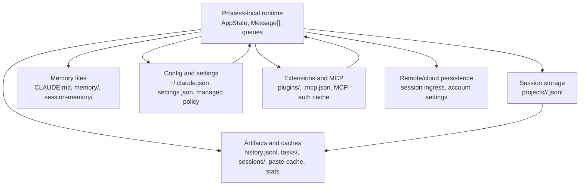

# Storage Architecture

## Purpose

Claude Code uses several storage layers instead of one database. The main
session JSONL stores conversation history, but other layers own settings,
memory, prompt history, live-session registration, task lists, plugin
installations, MCP auth state, file backups, and bounded caches.

This document is the map. Detailed layer docs live in:

- [storage-session.md](./storage-session.md) for transcript JSONL, subagent
  transcripts, tool-result sidecars, and file-history snapshot entries.
- [memory.md](./memory.md) for instruction memory, auto-memory, team memory,
  agent memory, and session memory.
- [storage-config-settings.md](./storage-config-settings.md) for global config,
  settings, managed policy, and auth-related storage.
- [storage-extensions-mcp.md](./storage-extensions-mcp.md) for plugin,
  marketplace, MCP config, and MCP auth-cache storage.
- [storage-runtime-artifacts.md](./storage-runtime-artifacts.md) for prompt
  history, live PID files, TodoV2 task files, scheduled tasks, statistics,
  paste/image caches, and generated artifact blobs.

The examples below are based on the observed local sample under
`/home/xiaos/.claude` and on source-defined shapes when no sample file existed.
Sensitive values are omitted or replaced with placeholders.

---

## Storage Layer Map



## Root Locations

| Root | Meaning |
|---|---|
| `~/.claude.json` | Global config file. Stores user-level config, project registry, auth fallback fields, feature caches, usage counters, and UI preferences. |
| `~/.claude/` | Claude config home. Stores settings, projects, memory, plugins, caches, tasks, session PID files, prompt history, policy cache, and sidecars. |
| `<project>/.claude/` | Project-local settings, local settings, rules, scheduled tasks, and sometimes MCP config. |
| `<project>/.mcp.json` | Project MCP server definitions. |
| Project temp dir | Runtime output files such as background task output. Path is resolved through the permissions filesystem helpers, not the session transcript directory. |
| Remote API/threadstore | Optional server-side session persistence and account settings. |

## Observed Sample Inventory

The local sample showed these durable files:

| File or directory | Observed shape |
|---|---|
| `projects/-home-xiaos-git-gabriel-python/cd51bba4-...jsonl` | Main transcript JSONL, 515 lines. |
| `projects/-home-xiaos-git-gabriel-python/cd51bba4-.../subagents/` | 28 subagent JSONLs and 28 `.meta.json` files. |
| `projects/-home-xiaos-git-gabriel-python/cd51bba4-.../tool-results/` | 3 large text blobs. |
| `projects/-home-xiaos-git-gabriel-python/sessions-index.json` | Indexed session summaries for listing/resume. |
| `history.jsonl` | 2,457 prompt-history entries. |
| `sessions/<pid>.json` | Live session registry records. |
| `tasks/<session-or-list-id>/` | TodoV2 task JSON files, `.lock`, and `.highwatermark`. |
| `file-history/<sessionId>/` | Backup blobs named `<hash>@vN`. |
| `settings.json` | User settings. |
| `~/.claude.json` | Global config. |
| `plugins/installed_plugins.json` | Plugin install metadata. |
| `plugins/known_marketplaces.json` | Marketplace registry. |
| `plugins/cache/`, `plugins/marketplaces/`, `plugins/data/` | Plugin code cache, marketplace checkouts, persistent plugin data. |
| `stats-cache.json` | Aggregated bounded stats. |
| `policy-limits.json` | Cached policy restrictions. |
| `security_warnings_state_*.json` | Per-warning acknowledgement state. |
| `cache/changelog.md` | Cached release notes/changelog. |

Source-defined but not observed in the targeted sample set:

| Store | Source-defined path |
|---|---|
| Scheduled tasks | `<project>/.claude/scheduled_tasks.json` plus `.claude/scheduled_tasks.lock`. |
| MCP auth-needed cache | `~/.claude/mcp-needs-auth-cache.json`. |
| Large paste store | `~/.claude/paste-cache/<hash>.txt`. |
| Image cache | per-session `image-cache` directory under config home. |
| Agent/team memory | agent-memory and team-memory directories described in [memory.md](./memory.md). |

---

## Layer Responsibilities

| Layer | Owns | Does not own |
|---|---|---|
| Runtime state | Active process state: `AppState`, in-flight messages, MCP connections, tool state, overlays, notifications. | Durable recovery after process exit, except where projected into another store. |
| Session storage | Conversation/event history, parent chains, metadata entries, subagent transcripts, transcript-derived resume views. | Settings, global config, memory topic files, plugin installs, full file backup bytes. |
| Memory storage | Prompt-injected Markdown knowledge and instructions across instruction, auto, team, agent, and session scopes. | Raw chat transcript or model API payloads. |
| Config/settings | User preferences, policy, permissions, environment, model choices, plugin enablement intent, project trust state. | Conversation turns or generated outputs. |
| Extension/MCP storage | Plugin install registry, marketplace registry, plugin data dirs, MCP config files, MCP auth-needed cache. | Live MCP client objects; those stay in `AppState.mcp`. |
| Runtime artifacts | Prompt history, PID registry, tasks, task output, paste/image caches, stats, changelog cache, warning state. | Canonical chat history. |
| Remote storage | Server-side session persistence and remote/account settings. | Local-only caches and project files unless explicitly synced. |

## Recovery Flow

```text
startup
  read ~/.claude.json and settings sources
  load plugin and MCP configuration
  register current process in ~/.claude/sessions/<pid>.json
  discover memory files for prompt context
  load or list session JSONL when resuming
  restore sidecars: file history, content replacements, tasks, plugin data
  keep AppState and Message[] process-local until projected back to stores
```

The transcript is a durable event log, not a full snapshot of the application.
Resume reconstructs only the pieces that the transcript and sidecars explicitly
store. Live UI state, connection handles, timers, and queues are rebuilt from
config, files, or runtime initialization.

## Write Patterns

| Pattern | Used by | Why |
|---|---|---|
| Append-only JSONL | Session transcripts, prompt history | Crash-tolerant, streamable, cheap to append. |
| Pretty JSON file | Config, settings, plugin metadata, tasks, PID files | Human-editable or small structured state. |
| Markdown files | Memory and instruction stores | Human-editable prompt context. |
| Opaque blobs | File history, tool results, paste cache, image cache, task output | Avoid bloating transcript or config files. |
| Lock files | Global config, prompt history, TodoV2 tasks, scheduled tasks | Serialize cross-process writes. |
| Temp-file then rename | Stats cache and some cache writes | Avoid corrupt partial files. |
| Bounded caches | Stats, feature caches, auth-needed cache, changelog cache | Improve startup/UI without becoming canonical state. |

## Storage Boundaries

The most important boundary is between model-visible data and product/runtime
data:

- Model-visible data is projected into API messages from runtime messages,
  memory files, tool results, and selected context attachments.
- UI/runtime data can include richer fields such as tool structured results,
  task metadata, plugin attribution, permission state, diagnostics, and file
  backup pointers.
- Storage preserves enough runtime metadata to resume, list, or inspect the
  session, but the LLM/API payload is always a later projection.

## Sample-Guided Design Notes

- `history.jsonl` is separate from transcript JSONL. It powers prompt recall and
  search, not conversation resume.
- `sessions-index.json` is a derived project-local listing cache. The session
  JSONL remains the source for full resume.
- `sessions/<pid>.json` is a liveness registry. Stale files can be swept by
  process checks.
- `tasks/<listId>/*.json` is a shared coordination store. It can be keyed by
  session id, team name, or explicit task-list id.
- File history stores the bytes outside the transcript. Transcript snapshots
  point at backup blob names. **IMHO: This is what they used for `rewind` to
  a specific checkpoint. Please see [storage-session.md](./storage-session.md)
- Plugin settings intent and plugin installation state are intentionally
  separate: settings say what should be enabled, while `installed_plugins.json`
  records what is installed and where.
