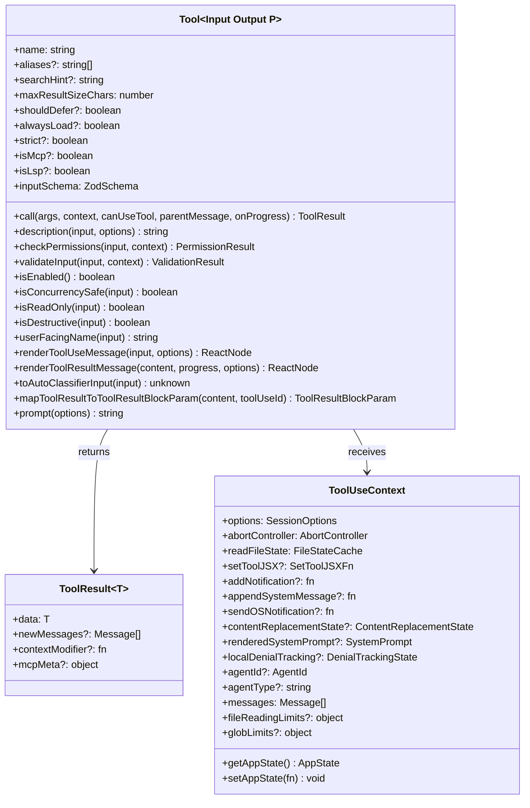
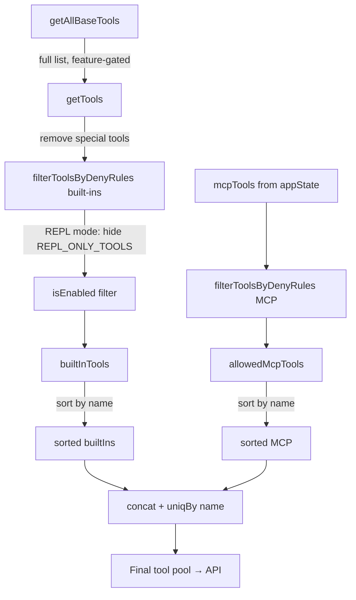
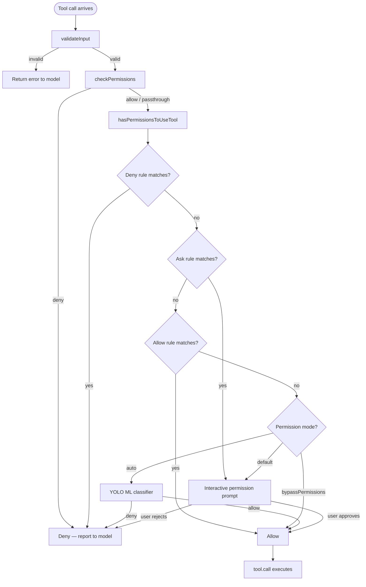

# Tool System

## Purpose

The tool system has two responsibilities: defining the shape every tool must conform to, and assembling the pool of tools that reaches the API for a given session.

`Tool.ts` provides the `Tool<Input, Output, P>` interface, the `ToolUseContext` rich-context object passed to every tool call, the `ToolResult` return type, and the `buildTool` factory that fills in safe defaults.

`tools.ts` provides the registry: `getAllBaseTools()` enumerates every possible tool (feature-gated conditionally), `getTools()` filters by deny rules and `isEnabled()`, and `assembleToolPool()` merges built-in and MCP tools into a single sorted, deduplicated list for prompt-cache stability.

---

## Tool Interface

### Key type details

**`ToolResult<T>`**
- `data` — the tool output forwarded to the model.
- `newMessages` — optional additional messages injected into the conversation (e.g., attachment messages from file reads).
- `contextModifier` — a function that mutates `ToolUseContext` for the next turn. Only honored for tools where `isConcurrencySafe` returns `false`; concurrent tools cannot safely mutate shared context.
- `mcpMeta` — pass-through MCP protocol metadata (`structuredContent`, `_meta`) for SDK consumers.

**`ToolUseContext` — selected fields**

| Field | Description |
|---|---|
| `options.mainLoopModel` | Model string used for the current agent loop |
| `options.isNonInteractiveSession` | True in SDK/print mode; affects prompt and tool descriptions |
| `options.mcpClients` | Active MCP server connections |
| `options.thinkingConfig` | Extended thinking budget settings |
| `setToolJSX` | Pushes a React node into the REPL panel (REPL mode only) |
| `addNotification` | Appends a status-bar notification |
| `appendSystemMessage` | Injects a UI-only system message (stripped before API) |
| `contentReplacementState` | Per-thread budget for persisting oversized tool results to disk |
| `renderedSystemPrompt` | Parent's frozen system prompt bytes, shared by fork subagents for cache hit |
| `agentId` / `agentType` | Subagent identity; used by hooks to distinguish subagent calls |
| `localDenialTracking` | Mutable denial counter for async subagents whose `setAppState` is a no-op |
| `fileReadingLimits` / `globLimits` | Per-call caps on file read tokens and glob result counts |

### `buildTool(def)`

`buildTool` merges `TOOL_DEFAULTS` with the supplied definition. Defaults are fail-closed where security matters:

| Method | Default |
|---|---|
| `isEnabled` | `true` |
| `isConcurrencySafe` | `false` (assume unsafe) |
| `isReadOnly` | `false` (assume writes) |
| `isDestructive` | `false` |
| `checkPermissions` | `{ behavior: 'allow', updatedInput }` — defer to the general permission system |
| `toAutoClassifierInput` | `''` — skip classifier (security-relevant tools must override) |
| `userFacingName` | `name` |

Security-sensitive tools — BashTool, FileEditTool, FileWriteTool — override `checkPermissions` and `toAutoClassifierInput` explicitly. Non-overriding tools are still subject to the general permission pipeline; the `checkPermissions` default simply says "no tool-specific objection".

---

## Tool Registry

### `getAllBaseTools()`

Returns the exhaustive list of all tools that could be active in the current process. Feature-gated groups are conditionally included at module load time via compile-time `feature()` flags and runtime environment checks.

| Category | Tools |
|---|---|
| Always present | AgentTool, BashTool, FileReadTool, FileEditTool, FileWriteTool, GlobTool\*, GrepTool\*, NotebookEditTool, WebFetchTool, WebSearchTool, TodoWriteTool, AskUserQuestionTool, SkillTool, EnterPlanModeTool, ExitPlanModeV2Tool, TaskOutputTool, TaskStopTool, BriefTool, ListMcpResourcesTool, ReadMcpResourceTool, SendMessageTool |
| `USER_TYPE=ant` | ConfigTool, TungstenTool, REPLTool, SuggestBackgroundPRTool |
| `KAIROS` / `PROACTIVE` flag | SleepTool |
| `KAIROS` flag | SendUserFileTool |
| `KAIROS` or `KAIROS_PUSH_NOTIFICATION` | PushNotificationTool |
| `KAIROS_GITHUB_WEBHOOKS` | SubscribePRTool |
| Worktree mode | EnterWorktreeTool, ExitWorktreeTool |
| Agent swarms | TeamCreateTool, TeamDeleteTool |
| `AGENT_TRIGGERS` | CronCreateTool, CronDeleteTool, CronListTool |
| `AGENT_TRIGGERS_REMOTE` | RemoteTriggerTool |
| `MONITOR_TOOL` | MonitorTool |
| `WEB_BROWSER_TOOL` | WebBrowserTool |
| `TERMINAL_PANEL` | TerminalCaptureTool |
| `HISTORY_SNIP` | SnipTool |
| `UDS_INBOX` | ListPeersTool |
| `WORKFLOW_SCRIPTS` | WorkflowTool |
| TodoV2 enabled | TaskCreateTool, TaskGetTool, TaskUpdateTool, TaskListTool |
| Tool search enabled | ToolSearchTool |
| LSP env var | LSPTool |

\* Omitted when embedded fast-search tools (bfs/ugrep) are available in the binary.

### `getTools(permissionContext)`

Builds the active tool list for a session:

1. **SIMPLE mode** (`CLAUDE_CODE_SIMPLE=1`): returns only `[BashTool, FileReadTool, FileEditTool]`, plus coordinator-mode tools when applicable. If REPL mode is also active, returns `[REPLTool]` instead.
2. **Normal mode**: starts from `getAllBaseTools()`, removes MCP resource tools (added separately), applies deny rules, then hides `REPL_ONLY_TOOLS` when REPL mode wraps them inside the VM. Finally calls `isEnabled()` on each remaining tool.

### `assembleToolPool(permissionContext, mcpTools)`

The single source of truth for combining built-in and MCP tools:

1. Calls `getTools(permissionContext)` for built-in tools.
2. Applies deny rules to the MCP tool list.
3. Sorts each partition by name independently (built-ins first, MCP tools second). This keeps built-ins as a contiguous prefix so the server-side `claude_code_system_cache_policy` cache breakpoint stays stable — interleaving MCP tools into the built-in prefix would bust all downstream cache keys whenever an MCP tool's name sorts between existing built-ins.
4. Concatenates and deduplicates by name with `uniqBy`; built-ins win on collision.

---

## Assembly Flow

---

## Tool Search and Deferral

When `isToolSearchEnabledOptimistic()` is true, `ToolSearchTool` is included in the pool and tools marked `shouldDefer: true` are sent to the API with `defer_loading: true`. Their full schemas are withheld from the initial prompt; the model uses `ToolSearchTool` to fetch schemas on demand. Tools marked `alwaysLoad: true` are exempt from deferral and always appear in full.

`searchHint` is a 3–10 word phrase on each tool used by `ToolSearchTool` for keyword matching. It should contain terms not already present in the tool name (e.g., `'jupyter'` on `NotebookEditTool`).

---

## Sources

- `~/git/claude-code/Tool.ts`
- `~/git/claude-code/tools.ts`
