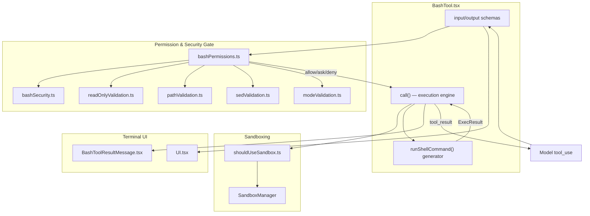
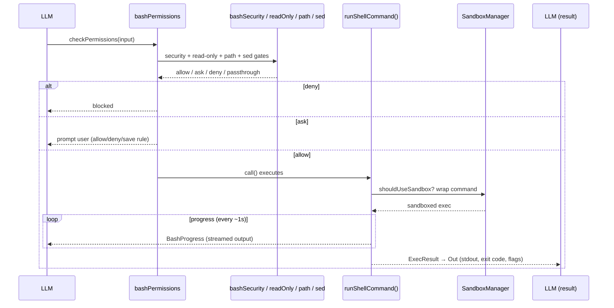

# BashTool — Shell Command Execution

This directory documents the `Bash` tool — the subsystem that lets the agent run
shell commands in the user's environment, capture their output, and do so under a
layered security, permission, and sandboxing model.

It is by far the largest single tool in the codebase (~12,400 lines across 18
files), so the documentation is split by concern. This README gives the module
map, the end-to-end request flow, and an index of the per-concern docs.

## Module Map

```
tools/BashTool/
├── BashTool.tsx               # Tool definition: schemas, lifecycle, call() execution engine
├── prompt.ts                  # Model-facing prompt: git rules, sandbox, timeout/background guidance
├── toolName.ts                # BASH_TOOL_NAME = "Bash" (breaks a circular import)
├── utils.ts                   # Output formatting, image handling, cwd-reset helpers
├── commentLabel.ts            # Extract a leading `# comment` for the UI label
│
├── bashSecurity.ts            # Command-injection / parser-differential defense (verdict: allow/ask/passthrough)
├── bashPermissions.ts         # Permission decision engine (allow/deny/ask), rule matching
├── modeValidation.ts          # Permission-mode auto-allows (acceptEdits)
├── commandSemantics.ts        # Exit-code interpretation (grep 1 = "no match", etc.)
├── destructiveCommandWarning.ts # Inline warnings for rm -rf, git reset --hard, etc.
│
├── readOnlyValidation.ts      # Read-only classification (drives auto-approval + concurrency)
├── shouldUseSandbox.ts        # Sandbox-eligibility decision
├── bashCommandHelpers.ts      # Command splitting, prefix extraction, redirection parsing
│
├── pathValidation.ts          # Path extraction + working-directory boundary enforcement
│
├── sedValidation.ts           # sed permission allowlist/denylist
├── sedEditParser.ts           # Parse sed -i edits so they render as file edits
│
├── UI.tsx                     # Render command invocation / progress / queued states
└── BashToolResultMessage.tsx  # Render stdout/stderr/exit-code results
```

## High-Level Architecture



## End-to-End Request Flow



The gate is **fail-closed**: any verdict other than `allow`/`passthrough` short-circuits
before execution. Read-only classification is what lets safe commands (`ls`, `git status`,
`grep`) auto-approve and run concurrently; everything else escalates to the user.

## Documents

| File | Covers |
|------|--------|
| [bashtool.md](./bashtool.md) | `BashTool.tsx` + `prompt.ts`: schemas, ToolDef lifecycle, the `call()` execution engine, background tasks, image output |
| [security.md](./security.md) | `bashSecurity.ts`: command-injection and parser-differential defense |
| [permissions.md](./permissions.md) | `bashPermissions.ts` + `modeValidation.ts` + `commandSemantics.ts` + `destructiveCommandWarning.ts`: the allow/deny/ask decision engine |
| [read-only-validation.md](./read-only-validation.md) | `readOnlyValidation.ts` + `shouldUseSandbox.ts` + `bashCommandHelpers.ts`: read-only classification and sandbox eligibility |
| [path-validation.md](./path-validation.md) | `pathValidation.ts`: path extraction and working-directory boundary enforcement |
| [sed-validation.md](./sed-validation.md) | `sedValidation.ts` + `sedEditParser.ts`: treating `sed -i` as a file edit |
| [ui.md](./ui.md) | `UI.tsx` + `BashToolResultMessage.tsx`: terminal rendering |

## Cross-Cutting Themes

- **Layered defense.** A command passes through security (injection) → read-only
  classification → path boundaries → sed rules → permission rules → mode. Each
  layer can independently force an `ask` or `deny`.
- **AST + regex duality.** Where a tree-sitter AST is available it is authoritative;
  legacy regex/shell-quote paths remain as fallbacks. Many checks exist specifically
  to catch *parser differentials* — cases where shell-quote tokenization and real
  bash disagree.
- **Compound commands are split.** `a && b | c` is decomposed into subcommands;
  each is evaluated independently and the results merged (any deny → deny, any ask
  → ask).
- **`USER_TYPE === 'ant'`** unlocks additional safe env vars and read-only command
  allowlists (e.g. `gh`, cluster tooling) for internal users.
