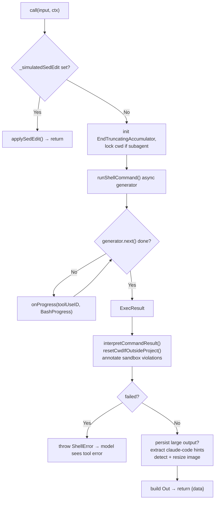
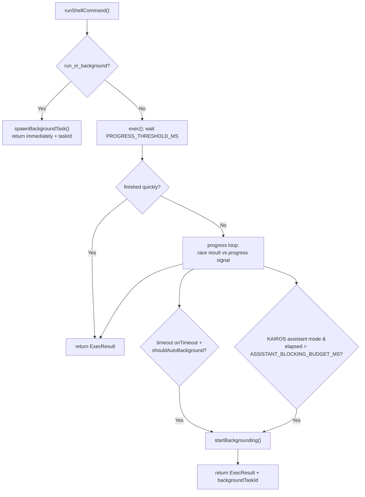

# BashTool Core — Tool Definition & Execution Engine

**Source:** `BashTool.tsx`, `prompt.ts`, `toolName.ts`, `utils.ts`, `commentLabel.ts`

This is the heart of the subsystem: the `ToolDef` that defines the `Bash` tool's
schemas and lifecycle, the `call()` execution engine, and the model-facing prompt.
The security/permission/validation modules are documented separately (see the
[README](./README.md) index).

## Purpose

Execute a shell command in the project's working environment and return its output
to the model. Beyond plain execution it supports streamed progress, background
tasks, timeouts with auto-backgrounding, sandboxing, large-output persistence, and
image (data-URI) output.

## Input Schema

`BashTool.tsx` defines a `fullInputSchema` (internal) and a model-facing
`inputSchema` that omits internal/disabled fields.

| Field | Type | Notes |
|-------|------|-------|
| `command` | `string` (required) | The shell command to execute. |
| `timeout` | `number?` | Milliseconds, capped at `getMaxTimeoutMs()`, default `getDefaultTimeoutMs()`. Semantic parsing turns `"5s"` → `5000`. |
| `description` | `string?` | Active-voice, 5–10 word summary shown in the UI. |
| `run_in_background` | `boolean?` | Return immediately with a task ID; omitted from the schema when `CLAUDE_CODE_DISABLE_BACKGROUND_TASKS=1`. |
| `dangerouslyDisableSandbox` | `boolean?` | Bypass the sandbox (still subject to permission rules). |
| `_simulatedSedEdit` | `{ filePath, newContent }?` | **Internal only** — a pre-computed sed edit result injected after the user approves a `SedEditPermissionRequest`. Omitted from the model-facing schema. |

## Output Schema (`Out`)

| Field | Type | Meaning |
|-------|------|---------|
| `stdout` | `string` | Merged stdout+stderr (`2>&1`), truncated at `getMaxOutputLength()`. |
| `stderr` | `string` | Shell-reset messages only (e.g. "cwd was reset"), not command stderr. |
| `interrupted` | `boolean` | Aborted before completion (timeout / user cancel). |
| `isImage` | `boolean?` | stdout is a data-URI image; triggers `buildImageToolResult()`. |
| `backgroundTaskId` | `string?` | Set when backgrounded (explicit, timeout, or assistant auto-background). |
| `backgroundedByUser` | `boolean?` | Backgrounded via Ctrl+B. |
| `assistantAutoBackgrounded` | `boolean?` | Auto-backgrounded after `ASSISTANT_BLOCKING_BUDGET_MS` (KAIROS). |
| `returnCodeInterpretation` | `string?` | Semantic exit-code meaning (see [permissions.md](./permissions.md) → `commandSemantics`). |
| `noOutputExpected` | `boolean?` | Command normally produces no stdout (e.g. `mv`, `mkdir`) → UI shows "Done". |
| `rawOutputPath` / `persistedOutputPath` / `persistedOutputSize` | — | Large output spilled to disk under `tool-results/`. |
| `structuredContent` | `array?` | MCP-style content blocks (images + text). |

## ToolDef Lifecycle

Assembled via `buildTool({...})`. Notable members:

| Member | Behavior |
|--------|----------|
| `name` | `"Bash"` (from `toolName.ts`). |
| `description()` | Returns `input.description` or a default. |
| `prompt()` | Returns `getSimplePrompt()` from `prompt.ts`. |
| `inputSchema` / `outputSchema` | Zod getters. `strict: true`. |
| `isReadOnly(input)` | Delegates to `checkReadOnlyConstraints()` — true only for guaranteed read-only commands. |
| `isConcurrencySafe(input)` | `= isReadOnly(input)` — read-only commands may run in parallel. |
| `userFacingName(input)` | `"SandboxedBash"` vs `"Bash"`; renders sed edits specially. |
| `preparePermissionMatcher(input)` | Parses the AST to extract subcommands; returns a matcher for rule evaluation. |
| `validateInput(input)` | Blocks `sleep N` (N≥2) when the Monitor tool is enabled. |
| `checkPermissions(input, ctx)` | Delegates to `bashToolHasPermission()` (see [permissions.md](./permissions.md)). |
| `call(input, ctx)` | The execution engine (below). |
| `mapToolResultToToolResultBlockParam()` | Converts `Out` to an SDK `ToolResultBlockParam`; handles images, large output, background tasks. |
| `maxResultSizeChars` | `30_000` — threshold for persisting output to disk. |

## `call()` Execution Engine

Key points:

- **Simulated sed edits** short-circuit: an approved `sed -i` is applied directly
  via `applySedEdit()` rather than re-running sed.
- **Streaming** is driven by an async generator `runShellCommand()` that yields
  `BashProgress` (`output`, `fullOutput`, `elapsedTimeSeconds`, `totalLines`,
  `totalBytes`, `taskId`, `timeoutMs`) roughly every second.
- **Output is merged** (`2>&1`) and capped by an `EndTruncatingAccumulator`; the
  `stderr` field carries only shell-reset notices.
- **Failure → `ShellError`** is thrown so the model receives a tool error, not a
  silent non-zero result.

### Background Tasks & Timeouts

`runShellCommand()` decides foreground vs background:

Three backgrounding paths: explicit (`run_in_background`), timeout-driven (the
command would otherwise be killed — instead it backgrounds), and assistant-mode
auto-backgrounding after a 15s blocking budget. The user can also background a
running foreground task with Ctrl+B (see [ui.md](./ui.md)).

## Helper Modules

- **`utils.ts`** — `isImageOutput()` / `parseDataUri()` / `buildImageToolResult()`
  / `resizeShellImageOutput()` (compress to the API's ~5 MB base64 limit);
  `formatOutput()` (truncate + line-count); `resetCwdIfOutsideProject()` (reset
  the shell's cwd if a command moved it outside allowed directories, appending a
  notice to `stderr`); `stripEmptyLines()`.
- **`commentLabel.ts`** — `extractBashCommentLabel()` pulls a leading `# label`
  comment from the command for the fullscreen UI label (ignores shebangs).
- **`toolName.ts`** — exports `BASH_TOOL_NAME = "Bash"` to break a circular
  dependency with `prompt.ts`.

## The Prompt (`prompt.ts`)

`getSimplePrompt()` assembles the model-facing guidance:

- **Tool preferences** — steer the model toward `Glob`/`Grep`/`Read` instead of
  `find`/`grep`/`cat`/`sed`/`echo` when those dedicated tools exist.
- **Execution rules** — create parent dirs first, quote paths with spaces, prefer
  absolute paths, use `timeout`, use `run_in_background` for long tasks, and avoid
  long `sleep` (use the Monitor tool).
- **Git safety** — never edit git config, never force-push to main/master, never
  skip hooks (`--no-verify`/`--no-gpg-sign`), create *new* commits rather than
  amending after a hook failure, prefer `git add <files>` over `git add .`, and
  only commit when asked. Internal users are pointed at `/commit` skills.
- **Sandbox section** (`getSimpleSandboxSection`) — documents the filesystem /
  network / unix-socket policy and the auto-allow-with-evidence override, and
  directs temp files to `$TMPDIR`.

It also exports `getDefaultTimeoutMs()`, `getMaxTimeoutMs()`, and
`getBackgroundUsageNote()`.
