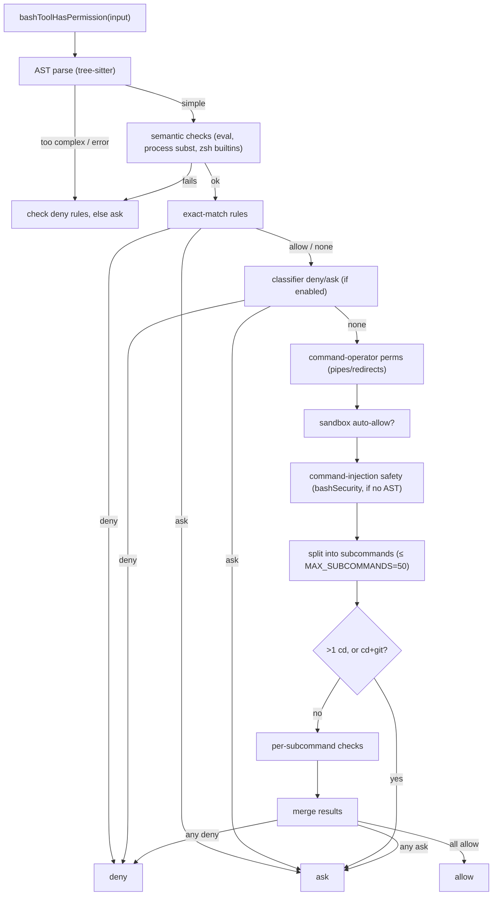
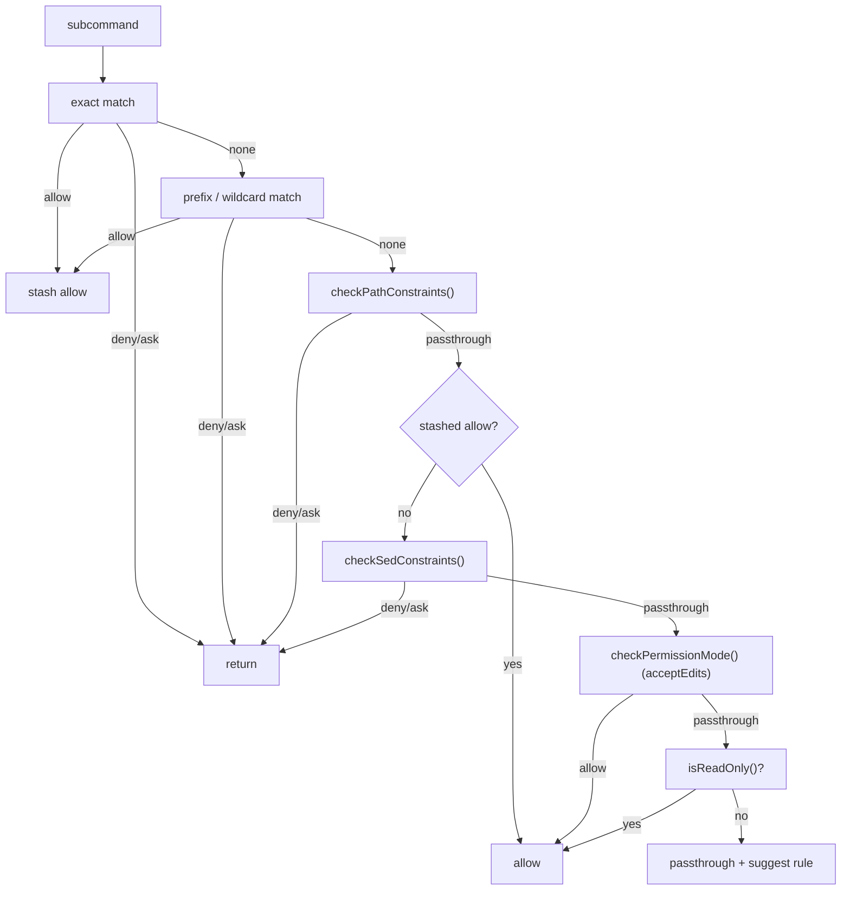

# bashPermissions — The Permission Decision Engine

**Source:** `bashPermissions.ts`, `modeValidation.ts`, `commandSemantics.ts`, `destructiveCommandWarning.ts`

This is the orchestrator that turns a command into a final verdict —
`allow` / `deny` / `ask` / `passthrough` — by coordinating rule matching, the
security gate, read-only classification, path/sed constraints, permission mode,
and an optional ML classifier.

## Entry Point

```ts
async function bashToolHasPermission(
  input,
  context,
  getCommandSubcommandPrefixFn = getCommandSubcommandPrefix,
): Promise<PermissionResult>
```

It returns a `PermissionResult`:

```ts
type PermissionResult =
  | { behavior: 'allow';       updatedInput; decisionReason }
  | { behavior: 'deny';        message; decisionReason }
  | { behavior: 'ask';         message; decisionReason; suggestions?; pendingClassifierCheck? }
  | { behavior: 'passthrough'; message?; decisionReason?; suggestions? }
```

`decisionReason` records *why* (a matched `rule`, the `classifier`, the `mode`,
per-`subcommandResults`, or `other`), which drives both UI messaging and the
rules the dialog offers to save.

## Decision Pipeline



### Per-subcommand check (`bashToolCheckPermission`)

Each subcommand runs through a fixed order, returning early on `deny`/`ask`:



The ordering is deliberately **deny-before-allow** at every level, so an explicit
deny rule always wins.

## The Permission Model

### Rule types

Rules live in `ToolPermissionContext.toolPermissions` keyed by behavior
(`allow`/`deny`/`ask`). Each rule's content parses (via `parsePermissionRule`)
into one of:

| Type | Example | Matches |
|------|---------|---------|
| exact | `npm install` | only that exact command |
| prefix | `npm install:*` | `npm install …` |
| wildcard | `npm*test` | case-sensitive regex |

### Matching (`filterRulesByContentsMatchingInput`)

1. Strip output redirections (`python x.py > out.txt` → `python x.py`).
2. Strip safe wrappers (`timeout`, `time`, `nice`, `nohup`, `stdbuf`) and **safe
   env vars** only — for allow rules.
3. For **deny/ask** rules, additionally strip *all* leading env vars
   (`stripAllLeadingEnvVars`, honoring the `BINARY_HIJACK_VARS` blocklist of
   `LD_*`/`DYLD_*`/`PATH`) so `FAKE=1 denied_cmd` can't dodge a deny rule.
4. Build candidate commands via a fixed-point loop, then match per rule type.

**Compound-command guard:** prefix/wildcard rules are skipped for compound commands
(`a && b`) unless the structure was AST-validated — otherwise `Bash(cd:*)` would
match `cd /path && python3 evil.py`.

### Environment variable handling

- `SAFE_ENV_VARS` (~40): vars that don't execute code (`NODE_ENV`, `RUST_LOG`,
  `LANG`, `TZ`, …) — safe to strip when matching allow rules.
- `ANT_ONLY_SAFE_ENV_VARS` (~25): extra vars stripped only for `USER_TYPE === 'ant'`
  (`KUBECONFIG`, `DOCKER_HOST`, `AWS_PROFILE`, cluster vars, …).
- `BARE_SHELL_PREFIXES`: shells and wrappers (`sh`, `bash`, `sudo`, `env`, `xargs`,
  …) that must never be *suggested* as a rule — `Bash(sudo:*)` would be a blank check.

### Compound commands

`splitCommand_DEPRECATED` (or AST spans when available) decomposes the command;
self-referential `cd ${cwd}` prefixes are filtered. Then: any subcommand `deny`
→ deny; `>1 cd` → ask; `cd` + `git` together → ask (RCE risk via a bare repo with
`core.fsmonitor`); otherwise merge, capping suggested rules at
`MAX_SUGGESTED_RULES_FOR_COMPOUND = 5`.

### ML classifier integration

When enabled, a Haiku classifier runs **speculatively in parallel** while the
permission dialog is being prepared (`startSpeculativeClassifierCheck`), and again
**in the background** while the dialog is shown (`executeAsyncClassifierCheck`).
A high-confidence allow can auto-approve before the user even responds; a
high-confidence deny/ask escalates.

## modeValidation.ts

`checkPermissionMode()` implements the **acceptEdits** mode auto-allow: filesystem
commands (`mkdir`, `touch`, `rm`, `rmdir`, `mv`, `cp`, `sed`) are auto-approved.
`bypass` / `dontAsk` modes are handled in the main flow, not here.

## commandSemantics.ts

`interpretCommandResult(command, exitCode, stdout, stderr)` maps non-zero exits
that aren't really errors, via a `COMMAND_SEMANTICS` table:

| Command | Exit 1 means |
|---------|--------------|
| `grep` / `rg` | no matches found |
| `find` | some dirs inaccessible (partial) |
| `diff` | files differ |
| `test` / `[` | condition false |

Default: only exit 0 is success. The result populates
`Out.returnCodeInterpretation` and decides whether `call()` throws a `ShellError`.

## destructiveCommandWarning.ts

`getDestructiveCommandWarning(command)` returns an inline, non-blocking warning
(shown in the permission dialog) for irreversible operations matched against
`DESTRUCTIVE_PATTERNS`: `git reset --hard`, `git push --force`, `git clean -f`,
`git branch -D`, `--no-verify`, `git commit --amend`, `rm -rf`, SQL
`DROP`/`DELETE FROM`, `kubectl delete`, `terraform destroy`, and more.

## Integration

`bashToolHasPermission` is `BashTool.checkPermissions`. It consumes
[security.md](./security.md), [read-only-validation.md](./read-only-validation.md),
[path-validation.md](./path-validation.md), and [sed-validation.md](./sed-validation.md)
as gates within the per-subcommand check.
