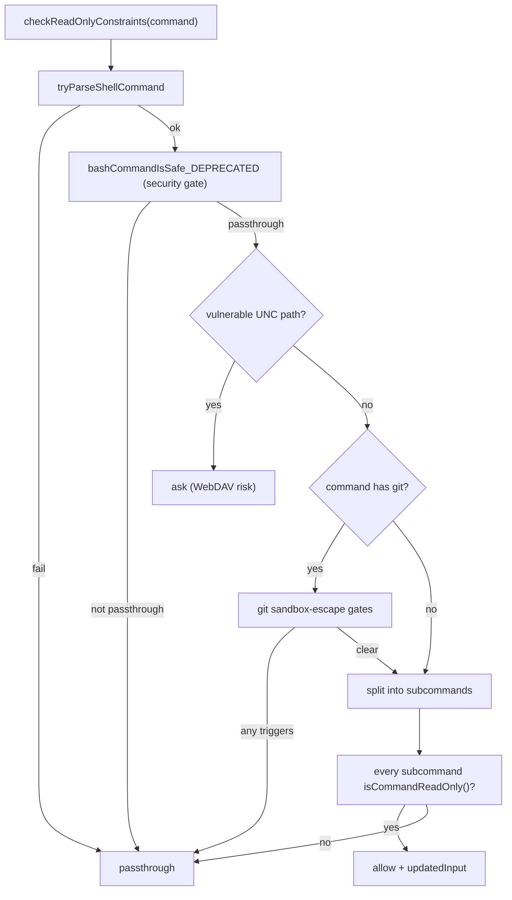
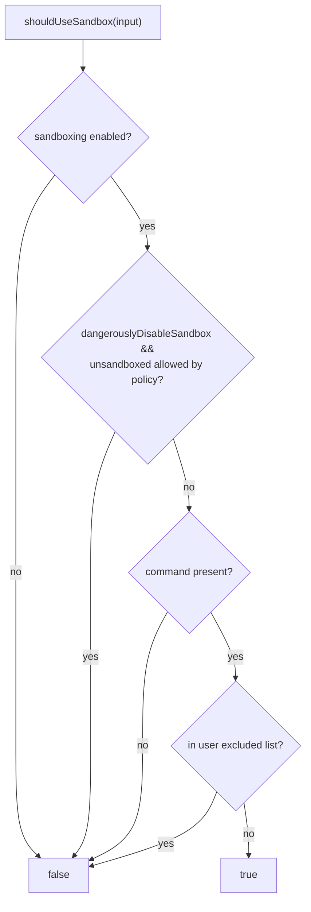

# readOnlyValidation — Read-Only Classification & Sandbox Eligibility

**Source:** `readOnlyValidation.ts`, `shouldUseSandbox.ts`, `bashCommandHelpers.ts`

Read-only classification answers one question: *is this command guaranteed to have
no side effects?* A `true` answer is what lets a command auto-approve
(`BashTool.isReadOnly`) and run concurrently (`isConcurrencySafe`). The design is
allowlist-first, deny-by-default: anything not provably safe falls through to a
user prompt.

## Entry Points

| Function | Returns | Role |
|----------|---------|------|
| `checkReadOnlyConstraints(input, compoundCommandHasCd)` | `PermissionResult` (`allow` or `passthrough`) | Top-level arbiter for a (possibly compound) command. Never denies — it either auto-approves or defers. |
| `isCommandSafeViaFlagParsing(command)` | `boolean` | Allowlist-based validator for a single command. |
| `shouldUseSandbox(input)` | `boolean` | Whether to run inside the OS sandbox. |

## How Classification Works



A compound command is read-only **only if every segment is** — `cat f | grep x` is
fine, but `cat f | sh` or `cat f | rm y` is not.

### `isCommandReadOnly` (single command)

```mermaid
flowchart TD
    A["command"] --> B["strip trailing 2>&1"]
    B --> C{"vulnerable UNC path?"}
    C -->|yes| F["false"]
    C -->|no| D{"unquoted $VAR or glob?"}
    D -->|yes| F
    D -->|no| E["isCommandSafeViaFlagParsing()"]
    E -->|true| T["true"]
    E -->|false| G["try READONLY_COMMAND_REGEXES"]
    G -->|match (and no git -c)| T
    G -->|no match| F
```

`containsUnquotedExpansion` rejects `$VAR` and glob chars outside quotes —
defeating parser differentials like `uniq --skip-chars=0$_` (where `$_` expands at
runtime to smuggle an argument past a regex).

## The Allowlist

`COMMAND_ALLOWLIST` (90+ entries) is a `Record<string, CommandConfig>` keyed by
command name or multi-word pattern (`"git diff"`):

```ts
type CommandConfig = {
  safeFlags: Record<string, FlagArgType>   // flag → argument type
  regex?: RegExp                            // extra restriction
  additionalCommandIsDangerousCallback?: (rawCommand, args) => boolean
  respectsDoubleDash?: boolean
}
```

`FlagArgType` declares what argument a flag consumes: `'none'`, `'number'`,
`'string'`, `'char'`, `'{}'` (xargs replacement string), or `'EOF'`.

`isCommandSafeViaFlagParsing` then:

1. Tokenizes; rejects pipes/redirects in the segment.
2. Matches the longest command key (handles `git diff`).
3. **Rejects any token containing `$`** (variable-expansion ambiguity) or brace
   expansion `{a,b}`.
4. Validates every flag against `safeFlags` (unknown flag ⇒ reject), consuming
   arguments per `FlagArgType`, honoring `--`.
5. Applies the optional `regex` and `additionalCommandIsDangerousCallback`.

### Illustrative entries

| Command | Notable rule |
|---------|--------------|
| `git diff` / `git log` / `git status` … | extensive `safeFlags`; `-S` must be `'string'` not `'none'`; a regex blocks `-c core.fsmonitor=…` config injection. |
| `xargs` | only safe target commands (`echo`, `grep`, `head`, `tail`, `wc`); `-I '{}'` and `-E 'EOF'` use exact-match arg types; GNU `-i`/`-e` **omitted** (optional-arg parser differential). |
| `sed` | callback delegates to `sedCommandIsAllowedByAllowlist` (see [sed-validation.md](./sed-validation.md)). |
| `ps` | callback blocks the BSD `e` modifier (would print environment variables). |
| `date` | callback blocks `-s`/`-f` and positional `MMDDhhmm` time-setting; format args must start with `+`. |
| `fd` / `fdfind` | `FD_SAFE_FLAGS`; `-x`/`-X` (execute-per-result) deliberately excluded. |
| `tput`, `lsof`, `tree` | callbacks/omissions block capability writes, mount-supplement writes, and `-o` file output. |

`gh` and other network-capable commands are gated behind `USER_TYPE === 'ant'`
(`ANT_ONLY_COMMAND_ALLOWLIST`).

### Regex fallback

`READONLY_COMMAND_REGEXES` covers ~80 simple commands (`cat`, `ls`, `wc`, `id`,
`uname`, `cut`, `diff`, `true`, `which`, …) plus carefully-bounded patterns for
`echo`, `jq` (blocking `-f`/`--rawfile`), and `find` (blocking `-exec`/`-delete`/
`-fprint`). `makeRegexForSafeCommand` generates patterns that forbid shell
metacharacters and command substitution.

## Git Sandbox-Escape Gates

Because `git` runs hooks, `checkReadOnlyConstraints` applies extra gates before
trusting a git command:

1. **cd + git** in one compound command → defer (hooks would run in the new dir).
2. **Bare-repo shape** (`.git/HEAD` deleted, `hooks/` present) → defer.
3. **Write-to-git-internal then git** (`mkdir hooks && echo … > hooks/pre-commit
   && git status`) → defer. `commandWritesToGitInternalPaths` extracts write paths
   and matches them against `GIT_INTERNAL_PATTERNS` (`HEAD`, `objects/`, `refs/`,
   `hooks/`).
4. **Git outside the original cwd** while sandboxing is enabled → defer (TOCTOU
   race mitigation).

## shouldUseSandbox.ts

`shouldUseSandbox(input)` decides whether to wrap execution in the OS sandbox.
It is **orthogonal to read-only** — read-only commands still run sandboxed.



`containsExcludedCommand` consults feature flags (`tengu_sandbox_disabled_commands`
for ants) and user settings (`settings.sandbox.excludedCommands`), splitting
compound commands and stripping env-var/wrapper prefixes before wildcard matching.
The excluded list is a convenience, **not** a security boundary.

## bashCommandHelpers.ts

Shared parsing utilities used across the subsystem:

- `splitCommand_DEPRECATED()` — split on `&&`, `;`, `||`, `|`.
- `tryParseShellCommand()` — quote/escape-aware tokenizer.
- `extractOutputRedirections()` — pull `>`, `>>`, `&>` targets.
- `buildParsedCommandFromRoot()` — build a parsed command from an AST root.
