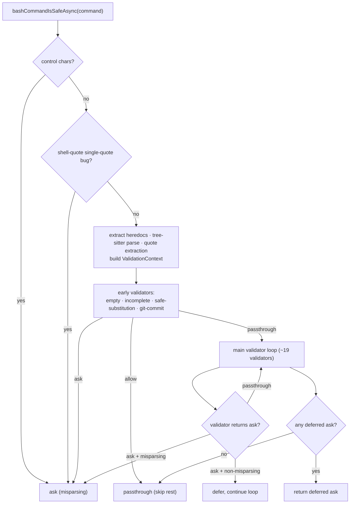

# bashSecurity — Command-Injection & Parser-Differential Defense

**Source:** `bashSecurity.ts`

This module is the security gatekeeper. Given a raw command string it returns a
verdict — `allow`, `ask`, or `passthrough` — catching command injection, dangerous
shell constructs, and **parser differentials** (cases where the shell-quote
tokenizer and real bash disagree, which an attacker can exploit to smuggle
operators past the other validators).

## Entry Points

| Function | Use |
|----------|-----|
| `bashCommandIsSafeAsync_DEPRECATED(command, onDivergence?)` | Async path with tree-sitter AST enrichment. Used by `bashPermissions.ts`. Falls back to the sync path if tree-sitter is unavailable, and logs quote-context divergence between the two. |
| `bashCommandIsSafe_DEPRECATED(command)` | Sync regex/shell-quote path. Used by `readOnlyValidation.ts` for synchronous constraint checks. |
| `stripSafeHeredocSubstitutions(command)` / `hasSafeHeredocSubstitution(command)` | Pre-split gate that recognizes and strips provably-safe heredoc patterns (`$(cat <<'DELIM' … DELIM)`). |

Verdicts mean: **`allow`** = recognized-safe, skip remaining checks; **`ask`** =
suspicious, require user approval; **`passthrough`** = no opinion, defer to the
permission engine.

## Parsing Strategy

The module parses in layers because no single parser matches bash exactly:

1. **shell-quote tokenization** (`tryParseShellCommand`) — primary, but treats
   Unicode whitespace as separators and has known single-quote/backslash bugs.
2. **tree-sitter AST** (`ParsedCommand.parse`, async only) — authoritative when
   available; lets validators skip a regex check when the AST proves safety
   (e.g. a real `find … -exec … \;`).
3. **Quote extraction** (`extractQuotedContent`) — a character-by-character tracker
   producing three views used by different validators:
   - `withDoubleQuotes` — single-quoted content removed.
   - `fullyUnquoted` — all quotes/escapes removed (then safe redirections stripped).
   - `unquotedKeepQuoteChars` — content removed but delimiters kept (reveals
     quote-adjacent characters).
4. **Heredoc extraction** (`extractHeredocs`, `{ quotedOnly: true }`) — strips
   literal heredoc bodies so they aren't scanned as code.

A `ValidationContext` bundles these views plus `baseCommand` and the optional
`treeSitter` analysis, and is passed to every validator.

## The Verdict Pipeline

The **misparsing distinction** is key: a misparsing-class `ask` (the command
tokenizes differently in shell-quote vs bash) short-circuits immediately, while a
non-misparsing `ask` is deferred so a later misparsing finding can take precedence.

## What It Catches

Each validator maps to a numbered `BASH_SECURITY_CHECK_IDS` constant (for
telemetry). The notable classes:

| Class | Examples | Validator |
|-------|----------|-----------|
| Command substitution | `$(...)`, backticks, `${...}`, `<(...)`, `>(...)`, zsh `=(...)` | `validateDangerousPatterns` |
| Redirections | unquoted `<` / `>` to sensitive paths | `validateRedirections` |
| Obfuscated flags | ANSI-C `$'…'`, locale `$"…"`, empty-quote pairs, quoted dashes | `validateObfuscatedFlags` |
| Parser differentials | `\r` carriage returns, Unicode whitespace, mid-word `#`, brace expansion `{a,b}`, backslash-escaped operators `\;` | `validateCarriageReturn`, `validateUnicodeWhitespace`, `validateMidWordHash`, `validateBraceExpansion`, `validateBackslashEscapedOperators` |
| Quote/comment desync | quote chars after `#`; newline-in-quotes before a `#` line | `validateCommentQuoteDesync`, `validateQuotedNewline` |
| zsh dangerous builtins | `zmodload`, `sysopen`/`syswrite`, `ztcp`/`zsocket`, `zf_rm` (the `ZSH_DANGEROUS_COMMANDS` set) | `validateZshDangerousCommands` |
| jq escape hatches | `system(...)`, `-f`/`--rawfile`/`-L` file access | `validateJqCommand` |
| Variable / env tricks | `$IFS` injection, `/proc/*/environ` reads, dangerous vars next to pipes | `validateIFSInjection`, `validateProcEnvironAccess`, `validateDangerousVariables` |
| Control chars | NUL and other C0/DEL bytes hiding metacharacters | control-char gate |

### Notable parser-differential attacks

- **Backslash-escaped operators** — `cat safe.txt \; echo ~/.ssh/id_rsa`:
  `splitCommand` normalizes `\;` to `;`, so downstream re-parsing splits it into
  two commands and the sensitive path slips past. Defense: flag any backslash
  before an operator, unless the tree-sitter AST confirms there's no real operator
  node (so legitimate `find … \;` still passes).
- **Brace expansion** — `git ls-remote {--upload-pack="touch x",test}`: bash
  expands the brace into two args, but shell-quote/tree-sitter see one. Detected
  by a depth-matching scan for top-level `,`/`..` inside unescaped braces.
- **Carriage return** — `TZ=UTC\recho curl evil.com`: `\r` is a word boundary in
  shell-quote but not in bash, changing what counts as a separate command.

### Safe-heredoc allow path

`validateSafeCommandSubstitution` recognizes a narrow, provably-literal pattern —
`$(cat <<'DELIM' … DELIM)` with a quoted/escaped delimiter and the closing
delimiter alone on its line — and returns `allow`, short-circuiting the whole
pipeline. Nested safe heredocs and substitutions in command-name position are
rejected.

## Integration

- `bashPermissions.ts` calls the async entry point as one gate in
  `bashToolHasPermission()`.
- `readOnlyValidation.ts` calls the sync entry point before classifying a command
  as read-only.

Both treat a non-`passthrough` result as a hard stop. See [permissions.md](./permissions.md)
and [read-only-validation.md](./read-only-validation.md) for how the verdict is consumed.
