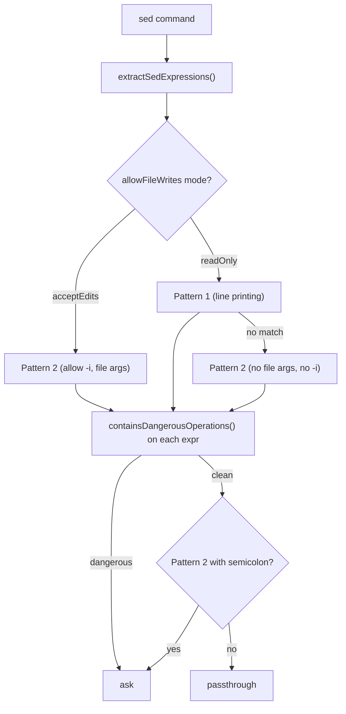

# sed Validation & Edit Parsing

**Source:** `sedValidation.ts`, `sedEditParser.ts`

`sed` is special: `sed -i` edits files in place — a write operation the permission
and path layers must recognize and, ideally, render as a file edit rather than a
raw shell line. These two modules provide a layered approach:

- **`sedValidation.ts`** — permission-level filtering: an allowlist of provably
  safe patterns plus a denylist of dangerous operations.
- **`sedEditParser.ts`** — extraction: parse a `sed -i` substitution so it can be
  previewed and applied as a structured file edit.

## sedValidation.ts

### Entry points

| Function | Returns | Role |
|----------|---------|------|
| `checkSedConstraints(input, toolPermissionContext)` | `PermissionResult` (`ask`/`passthrough`) | Per-command gate called by the permission engine. |
| `sedCommandIsAllowedByAllowlist(command, {allowFileWrites?})` | `boolean` | Core allowlist+denylist check. Also used by `readOnlyValidation`'s `sed` callback. |

### Two allowed patterns

**Pattern 1 — line printing** (read-only): `sed -n '1p'`, `sed -n '1,5p;10p'`.
Requires `-n` (quiet), allows file args, and every expression must match the strict
print form `^(?:\d+|\d+,\d+)?p$`. Allowed flags: `-n`, `-E`, `-r`, `-z`, and their
long forms.

**Pattern 2 — substitution**: `sed 's/old/new/flags'`, or `sed -i 's/old/new/'`
when `allowFileWrites` (acceptEdits mode). One `s/…/…/` expression, flags limited
to `[gpimIM1-9]`. In read-only mode it must have **no file args and no `-i`**;
semicolons in the expression are rejected.

### Denylist (`containsDangerousOperations`)

Even an allowlisted command is rejected if it contains dangerous constructs:
non-ASCII (homoglyphs), `{…}` blocks, newlines, comments, negation (`!`), GNU step
addresses (`1~2`), backslash-delimiter tricks (`s\`, `\|`), and — most importantly —
the `w`/`W` (write-to-file), `e`/`E` (execute), and `s///w` (write flag) commands
that would let sed write arbitrary files or run commands without `-i`.



## sedEditParser.ts

Turns an in-place sed substitution into a structured edit.

| Function | Role |
|----------|------|
| `isSedInPlaceEdit(command)` | Quick test: is this a `sed -i` edit? |
| `parseSedEditCommand(command)` | Full parse → `SedEditInfo` or `null`. |
| `applySedSubstitution(content, sedInfo)` | Apply the substitution to file content (for preview / the simulated edit). |

```ts
type SedEditInfo = {
  filePath: string
  pattern: string
  replacement: string
  flags: string          // g, i, m, 1-9
  extendedRegex: boolean // -E / -r
}
```

The parser tokenizes with `tryParseShellCommand`, recognizes `-i`/`-i.bak`
(macOS backup suffix), `-E`/`-r`, and `-e`; requires exactly an `-i` flag, one
`s/…/…/` expression (only `/` delimiter), and one file path. A small state machine
walks `pattern → replacement → flags`, handling escapes. It conservatively returns
`null` for anything unusual: multiple `-e`, globs, unknown flags, non-`s`
expressions, or multiple files.

`applySedSubstitution` converts BRE metacharacters to JS-regex form using null-byte
placeholders (`\x00PLUS\x00`, …) so escaping can't be injected, and maps sed's `&`
(whole match) to JS `$&`.

## Why two layers

`sedValidation` is the **gate** (block unsafe sed before it runs);
`sedEditParser` is the **renderer/applier** (show a safe `sed -i` as a file edit
and apply it client-side). They connect through the BashTool flow: an approved
sed edit becomes a `_simulatedSedEdit` on the input, which `call()` applies
directly via `applySedEdit()` rather than re-running sed (see
[bashtool.md](./bashtool.md)). The `readOnlyValidation` `sed` allowlist callback
also delegates to `sedCommandIsAllowedByAllowlist`.
