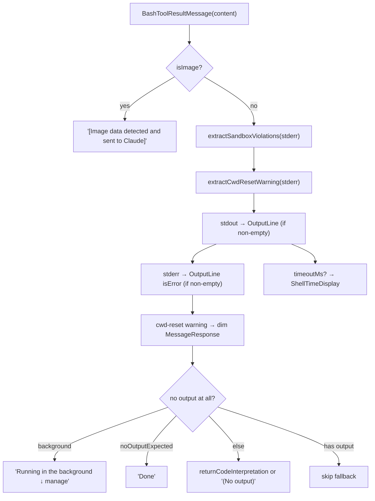

# BashTool UI — Invocation & Result Rendering

**Source:** `UI.tsx`, `BashToolResultMessage.tsx`

These React + Ink components render the BashTool in the terminal: the command
invocation, live progress, queued state, and the final result. Both are compiled
with the React Compiler (`_c()` cache slots) for automatic memoization.

## UI.tsx — Render Hub

Exports the `render*` hooks the tool system calls, plus a `BackgroundHint`
component.

| Export | Renders |
|--------|---------|
| `renderToolUseMessage(input, {verbose})` | The command, with intelligent truncation. |
| `renderToolUseProgressMessage(progress, {...})` | Live `ShellProgressMessage`, or "Running…" fallback. |
| `renderToolUseQueuedMessage()` | "Waiting…". |
| `renderToolResultMessage(content, progress, {...})` | Delegates to `BashToolResultMessage` (passing `timeoutMs`). |
| `renderToolUseErrorMessage(result, {...})` | `FallbackToolUseErrorMessage`. |
| `BackgroundHint({onBackground?})` | Ctrl+B hint that backgrounds running tasks. |

### Command display (`renderToolUseMessage`)

Constants `MAX_COMMAND_DISPLAY_LINES = 2` and `MAX_COMMAND_DISPLAY_CHARS = 160`
bound the displayed command. Special cases:

- **sed edits** — if `parseSedEditCommand()` recognizes a `sed -i`, only the
  target file path is shown (it reads as a file edit, not a raw sed line).
- **Fullscreen** — `extractBashCommentLabel()` pulls a leading `# label` and shows
  just that.
- **Truncation** — collapse to 2 lines, then 160 chars, appending `…`. Verbose
  mode shows the full command.

### Background hint (`BackgroundHint`)

Registers the `task:background` keybinding. The handler calls `backgroundAll()`
to move every running foreground bash task to the background, plus an optional
`onBackground?()` for non-bash tasks. In tmux (where Ctrl+B is the prefix key) the
hint reads "ctrl+b ctrl+b (twice)". Hidden when `CLAUDE_CODE_DISABLE_BACKGROUND_TASKS`
is set.

## BashToolResultMessage.tsx — Result Display

Renders `{ content: Out, verbose, timeoutMs? }` as a vertical stack.

Two extraction helpers clean up `stderr` before display:

- **`extractSandboxViolations`** — strips `<sandbox_violations>…</sandbox_violations>`
  tags so they remain available to the model (in violation logs) but don't clutter
  the user's view.
- **`extractCwdResetWarning`** — pulls the "Shell cwd was reset to …" line out so
  it renders in dim *warning* styling rather than error (red) styling.

The no-output fallback distinguishes a backgrounded task ("Running in the
background"), an expected-silent command ("Done", driven by `noOutputExpected`),
and a genuinely empty result ("(No output)").
