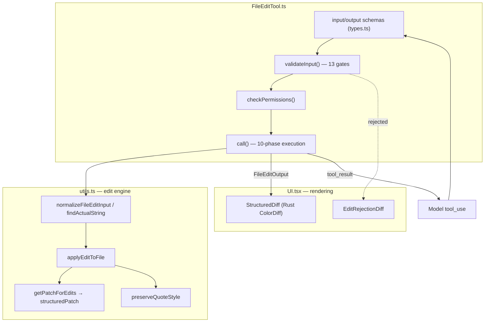
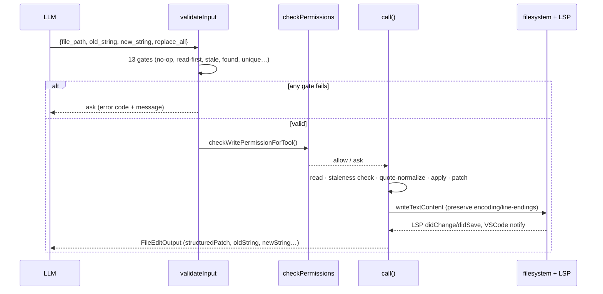

# FileEditTool — In-Place String-Replacement Edits

This directory documents the `Edit` tool — the mechanism by which the agent makes
precise, exact-match string replacements in files (`old_string` → `new_string`),
with an optional `replace_all`.

The subsystem is six files (~1,800 lines). The documentation is split into three
focused docs by concern; the three tiny files (`constants.ts`, `prompt.ts`,
`types.ts`) are folded into the core doc.

## Module Map

```
tools/FileEditTool/
├── FileEditTool.ts   # Tool definition: schemas, lifecycle, validateInput, call() execution
├── types.ts          # Zod schemas + types (FileEditInput, FileEdit, Hunk, FileEditOutput)
├── constants.ts      # Tool name, .claude permission patterns, stale-file error string
├── prompt.ts         # Model-facing guidance (read-first, indentation, uniqueness, replace_all)
├── utils.ts          # Matching, replacement, quote normalization, patch/diff generation
└── UI.tsx            # Terminal rendering: colored diffs, rejection previews, error messages
```

## Purpose

Edit an existing file by replacing an exact substring, or create a new file (with
an empty `old_string`). Edits are deterministic exact matches — there is no fuzzy
search — but a layer of input normalization (curly-quote, desanitization, trailing
whitespace) reconciles what the model emits with what's actually on disk. The tool
is **not** read-only and **not** concurrency-safe: it requires write permission and
guards against stale writes.

## Architecture



## End-to-End Flow



The two strongest invariants: **the file must have been read first** (staleness
tracking via `readFileState`), and **`old_string` must match exactly once** unless
`replace_all` is set. Both surface as an `ask` rather than a hard failure, so the
model can correct course.

## Documents

| File | Covers |
|------|--------|
| [fileedittool.md](./fileedittool.md) | `FileEditTool.ts` + `types.ts` + `constants.ts` + `prompt.ts`: schemas, ToolDef lifecycle, the 13-gate `validateInput`, the 10-phase `call()` engine |
| [edit-application.md](./edit-application.md) | `utils.ts`: the matching/replacement algorithm, input normalization, quote preservation, and structured-patch generation |
| [ui.md](./ui.md) | `UI.tsx`: colored diff rendering, rejection previews, and condensed-mode error messages |

## Cross-Cutting Themes

- **Exact match, normalized input.** Replacement is plain `String.replace` /
  `replaceAll`; the cleverness is in *normalizing* the model's `old_string`
  (curly quotes, sanitized tags, trailing whitespace) to find the real text.
- **Stale-write protection.** An edit is rejected if the file changed since it was
  last read (mtime, with a content-comparison fallback for cloud-sync/AV false
  positives on Windows).
- **Display vs bytes.** Tab→space conversion, line-ending normalization, and diff
  escaping happen only at *display/diff* time; the bytes written to disk are the
  exact replacement result.
- **Rich side effects.** `call()` also drives LSP diagnostics, VSCode diff view,
  file-history backups, dynamic-skill discovery, and analytics — all fire-and-forget
  outside the atomic read-modify-write window.
