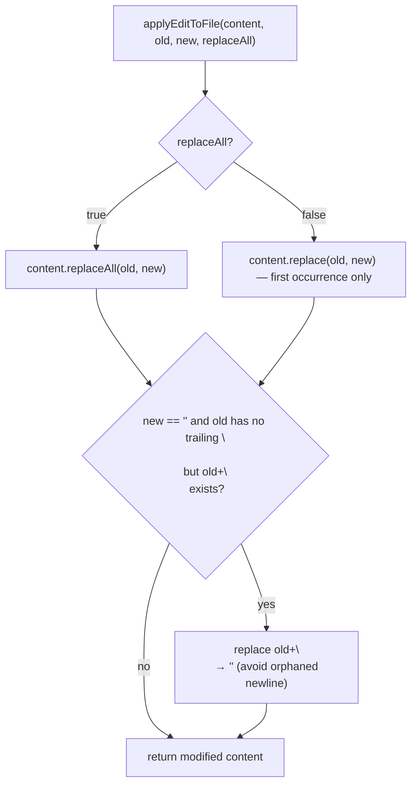
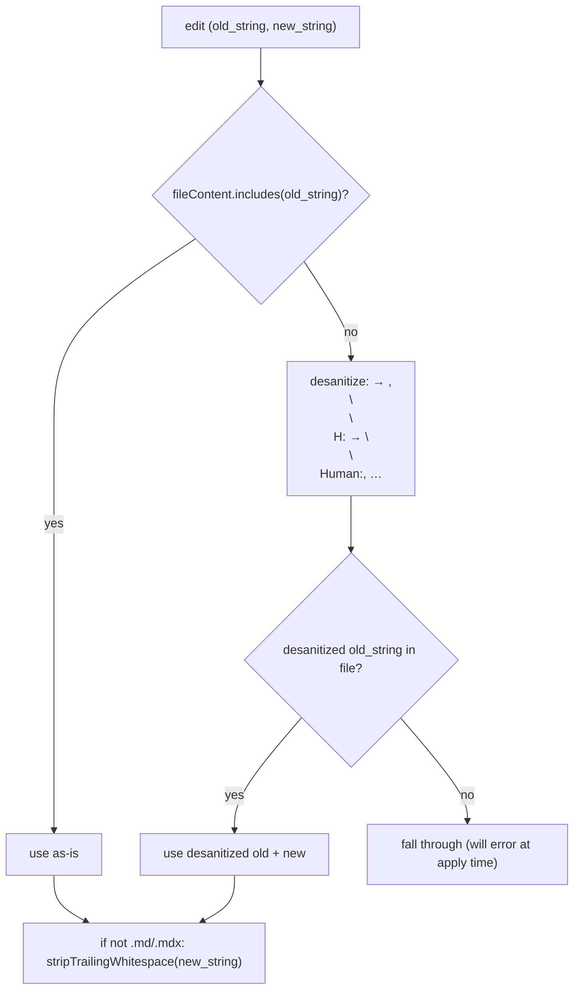
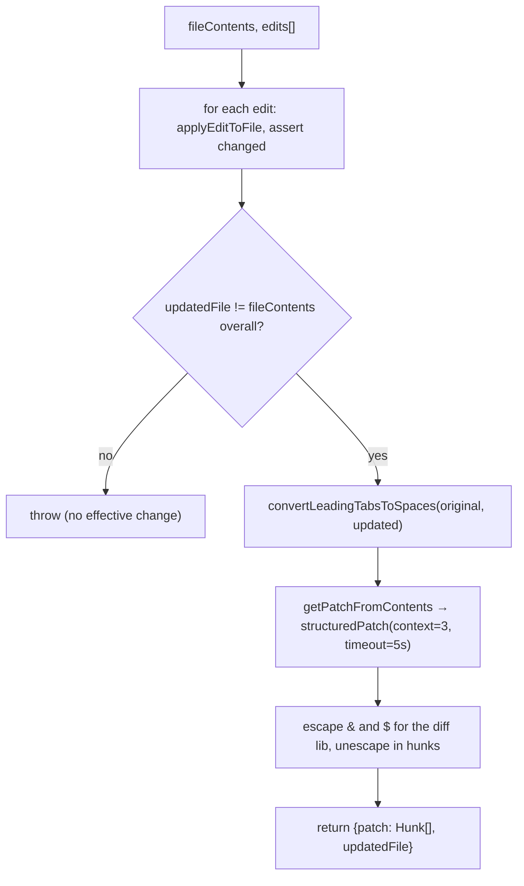

# Edit Application — Matching, Replacement & Patch Generation

**Source:** `utils.ts`

The core engine behind the `Edit` tool: it normalizes the model's input to find
the real text on disk, applies the replacement, preserves typographic quote style,
and generates the structured diff. Matching is deterministic and exact — the
intelligence is in the normalization layers, not in fuzzy search.

## Main Functions

| Function | Role |
|----------|------|
| `getPatchForEdits({filePath, fileContents, edits})` | **Core orchestrator** — applies edits sequentially, validates each changes the file, then produces one unified diff. Returns `{ patch, updatedFile }`. |
| `getPatchForEdit({…, oldString, newString, replaceAll})` | Single-edit wrapper over `getPatchForEdits`. |
| `applyEditToFile(content, oldString, newString, replaceAll)` | The actual replacement primitive. |
| `normalizeFileEditInput({file_path, edits})` | Preprocess: exact → desanitized match, strip trailing whitespace from `newString`. |
| `findActualString(fileContent, searchString)` | Locate the real substring, normalizing curly↔straight quotes if a direct match fails. |
| `preserveQuoteStyle(oldString, actualOldString, newString)` | Re-apply the file's curly-quote style to `newString` when the match required quote normalization. |
| `getSnippetForPatch(patch, newFile)` | Extract a line-numbered context snippet around changes. |
| `getEditsForPatch(patch)` | Reverse a diff back into `FileEdit[]`. |
| `areFileEditsEquivalent` / `areFileEditsInputsEquivalent` | Semantic equivalence (apply both, compare results). |

## The Replacement Primitive

`applyEditToFile` is intentionally simple:

There is **no fuzzy matching** and **no occurrence disambiguation**: with
`replace_all=false`, JS `String.replace` takes the first (left-to-right) match,
so the caller must make `old_string` unique. The lone special case is empty-`new`
deletions, which also consume a trailing newline to avoid leaving a blank line.

## Input Normalization (the real matching logic)

`normalizeFileEditInput` and `findActualString` reconcile what the model emits with
what's on disk, in this order:

1. **Exact match** — preferred.
2. **Quote normalization** (`findActualString`) — if the exact match fails, both
   the file view and the search string have curly quotes (`'' "" `) folded to
   straight quotes (`' "`), so a model that emitted straight quotes can match text
   that's actually curly on disk.
3. **Desanitization** (`desanitizeMatchString`, `DESANITIZATIONS` map) — reverses
   API-sanitized tokens (`<fnr>` → `<function_results>`, etc.) the model may echo.
4. **Trailing-whitespace stripping** of `new_string` (line-ending aware; skipped
   for `.md`/`.mdx`).

### Quote-style preservation

When a match only succeeded via quote normalization, `preserveQuoteStyle` re-applies
the file's *curly* style to `new_string` so the edit doesn't silently downgrade
typography. `applyCurlyDoubleQuotes` / `applyCurlySingleQuotes` use an
opening/closing heuristic (`isOpeningContext`: whitespace/punctuation before the
quote) and skip apostrophes inside contractions (`don't`).

## Patch Generation

`getPatchForEdits` applies all edits to one in-memory copy, validating each
produces a change (else it throws `String not found in file. Failed to apply
edit.`), then diffs **once** at the end:

Built on the `diff` npm library's `structuredPatch`, with `CONTEXT_LINES = 3`
context lines and a 5s timeout. `&` and `$` are escaped before diffing (they're
special to the library) and unescaped in the resulting hunks. Tab→space conversion
is applied only to the diff *inputs* so displayed line numbers line up — the
written file keeps its exact bytes.

## Line Endings, Encoding & Newlines

- `stripTrailingWhitespace` splits on `/(\r\n|\n|\r)/` so it preserves CRLF / LF /
  CR while trimming each content line.
- `readFileForEdit` returns `{ content, fileExists, encoding, lineEndings }` —
  content normalized to LF for matching; the original encoding (UTF-8 / UTF-16LE
  via BOM) and ending style are carried through so `writeTextContent` restores them.
- Diff hunks always use `\n`; the consumer renders per the file's detected ending.

## Key Constants & Types

| Name | Value / Shape |
|------|---------------|
| `CONTEXT_LINES` | `3` (diff) / `4` (snippet context) |
| `DIFF_SNIPPET_MAX_BYTES` | `8192` |
| `DESANITIZATIONS` | map of sanitized-token → real-tag pairs |
| curly-quote constants | `'' '' "" ""` (Unicode) |
| `FileEdit` | `{ old_string, new_string, replace_all }` (runtime: `replace_all` always boolean) |
| `StructuredPatchHunk` | `{ oldStart, oldLines, newStart, newLines, lines }` |

## Design Insights

1. **Deterministic core, smart edges.** Replacement is plain string ops; all the
   tolerance lives in the normalization layers, applied only as earlier ones fail.
2. **Sequential apply, single diff.** Multiple edits mutate one buffer; the diff is
   computed once against the original — efficient and order-correct.
3. **Display transforms ≠ byte transforms.** Tab→space, escaping, and ending
   normalization affect only the rendered diff, never the written content.
4. **Quote preservation is bidirectional.** The model can stay in ASCII while the
   file keeps its curly typography.
