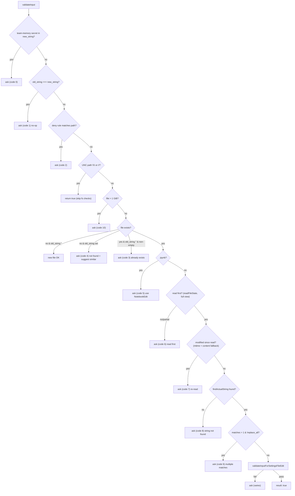
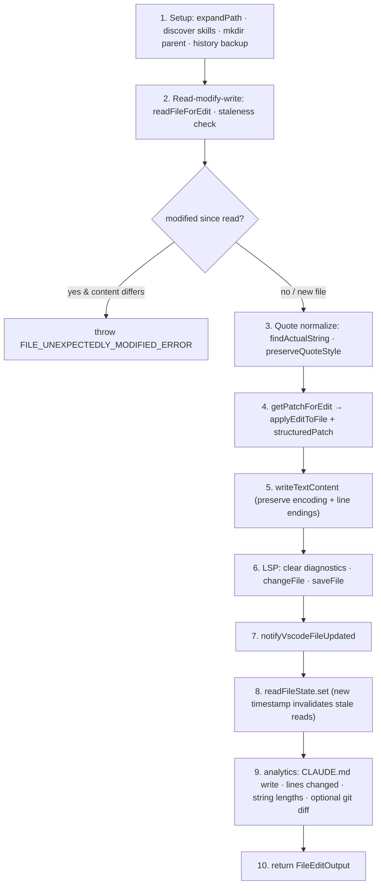

# FileEditTool Core — Tool Definition, Validation & Execution

**Source:** `FileEditTool.ts`, `types.ts`, `constants.ts`, `prompt.ts`

The `Edit` tool's `ToolDef`: its schemas, lifecycle, the 13-gate `validateInput`,
and the 10-phase `call()` engine. The matching/diff logic it delegates to lives in
[edit-application.md](./edit-application.md); rendering in [ui.md](./ui.md).

## Purpose

Apply an exact `old_string` → `new_string` replacement to a file (or create a new
file when `old_string` is empty), returning a structured patch. The tool requires
write permission and enforces that the file was read first and hasn't changed
underneath it.

## Schemas (`types.ts`)

### Input

| Field | Type | Notes |
|-------|------|-------|
| `file_path` | `string` (required) | Absolute path; expanded via `expandPath()` (handles `~`, relative) before permission checks. |
| `old_string` | `string` (required) | Text to find. Empty string ⇒ new-file creation / append to empty file. |
| `new_string` | `string` (required) | Replacement. Must differ from `old_string`. |
| `replace_all` | `boolean?` | Default `false`; `semanticBoolean`-preprocessed. `true` replaces every occurrence. |

Strict object (`z.strictObject`). Parsed type `FileEditInput` guarantees
`replace_all` is a concrete boolean.

### Output (`FileEditOutput`)

| Field | Meaning |
|-------|---------|
| `filePath` | The edited path. |
| `oldString` | The *actual* matched string (may differ from input after quote normalization). |
| `newString` | The replacement (post quote-style preservation). |
| `originalFile` | Full pre-edit contents. |
| `structuredPatch` | `Hunk[]` diff for display. |
| `userModified` | Whether the user altered the proposed edit before accepting. |
| `replaceAll` | Whether all occurrences were replaced. |
| `gitDiff?` | Optional git diff (feature-gated: `CLAUDE_CODE_REMOTE` + `tengu_quartz_lantern`). |

`Hunk` = `{ oldStart, oldLines, newStart, newLines, lines: string[] }`.

## ToolDef Lifecycle

| Member | Behavior |
|--------|----------|
| `name` | `"Edit"` (`FILE_EDIT_TOOL_NAME`). |
| `searchHint` | `"modify file contents in place"`. |
| `strict` | `true`. |
| `maxResultSizeChars` | `100_000`. |
| `prompt()` | `getEditToolDescription()` (see [Prompt](#prompt-promptts)). |
| `getPath(input)` | Returns `file_path` for permission/path tracking. |
| `backfillObservableInput(input)` | Expands `file_path` before permission hooks run (prevents `~`/relative bypass). |
| `toAutoClassifierInput(input)` | `` `${file_path}: ${new_string}` ``. |
| `inputsEquivalent(a, b)` | `areFileEditsInputsEquivalent` — literal fast-path, semantic slow-path. |
| `preparePermissionMatcher(input)` | Wildcard matcher over `file_path`. |
| `checkPermissions(input, ctx)` | `checkWritePermissionForTool()` against the tool permission context. |
| `validateInput(input, ctx)` | 13 sequential gates (below). |
| `call(input, ctx)` | 10-phase execution (below). |
| `mapToolResultToToolResultBlockParam()` | Summarizes the edit; notes user modification and "All occurrences replaced" when `replaceAll`. |
| `render*` hooks | Delegate to `UI.tsx`. |

`userFacingName` resolves to **"Create"** for an empty `old_string`, else
**"Update"**; `getActivityDescription` → `"Editing <path>"`.

## `validateInput` — 13 Gates

Each failed gate returns `{ result: false, behavior: 'ask', message, errorCode }`
so the model can fix and retry. Success returns `{ result: true, meta: { actualOldString } }`.

Notable gates: **code 6** (file must be read first — enforces the read→edit
discipline), **code 7** (stale file — mtime moved, with a content-compare fallback
for Windows cloud-sync/AV false positives), **code 8/9** (the exact-match and
uniqueness contract). UNC paths (`\\server\share`) deliberately short-circuit to
`true` to avoid leaking NTLM credentials through filesystem probing.

## `call()` — 10-Phase Execution

Phases 1–8 form the tight atomic read-modify-write window. LSP, VSCode, and
analytics (6, 7, 9) are fire-and-forget so they don't serialize the critical path.
Encoding (UTF-8 / UTF-16LE via BOM) and line endings (LF/CRLF/CR) detected on read
are preserved on write. Phase 8 stores the post-edit content + mtime so a
subsequent edit without an intervening read is correctly flagged stale.

## Prompt (`prompt.ts`)

`getEditToolDescription()` instructs the model to:

- **Read the file first** (an edit without a prior read errors).
- **Preserve exact indentation** *after* the line-number prefix, and **never**
  include the `line-number + tab` (or verbose `spaces + number + arrow`) prefix in
  `old_string`/`new_string`.
- Prefer editing existing files over creating new ones; emojis only on request.
- Make `old_string` **unique** — add surrounding context, or set `replace_all`.
  (Internal builds get a hint to keep context minimal: 2–4 lines, not 10+.)
- Use `replace_all` for renames / multi-occurrence replacements.

## Constants (`constants.ts`)

- `FILE_EDIT_TOOL_NAME = 'Edit'`
- `CLAUDE_FOLDER_PERMISSION_PATTERN = '/.claude/**'`,
  `GLOBAL_CLAUDE_FOLDER_PERMISSION_PATTERN = '~/.claude/**'` — guard `.claude`
  config edits.
- `FILE_UNEXPECTEDLY_MODIFIED_ERROR` — the stale-write error string.

## Security Notes

File-size cap (1 GiB, `MAX_EDIT_FILE_SIZE`) avoids V8/Bun string-limit OOMs; UNC
paths skip filesystem checks; `checkTeamMemSecrets` blocks secrets leaking into
shared team-memory files; all paths are expanded before being matched against
permission rules.
