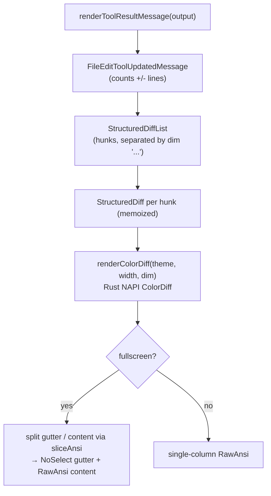
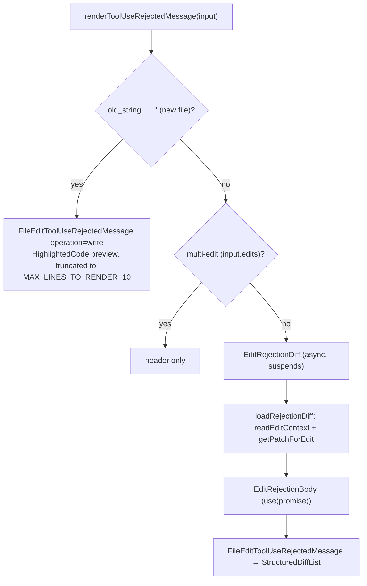

# FileEditTool UI — Diff & Rejection Rendering

**Source:** `UI.tsx`

React + Ink components that render the `Edit` tool in the terminal: the invocation
header, the colored result diff, the rejection preview, and friendly error
messages. The file does little rendering itself — it **delegates** to shared diff
components for caching and syntax highlighting.

## Exported Render Functions

| Function | Renders |
|----------|---------|
| `userFacingName(input)` | `"Create"` (empty `old_string`) / `"Update"` / `"Updated plan"`. |
| `getToolUseSummary(input)` | The display path for the message header. |
| `renderToolUseMessage(input, {verbose})` | A clickable `FilePathLink` to the target file (empty for plan files). |
| `renderToolResultMessage(output, …)` | Delegates to `FileEditToolUpdatedMessage` (the success diff). |
| `renderToolUseRejectedMessage(input, …)` | The rejection UI (preview or diff). |
| `renderToolUseErrorMessage(result, …)` | Friendly condensed errors, else a fallback. |

## Success Diff Rendering (Delegated)

- **`StructuredDiff`** is the per-hunk workhorse. It calls a Rust NAPI `ColorDiff`
  module to produce ANSI-colored lines, and caches the result in a module-level
  `RENDER_CACHE: WeakMap<StructuredPatchHunk, Map<string, CachedRender>>` keyed by
  theme + width + dim + gutter width. So terminal resizes / theme changes don't
  re-run the Rust renderer unless the hunk identity changes.
- **Gutter width** = `maxLineNumber.toString().length + 3` (marker + padding),
  applied only in fullscreen mode; otherwise a single column.
- **Context** is `CONTEXT_LINES = 3`; `adjustHunkLineNumbers()` shifts hunk line
  numbers when the diff was computed from a file *slice* (chunked read).

## Rejection UI

When the user declines an edit, `renderToolUseRejectedMessage` branches by edit
type:

- **New file** → a syntax-highlighted `HighlightedCode` preview of the would-be
  content, truncated to 10 lines (`… +N lines`) outside verbose mode.
- **Update** → `EditRejectionDiff`, an async component that **suspends** on a
  promise computing the patch via `readEditContext()` (a bounded read around the
  match, so large files don't OOM) + `getPatchForEdit()`, then renders the diff.
  `findActualString`/`preserveQuoteStyle` ensure the rejection diff matches the
  real (possibly curly-quoted) file text.

## Error Messages

`renderToolUseErrorMessage` extracts the `<tool_use_error>` payload and, in
condensed non-verbose mode, swaps raw errors for friendly ones:

| Underlying error | Shown as |
|------------------|----------|
| "File has not been read yet" | "File must be read first" (dim) |
| `FILE_NOT_FOUND_CWD_NOTE` | "File not found" (error color) |
| generic | "Error editing file" |

Verbose mode or unrecognized errors fall through to `FallbackToolUseErrorMessage`.

## Helpers, Memoization & Theming

- **React Compiler** (`_c()` cache) memoizes throughout — `EditRejectionDiff`
  (`_c(16)`), `EditRejectionBody` (`_c(7)`), `StructuredDiff` (`_c(26)`) — so
  components don't need manual `React.memo`.
- Imports key helpers from `utils.ts` (`findActualString`, `preserveQuoteStyle`,
  `getPatchForEdit`) and shared utils (`adjustHunkLineNumbers`, `readEditContext`,
  `getDisplayPath`).
- **Theming** via `useTheme()`; dim mode reduces saturation for rejection diffs;
  ANSI colors from the Rust renderer are preserved through `RawAnsi`.

## Why Delegate

Diff rendering routes through shared `StructuredDiffList` / `StructuredDiff` rather
than being reimplemented here, so the expensive Rust `ColorDiff` render and its
cache are shared across every tool that shows a diff. The FileEditTool UI only owns
the *framing*: which message (invocation / result / rejection / error) and which
preview shape to show.
