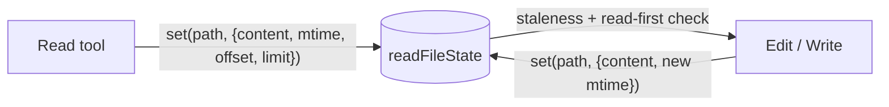
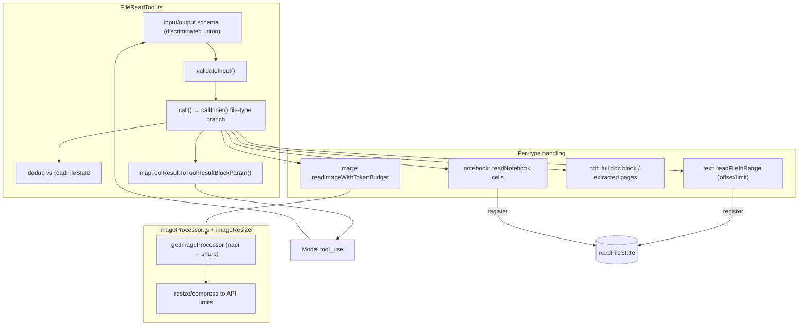

# FileReadTool — Reading Files, Images, PDFs & Notebooks

This directory documents the `Read` tool — how the agent reads files (text,
images, PDFs, Jupyter notebooks) into the conversation. Reading also **registers
the file in `readFileState`**, the gate that [Edit](../FileEditTool/README.md) and
[Write](../FileWriteTool/README.md) require before they will modify a file.

The subsystem is five files (~1,600 lines), documented as a README overview plus a
core doc and a UI/image doc (folding `limits.ts` and `prompt.ts` into the core).

## Module Map

```
tools/FileReadTool/
├── FileReadTool.ts     # Tool definition: schemas, lifecycle, validateInput, call() with file-type branching
├── limits.ts           # File-reading limits (max tokens, max bytes) + default resolution
├── prompt.ts           # Model-facing guidance + line-format / offset constants
├── UI.tsx              # Terminal rendering: "Read N lines / image / cells / PDF" summaries
└── imageProcessor.ts   # Lazy-loaded image library (native napi → sharp fallback)
```

## Purpose

Read a file and return it in the right form for the model: line-numbered text
(with `offset`/`limit` pagination), a resized image, a PDF (native document block
or extracted page images), or notebook cells. Every successful text/notebook read
is recorded in `readFileState` so the editing tools can later detect staleness and
enforce read-before-write.

## Central Role: `readFileState`



A `FileState` entry is `{ content, timestamp (mtime), offset, limit, isPartialView? }`.
`Edit`/`Write` read it to verify the file hasn't changed since it was read and that
a full (non-partial) read happened first. **Images and PDFs are not cached** (they
can't be followed by an edit); only text and notebooks register state.

## Architecture



## Documents

| File | Covers |
|------|--------|
| [filereadtool.md](./filereadtool.md) | `FileReadTool.ts` + `limits.ts` + `prompt.ts`: schemas, lifecycle, `validateInput`, the file-type-branching `call()` engine, `readFileState` registration, dedup, limits |
| [ui.md](./ui.md) | `UI.tsx` + `imageProcessor.ts`: result summaries, friendly errors, and the image-resize/compression pipeline |

## Cross-Cutting Themes

- **One tool, many content types.** A discriminated-union output (`text` / `image`
  / `pdf` / `parts` / `notebook` / `file_unchanged`) lets a single `Read` handle
  everything, with type detection driving the `call()` branch.
- **It is the read-before-write gate.** The whole edit-safety model depends on
  `Read` having registered the file (full view, current mtime) in `readFileState`.
- **Token-budget-aware.** Text reads are bounded by a byte cap (cheap pre-check)
  and a token cap (exact, API-counted); images are resized/recompressed to fit the
  API's image limits; large PDFs fall back to page extraction.
- **No circular persistence.** `maxResultSizeChars = Infinity` so a read result is
  never spilled to disk (which could be re-read in a loop).
- **Dedup.** Re-reading an unchanged range returns a tiny `file_unchanged` stub
  instead of resending the content (saves cache-creation tokens), gated by a
  GrowthBook killswitch.
