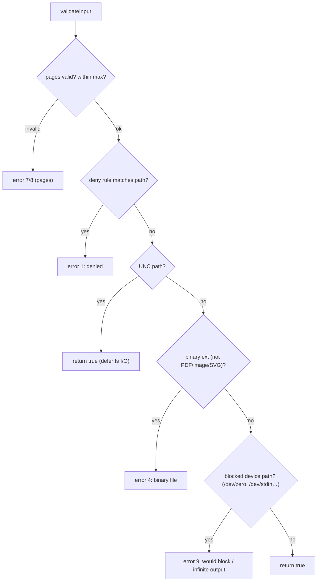
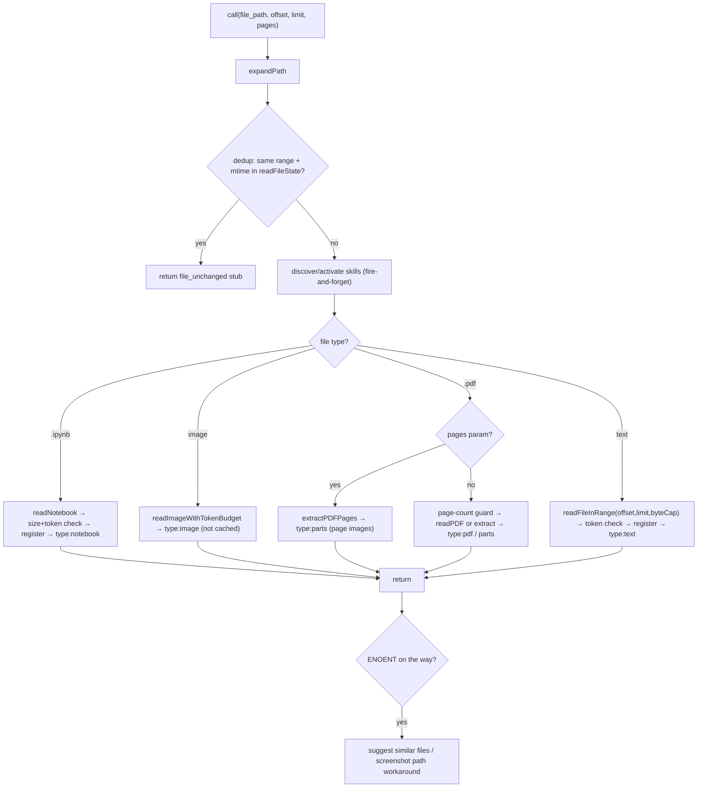

# FileReadTool Core — Schema, Validation & Execution

**Source:** `FileReadTool.ts`, `limits.ts`, `prompt.ts`

The `Read` tool's `ToolDef`: schemas, lifecycle, `validateInput`, and the
file-type-branching `call()` engine that also registers files in `readFileState`.
Rendering and image processing live in [ui.md](./ui.md).

## Schemas

### Input

| Field | Type | Notes |
|-------|------|-------|
| `file_path` | `string` (required) | Absolute path; expanded via `expandPath()`. Files only, not directories. |
| `offset` | `number?` | 1-indexed start line (text only); default 1. |
| `limit` | `number?` | Lines to read (text only); omitted ⇒ read up to the byte cap / EOF. |
| `pages` | `string?` | PDF page range (`"1-5"`, `"3"`); max `PDF_MAX_PAGES_PER_READ` (20). |

### Output — a discriminated union on `type`

| `type` | Payload |
|--------|---------|
| `text` | `{ filePath, content (line-numbered), numLines, startLine, totalLines }` |
| `image` | `{ base64, type, originalSize, dimensions? }` |
| `notebook` | `{ filePath, cells[] }` |
| `pdf` | `{ filePath, base64, originalSize }` (native document block) |
| `parts` | `{ filePath, originalSize, count, outputDir }` (extracted page images) |
| `file_unchanged` | `{ filePath }` — dedup stub when the same range is re-read unchanged |

## ToolDef Lifecycle

| Member | Behavior |
|--------|----------|
| `name` / `searchHint` | `"Read"` / `"read files, images, PDFs, notebooks"`. |
| `isReadOnly` / `isConcurrencySafe` | both `true`. |
| `isSearchOrReadCommand` | `{ isSearch: false, isRead: true }`. |
| `maxResultSizeChars` | `Infinity` — never persist a read result to disk (avoids a read→persist→read loop). |
| `description()` / `prompt()` | static description / dynamic template (`renderPromptTemplate`). |
| `userFacingName` | `"Read"`, `"Reading Plan"`, or `"Read agent output"`. |
| `getPath` / `backfillObservableInput` | return / expand `file_path`. |
| `toAutoClassifierInput` | returns `file_path`. |
| `checkPermissions` | `checkReadPermissionForTool()` (allow/deny rules). |
| `validateInput` | see below. |
| `call` | see below. |
| `extractSearchText` | `''` — content isn't indexed (circular-persistence risk). |
| `mapToolResultToToolResultBlockParam` | per-type serialization (image block, notebook cells, PDF/parts as supplemental `newMessages`, text with line numbers + freshness/cyber-risk reminders). |
| `render*` hooks | delegate to `UI.tsx`. |

## `validateInput`

Blocked device paths prevent reads that would hang or produce infinite output; UNC
paths short-circuit (deferring filesystem I/O) to avoid SMB/NTLM credential probes.

## `call()` — File-Type Branching

Notable behavior:

- **Text** uses `readFileInRange` for line-based pagination, returning both the
  slice and full-file context (`totalLines`); content is registered in
  `readFileState` with `offset`/`limit` and the file mtime.
- **Images** are read once and resized/compressed to a token budget (see
  [ui.md](./ui.md)); they are *not* registered (can't be followed by an edit).
- **PDFs** branch on the `pages` parameter and on model support: a supported model
  gets a native `document` block (`type: 'pdf'`); otherwise (or for large/too-many-
  page PDFs) pages are extracted to images (`type: 'parts'`). A page-count guard
  forces the model to pass a `pages` range for large documents.
- **Notebooks** are read whole (cells JSON), size/token-checked, and registered.
- **Token validation** (`validateContentTokens`) does a cheap estimate first and
  an exact API count when near the limit, throwing `MaxFileReadTokenExceededError`
  if exceeded.
- **Errors**: `ENOENT` is caught and turned into a friendly message with
  similar-file suggestions (and a macOS screenshot thin-space path workaround).

## Dedup

When a file/range was read before and its mtime is unchanged, `call()` returns a
small `file_unchanged` stub rather than resending content — measured to save a
meaningful slice of cache-creation tokens. It is gated by the
`tengu_read_dedup_killswitch` GrowthBook flag and only applies to non-partial,
offset-bearing reads.

## `limits.ts`

`FileReadingLimits = { maxTokens, maxSizeBytes, includeMaxSizeInPrompt?,
targetedRangeNudge? }`. `getDefaultFileReadingLimits()` (memoized) resolves each
field through a precedence chain — env var (`CLAUDE_CODE_FILE_READ_MAX_OUTPUT_TOKENS`)
→ GrowthBook (`tengu_amber_wren`) → hardcoded defaults (`DEFAULT_MAX_OUTPUT_TOKENS`
= 25,000 tokens, `MAX_OUTPUT_SIZE` = 256 KB) — validating each so a bad override
can't drop a limit to zero. Two-tier enforcement: the **byte cap** is a cheap
pre-read `stat` check; the **token cap** is an exact post-read API count.

## `prompt.ts`

Exports `FILE_READ_TOOL_NAME`, `MAX_LINES_TO_READ` (2000), the `FILE_UNCHANGED_STUB`
text, and line-format/offset instruction constants. `renderPromptTemplate(...)`
builds the model-facing guidance: absolute paths only; reads up to 2000 lines by
default with `offset`/`limit` for larger files; `cat -n` line-number format;
multimodal image support; conditional PDF blurb (only if `isPDFSupported()`);
notebook support; files-not-directories; and an empty-file system-reminder note.
The offset instruction switches between "read the whole file" and a targeted-read
nudge based on `targetedRangeNudge`.
