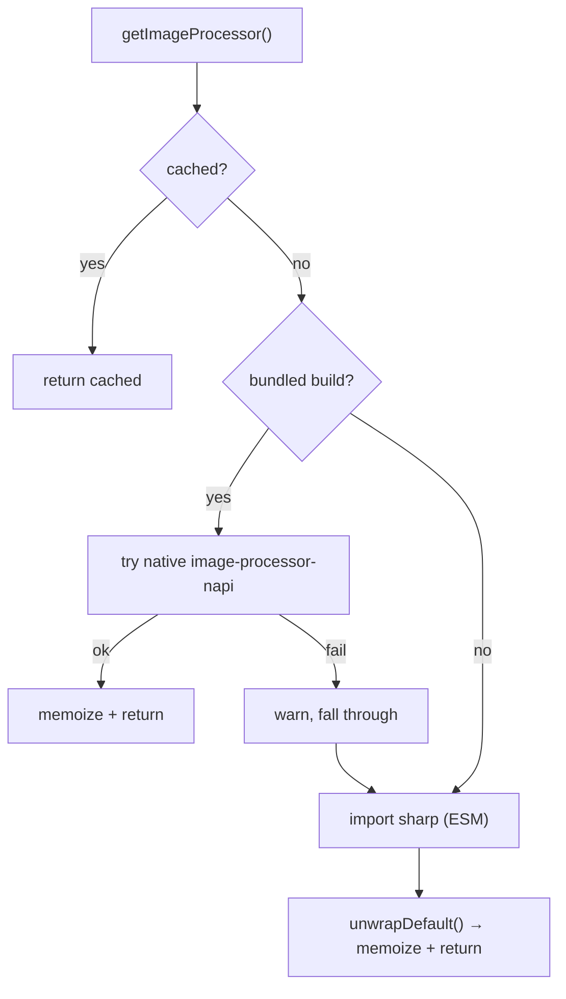
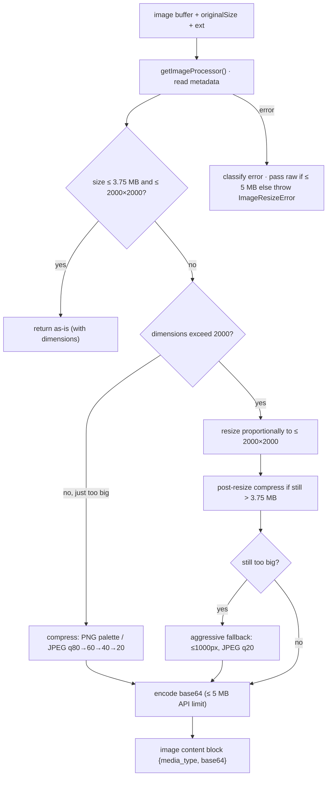

# FileReadTool UI & Image Processing

**Source:** `UI.tsx`, `imageProcessor.ts`

`UI.tsx` renders the `Read` tool's invocation and result summaries; `imageProcessor.ts`
is the thin, lazy-loaded gateway to the image library that powers image reads.

## UI.tsx — Rendering

| Function | Renders |
|----------|---------|
| `userFacingName(input)` | `"Read"`, `"Reading Plan"` (plan files), or `"Read agent output"`. |
| `getToolUseSummary(input)` | The display path, or the agent task id, or `null`. |
| `renderToolUseMessage(input, {verbose})` | A `FilePathLink` plus ` · pages X` / ` · lines X-Y` / ` · from line X` detail. |
| `renderToolUseTag(input)` | A dim agent task-id tag when reading agent output (else `null`). |
| `renderToolResultMessage(output)` | A one-line summary per output type (below). |
| `renderToolUseErrorMessage(result, {verbose})` | Condensed "File not found" / "Error reading file", else fallback. |

Result summaries are keyed on the output `type`:

| type | Summary |
|------|---------|
| `text` | `Read N lines` |
| `image` | `Read image (size)` |
| `notebook` | `Read N cells` |
| `pdf` | `Read PDF (size)` |
| `parts` | `Read M pages (size)` |
| `file_unchanged` | dim `Unchanged since last read` |

`getAgentOutputTaskId()` recognizes agent-output paths
(`<projectTempDir>/tasks/<taskId>.output`) so reads of subagent output render with
the task id rather than a raw path. Rendering delegates to shared components
(`FilePathLink`, `MessageResponse`, `Text`, `FallbackToolUseErrorMessage`) and the
`getDisplayPath` / `formatFileSize` helpers; styling is left to the Ink theme.

## imageProcessor.ts — Library Gateway

A small abstraction that lazily loads and memoizes the image library, with a
fallback chain:

- `getImageProcessor()` prefers the native `image-processor-napi` module in
  bundled builds and falls back to `sharp`; failures are swallowed (logged) for
  graceful degradation. `unwrapDefault()` normalizes ESM-default vs CJS exports.
- `getImageCreator()` always uses `sharp` (the native module can't create images).
- Both memoize at module scope so the dynamic `import()` happens once.

## Image-Processing Pipeline

`imageProcessor.ts` feeds the resize pipeline (`utils/imageResizer.ts`,
`maybeResizeAndDownsampleImageBuffer`) that `FileReadTool.call()` uses for image
reads:

Key limits (from `apiLimits.ts`): **5 MB** hard cap on base64 image data
(`API_IMAGE_MAX_BASE64_SIZE`); **3.75 MB** raw target (`IMAGE_TARGET_RAW_SIZE`,
leaving headroom for base64's ~33% overhead); **2000×2000** max dimensions. Format
is sniffed from magic bytes (`detectImageFormatFromBuffer`) rather than trusting
the extension, and errors are classified into numeric codes (module-load,
processing, pixel-limit, memory, timeout, vips, permission) for privacy-respecting
telemetry. On failure the raw buffer is passed through if it fits the 5 MB limit,
otherwise a user-friendly `ImageResizeError` is thrown.
