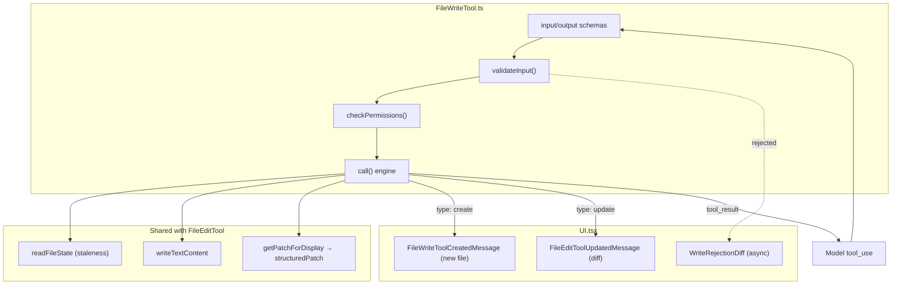

# FileWriteTool — Whole-File Create & Overwrite

This directory documents the `Write` tool — the mechanism by which the agent
creates a new file or completely overwrites an existing one with provided content.
It is the blunt-instrument sibling of the `Edit` tool: where
[FileEditTool](../FileEditTool/README.md) sends a targeted diff, `Write` replaces
the entire file.

The subsystem is three files (~856 lines), documented in a README overview plus
two focused docs; the tiny `prompt.ts` is folded into the core doc.

## Module Map

```
tools/FileWriteTool/
├── FileWriteTool.ts   # Tool definition: schemas, lifecycle, validateInput, call() engine
├── prompt.ts          # Model-facing guidance (read-first, prefer Edit, no unsolicited docs)
└── UI.tsx             # Terminal rendering: new-file preview, overwrite diff, rejection, errors
```

## Purpose

Write a complete file to disk — either creating it (`type: 'create'`) or
overwriting an existing one (`type: 'update'`). Like `Edit`, it requires write
permission and enforces a read-before-write discipline on existing files; unlike
`Edit`, the input is the *full* content rather than an old/new pair.

## Relationship to FileEditTool

`Write` deliberately reuses much of `Edit`'s machinery rather than duplicating it:

| Shared piece | Source | Used for |
|--------------|--------|----------|
| `hunkSchema`, `gitDiffSchema` | `FileEditTool/types.ts` | output shape |
| `FILE_UNEXPECTEDLY_MODIFIED_ERROR` | `FileEditTool/constants.ts` | stale-write error |
| `getPatchForDisplay` / `structuredPatch` | shared diff utils | overwrite diff |
| `readFileState` | `ToolUseContext` | read-first / staleness tracking |
| `FileEditToolUpdatedMessage`, `FileEditToolUseRejectedMessage`, `StructuredDiffList` | shared components | rendering |

So the [edit-application](../FileEditTool/edit-application.md) and
[ui](../FileEditTool/ui.md) docs for FileEditTool are directly relevant here.

## Architecture



## End-to-End Flow

```mermaid
sequenceDiagram
    participant LLM
    participant Val as validateInput
    participant Call as call()
    participant Disk as filesystem + LSP

    LLM->>Val: {file_path, content}
    Val->>Val: secrets · deny rules · UNC · read-first · staleness
    alt existing file not read / stale
        Val-->>LLM: ask (error code)
    else valid (or new file)
        Val->>Call: execute
        Call->>Call: read existing (for diff + staleness) · determine create vs update
        Call->>Disk: writeTextContent (LF, preserve encoding, mkdir parent)
        Disk-->>Call: LSP didChange/didSave · VSCode notify · history backup
        Call->>Call: create → patch [] ; update → getPatchForDisplay
        Call-->>LLM: {type, filePath, content, structuredPatch, originalFile}
    end
```

The key discipline mirrors `Edit`: **an existing file must have been read first**
and must not have changed since (mtime + content fallback). New files skip the
staleness gate entirely.

## Documents

| File | Covers |
|------|--------|
| [filewritetool.md](./filewritetool.md) | `FileWriteTool.ts` + `prompt.ts`: schemas, ToolDef lifecycle, `validateInput`, the `call()` engine, create-vs-update, shared code |
| [ui.md](./ui.md) | `UI.tsx`: new-file preview, overwrite diff, async rejection rendering, errors |

## Cross-Cutting Themes

- **Create vs update is the central distinction.** It's decided by whether the
  file already exists on disk, and it drives validation (staleness only applies to
  updates), the result `type`, the `structuredPatch` (empty for create), and the
  UI (content preview vs diff).
- **Preserve the model's line endings.** `Write` always writes `LF` rather than
  matching an existing file's CRLF — a past bug silently corrupted bash scripts on
  Linux when overwriting CRLF files.
- **Heavy reuse, not duplication.** Schema, diff, staleness, and rendering are
  shared with `Edit`; this tool owns the create/overwrite orchestration.
