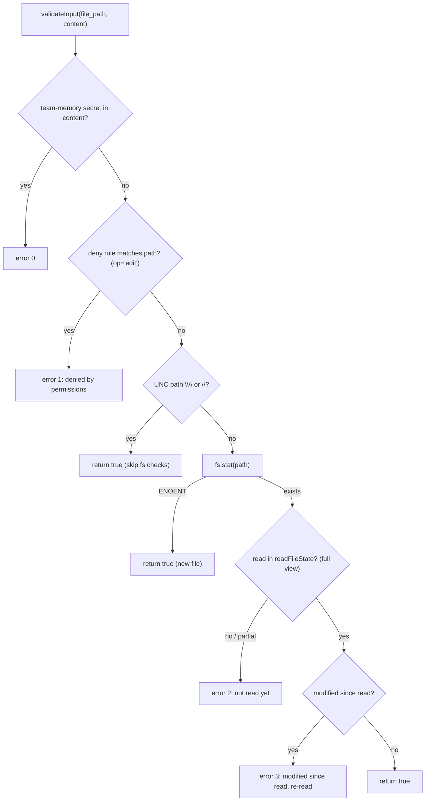
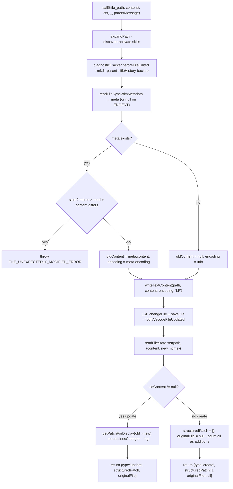

# FileWriteTool Core — Tool Definition, Validation & Execution

**Source:** `FileWriteTool.ts`, `prompt.ts`

The `Write` tool's `ToolDef`: its schemas, lifecycle, `validateInput`, and the
`call()` engine. Rendering lives in [ui.md](./ui.md); the diff/staleness machinery
it borrows from `Edit` is covered in the
[FileEditTool docs](../FileEditTool/README.md).

## Purpose

Create a new file or completely overwrite an existing one with the provided
`content`, returning a structured patch (empty for new files, a full old→new diff
for overwrites). Requires write permission and enforces read-before-write on
existing files.

## Schemas

### Input

`z.strictObject` with two fields:

| Field | Type | Notes |
|-------|------|-------|
| `file_path` | `string` (required) | Absolute path (not relative / `~`); expanded by `backfillObservableInput` via `expandPath()` before permission checks. |
| `content` | `string` (required) | The complete file content. Line endings are taken as the model wrote them (LF) and written as LF. |

### Output

| Field | Type | Meaning |
|-------|------|---------|
| `type` | `'create' \| 'update'` | Whether a new file was created or an existing one overwritten. |
| `filePath` | `string` | The written path. |
| `content` | `string` | The content written. |
| `structuredPatch` | `Hunk[]` | Diff hunks — **`[]` for create**, the old→new diff for update. |
| `originalFile` | `string \| null` | Pre-write content — **`null` for create**. |
| `gitDiff?` | object | Optional git diff (feature-gated: `CLAUDE_CODE_REMOTE` + `tengu_quartz_lantern`). |

## ToolDef Lifecycle

| Member | Behavior |
|--------|----------|
| `name` | `"Write"` (`FILE_WRITE_TOOL_NAME`). |
| `searchHint` | `"create or overwrite files"`. |
| `strict` / `maxResultSizeChars` | `true` / `100_000`. |
| `description()` | `"Write a file to the local filesystem."` |
| `prompt()` | `getWriteToolDescription()` (see below). |
| `userFacingName` | `"Updated plan"` for plan-dir files, else `"Write"`. |
| `getPath` / `backfillObservableInput` | Return / expand `file_path`. |
| `toAutoClassifierInput` | `` `${file_path}: ${content}` ``. |
| `preparePermissionMatcher` | Wildcard match over `file_path`. |
| `checkPermissions` | `checkWritePermissionForTool()`. |
| `validateInput` | See below. |
| `call` | See below. |
| `extractSearchText` | Returns `''` — in update mode only the diff is shown, so indexing raw content would create false positives. |
| `render*` hooks | Delegate to `UI.tsx`. |
| `mapToolResultToToolResultBlockParam` | `"File created successfully at: <path>"` (create) / `"The file <path> has been updated successfully."` (update). |

## `validateInput`

A short, ordered set of gates; each failure returns `{ result: false, message,
errorCode }`.

The **create vs overwrite** difference lives here: a non-existent file (`ENOENT`)
passes immediately, while an existing file must have a full prior read
(`readFileState`) and an unchanged mtime. UNC paths short-circuit to `true` to
avoid triggering SMB/NTLM credential probes on Windows.

## `call()` Engine

Notable points:

- **Parent-dir creation and history backup happen before** the staleness check, so
  a later stale-write abort leaves a valid backup, not corrupt state.
- **Line endings are forced to LF** on write rather than matched to the old file's
  CRLF — this fixed a class of silent script corruption.
- **Encoding is preserved** from the existing file (UTF-8 / UTF-16LE via BOM), or
  defaults to UTF-8 for new files.
- **`readFileState` is updated** with the just-written content + new mtime, so a
  follow-up write without an intervening read is correctly flagged stale.
- LSP, VSCode, file-history, skill discovery, and analytics are fire-and-forget
  side effects around the core read-modify-write.

## Prompt (`prompt.ts`)

`getWriteToolDescription()` tells the model:

- **Overwrites** the file at the path if one exists.
- For an existing file you **MUST `Read` it first** — the tool fails otherwise
  (enforced by `validateInput` error code 2).
- **Prefer `Edit`** for modifying existing files (it sends only the diff); use
  `Write` for new files or complete rewrites.
- **Never** create docs/README `*.md` files unless explicitly requested.
- Emojis only on explicit request.

## Shared Code

`Write` imports `hunkSchema`/`gitDiffSchema` and
`FILE_UNEXPECTEDLY_MODIFIED_ERROR` from FileEditTool, `getPatchForDisplay` /
`countLinesChanged` from the shared diff utils, `readFileSyncWithMetadata` /
`writeTextContent` from the file utils, and `readFileState` from the tool context —
so its diff, staleness, and encoding behavior match `Edit` exactly. See
[FileEditTool/edit-application.md](../FileEditTool/edit-application.md).
