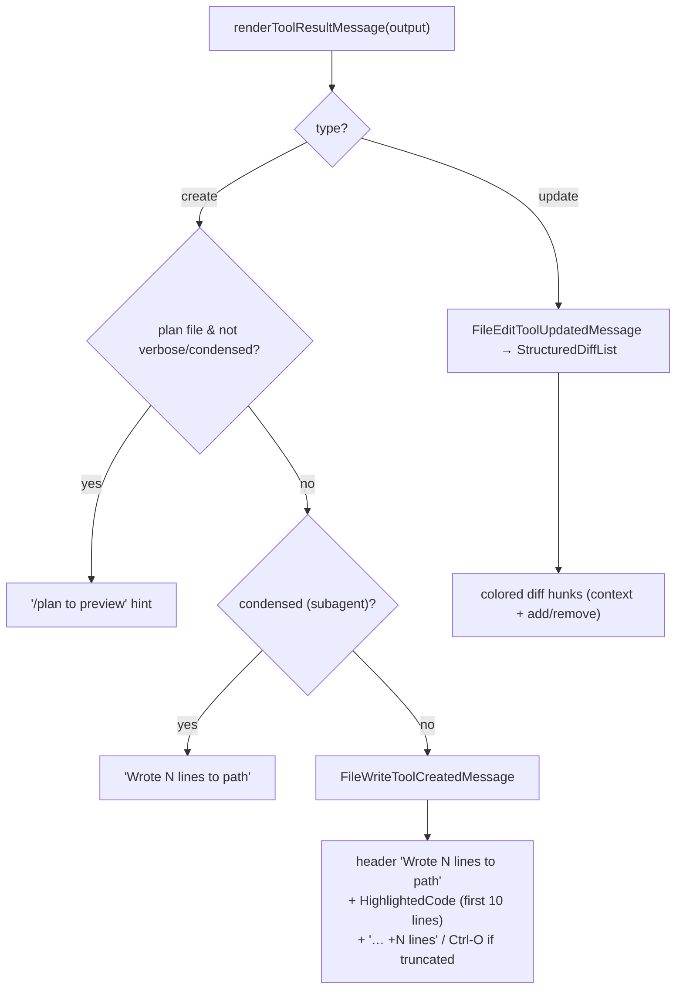
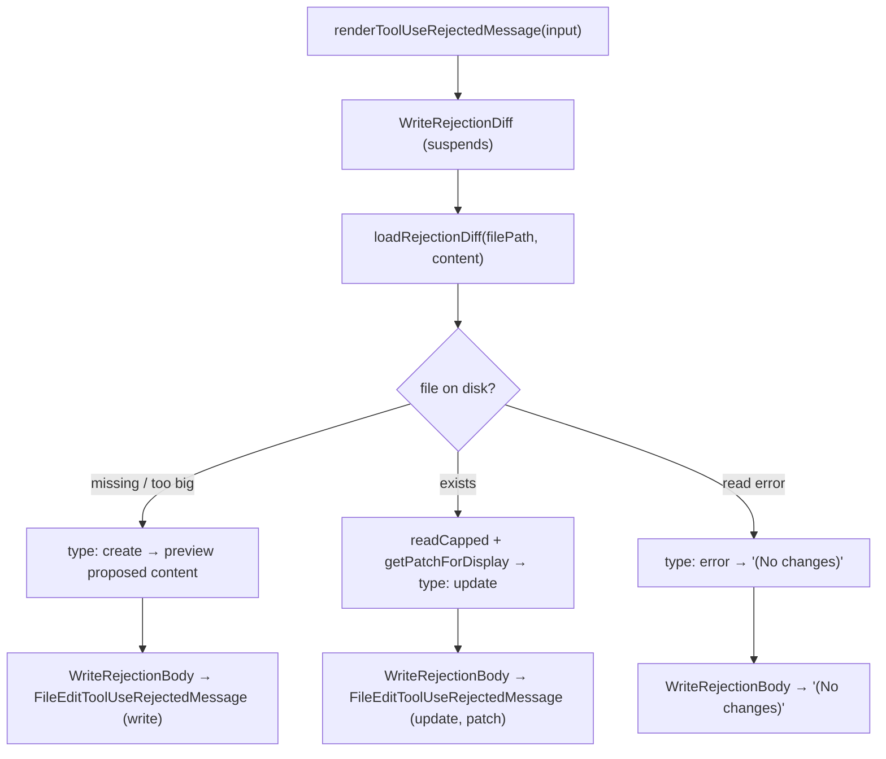

# FileWriteTool UI — New-File Preview & Overwrite Diff

**Source:** `UI.tsx`

React + Ink components that render the `Write` tool in the terminal: a
syntax-highlighted preview for new files, a structured diff for overwrites, an
async rejection preview, and condensed error messages. It delegates the heavy
rendering to shared components (notably the FileEditTool diff components).

## Exported Render Functions

| Function | Renders |
|----------|---------|
| `userFacingName(input)` | `"Updated plan"` for plan-dir files, else `"Write"`. |
| `getToolUseSummary(input)` | The display path (or `null` if no `file_path`). |
| `renderToolUseMessage(input, {verbose})` | A `FilePathLink` to the target (skipped for plan files). |
| `renderToolResultMessage(output, …, {style, verbose})` | The success UI — create preview or update diff. |
| `renderToolUseRejectedMessage(input, …)` | Async rejection preview/diff (`WriteRejectionDiff`). |
| `renderToolUseErrorMessage(result, {verbose})` | Condensed "Error writing file" or fallback. |
| `isResultTruncated(output)` | Whether a create preview was truncated (drives the Ctrl-O expand hint). |

Constants: `MAX_LINES_TO_RENDER = 10`, `EOL = '\n'`. `countLines` treats a trailing
newline as a terminator (editor-style line counting).

## Create vs Update Result Rendering

- **Create** → `FileWriteToolCreatedMessage`: a `Wrote N lines to <path>` header
  plus a `HighlightedCode` (syntax-highlighted, language auto-detected) preview.
  In non-verbose mode the preview is capped at `MAX_LINES_TO_RENDER` (10) lines
  with a `… +N lines` / `Ctrl-O to expand` hint. Plan files and condensed (subagent)
  mode get compact substitutes.
- **Update** → delegates to `FileEditToolUpdatedMessage`, which renders the
  `structuredPatch` via `StructuredDiffList` (the same colored-diff path
  documented in [FileEditTool/ui.md](../FileEditTool/ui.md)). Update output is
  **never truncated** — the full diff is always shown.

## Async Rejection UI

When a write is declined, the diff must be computed against the *current* on-disk
file, which is done asynchronously via React Suspense:

`loadRejectionDiff` opens the file with `openForScan`, bails to a *create* preview
if the file is absent or exceeds `MAX_SCAN_BYTES` (avoids OOM on multi-GB diffs),
otherwise reads a capped copy and builds the patch with `getPatchForDisplay`. The
fallback shown while the promise resolves is the write-style rejection message.

## Error Messages

`renderToolUseErrorMessage` extracts the `<tool_use_error>` payload; in condensed
non-verbose mode it shows a friendly `Error writing file`, and otherwise defers to
`FallbackToolUseErrorMessage`.

## Helpers, Memoization & Delegation

- **React Compiler** (`_c()` cache) memoizes the components
  (`FileWriteToolCreatedMessage` ~25 slots, `WriteRejectionDiff` ~20,
  `WriteRejectionBody` ~8) so terminal resizes and transcript scrolls don't
  trigger expensive re-renders.
- **Delegated components**: `HighlightedCode` (syntax highlighting),
  `FileEditToolUpdatedMessage` / `FileEditToolUseRejectedMessage` /
  `StructuredDiffList` (shared diff rendering), `FilePathLink`, `CtrlOToExpand`,
  `FallbackToolUseErrorMessage`, `MessageResponse`.
- **Theming** via the app theme system (syntax colors, `color="error"`, dim hints)
  and `useTerminalSize()` for responsive layout.

The module owns only the *framing* (which message and which preview shape); the
actual colored diff rendering is shared with the FileEditTool UI.
