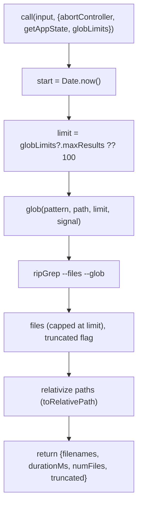

# GlobTool — File-Name Pattern Matching

This directory documents the `Glob` tool — fast file *name* matching by glob
pattern (e.g. `**/*.ts`), returning matching paths sorted by modification time.
It is the file-discovery counterpart to [Grep](../GrepTool/README.md) (content
search): Glob matches names, Grep matches contents.

The subsystem is tiny (3 files, ~267 lines), so it's documented in this single
page.

## Module Map

```
tools/GlobTool/
├── GlobTool.ts   # Tool definition: schema, lifecycle, validateInput, call()
├── UI.tsx        # Terminal rendering (reuses GrepTool's result renderer)
└── prompt.ts     # Model-facing guidance (5 lines)
```

## Schemas

### Input (`z.strictObject`)

| Field | Type | Notes |
|-------|------|-------|
| `pattern` | `string` (required) | The glob pattern (`**/*.js`, `src/**/*.ts`). |
| `path` | `string?` | Directory to search; defaults to cwd. The description explicitly tells the model to **omit** it (not pass `"undefined"`/`"null"`) for the default. |

### Output

| Field | Type | Meaning |
|-------|------|---------|
| `durationMs` | `number` | Search time. |
| `numFiles` | `number` | Count of returned files (post-truncation). |
| `filenames` | `string[]` | Matching paths, relativized to cwd, sorted by modification time. |
| `truncated` | `boolean` | Whether results hit the limit (default 100). |

## ToolDef Lifecycle

| Member | Behavior |
|--------|----------|
| `name` / `searchHint` | `"Glob"` / `"find files by name pattern or wildcard"`. |
| `maxResultSizeChars` | `100_000`. |
| `isReadOnly` / `isConcurrencySafe` | both `true`. |
| `isSearchOrReadCommand` | `{ isSearch: true, isRead: false }`. |
| `userFacingName` | `"Search"`. |
| `description()` / `prompt()` | `DESCRIPTION` from `prompt.ts`. |
| `getPath` | expanded `path` or cwd. |
| `toAutoClassifierInput` | returns `pattern`. |
| `validateInput` | confirms `path` exists and is a directory (ENOENT → suggest a path under cwd; UNC paths skipped to avoid credential probes). |
| `checkPermissions` | `checkReadPermissionForTool()`. |
| `extractSearchText` | newline-joined `filenames`. |
| `renderToolResultMessage` | **reuses `GrepTool.renderToolResultMessage`** (shared file-list summary). |
| `call` | see below. |

## `call()` Execution



The globbing engine is **ripgrep in `--files` mode** (via the `glob()` utility):
it lists files, filters with `--glob <pattern>`, and sorts with `--sort=modified`.
By default it passes `--no-ignore` and `--hidden` (overridable via
`CLAUDE_CODE_GLOB_NO_IGNORE` / `CLAUDE_CODE_GLOB_HIDDEN`). Permission ignore rules
and orphaned-plugin-cache directories are injected as `--glob !…` exclusions so
disallowed files never surface. Results are capped at `limit` (default 100,
overridable via `globLimits.maxResults`); exceeding it sets `truncated`, and the
result mapping appends a "consider a more specific path or pattern" hint. Paths are
relativized to save tokens, and the `AbortController` allows cancellation.

## prompt.ts & UI

`prompt.ts` (`DESCRIPTION`): fast pattern matching at any codebase size; supports
`**/*.js`-style patterns; returns paths sorted by modification time; use it to find
files by name; and use the `Agent` tool for open-ended, multi-round
glob-and-grep exploration.

`UI.tsx`: `userFacingName()` → `"Search"`; `renderToolUseMessage` shows
`pattern: "…"` (and `path` if provided, abbreviated unless verbose);
`renderToolUseErrorMessage` gives condensed "File not found" / "Error searching
files"; `getToolUseSummary` truncates the pattern for the activity line; and the
result renderer is delegated to GrepTool's `SearchResultSummary` for a consistent
file-list display.

## Glob vs Grep

| | Glob | Grep |
|--|------|------|
| matches | file **names** | file **contents** |
| engine | `ripgrep --files` | `ripgrep <pattern>` |
| pattern | glob (`*`, `**`, `?`) | regex |
| output | path list (mtime-sorted) | content / files / count |
| use for | file discovery / navigation | finding code by pattern |

For open-ended searches needing multiple rounds, both prompts point the model to
the `Agent` tool instead.
