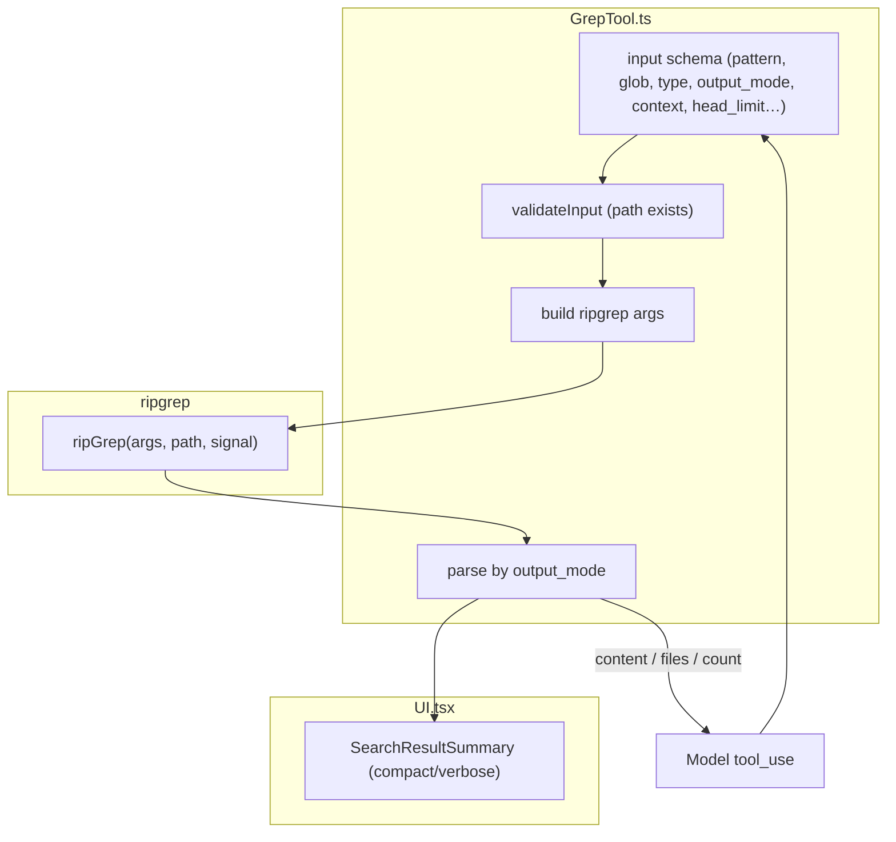
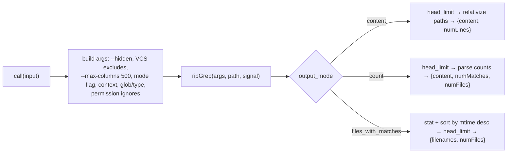

# GrepTool — Content Search over Files (ripgrep)

This directory documents the `Grep` tool — fast regex content search across files,
backed by the bundled **ripgrep** binary. It is the agent's primary content-search
mechanism (the prompt tells the model to always use it rather than shelling out to
`grep`/`rg`).

The subsystem is three files (~795 lines): a README overview plus a core doc and a
UI doc (folding the tiny `prompt.ts` into the core).

## Module Map

```
tools/GrepTool/
├── GrepTool.ts   # Tool definition: schema, lifecycle, ripgrep arg-building, result parsing
├── UI.tsx        # Terminal rendering: per-mode result summaries (SearchResultSummary)
└── prompt.ts     # Model-facing guidance (regex syntax, output modes, escaping, multiline)
```

## Purpose

Search file *contents* for a regex pattern and return one of three shapes
depending on `output_mode`: matching lines with context (`content`), the list of
matching files (`files_with_matches`, the default), or per-file match counts
(`count`). It is read-only, concurrency-safe, and scoped by the read-permission
rules.

## Architecture



## Flow



## Documents

| File | Covers |
|------|--------|
| [greptool.md](./greptool.md) | `GrepTool.ts` + `prompt.ts`: schema, lifecycle, the ripgrep arg-building and result-parsing pipeline, the three output modes |
| [ui.md](./ui.md) | `UI.tsx`: invocation and result rendering across the three modes |

## Cross-Cutting Themes

- **A typed wrapper over ripgrep.** The schema mirrors ripgrep flags
  (`-i`/`-n`/`-A`/`-B`/`-C`, `--type`, `--glob`, `-U` multiline), and `call()`
  translates them to args, runs the binary, and parses stdout per mode.
- **Three output modes, one tool.** `content` / `files_with_matches` / `count`
  differ in both the ripgrep flag (none / `-l` / `-c`) and the result shape.
- **mtime sorting for file lists.** `files_with_matches` stats matches and sorts
  newest-first (filename tiebreaker) so recently-touched files surface first;
  `content`/`count` keep ripgrep's order to avoid stat overhead.
- **Bounded by default.** `head_limit` defaults to 250 (with `offset` paging) and
  lines are capped at 500 columns, keeping minified/base64 noise out of context;
  `head_limit: 0` opts into unlimited.
- **Permission-scoped.** Read-permission ignore patterns are injected as
  `--glob !…` so ripgrep itself won't surface disallowed files; UNC paths are
  skipped to avoid credential probes.
