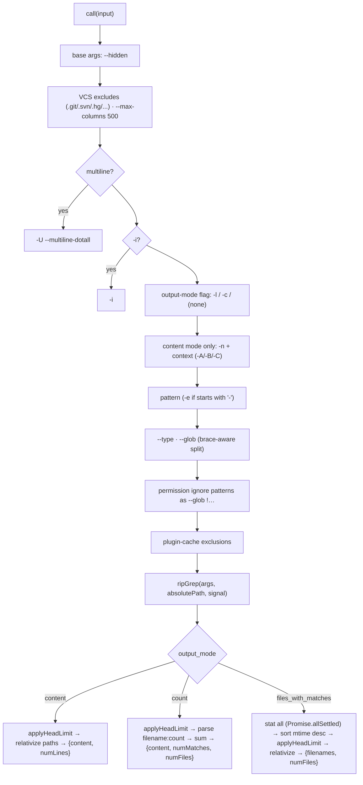

# GrepTool Core — Schema, ripgrep Pipeline & Output Modes

**Source:** `GrepTool.ts`, `prompt.ts`

The `Grep` tool's `ToolDef`: its schema, lifecycle, and the `call()` pipeline that
builds ripgrep arguments, runs the binary, and parses results per output mode.
Rendering lives in [ui.md](./ui.md).

## Input Schema

| Field | Type | Default | Maps to / meaning |
|-------|------|---------|-------------------|
| `pattern` | `string` (required) | — | The regex (full ripgrep syntax). |
| `path` | `string?` | cwd | Search root (`rg PATH`). |
| `glob` | `string?` | — | File filter, space/comma-separated, brace-aware (`--glob`). |
| `type` | `string?` | — | File-type filter (`--type js`). |
| `output_mode` | `'content' \| 'files_with_matches' \| 'count'` | `files_with_matches` | Output shape (see below). |
| `-i` | `boolean?` | false | Case-insensitive (`-i`). |
| `-n` | `boolean?` | true | Line numbers (content mode only). |
| `-A` / `-B` / `-C` / `context` | `number?` | — | After / before / both context lines (content mode only). Precedence: `context` > `-C` > `-A`/`-B`. |
| `multiline` | `boolean?` | false | `-U --multiline-dotall` (`.` matches newlines). |
| `head_limit` | `number?` | 250 (`0` = unlimited) | Cap on output lines/files/counts. |
| `offset` | `number?` | 0 | Skip first N before applying `head_limit`. |

## Output Schema

`{ mode?, numFiles, filenames[], content?, numLines?, numMatches?, appliedLimit?, appliedOffset? }`
— the populated fields depend on the mode (see [output modes](#output-modes)).

## ToolDef Lifecycle

| Member | Behavior |
|--------|----------|
| `name` / `searchHint` | `"Grep"` / `"search file contents with regex (ripgrep)"`. |
| `maxResultSizeChars` / `strict` | `20_000` / `true`. |
| `isReadOnly` / `isConcurrencySafe` | both `true`. |
| `isSearchOrReadCommand` | `{ isSearch: true, isRead: false }`. |
| `userFacingName` | `"Search"`. |
| `description()` / `prompt()` | `getDescription()` from `prompt.ts`. |
| `getPath` | `path || cwd`. |
| `toAutoClassifierInput` | `` `${pattern} in ${path}` ``. |
| `validateInput` | checks `path` exists (skips UNC paths to avoid NTLM credential probes). |
| `checkPermissions` | `checkReadPermissionForTool()`. |
| `mapToolResultToToolResultBlockParam` | formats the per-mode result, including a pagination note when `appliedLimit`/`appliedOffset` are set. |
| `render*` hooks | delegate to `UI.tsx`. |

## `call()` Pipeline

Notable details:

- **ripgrep binary**: invoked through the `ripGrep()` utility wrapper; its
  `execFile` timeout surfaces a `RipgrepTimeoutError` (so a timeout reads as "did
  not complete", not "no matches"). The `AbortController` allows cancellation.
- **Argument hygiene**: hidden files are searched but VCS dirs excluded;
  `--max-columns 500` truncates very long lines; a pattern starting with `-` is
  passed via `-e` so it isn't parsed as a flag; globs are split on whitespace/commas
  while preserving `{…}` brace groups.
- **`applyHeadLimit(items, limit, offset)`**: slices `[offset, offset+limit)`,
  using the default of 250 when `limit` is `undefined` and unlimited when `0`; it
  reports `appliedLimit` only when truncation actually occurred, so the model knows
  paging is possible.
- **Path relativization**: absolute paths from ripgrep are converted to
  cwd-relative to save tokens — done *after* `head_limit` so discarded lines aren't
  processed.

## Output Modes

| | `content` | `files_with_matches` (default) | `count` |
|--|-----------|-------------------------------|---------|
| ripgrep flag | (none) | `-l` | `-c` |
| stdout | `path:[num:]line` | `path` | `path:count` |
| context/`-n` | applied | ignored | ignored |
| sorting | ripgrep order | **mtime desc**, filename tiebreak | ripgrep order |
| result fields | `content`, `numLines` | `filenames`, `numFiles` | `content`, `numMatches`, `numFiles` |

Only `files_with_matches` stats and sorts files (newest-first), to surface
recently-touched files; the other modes skip the stat overhead. (In test mode,
sorting is forced to filename order for determinism.)

## `prompt.ts`

`getDescription()` tells the model: **always use `Grep`** (never shell `grep`/`rg`)
because it's optimized for permissions; full ripgrep regex syntax is supported;
filter with `glob` or `type`; the three output modes and their default; use the
`Agent` tool for open-ended multi-round searches; ripgrep escaping (literal braces
need `\{\}`); and that matching is single-line unless `multiline: true`.
