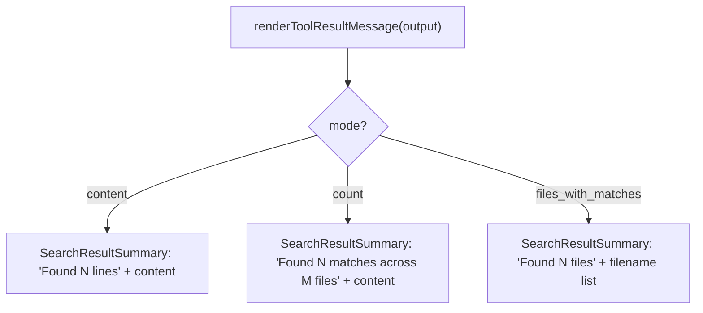

# GrepTool UI — Search Result Rendering

**Source:** `UI.tsx`

React + Ink components that render the `Grep` tool's invocation and results across
the three output modes. The centerpiece is a reusable `SearchResultSummary`.

## Exported Functions

| Function | Renders |
|----------|---------|
| `renderToolUseMessage(input, {verbose})` | `pattern: "…"` plus `path: "…"` (abbreviated via `getDisplayPath` unless verbose). |
| `renderToolUseErrorMessage(result, {verbose})` | Condensed "File not found" / "Error searching files", else fallback. |
| `renderToolResultMessage(output, …, {verbose})` | A `SearchResultSummary` shaped by the output mode. |
| `getToolUseSummary(input)` | The pattern truncated to `TOOL_SUMMARY_MAX_LENGTH` (drives "Searching for …"). |

## SearchResultSummary

The shared component that renders counts + content in two layouts:

- **Verbose** — a tree layout (`⎿` separator) with primary/secondary counts
  ("Found X lines", "Found X matches across Y files") and the content indented
  below.
- **Compact** — a single-line `MessageResponse` with inline counts and a
  `<CtrlOToExpand />` show-more hint.

Labels are singularized when a count is 1 ("1 file" vs "2 files").

## Per-Mode Rendering

| mode | primary count | secondary | body |
|------|---------------|-----------|------|
| `content` | `numLines` lines | — | matched lines |
| `count` | `numMatches` matches | `numFiles` files | `path:count` lines |
| `files_with_matches` | `numFiles` files | — | newline-joined filenames |

Rendering delegates styling to shared Ink components (`MessageResponse`, `Text`,
`FilePathLink`, `CtrlOToExpand`, `FallbackToolUseErrorMessage`); pagination info
(when `head_limit`/`offset` applied) is surfaced by the tool's result mapping, not
the UI. This `renderToolResultMessage` is also **reused by GlobTool** for its file
list (see [GlobTool](../GlobTool/README.md)).
