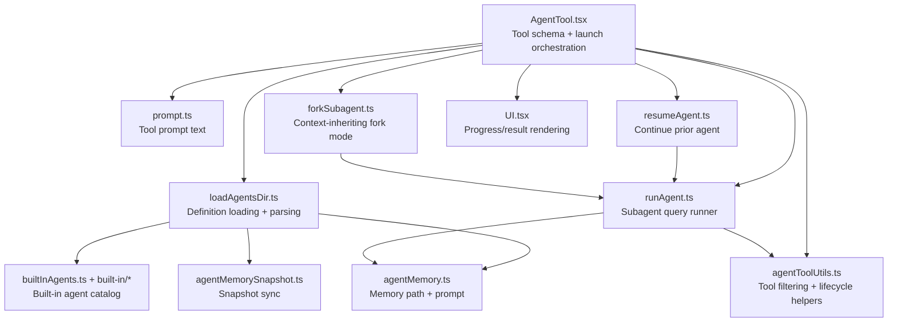

# AgentTool Design Documents

The `tools/AgentTool/` subsystem implements Claude Code's subagent delegation
tool. It covers selecting agent definitions, launching synchronous or
background workers, forking the parent context, resuming prior agents,
filtering tool access, displaying progress, and loading persistent agent
memory.

| File | Covers |
|---|---|
| [agent-tool.md](./agent-tool.md) | `AgentTool.tsx` — public tool schema, dispatch decisions, sync/background/worktree/remote paths |
| [agent-runner.md](./agent-runner.md) | `runAgent.ts` and `agentToolUtils.ts` — subagent query execution, context construction, tool filtering, lifecycle finalization |
| [agent-definitions.md](./agent-definitions.md) | `loadAgentsDir.ts`, `builtInAgents.ts`, `prompt.ts`, `built-in/*` — agent loading, precedence, prompts, built-ins |
| [agent-fork-resume.md](./agent-fork-resume.md) | `forkSubagent.ts`, `resumeAgent.ts` — forked workers and background continuation |
| [agent-memory.md](./agent-memory.md) | `agentMemory.ts`, `agentMemorySnapshot.ts` — persistent agent memory and project snapshots |
| [agent-ui.md](./agent-ui.md) | `UI.tsx`, `agentDisplay.ts`, `agentColorManager.ts`, `constants.ts` — terminal rendering, grouping, display helpers |

Small files such as `constants.ts`, `agentColorManager.ts`, and
`agentDisplay.ts` are covered inside the UI/definition documents because their
behavior is only meaningful as part of those larger flows.

## High-Level Map

