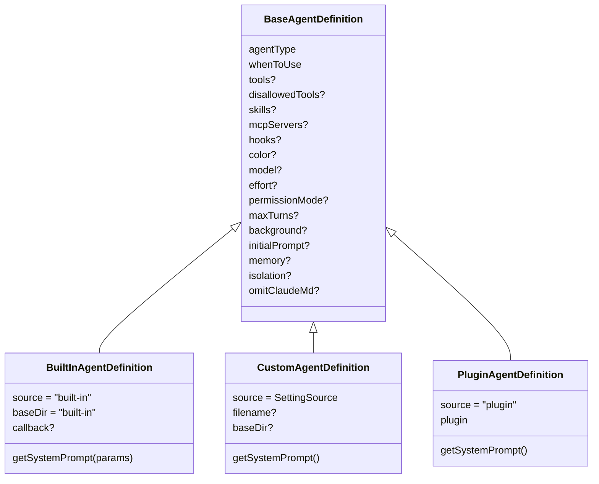
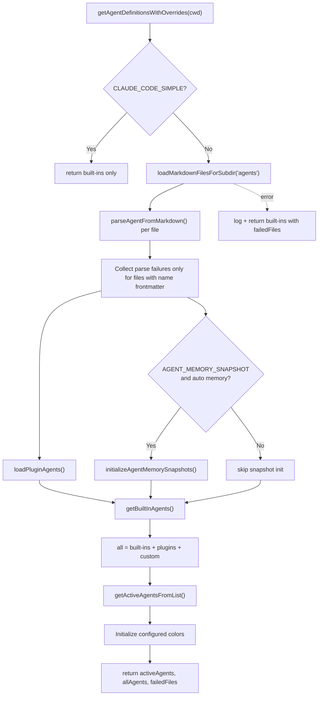
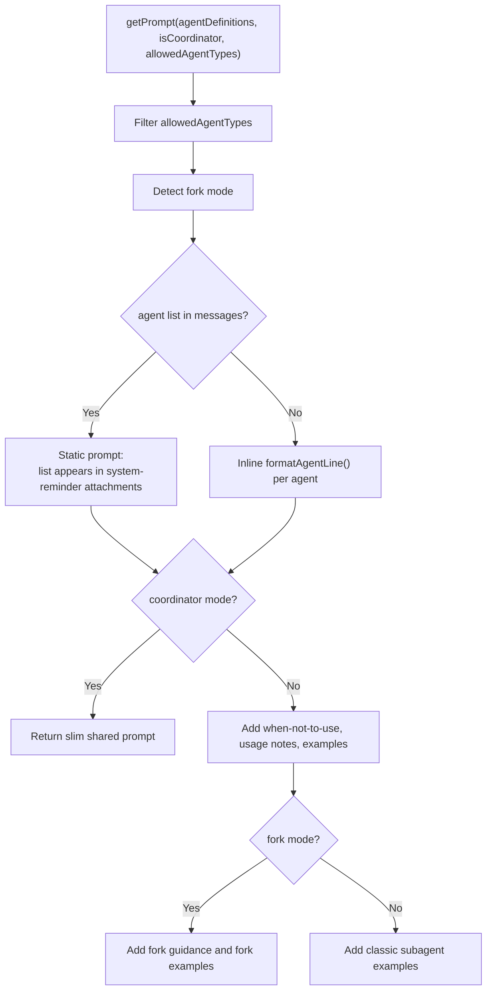

# Agent Definitions — Loading, Precedence, Prompts

**Sources:** `tools/AgentTool/loadAgentsDir.ts`, `tools/AgentTool/builtInAgents.ts`, `tools/AgentTool/prompt.ts`, `tools/AgentTool/built-in/*`

## Purpose

Agent definitions describe the named workers that `AgentTool` can launch. A
definition combines selection text (`whenToUse`), system prompt, tool policy,
model/effort overrides, permissions, MCP servers, hooks, skills, memory, and
execution preferences such as background or worktree isolation.

Definitions come from built-ins, plugins, markdown agent files, and JSON
settings. The loader normalizes these sources into one `AgentDefinition` union.

## Definition Types

## Load Flow

The function is memoized by cwd. `clearAgentDefinitionsCache()` clears both the
definition memo and the plugin-agent cache.

## Precedence

`getActiveAgentsFromList()` deduplicates by `agentType` using ordered source
groups. Later groups override earlier groups:

1. built-in
2. plugin
3. user settings
4. project settings
5. flag settings
6. managed policy settings

Because assignment overwrites earlier entries in a `Map`, managed agents win
over flag/project/user/plugin/built-in agents of the same type.

`agentDisplay.ts` provides the display-side companion: it annotates inactive
definitions with `overriddenBy`, deduplicates worktree duplicates by
`agentType:source`, and sorts agents alphabetically for UI display.

## Markdown And JSON Parsing

Markdown agents require frontmatter `name` and `description`. The markdown body
becomes the system prompt closure. Optional fields include:

- `tools`, `disallowedTools`
- `skills`, `initialPrompt`
- `mcpServers`
- `hooks`
- `model`, `effort`, `permissionMode`, `maxTurns`
- `background`, `memory`, `isolation`, `color`

JSON agents use a Zod schema with similar fields and a required `prompt`
property. Both formats inject Read/Edit/Write tools automatically when agent
memory is enabled and a finite tool list is present.

## Tool Prompt Generation

`prompt.ts` builds the description shown to the parent model for the `Agent`
tool. It can either inline the available agent list or keep the tool schema
static and move the list into attachment messages.

Moving the dynamic list to messages avoids prompt-cache churn when MCP,
plugin, or permission state changes.

## Built-In Agents

`builtInAgents.ts` decides which built-ins are available:

- `general-purpose`: default broad research/task agent with all tools.
- `statusline-setup`: modifies Claude Code status line settings.
- `Explore`: read-only codebase search agent, gated by
  `BUILTIN_EXPLORE_PLAN_AGENTS`.
- `Plan`: read-only planning/architecture agent, gated with `Explore`.
- `claude-code-guide`: docs-focused agent for Claude Code, Agent SDK, and API
  questions; excluded from SDK entrypoints.
- `verification`: background verification specialist, feature-gated.

Coordinator mode replaces the normal built-in catalog with coordinator worker
agents through a lazy require, avoiding circular imports during tool assembly.
