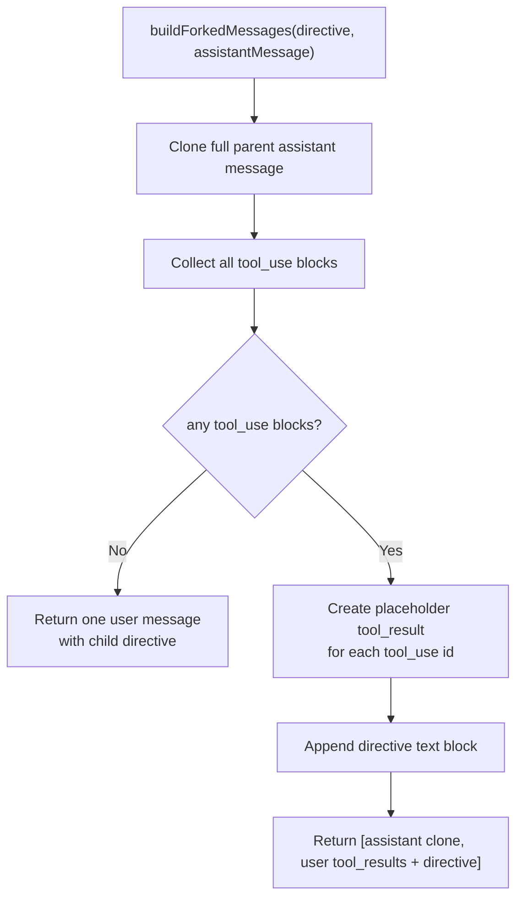
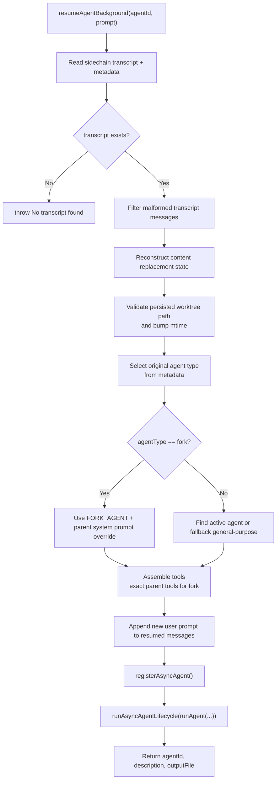

# Fork And Resume — Context-Inheriting Agents

**Sources:** `tools/AgentTool/forkSubagent.ts`, `tools/AgentTool/resumeAgent.ts`

## Purpose

Fork mode and resume mode are two specialized ways to run agents with more
context than a normal fresh subagent.

- Fork mode creates a worker that inherits the parent conversation and rendered
  system prompt, then receives a directive.
- Resume mode continues a previously spawned background agent from its recorded
  sidechain transcript.

## Fork Feature Gate

`isForkSubagentEnabled()` requires:

- compile-time `FORK_SUBAGENT` feature enabled;
- not coordinator mode;
- not non-interactive session.

When active, omitting `subagent_type` in `AgentTool` selects the synthetic
`FORK_AGENT`. The synthetic definition uses:

- `agentType: 'fork'`
- `tools: ['*']`
- `maxTurns: 200`
- `model: 'inherit'`
- `permissionMode: 'bubble'`
- empty `getSystemPrompt()` because the parent prompt is passed as an override.

## Fork Message Construction

There are two layers of message assembly in fork mode:

1. `AgentTool.call()` passes the parent's existing conversation as
   `forkContextMessages`.
2. `buildForkedMessages()` builds only the fork-specific suffix: the current
   assistant message that issued the `Agent` tool calls, followed by synthetic
   placeholder tool results and the child directive.

`runAgent()` concatenates them as:

```text
initialMessages = [
  ...filterIncompleteToolCalls(parent conversation messages),
  current assistant message with all Agent tool_use blocks,
  synthetic user message with placeholder tool_results + fork directive,
]
```

So the forked child does receive the parent user message and broader parent
conversation, subject to `filterIncompleteToolCalls()`. The diagram below only
shows the fork-specific suffix produced by `buildForkedMessages()`.



All placeholder tool results use the same text:
`Fork started — processing in background`. This keeps the request prefix
byte-identical across fork children until the final directive block, maximizing
prompt-cache reuse.

## Recursive Fork Guard

Fork children still keep the `Agent` tool in their exact inherited tool set so
tool definitions stay cache-identical. Recursive forking is blocked at call time
instead:

- primary check: `toolUseContext.options.querySource === 'agent:builtin:fork'`;
- fallback check: scan messages for the fork boilerplate XML tag.

The `querySource` check survives autocompaction because it lives in context
options rather than rewritten message history.

## Worktree Notice

If a fork runs in worktree isolation, `buildWorktreeNotice()` appends a user
message telling the child:

- parent paths refer to the original cwd;
- current cwd is an isolated worktree;
- files should be re-read before editing;
- changes remain isolated from the parent.

## Resume Flow



Resume intentionally skips reapplying current deny rules: the original spawn
already passed permission checks. It also does not re-register name routing; the
original `name -> agentId` registry entry persists from initial spawn.

## Transcript Hygiene

Before resuming, the transcript is cleaned with message helpers:

- `filterUnresolvedToolUses()`
- `filterOrphanedThinkingOnlyMessages()`
- `filterWhitespaceOnlyAssistantMessages()`

This protects the resumed API call from invalid assistant/tool-result structure.
For fork resumes, the old transcript already contains the inherited parent
context slice, so `forkContextMessages` is not supplied again; doing so would
duplicate tool-use ids.
